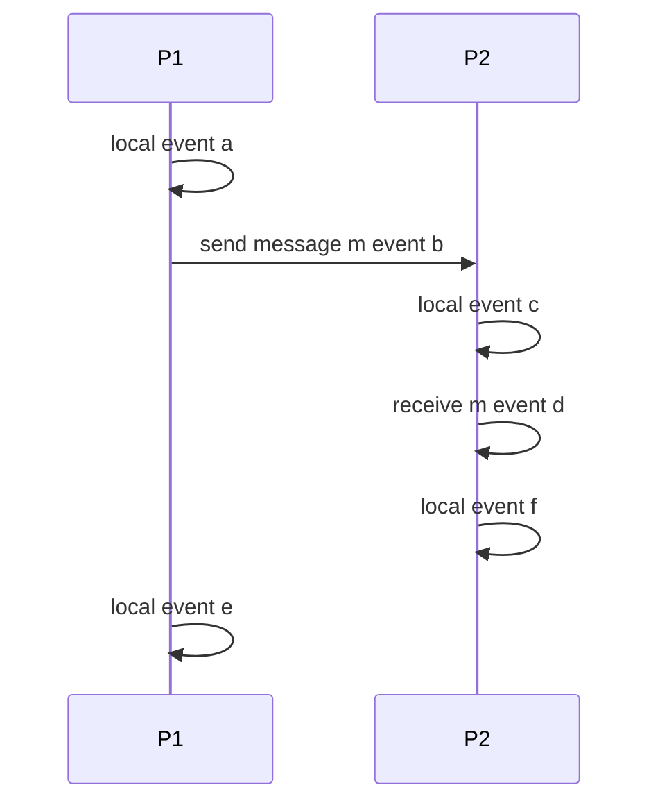
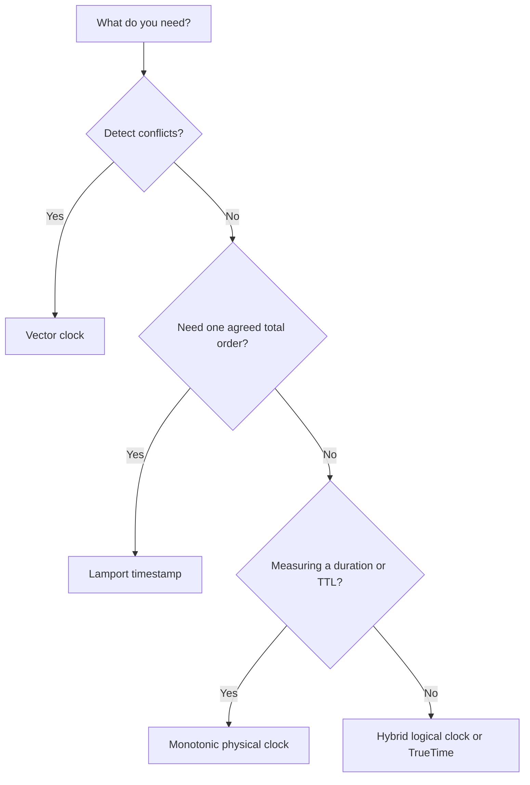

# Lecture 1 — Time, Clocks, and Logical Order: Ordering Events Without a Global Clock

> **Duration:** ~2 hours of reading + hands-on.
> **Outcome:** You can explain why physical clocks cannot order events across machines, define the happens-before relation precisely, implement Lamport timestamps and vector clocks from scratch, and state exactly what each can and cannot tell you about the order of two events.

If you remember one sentence from this entire lecture, remember this one:

> **You cannot use wall-clock time to order events across machines, because clocks drift, NTP corrections make time jump backward, and there is no instant two machines agree is "now" — so the only honest notion of order in a distributed system is *causality*, captured by Lamport's happens-before relation and measured by logical clocks.**

Every junior distributed-systems engineer writes the same bug exactly once: they compare two `System.currentTimeMillis()` (or `time.time()`) values from two machines to decide which event came first, and it works in testing and then silently corrupts data in production when one machine's clock is 200 ms ahead. This lecture makes you immune by replacing physical time with logical order.

---

## 1. Why physical clocks lie

Let's be precise about *how* wall-clock time betrays you. There are three independent failure modes, and any one is enough to break naive timestamp-ordering.

### 1.1 Drift

A quartz clock is not perfect. It gains or loses time at a rate measured in **parts per million** — a typical server clock drifts on the order of tens of microseconds per second, which is *seconds per day* if uncorrected. Two machines that were perfectly synchronized at boot will disagree by milliseconds within minutes and by seconds within hours. Drift is continuous and unavoidable; it is a property of the physical oscillator.

### 1.2 Skew

**Skew** is the difference between two clocks at a given instant. NTP (Network Time Protocol) keeps skew bounded — typically to within a few milliseconds on a good LAN, tens of milliseconds across the internet — but "bounded by tens of milliseconds" is *catastrophic* for ordering events that happen microseconds apart. If event `a` on machine 1 and event `b` on machine 2 happen 5 ms apart in true time, and the clocks are skewed by 20 ms, your timestamps can easily say `b` came before `a` when it did not. The skew is larger than the interval you are trying to resolve.

### 1.3 The backward jump (the one that really hurts)

Here is the failure mode that surprises people: **NTP can move a clock backward.** When NTP detects that a machine's clock is ahead of true time, it corrects it — and if the correction is large, the clock *steps* backward. Your code calls `now()` and gets `T`, then calls `now()` again a moment later and gets `T - 50ms`. Time went backward. Any logic that assumes timestamps are monotonically increasing — "this event is newer because its timestamp is larger" — is now wrong, and the bug is intermittent and tied to NTP's correction schedule, which means it reproduces approximately never on demand.

```python
# The bug that ships at every company. Do NOT do this across machines.
def newer(event_a, event_b):
    # event.ts came from time.time() on whatever machine produced the event.
    return event_a.ts > event_b.ts   # WRONG: clocks differ; ts is not a global order.

# Even on ONE machine this is unsafe if ts came from a wall clock that NTP
# stepped backward. Use a MONOTONIC clock for durations on a single machine:
import time
start = time.monotonic()   # never goes backward, but is meaningless ACROSS machines
# ... do work ...
elapsed = time.monotonic() - start   # safe for "how long did this take" locally
```

> **The one correct use of physical time for ordering** is when you *bound* its uncertainty and *wait it out*, which is exactly what Google Spanner's TrueTime does (Week 1, Lecture 2): it returns an interval `[earliest, latest]` and waits until `latest` has passed before committing, so the timestamp is provably in the past everywhere. That requires GPS and atomic clocks in every datacenter. Without that infrastructure, physical time is a footgun for ordering. Physical time *is* fine for **durations** (lease lengths, timeouts) on a single machine using a monotonic clock — just never for *cross-machine order*.

---

## 2. Happens-before: the only honest order

Lamport's 1978 insight: forget wall clocks. Define order by *causality* — what could have influenced what — using only message-passing. The **happens-before** relation, written `→`, is defined by three rules:

1. **Same-process order.** If `a` and `b` are events in the *same* process and `a` occurs before `b`, then `a → b`.
2. **Message order.** If `a` is the *sending* of a message and `b` is the *receipt* of that same message, then `a → b`. (You cannot receive a message before it was sent — causality.)
3. **Transitivity.** If `a → b` and `b → c`, then `a → c`.

Two events `a` and `b` are **concurrent**, written `a ∥ b`, if **neither** `a → b` nor `b → a`. Concurrency is the *absence* of a causal path between them — they happened in "parallel" with no way for one to have influenced the other.

This is the entire foundation. Notice what it does *not* require: no clock, no global time, no synchronized anything. It only requires that processes record their local order and that messages connect send to receive. From those two facts you get a partial order on all events in the system — and a partial order is the most you can honestly have, because genuinely concurrent events have *no* true order, and pretending they do (by comparing wall clocks) is the original sin.

```
Process P1:  a ──────► b ──────────────► e
                        │ (send m)         ▲
                        ▼                   │ (same process)
Process P2:            c ──► d ──────────► f
                              (receive m at c)

happens-before edges:
  a → b → e        (P1 process order)
  c → d → f        (P2 process order)
  b → c            (send m → receive m)
  therefore a → c, a → d, b → d, ...   (transitivity)

concurrent pairs (neither →):
  a ∥ c?  No: a → b → c, so a → c.
  e ∥ f?  Yes, if no message connects them: neither can have influenced the other.
```

That last line is the payoff: `e ∥ f` are *concurrent*. No wall clock can tell you their "real" order, because there is no real order — and a correct distributed system must treat them as concurrent, not invent a winner.


*The send of m on P1 happens-before its receive on P2; e and f share no message and are concurrent.*

> **Preview of Lecture 2:** Raft's **term number** is a logical clock for the *whole cluster* — a single integer that increments every election, with the rule "at most one leader per term." It is happens-before applied to leadership: a message from an older term is causally stale and is rejected. When you trace a Raft election on Wednesday, watch the term increment and recognize it as the same Lamport-counter idea you are learning today, scaled up from one process's events to one cluster's leadership epochs. Logical time is not an academic warm-up for consensus; it is the *substrate* consensus is built on.

---

## 3. Lamport timestamps: a usable total order

Happens-before is a *partial* order, but sometimes you need a *total* order — e.g., to break ties deterministically, or to order operations in a replicated log. Lamport timestamps give you one, with a single integer counter per process.

### 3.1 The algorithm

Each process `i` keeps a counter `L_i`, initially 0. The rules:

1. **Before any event** (local event or sending a message), increment: `L_i = L_i + 1`.
2. **When sending a message**, attach the current `L_i` as the message timestamp.
3. **When receiving a message** with timestamp `t`, set `L_i = max(L_i, t) + 1` before processing the receive.

Each event gets the value of `L_i` at the moment it occurs. That value is the event's **Lamport timestamp** `L(e)`.

```python
class LamportClock:
    def __init__(self):
        self.time = 0

    def tick(self) -> int:
        """Call before any local event or a send. Returns the event's timestamp."""
        self.time += 1
        return self.time

    def send(self) -> int:
        """A send is an event; stamp it and attach the stamp to the message."""
        return self.tick()

    def receive(self, msg_time: int) -> int:
        """Merge the sender's clock, then advance past it."""
        self.time = max(self.time, msg_time) + 1
        return self.time
```

### 3.2 What it guarantees — and what it does not

The clock-condition guarantee:

> **If `a → b`, then `L(a) < L(b)`.** (Causally earlier events have strictly smaller timestamps.)

That is exactly what you need to *respect* causality in a total order: build the total order by sorting on `L(e)`, breaking ties by process ID, and you get a total order consistent with happens-before. Two events with the same `L` value must be concurrent (you can order them arbitrarily, and the process-ID tiebreak does it deterministically).

But here is the crucial limitation, the one Exercise 2 makes you feel:

> **The converse is FALSE: `L(a) < L(b)` does NOT imply `a → b`.** A smaller Lamport timestamp does not mean "happened before"; it might mean "concurrent, and happened to get a smaller number."

So a Lamport timestamp can give you a *total order* (useful) but **cannot tell you whether two events are concurrent** (a fatal blind spot for conflict detection). If `L(a) < L(b)`, you know `b` did not happen-before `a` — but you do **not** know whether `a → b` or `a ∥ b`. To answer *that* — to detect concurrency — you need a vector clock.

### 3.3 A full worked trace, step by step

Three processes, a couple of messages. Follow the counter at every event so the `max + 1` rule becomes mechanical.

| Step | Event | Process | Rule applied | Resulting `L` |
|---|---|---|---|---|
| 1 | local event `a` | P1 | tick | `L1 = 1` |
| 2 | send m1 (event `b`) | P1 | tick, attach `1` | `L1 = 2`, m1.ts = 2 |
| 3 | local event `c` | P2 | tick | `L2 = 1` |
| 4 | recv m1 (event `d`) | P2 | `max(1, 2) + 1` | `L2 = 3` |
| 5 | send m2 (event `e`) | P2 | tick, attach `3` | `L2 = 4`, m2.ts = 4 |
| 6 | local event `f` | P3 | tick | `L3 = 1` |
| 7 | recv m2 (event `g`) | P3 | `max(1, 4) + 1` | `L3 = 5` |

Now read the guarantee off the table. `b → d` (send→receive of m1), and indeed `L(b) = 2 < L(d) = 3`. ✓ `d → e` (same process), `3 < 4`. ✓ `e → g` (send→receive of m2), `4 < 5`. ✓ By transitivity `b → g`, and `2 < 5`. ✓ The clock condition holds on every causal edge.

And the limitation: compare `c` (`L = 1`, on P2) with `f` (`L = 1`, on P3). Equal timestamps — and they are genuinely **concurrent** (no message connects them). The Lamport value cannot distinguish "concurrent" from "ordered"; it just hands them the same number and lets the process-ID tiebreak impose an arbitrary total order. If you needed to know they were *concurrent* (e.g., to merge rather than overwrite), the Lamport timestamp has thrown that information away. Hold this trace next to the vector-clock version in §4 and the difference is stark.

### 3.4 The killer application: totally-ordered multicast

Why does a *total* order matter at all if it is partly arbitrary? Because some problems need *every* replica to apply operations in the *same* order, even if that order is not the "true" one (which, for concurrent ops, does not exist). The canonical example is **state-machine replication**: if every replica starts in the same state and applies the same operations in the same order, they end in the same state. That is the entire principle behind Raft's replicated log (Lecture 2) and behind multi-master replication.

Lamport's original paper uses logical clocks to build exactly this: a totally-ordered multicast where every process delivers messages in Lamport-timestamp order (ties broken by process ID), using acknowledgements so a process knows it has seen all messages that could have a smaller timestamp. The mechanism matters less than the lesson: **a total order consistent with causality is enough to keep replicas in sync**, and Lamport timestamps give you exactly that with one integer. You do not always need to *detect* concurrency; sometimes you just need everyone to *agree on an order*, and for that Lamport is the cheap, correct tool. Knowing *which* problem you have — "impose an order" vs "detect concurrency" — is what tells you which clock to reach for.

---

## 4. Vector clocks: detecting concurrency

A vector clock upgrades the single counter to **one counter per process**, and that is exactly enough to recover the full happens-before relation, including concurrency.

### 4.1 The algorithm

Each process `i` keeps a vector `V_i` of length `N` (number of processes), all zeros initially. `V_i[j]` is process `i`'s knowledge of how many events process `j` has done.

1. **Before any local event or send**, increment its *own* component: `V_i[i] = V_i[i] + 1`.
2. **When sending**, attach the whole vector `V_i`.
3. **When receiving** a vector `V_msg`, merge element-wise then bump own: `V_i[k] = max(V_i[k], V_msg[k])` for all `k`, then `V_i[i] = V_i[i] + 1`.

```python
class VectorClock:
    def __init__(self, node_id: int, num_nodes: int):
        self.id = node_id
        self.v = [0] * num_nodes

    def tick(self) -> list[int]:
        """A local event or a send: bump our own component."""
        self.v[self.id] += 1
        return list(self.v)

    def receive(self, msg_v: list[int]) -> list[int]:
        """Merge element-wise, then bump our own component."""
        self.v = [max(a, b) for a, b in zip(self.v, msg_v)]
        self.v[self.id] += 1
        return list(self.v)
```

### 4.2 The partial order on vectors

Define `V ≤ W` iff `V[k] ≤ W[k]` for *every* `k`. Then:

- `a → b`  iff  `V(a) < V(b)`  (i.e., `V(a) ≤ V(b)` and `V(a) ≠ V(b)` — `b`'s vector *dominates* `a`'s).
- `a ∥ b`  iff  **neither** `V(a) ≤ V(b)` **nor** `V(b) ≤ V(a)` — the vectors are *incomparable*.

That second line is the whole reason vector clocks exist: **incomparable vectors detect concurrency.** A Lamport timestamp collapses the vector to a single number and loses the information needed to see incomparability. A vector clock keeps it.

```
P1: [1,0,0] ──► [2,0,0] ──send──► ...
P2:                    [0,1,0] ──► receive ──► [2,2,0]

Compare [2,0,0] (a P1 event) with [0,1,0] (a P2 event before the receive):
  [2,0,0] ≤ [0,1,0]?  No (2 > 0 in slot 0).
  [0,1,0] ≤ [2,0,0]?  No (1 > 0 in slot 1).
  => INCOMPARABLE => the two events are CONCURRENT.

Compare [2,0,0] with [2,2,0] (after the receive):
  [2,0,0] ≤ [2,2,0]?  Yes (2≤2, 0≤2, 0≤0) and not equal => [2,0,0] → [2,2,0].
```

### 4.2b The same three-process trace, now with vectors

Re-run the §3.3 trace with vector clocks (3 processes, so vectors of length 3, indices P1,P2,P3):

| Step | Event | Process | Rule | Resulting vector |
|---|---|---|---|---|
| 1 | `a` | P1 | bump self | `[1,0,0]` |
| 2 | send m1 (`b`) | P1 | bump self, attach `[2,0,0]` | `[2,0,0]` |
| 3 | `c` | P2 | bump self | `[0,1,0]` |
| 4 | recv m1 (`d`) | P2 | merge `[2,0,0]`, bump self | `[2,2,0]` |
| 5 | send m2 (`e`) | P2 | bump self, attach `[2,3,0]` | `[2,3,0]` |
| 6 | `f` | P3 | bump self | `[0,0,1]` |
| 7 | recv m2 (`g`) | P3 | merge `[2,3,0]`, bump self | `[2,3,2]` |

Now ask the question Lamport could not answer: **are `c` and `f` concurrent?** `c = [0,1,0]`, `f = [0,0,1]`. Is `[0,1,0] ≤ [0,0,1]`? No (1 > 0 in slot P2). Is `[0,0,1] ≤ [0,1,0]`? No (1 > 0 in slot P3). **Incomparable → concurrent.** The vector clock *sees* the concurrency the Lamport timestamp erased (recall both got `L = 1`). And the causal chain is visible too: `b = [2,0,0] ≤ g = [2,3,2]`, so `b → g`, matching §3.3. Same trace, strictly more information — at the cost of carrying three integers instead of one.

### 4.2c Version vectors: the database cousin

You will meet a close relative called a **version vector** (or version *vector* per key) in Dynamo-style databases and in Week 3's CRDTs. It is the same idea — one counter per *replica* — applied to track the causal history of a single data item rather than every event in the system. When two replicas of a key have incomparable version vectors, the database knows the writes were concurrent and surfaces them as **siblings** (Riak's term) for the application or a CRDT to merge. The refinement that makes this scale — **dotted version vectors** — handles the awkward case of a single replica accepting multiple concurrent client writes without conflating them. You do not need the full machinery now; you need to recognize that "version vector," "vector clock," and "the metadata a CRDT carries" are the same concurrency-detection idea wearing three hats, and that *detecting* concurrency is always the prerequisite for *resolving* it without data loss.

### 4.3 The cost

Vector clocks carry **O(N) metadata per event** — one integer per process in the system. For a 3-node cluster that is trivial. For a system with thousands of clients (each a "process" in the vector), it is a real cost: every value carries a vector as large as the number of writers that ever touched it, and that vector only grows. This is the metadata-growth problem you will measure directly in Week 3's CRDT lab. The practical mitigations — bounding the vector to server replicas rather than clients, pruning, dotted version vectors — are exactly the engineering that makes Dynamo-style systems and CRDTs viable at scale. For now, internalize the tradeoff: **Lamport is cheap (one int) but cannot detect concurrency; vector clocks detect concurrency but cost O(N) per event.** You pick based on whether you need to *detect conflicts* (vector) or merely *impose an order* (Lamport).

---

## 5. A worked comparison: the same trace under both clocks

Consider two replicas of a shopping cart that each accept a write during a partition (the AP scenario from Week 1).

```
Replica A: add("milk")    -> Lamport 1, Vector [1,0]
Replica B: add("eggs")    -> Lamport 1, Vector [0,1]
(partition heals; replicas exchange)
```

- **Under Lamport timestamps:** both writes have timestamp `1`. The tiebreak by replica ID picks a "winner" — say A < B, so "milk" sorts first. But notice: Lamport *cannot tell you these were concurrent*. It just gives them an order, and if your reconcile is "last writer wins by Lamport timestamp," you might silently discard one cart item. The total order is real; the concurrency information is gone.
- **Under vector clocks:** `[1,0]` and `[0,1]` are **incomparable**. The system can *see* that these were concurrent writes and therefore *must be merged* (a cart with both milk and eggs), not have one chosen over the other. Vector clocks turn "I picked a winner and lost data" into "I detected a conflict and resolved it correctly."

This is the precise reason Week 3's CRDTs use vector-clock-style metadata: concurrency *detection* is the prerequisite for concurrency *resolution* that doesn't lose data. Last-writer-wins on a wall clock — or even on a Lamport timestamp — silently discards concurrent writes. Vector clocks are what let you do better.

---

## 6. When you still want physical time

Logical clocks order events; they say nothing about *how long ago* something happened. Some jobs genuinely need physical time, and using a logical clock for them is as wrong as using a wall clock for ordering:

- **Lease durations and timeouts.** "Hold this lock for 10 seconds" is a *duration* — use a monotonic physical clock. (Crucially, a *duration* on one machine, not a cross-machine instant.)
- **Time-to-live / expiry.** "This cache entry is valid for 60 s" is physical time.
- **Rate limiting.** "100 requests per second" is physical time.
- **Hybrid logical clocks (HLC).** The modern compromise (used by CockroachDB and others): combine a physical timestamp with a logical counter, so you get *something close to* wall-clock readability *and* the happens-before guarantee. An HLC timestamp is monotonic, close to physical time, and respects causality — the best of both for systems that want human-readable timestamps without sacrificing order. It is worth knowing the name; it is what you reach for when "logical order" and "roughly what time was it" must coexist.

A compact decision table for which clock to reach for:

| You need to... | Use | Why |
|---|---|---|
| Decide if `a → b` or `a ∥ b` (detect conflicts) | **Vector clock** | Only incomparable vectors reveal concurrency. |
| Impose one agreed total order on operations | **Lamport timestamp** | Cheap (one int), total order consistent with causality. |
| Measure "how long did this take" on one machine | **Monotonic physical clock** | Never steps backward; durations are physical. |
| Set a lease/TTL/timeout | **Monotonic physical clock** | A duration, not a cross-machine instant. |
| Human-readable timestamp *and* causal order | **Hybrid logical clock (HLC)** | Close to wall time, still respects happens-before. |
| Globally-ordered commits with real timestamps | **Bounded physical (TrueTime)** | Wait out measured uncertainty; needs GPS/atomic clocks. |

The discipline: **use logical clocks to order, physical (monotonic) clocks to measure durations, and never cross the streams.** Ordering with a wall clock is the bug; timing a lease with a logical clock is the inverse bug.


*Which clock to reach for, decided by what question you actually need answered.*

---

## 6b. A real incident: the last-write-wins data-loss bug

Make the abstraction concrete with a failure that has happened in production at scale. Cassandra (and many systems) resolves conflicting writes to the same cell by **last-write-wins using a timestamp**. By default, that timestamp comes from the *client's* wall clock. Now picture:

1. Client A (clock correct) writes `name = "Alice"` at true time 12:00:00.000, timestamp `T`.
2. Client B (clock 3 seconds *fast*) writes `name = "Bob"` at true time 12:00:00.100 — but stamps it `T + 3s` because its clock is ahead.
3. A *third* write from client A at true time 12:00:05 — `name = "Alice2"` — gets timestamp `T + 5s` (correct clock).

The database keeps the highest timestamp. So far `Alice2` (`T+5s`) wins, fine. But consider a fourth write from the fast client B at true time 12:00:04, stamped `T + 7s`: it now wins over `Alice2` even though it happened *earlier* in true time. Worse, if client B's clock were *far* ahead, its writes could win for *minutes*, silently swallowing every other client's updates, and then — when B's clock is corrected by NTP — its writes suddenly stop winning, and the behavior flips with no code change. This is not hypothetical; "our writes mysteriously disappear" tickets traced to client clock skew are a recurring Cassandra operational hazard.

The lesson maps exactly onto this lecture: **using a wall clock to order writes across clients is the original sin, and the symptom is silent, intermittent data loss tied to clock skew.** The mitigations are all "stop trusting the wall clock for order": use server-side timestamps (skew bounded to a few machines you control), or — better — use logical/vector clocks to *detect* the concurrent writes and resolve them with a CRDT merge (Week 3) instead of a timestamp coin flip. Every time you see "last write wins by timestamp," ask "whose clock, and what happens when it's wrong?"

## 6c. Three misconceptions to kill

- **"NTP keeps clocks close enough to order events."** NTP bounds skew to milliseconds at best — orders of magnitude larger than the microsecond intervals you often need to resolve. "Close enough" for a log's human-readable timestamp is *nowhere near* close enough to decide which of two near-simultaneous events came first.
- **"A bigger timestamp means it happened later."** Only true on a single machine with a monotonic clock. Across machines, or with a wall clock that NTP can step backward, a bigger timestamp means nothing reliable about order. Lamport's whole point is to replace this false intuition with a *real* (if partial) order.
- **"Vector clocks are just slower Lamport clocks."** No — they answer a *different question*. Lamport gives a total order but cannot detect concurrency; vector clocks detect concurrency but only give a partial order. They are not faster/slower versions of one thing; they trade different capabilities for different costs.

## 6d. The one diagnostic question

When you suspect a timestamp/ordering bug in a distributed system, ask one question first:

> **"Where did this timestamp come from, and is it being used to order events across machines?"**

If a wall clock is ordering cross-machine events, you have found the bug — full stop. The fix is always one of: (a) move to server-side timestamps to shrink the skew to machines you control, (b) switch to logical/vector clocks to order by causality, or (c) if you genuinely need physical-time ordering, adopt bounded-uncertainty time (TrueTime/HLC) and pay for it. There is no fourth option where a naked wall clock safely orders distributed events; the universe does not provide a global "now." Internalizing that single question will save you more debugging hours than any other heuristic in this course.

## 7. Recap

You should now be able to:

- Explain the three ways physical clocks lie — drift, skew, and backward NTP steps — and why any one breaks naive timestamp-ordering across machines.
- Define **happens-before** (`→`) from its three rules, and define **concurrency** (`∥`) as the absence of a causal path.
- Implement **Lamport timestamps**, state their guarantee (`a → b ⟹ L(a) < L(b)`), and name their fatal limitation (the converse fails — they cannot detect concurrency).
- Implement **vector clocks**, use the partial order to decide `a → b`, `b → a`, or `a ∥ b`, and explain the O(N) metadata cost.
- Choose Lamport (cheap total order) vs vector clocks (concurrency detection) based on whether you must detect conflicts, and know when physical (monotonic) time is the right tool instead.

## 7b. The bridge to consensus

Logical clocks are not just a conflict-detection tool; they are the *substrate* of consensus. As Lecture 2 makes explicit:

- Raft's **term** is a Lamport clock for cluster leadership — one integer, incremented each election, with "higher term wins" playing the role of "later timestamp dominates."
- Paxos's **ballot number** is the same: a monotonically increasing logical clock that orders proposals so that once a value is chosen, later ballots are forced to respect it.
- A lock's **fencing token** is a logical clock applied to lock ownership — a monotonic number that lets storage reject a stale holder.

So everything you learned today about ordering without a wall clock returns immediately, scaled from "events in one process" to "leadership epochs in a cluster" and "lock grants over time." A learner who skips logical clocks always cargo-cults the term number; one who internalizes them sees the term *is* a Lamport timestamp and reasons about it correctly.

Next: how a cluster agrees on a single value despite FLP — Raft in depth, Paxos in overview, and the leases and fencing tokens that make locks safe. Continue to [Lecture 2 — Consensus: Raft, Paxos, and Leases](./02-consensus-raft-paxos-leases.md).

---

## References

- *Time, Clocks, and the Ordering of Events in a Distributed System* — Lamport (1978): <https://lamport.azurewebsites.net/pubs/time-clocks.pdf>
- *Designing Data-Intensive Applications*, Ch. 8 — Kleppmann (2017).
- *There is No Now* — Sheehy (ACM Queue, 2015): <https://queue.acm.org/detail.cfm?id=2745385>
- *Spanner / TrueTime* — Corbett et al. (OSDI 2012): <https://research.google/pubs/pub39966/>
- *Hybrid Logical Clocks* — Kulkarni et al. (2014): <https://cse.buffalo.edu/tech-reports/2014-04.pdf>
