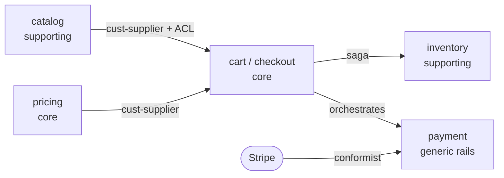

# Exercise 1 — Draw the Context Map

**Goal:** Take a described monolith, find its bounded contexts using the language test, and produce a context map that names each context, its subdomain kind, its team owner, and the DDD relationship pattern at every boundary. You will train the single most important design habit of the week: refusing to draw a boundary you can't name a relationship for.

**Estimated time:** 45 minutes. Guided.

---

## The system: "Bookhive," a 38 kLOC monolith

You've inherited Bookhive, a monolithic online bookstore backend. Here is how the different teams describe what it does. Read it twice. Highlight every place a *word changes meaning* — those are your boundary candidates.

> **The storefront team** says: "A customer browses **books**, reads reviews, and adds a **book** to their cart. A book has a title, author, cover image, description, and an average rating. We care about making the catalog fast and the search relevant."
>
> **The checkout team** says: "When a customer checks out, we take their **cart**, turn it into an **order**, lock the **price** of each line at checkout time, and hand it to fulfillment. An order has line items, each a SKU and a locked price and a quantity. We never recompute a price after checkout — the locked price is law."
>
> **The warehouse team** says: "We track **stock** per SKU across three warehouses. When an order comes in we **reserve** stock, and reservations expire after 30 minutes if the order doesn't complete. We don't care about a book's description — to us a 'book' is a SKU with an on-hand count and a shelf location."
>
> **The payments team** says: "We charge the customer's card via Stripe. We handle the charge, and refunds, and chargebacks. We don't store cards — Stripe does. We just need an amount and a customer payment token."
>
> **The pricing team** says: "We compute the price a customer pays: base price minus promotions, plus tax by region. Promotions change weekly. The catalog's base price changes maybe monthly. We are *not* the catalog."
>
> **Today, all of this is one Django app with one Postgres database.** Every team's code reaches into every team's tables. A promotion change last month broke checkout because checkout was reading the `promotions` table directly.

---

## Step 1 — Run the language test

In a scratch file, list every domain noun and write down what it means *to each team that uses it*. You're looking for the same word meaning different things. Start this table and finish it:

| Word | Storefront | Checkout | Warehouse | Pricing |
|---|---|---|---|---|
| **Book / product** | rich editorial object (title, cover, description, rating) | a line item (SKU + locked price + qty) | a SKU with on-hand count + shelf location | a thing with a base price to discount |
| **Price** | "average rating"? no — display price | *locked* at checkout, never recomputed | (not used) | computed: base − promo + tax |
| **Order** | (not used; it's a "cart") | the central object: line items + locked prices | a thing to *reserve stock* for | (not used) |

Every row where the meaning changes across columns is a context boundary you've just *discovered empirically.* "Book" means four different things → it does not belong to one service.

---

## Step 2 — Name the bounded contexts

From the language test, name the contexts. You should land near these five — but justify each from the descriptions, don't just copy:

- **`catalog`** — browse and describe books (storefront's rich book).
- **`pricing`** — compute the price paid (pricing's base − promo + tax).
- **`cart` / `checkout`** — turn a cart into an order with locked prices (checkout's order).
- **`inventory`** — track and reserve stock per SKU (warehouse's SKU).
- **`payment`** — charge / refund / chargeback via Stripe (payments' generic rails).

Note that **search** might be its own context (a read model over catalog) — decide and justify. Note that there is **no `BookService`** — the four meanings of "book" are spread across four contexts, linked by SKU. If you wrote a `BookService`, re-read Lecture 2 §2.4.

---

## Step 3 — Classify each subdomain

For each context, mark it *core*, *supporting*, or *generic*, and give a one-line reason:

- `catalog` — supporting (needed, not differentiating).
- `pricing` — core-ish (promotions and dynamic pricing are where margin is made). Justify your call.
- `cart`/`checkout` — core (the conversion funnel).
- `inventory` — supporting.
- `payment` — generic *rails* (you conform to Stripe), supporting *workflow*.

---

## Step 4 — Assign a relationship pattern to every boundary

This is the step people skip and the step that matters. For *each* edge between two contexts, name the DDD relationship pattern (Lecture 1 §3) and the integration mechanism. Fill in this table:

| Upstream → Downstream | Relationship pattern | Mechanism | Why |
|---|---|---|---|
| `catalog` → `cart` | Customer–Supplier (+ ACL in `cart`) | gRPC read | `cart` needs product names/prices but must not let catalog's editorial model leak in |
| `pricing` → `cart` | Customer–Supplier | gRPC read at checkout | the locked price comes from pricing at the moment of checkout |
| `cart` → `inventory` | Customer–Supplier | gRPC + saga | reserve stock when an order is placed; compensate on failure |
| external Stripe → `payment` | Conformist | Stripe SDK | you accept Stripe's model; not worth an ACL |
| ... | ... | ... | ... |

Every edge gets a pattern. If you can't name the pattern for an edge, you don't understand the edge yet — that's the signal to go back to the descriptions.

---

## Step 5 — Draw it

Produce the actual context map as a diagram. Mermaid in your markdown is fine:

Or draw it by hand and photograph it. The tool doesn't matter; the *named edges* do.

---

## Acceptance criteria

You can mark this exercise done when:

- [ ] A file `context-map.md` exists with the language-test table (Step 1), the named contexts with subdomain classification (Steps 2–3), the relationship-pattern table with one row per boundary (Step 4), and a diagram (Step 5).
- [ ] There is **no entity service** — no `BookService` / `ProductService` unifying the four meanings of "book."
- [ ] Every boundary in the diagram has a *named* DDD relationship pattern, not a bare arrow.
- [ ] At least one boundary uses an **anti-corruption layer**, and you can say in one sentence why (something leaks that you don't want to leak).
- [ ] You can state, in one sentence, which heuristic separates `pricing` from `catalog` (change-frequency: weekly vs monthly).

---

## Stretch

- The descriptions mention checkout broke because it read the `promotions` table directly. Name the anti-pattern (shared database) and write the one-sentence fix (`checkout` asks `pricing` over gRPC; it never touches the `promotions` table).
- Add a `search` context as a read model fed by catalog changes. What relationship pattern connects them, and why isn't it a synchronous call? (Foreshadows Weeks 10–14: it's an event-fed read model.)
- Run the inverse Conway maneuver: write the team structure (one stream-aligned team per context) that would *produce* this architecture, and name the one team boundary most likely to erode if two contexts share a team.

---

When this feels comfortable, move to [Exercise 2 — Score a topology against the heuristics](exercise-02-decompose-the-monolith.py).
