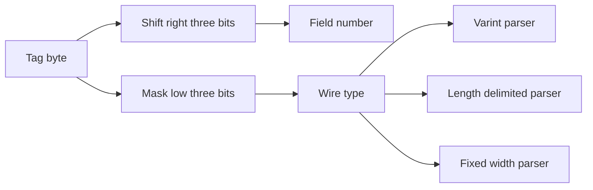
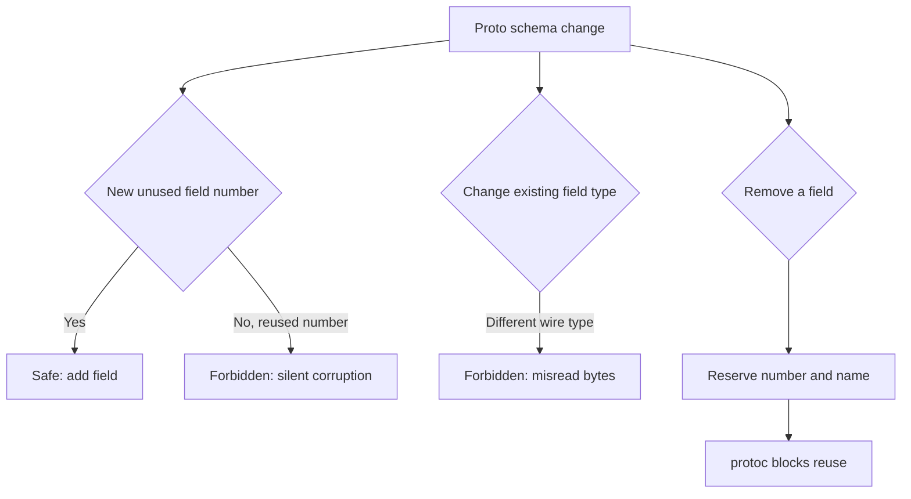

# Lecture 1 — The Protobuf Wire Format and the Rules That Keep the Promise

> **Duration:** ~2 hours of reading + hands-on.
> **Outcome:** You can decode a Protobuf message at the byte level, author a proto3 schema following the style guide, and state precisely which schema changes are safe and which break the contract — and why the wire format makes that distinction in the first place.

If you remember one sentence from this entire week, remember this one:

> **On the Protobuf wire, the field *number* is the identity; the field *name* is a comment. Add a field with a fresh number and every old reader skips it harmlessly; reuse a retired number and every old reader silently misreads the new field as the old one. The whole discipline of schema evolution is a discipline of field numbers.**

Last week you built a `cart`→`catalog` boundary over HTTP+JSON. JSON has no schema the compiler enforces, no field numbers, and no rules about what changes are safe — so the "contract" was a README and a prayer. This week you make the boundary a real contract, and to use it well you must understand the one thing that makes Protobuf evolvable: the wire format. We start there, at the bytes, because every evolution rule is a consequence of how the bytes are laid out.

---

## 1. Why a binary, schema-defined format at all

Three properties matter for a service contract, and JSON-over-HTTP gives you at most one of them:

1. **A schema the compiler enforces.** With Protobuf, the `.proto` is the single source of truth, and `protoc` generates code in every language from it. A field renamed in the schema is a *compile error* in every consumer, at your desk, not a `null` at 3 a.m. JSON has no enforced schema; a typo is a runtime surprise.
2. **A compact, fast wire format.** Protobuf is binary: integers are varint-encoded (small numbers, few bytes), there are no field-name strings on the wire (just numbers), and parsing is a tight loop. For service-to-service traffic measured in millions of calls per second, this matters.
3. **Defined evolution rules.** Protobuf specifies exactly what changes preserve compatibility. This is the property you cannot get from hand-rolled JSON *at all*, and it is the reason a platform of fifty services can keep deploying independently.

You give up human-readability on the wire (you need a schema to decode the bytes) and you give up the "just curl it" ergonomics of REST (mitigated by `grpcurl` + reflection, §Lecture 2). For a *public* API consumed by unknown third parties on browsers, those tradeoffs often favor REST. For *internal* service-to-service traffic in a polyglot platform — the entire premise of Crunch Mesh — they favor Protobuf + gRPC overwhelmingly.

---

## 2. The wire format, byte by byte

A Protobuf message is a flat sequence of **key-value pairs**, each encoded as a *tag* followed by a *value*. There is no message-level framing inside the payload — just one field after another. Let's build it up.

### 2.1 The tag: field number + wire type

Every field on the wire starts with a tag, which is a single varint encoding two things packed together:

```
tag = (field_number << 3) | wire_type
```

The low 3 bits are the **wire type** — how to parse the value that follows. The rest is the **field number** — which field this is. There are six wire types; you'll use four constantly:

| Wire type | Value | Used for |
|---|---|---|
| `VARINT` | 0 | `int32`, `int64`, `uint32`, `uint64`, `bool`, `enum` |
| `I64` | 1 | `fixed64`, `sfixed64`, `double` |
| `LEN` | 2 | `string`, `bytes`, embedded messages, packed `repeated` |
| `I32` | 5 | `fixed32`, `sfixed32`, `float` |

So a field with number 1 and wire type `VARINT` (0) has tag `(1 << 3) | 0 = 0x08`. A field with number 2 and wire type `LEN` (2) has tag `(2 << 3) | 2 = 0x12`. Recognizing `0x08` as "field 1, varint" by eye is a party trick that becomes genuinely useful when you're staring at a hex dump in an incident.


*A single tag byte splits into the field number and the wire type that picks the parser.*

### 2.2 Varints: variable-length integers

A varint encodes an unsigned integer in 1–10 bytes. Each byte uses its low 7 bits for data and its high bit (the *continuation bit*) to say "more bytes follow." Bytes are little-endian groups of 7 bits.

The number `1` is `0x01` (one byte, high bit clear: done). The number `300` is two bytes: `300 = 0b100101100`. Split into 7-bit groups, little-endian: `0101100` and `0000010`. Set the continuation bit on the first: `10101100 00000010` = `0xAC 0x02`. So `300` on the wire is `AC 02`.

Why does this matter? Because **small numbers are cheap.** A field whose values are usually small (a quantity, a status enum) costs one byte. This is also why you put your *most frequent* fields in numbers 1–15: field numbers 1–15 fit their tag in a single byte (the tag varint is one byte for field numbers up to 15), while 16+ take two. The style guide's "reserve 1–15 for the hottest fields" is a wire-format optimization, not arbitrary.

### 2.3 Length-delimited fields (`LEN`)

Strings, bytes, embedded messages, and packed repeated fields use wire type 2: a varint **length** followed by exactly that many bytes. The string `"hi"` in field 2 is:

```
12        tag: field 2, wire type LEN
02        length: 2 bytes
68 69     'h' 'i'
```

Embedded messages use the same encoding — a length prefix then the sub-message's own tag-value bytes — which is why a message can contain a message can contain a message, recursively, with no special framing.

### 2.4 A complete worked decode

Here is a real `catalog.v1.Product` message on the wire (the message from this week's exercises):

```
message Product {
  string sku        = 1;
  string name       = 2;
  int64  price_cents = 3;
}
```

Encoding `{sku: "A", name: "Pen", price_cents: 300}`:

```
0a 01 41              field 1 (sku), LEN, len 1, "A"
12 03 50 65 6e        field 2 (name), LEN, len 3, "Pen"
18 ac 02              field 3 (price_cents), VARINT, value 300
```

Decode it yourself: `0a` is `(1<<3)|2` → field 1, LEN. `01` → length 1. `41` → `'A'`. `12` is `(2<<3)|2` → field 2, LEN. `03` → length 3. `50 65 6e` → `"Pen"`. `18` is `(3<<3)|0` → field 3, VARINT. `ac 02` → varint 300. Nine bytes, fully self-describing *given the schema*. Verify this against `protoscope` in Exercise 1; it will print exactly this structure.

> **The load-bearing observation:** nowhere in those nine bytes does the string `"sku"`, `"name"`, or `"price_cents"` appear. The *names* are not on the wire — only the *numbers* 1, 2, 3. This single fact explains every evolution rule in §4. The reader matches fields by number; the name is purely a local label in your generated code.

---

## 3. Authoring a proto3 schema (the style that survives)

Now the schema itself. Here is `catalog.v1`, the contract you'll generate from this week, written to the style guide:

```proto
syntax = "proto3";

package catalog.v1;

option go_package = "github.com/crunchmesh/catalog/gen/catalogv1;catalogv1";

import "google/protobuf/timestamp.proto";

// A product as the catalog context models it. (Lecture 4: catalog's product is
// an editorial object; cart translates it via an anti-corruption layer.)
message Product {
  string sku          = 1;  // stable business key; field 1, hottest
  string name         = 2;
  int64  price_cents  = 3;  // money in minor units; NEVER a float
  string description  = 4;  // cart does not use this; included to force the ACL
  string category     = 5;
  google.protobuf.Timestamp updated_at = 6;
}

message GetProductRequest {
  string sku = 1;
}

message GetProductResponse {
  Product product = 1;
}

message BatchGetProductsRequest {
  repeated string skus = 1;  // bulk: the chatty-mesh fix from Week 4
}

message BatchGetProductsResponse {
  repeated Product products = 1;
}

message ListProductsRequest {
  string category = 1;
  int32  page_size = 2;
}

// A service is a set of RPCs. Each rpc names its request and response messages.
service CatalogService {
  // Unary: one product by SKU.
  rpc GetProduct(GetProductRequest) returns (GetProductResponse);

  // Unary, bulk: many products in one round trip.
  rpc BatchGetProducts(BatchGetProductsRequest) returns (BatchGetProductsResponse);

  // Server-streaming: a feed of products in a category.
  rpc ListProducts(ListProductsRequest) returns (stream Product);
}
```

The non-negotiable style rules in that file, each with its reason:

- **`package catalog.v1`.** The version is *in the package name*. When you need a breaking change you can't make compatibly, you create `catalog.v2` as a *new package* that coexists with `v1` while consumers migrate. The version is not a comment; it's a namespace.
- **`price_cents` is an `int64`, never a `double`.** Money in floating point is a correctness bug — `0.1 + 0.2 != 0.3`. Always integer minor units (cents) or a dedicated decimal `Money` message. This is a hill to die on.
- **Field numbers are deliberate and stable.** `sku` is field 1 because it's the hottest field. Numbers are assigned once and never changed.
- **`google.protobuf.Timestamp`** for time — a well-known type, not a hand-rolled `int64 epoch_millis` that every consumer interprets differently.
- **proto3 has no `required`.** Every field is effectively optional on the wire (a missing scalar reads as its zero value). This is *deliberate* — `required` was removed from proto3 precisely because it makes schema evolution impossible (you can never remove a required field without breaking old readers). Validate requiredness in code, not in the schema.

---

## 4. Schema evolution — the rules that keep the promise

This is the heart of the week. A contract you can't evolve is a contract you'll break in anger. Protobuf's rules let you evolve safely *because* of the wire format in §2. Here they are, with the wire-level reason for each.

### 4.1 The two compatibilities, defined

- **Backward compatibility:** a *new* reader can read messages written by an *old* writer. (You upgraded the consumer; the producers haven't caught up.)
- **Forward compatibility:** an *old* reader can read messages written by a *new* writer. (You upgraded the producer; the consumers haven't caught up.)

In a real fleet you need *both*, because you never deploy all services atomically. Protobuf gives you both for additive changes, and the reason is unknown-field handling: **when a reader encounters a tag whose field number it doesn't know, it skips it** (it knows the wire type from the tag, so it knows how many bytes to skip). An old reader meeting a new field skips it (forward compat); a new reader meeting a message missing a field gets the zero value (backward compat).

### 4.2 What is SAFE to do

- **Add a new field with a new, never-before-used field number.** Old readers skip it; new readers default it. This is the workhorse evolution. (Contrast with Week-4's ROS-style note that *other* systems make additive changes a redeploy event — Protobuf does not, and that's its superpower.)
- **Add a new value to an `enum`** — *but* old readers will see it as the unknown value (in proto3, an unrecognized enum value is preserved as its integer). Handle the default/unknown case in code.
- **Add a new `rpc` to a service.** Old clients don't call it; new clients do.
- **Rename a field** — names aren't on the wire (§2.4), so a pure rename (same number, same type) is wire-compatible. It *is* a source break (generated code changes), so coordinate the code, but the bytes are fine. Do this rarely and deliberately.

### 4.3 What is FORBIDDEN (it silently corrupts)

- **Reusing a field number for a different field.** This is the cardinal sin. If field 4 was `string description` and you delete it and later add `bool in_stock = 4`, an old writer's `description` bytes will be read by a new reader as an `in_stock` — a length-delimited string parsed as... garbage, or a crash. The wire has no idea the *meaning* changed; the number is the identity.
- **Changing a field's type** in a wire-incompatible way (e.g. `int32` → `string`, varint → length-delimited). The reader parses by wire type; change the wire type and the bytes are misread. (Some changes are compatible — `int32`/`int64`/`uint32`/`bool` are all varints and interconvert with caveats — but treat type changes as breaking unless you've checked the encoding table.)
- **Changing a field number** of an existing field. Same as deleting the old and adding a new — every existing writer/reader disagrees.
- **Removing a `required` field** — not applicable in proto3 (no `required`), and this is *why* proto3 removed it.

### 4.4 `reserved` — the guardrail against recycling

When you *delete* a field, you must reserve its number and name so no one can ever recycle them:

```proto
message Product {
  reserved 4;                 // 'description' used to be field 4 — never reuse it
  reserved "description";     // and never reuse the name either
  string sku         = 1;
  string name        = 2;
  int64  price_cents = 3;
  string category    = 5;
  google.protobuf.Timestamp updated_at = 6;
}
```

Now if anyone tries `bool in_stock = 4;`, `protoc` *refuses to compile.* The `reserved` keyword turns the §4.3 cardinal sin from a silent runtime corruption into a build error. Reserve both the number (protects the wire) and the name (protects source compatibility). This is the single most underused safety feature in Protobuf; use it every time you remove a field.


*Deciding whether a proto change is additive-safe or a wire-breaking hazard.*

### 4.5 Mechanically detecting breaking changes

You should not enforce these rules by careful reading — humans miss them. The tool is **`buf breaking`**: it compares your `.proto` against a previous version (a git ref or a registry) and *fails CI* if you reused a number, changed a type, or removed a field without reserving it. This is the schema-evolution analogue of a type checker. The challenge this week has you run exactly this. In a real shop, `buf breaking` runs on every pull request that touches a `.proto`, and a breaking change can't merge without an explicit, reviewed version bump.

---

## 5. Backward-compatibility worked example

Let's make this concrete with the `catalog.v1.Product` from §3. Suppose `catalog` adds an `in_stock` boolean:

```proto
message Product {
  string sku          = 1;
  string name         = 2;
  int64  price_cents  = 3;
  string description  = 4;
  string category     = 5;
  google.protobuf.Timestamp updated_at = 7;  // (note: 7, not 6 — see below)
  bool   in_stock     = 8;                    // NEW field, new number
}
```

- An **old `cart`** (built against the schema without `in_stock`) receives a `Product` from the **new `catalog`**. It hits tag `(8<<3)|0` for `in_stock`, doesn't recognize field 8, knows it's a varint from the wire type, skips one byte, moves on. `cart` works, unaware `in_stock` exists. **Forward-compatible.**
- A **new `cart`** (built against the schema *with* `in_stock`) receives a `Product` from an **old `catalog`** that doesn't set it. The field is absent on the wire; `in_stock` reads as its zero value (`false`). **Backward-compatible.**

Both directions work, no coordination required, *because* the change was purely additive with a fresh number. Now contrast: if `catalog` had instead changed `price_cents` from `int64` (field 3, varint) to a `Money` message (field 3, length-delimited), every old `cart` would hit tag `(3<<3)|2` where it expected `(3<<3)|0`, misread the wire type, and either crash or produce garbage. Same field "meaning," incompatible wire. That's why §4.3 forbids it and `buf breaking` catches it.

---

## 6. Recap

You should now be able to:

- Decode a Protobuf message by hand: read a tag into a field number and wire type, decode a varint, and parse a length-delimited field.
- Explain *why* field numbers (not names) are the wire identity, and why that fact underlies every evolution rule.
- Author a proto3 `catalog.v1` schema following the style guide: versioned package, deliberate field numbers, `int64` money, well-known types, no `required`.
- State which changes are safe (add a field with a new number, add an enum value, add an rpc) and which are forbidden (reuse/change a number, change a type), and use `reserved` to make recycling a build error.
- Define backward and forward compatibility and reason about a concrete additive change in both directions.
- Reach for `buf breaking` to enforce all of this mechanically instead of by careful reading.

Next: how gRPC turns this schema into running RPCs — the four call kinds, the HTTP/2 substrate, interceptors, reflection, and how to choose gRPC over REST or GraphQL with evidence. Continue to [Lecture 2 — gRPC RPC Kinds, Interceptors, and Choosing](./02-grpc-rpc-kinds-interceptors-and-choosing.md).

---

## Appendix A — More wire-format types you'll meet

Section 2 covered the four wire types you use constantly. A few more details matter when you decode real messages.

**Signed integers and zig-zag.** A plain `int32`/`int64` varint-encodes its two's-complement value, which means a *negative* number always takes the full 10 bytes (the sign bit is high). If your field is often negative, use `sint32`/`sint64`, which apply **zig-zag** encoding: `0 → 0, -1 → 1, 1 → 2, -2 → 3, ...`, mapping small-magnitude signed numbers to small varints. The rule: `int32` for usually-positive, `sint32` for values that swing negative. Money deltas, temperature offsets, and coordinates are `sint`.

**Fixed-width types.** `fixed32`/`fixed64` (and `sfixed`, `float`, `double`) use wire types I32/I64 — always 4 or 8 bytes, no varint. Use them when the value is usually *large* (a hash, a random id) so varint's "small is cheap" doesn't help and you'd rather have a predictable size. A 64-bit hash is `fixed64`, not `int64`.

**Packed repeated fields.** A `repeated int32` of scalars is, by default in proto3, **packed**: one LEN field containing all the elements' varints back to back, rather than a tag per element. This is much more compact for numeric arrays. (Repeated *strings* and *messages* are not packed — each gets its own tag, as you'll see decoding `repeated string skus`.)

**Maps are sugar.** A `map<string, int32>` is wire-encoded as a `repeated` message of `{key, value}` entries (field 1 = key, field 2 = value). On the wire there's no "map" type; it's repeated key-value pairs. This is why a map field evolves like a repeated field, and why you can add a map without breaking readers.

## Appendix B — The evolution rules as a checklist

Print this and run it before every `.proto` change. (`buf breaking` automates it, but you should know what it checks.)

```text
BEFORE changing a .proto, for each modified message:
  [ ] Am I REUSING a field number that was ever used?         -> FORBIDDEN
  [ ] Am I CHANGING an existing field's number?               -> FORBIDDEN
  [ ] Am I CHANGING an existing field's TYPE across wire types?-> FORBIDDEN
       (int32<->string, varint<->message, etc.)
  [ ] Am I REMOVING a field?                                  -> OK, but RESERVE its number+name
  [ ] Am I ADDING a field with a brand-new number?            -> SAFE (additive)
  [ ] Am I ADDING an enum value?                              -> SAFE (handle unknown in code)
  [ ] Am I ADDING an rpc?                                     -> SAFE
  [ ] Am I RENAMING a field (same number, same type)?         -> wire-SAFE, source-BREAK (coordinate)
  [ ] Is this change BREAKING and unavoidable?                -> new package vX+1, coexist, migrate
```

The mental model: **the wire cares about numbers and wire types; it does not care about names or concepts.** Every "forbidden" row is a place where the *bytes* would be misread even though the *meaning* seems unchanged. Every "safe" row is a place where old and new readers gracefully ignore or default what they don't know. When in doubt, the question is never "does this make sense to a human?" — it's "what happens to the existing bytes when the new reader parses them?"

## Appendix C — Why `int64` for money, expanded

It bears repeating because it's the most common correctness bug in service contracts. Floating-point cannot represent most decimal fractions exactly: `0.1` is not `0.1` in IEEE 754, it's `0.1000000000000000055...`. Sum enough of them and the error is visible in a customer's total. So:

- **Never** `double price`. A money field that's a float is a bug, full stop.
- **Prefer** `int64 amount_minor_units` — the price in cents (or the currency's smallest unit), an exact integer. `7999` cents is exactly `$79.99`, always.
- For multi-currency, a small `Money { int64 units; int32 nanos; string currency_code; }` message (the Google `Money` type) carries both the amount *and* the currency, because an amount without a currency is meaningless. The capstone uses exactly this when it expands to EUR.

The wider lesson: a contract encodes *semantics*, and choosing the wrong primitive (a float for money, an `int64` epoch for a time instead of `Timestamp`, an unbounded `string` where a bounded one belongs) bakes a bug into every consumer in every language. Get the types right in the `.proto` and the correctness propagates for free; get them wrong and every consumer inherits the mistake.

---

## Appendix D — Wire-type quick reference

For decoding hex dumps in an incident. The tag's low 3 bits are the wire type:

| Bits | Wire type | Decimal | Carries | How to read the value |
|---|---|---|---|---|
| 000 | VARINT | 0 | int32/64, uint, bool, enum, sint(zigzag) | read a varint |
| 001 | I64 | 1 | fixed64, sfixed64, double | read 8 bytes, little-endian |
| 010 | LEN | 2 | string, bytes, message, packed repeated | read a varint length, then that many bytes |
| 101 | I32 | 5 | fixed32, sfixed32, float | read 4 bytes, little-endian |

To get the field number from a tag byte: `field_number = tag >> 3`. To get the wire type: `wire_type = tag & 0x07`.

Worked: tag byte `0x1a`. Binary `0001 1010`. Low 3 bits `010` = LEN (2). Remaining `00011` = 3. So: **field 3, length-delimited.** A varint length follows, then the bytes.

## Appendix E — The "additive is free" superpower, stated plainly

The single most important practical consequence of the wire format is worth isolating: **in Protobuf, adding a field with a new number is free — no consumer breaks, in either direction, with no coordination.** This is not true of every serialization format, and it is the property that lets a fifty-service platform evolve.

- The producer can start sending the new field today.
- Old consumers skip it (they don't know field N, they skip it by wire type).
- New consumers built before the producer sends it get the zero value.
- No deploy ordering, no version negotiation, no downtime.

This is why the *shape* of safe evolution is always "add, don't change": add a new field rather than repurpose an old one; add a new RPC rather than change an existing one's signature; add an enum value rather than renumber. When a change genuinely can't be expressed additively (the `int64`→`Money` case), that's the signal you need a new package version (`v2`) — and the rarity of that need is exactly *because* most changes *can* be additive. Lean on additive evolution; it's the cheapest correctness guarantee in distributed systems.

### One more habit: the `_UNSPECIFIED` enum zero value

A proto3 style rule that bites people: **every enum must have a zero value, and it should be `_UNSPECIFIED`** (or `_UNKNOWN`):

```proto
enum ProductStatus {
  PRODUCT_STATUS_UNSPECIFIED = 0;   // mandatory zero — the "unset" state
  PRODUCT_STATUS_ACTIVE      = 1;
  PRODUCT_STATUS_DISCONTINUED = 2;
}
```

The zero value is what a field gets when it's *unset* on the wire (proto3 has no presence for scalars). If your zero value were `ACTIVE = 0`, then a message that never set the status would *look like* it said `ACTIVE` — a silent, dangerous default. Making the zero value an explicit `_UNSPECIFIED` means "unset" is distinguishable from any real value, and a new enum member added later (`OUT_OF_STOCK = 3`) is seen by old readers as a preserved-but-unrecognized integer rather than misread. This is a small rule with an outsized payoff: it's the difference between "the absence of a value" and "a value that happens to be the first one," and conflating those is a real production bug.

## References

- Protocol Buffers — Encoding (the wire format): <https://protobuf.dev/programming-guides/encoding/>
- Protocol Buffers — proto3 Language Guide: <https://protobuf.dev/programming-guides/proto3/>
- Protobuf — Best Practices (dos and don'ts): <https://protobuf.dev/best-practices/dos-donts/>
- `buf breaking` — mechanical breaking-change detection: <https://buf.build/docs/breaking/overview>
- `protoscope` — wire-format inspector: <https://github.com/protocolbuffers/protobuf/tree/main/protoscope>
