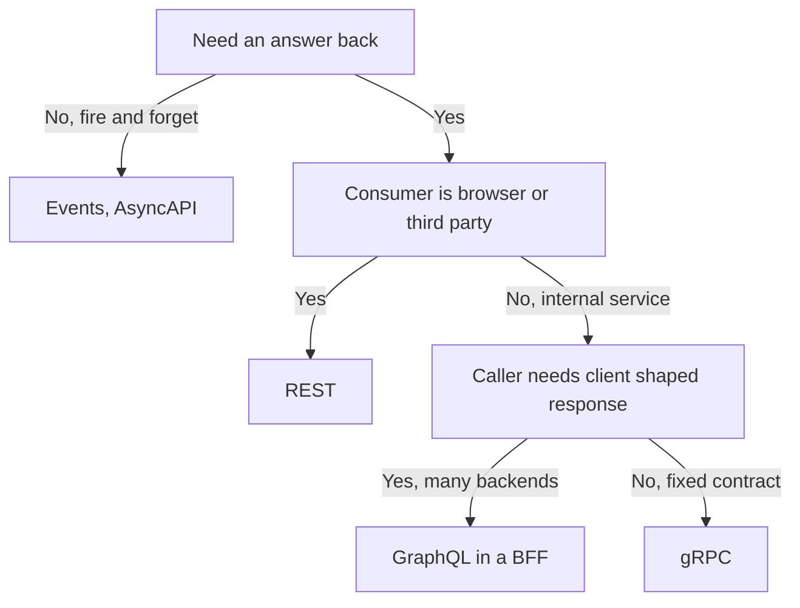
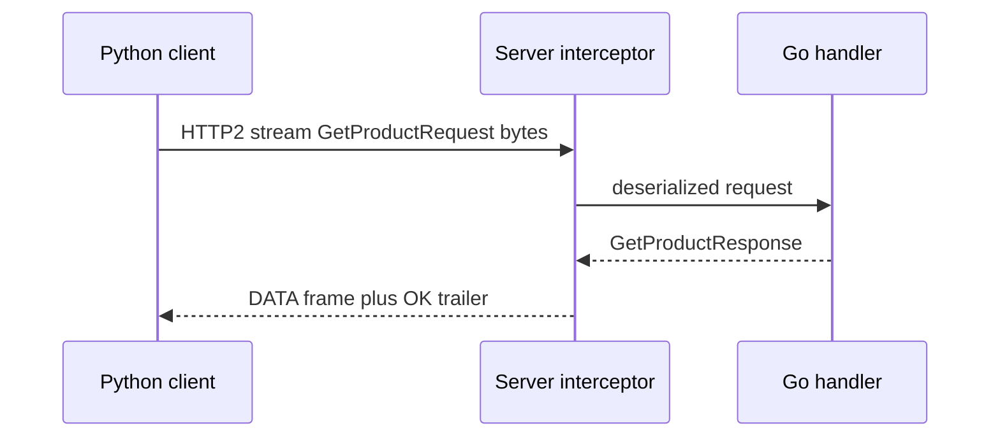

# Lecture 2 — gRPC RPC Kinds, the HTTP/2 Substrate, Interceptors, and Choosing the Right Tool

> **Duration:** ~2 hours of reading + hands-on.
> **Outcome:** You can implement all four gRPC RPC kinds and say when each is correct, explain why gRPC needs HTTP/2, wire an interceptor and enable reflection, and choose between gRPC, REST, GraphQL, and events for a given boundary with reasons you'd defend in a review.

Lecture 1 was the contract — the schema and the bytes. This lecture is the *transport and the runtime*: how gRPC turns a `.proto` into running RPCs across two languages, the four shapes a call can take, the middleware hook (interceptors), the self-description mechanism (reflection), and — the question a staff engineer actually gets asked — *why gRPC here and not REST or GraphQL?* Four parts.

---

## Part 1 — The four RPC kinds

A `service` in your `.proto` is a set of `rpc` declarations, and each rpc is one of four shapes. The shape is determined by where the `stream` keyword appears.

### 1.1 Unary — request → response

The default and the one you'll use most. One request message, one response message, like a function call across the network.

```proto
rpc GetProduct(GetProductRequest) returns (GetProductResponse);
```

Use it for the overwhelming majority of service-to-service calls: "fetch this," "do this and tell me the result." It's the gRPC analogue of an HTTP GET/POST with a typed body. The `cart`→`catalog` product lookup is unary.

### 1.2 Server-streaming — request → stream of responses

One request, then the server pushes a *stream* of response messages until it's done.

```proto
rpc ListProducts(ListProductsRequest) returns (stream Product);
```

Use it when the response is naturally a sequence the client consumes incrementally: a product feed, a search-results page that arrives in chunks, a tail of a log, a progress stream for a long job. The win over "return a giant `repeated`" is that the client starts processing the first item before the last is produced, and memory on both sides stays bounded.

### 1.3 Client-streaming — stream of requests → response

The client pushes a stream of request messages, then the server returns one response.

```proto
rpc UploadProducts(stream Product) returns (UploadSummary);
```

Use it for bulk ingestion: uploading a large dataset, streaming sensor readings to be aggregated, sending a file in chunks. The server can begin processing as requests arrive and returns a single summary at the end ("imported 4,000 products, 3 rejected").

### 1.4 Bidirectional-streaming — two independent streams

Both sides stream independently over one connection. Neither stream's timing is tied to the other's.

```proto
rpc WatchPrices(stream WatchRequest) returns (stream PriceUpdate);
```

Use it for genuinely interactive, full-duplex protocols: a price ticker where the client sends watch/unwatch requests *while* the server pushes updates; a chat; a live collaboration session; a control channel. This is the most powerful and the easiest to misuse — most problems are *not* bidi, and reaching for it when unary would do adds complexity for no benefit.

> **Choosing the kind:** start at unary; it's correct until proven otherwise. Move to server-streaming when the *response* is a sequence consumed incrementally. Move to client-streaming when the *request* is a sequence (bulk upload). Reach for bidi only when both directions are independently live at once. The shape should match the data's natural shape, not your enthusiasm for streams.

---

## Part 2 — The HTTP/2 substrate (why gRPC can do this)

gRPC runs on **HTTP/2**, and that is not an implementation detail — it's the reason streaming works at all. The properties of HTTP/2 that gRPC depends on:

- **Multiplexed streams over one connection.** HTTP/1.1 serializes requests on a connection (or opens many connections). HTTP/2 carries many independent *streams* over a single TCP connection, each a sequence of frames, interleaved. That's what lets one gRPC channel handle dozens of concurrent calls — and what makes the four streaming kinds possible: a gRPC call *is* an HTTP/2 stream.
- **Binary framing.** HTTP/2 messages are binary frames (HEADERS, DATA), not text. gRPC packs Protobuf-encoded messages into DATA frames with a tiny 5-byte length-prefix per message, so a stream of messages is just a sequence of length-prefixed payloads in DATA frames.
- **Header compression (HPACK).** Repeated headers (the method path, content-type) are compressed, cheap to send on every call.
- **Trailers.** gRPC sends the final status code (OK, NOT_FOUND, etc.) in HTTP/2 *trailers* — headers sent *after* the body. This is elegant for streaming (you can't know the final status until the stream ends) but it's also why **browsers can't speak raw gRPC**: the Fetch API can't read HTTP/2 trailers.

That last point is the entire reason **gRPC-Web** and **Connect** exist. A browser can't read trailers, so gRPC-Web defines a variant that encodes the trailing status into the response body, and a proxy (Envoy, which you meet in Week 7) translates between gRPC-Web and real gRPC. **Connect** (by Buf) goes further: it's a single server that speaks gRPC, gRPC-Web, *and* a plain-HTTP/JSON protocol, so the same handler serves a Go microservice and a browser without a translating proxy. For service-to-service traffic you use real gRPC; for browser clients you reach for gRPC-Web or Connect. Know the distinction; it comes up the first time a frontend team asks to call your service directly.

---

## Part 3 — Interceptors and reflection

### 3.1 Interceptors — gRPC's middleware

Cross-cutting concerns — logging, authentication, tracing, metrics, panic recovery — don't belong in every handler. gRPC's hook for them is the **interceptor**: a function that wraps every RPC, runs before/after the handler, and can inspect or modify the call. There are unary and streaming variants, on both client and server side.

A server-side unary logging interceptor in Go:

```go
func LoggingInterceptor(
	ctx context.Context,
	req any,
	info *grpc.UnaryServerInfo,
	handler grpc.UnaryHandler,
) (any, error) {
	start := time.Now()
	resp, err := handler(ctx, req)        // call the actual RPC handler
	code := status.Code(err)
	slog.Info("grpc_call",
		"method", info.FullMethod,
		"code", code.String(),
		"duration_ms", time.Since(start).Milliseconds(),
	)
	return resp, err
}

// Registered once on the server, applies to every RPC:
server := grpc.NewServer(grpc.UnaryInterceptor(LoggingInterceptor))
```

Every RPC the server handles now emits a structured log line with method, status, and latency — without a single line added to any handler. This is the hook you extend into **OpenTelemetry tracing in Week 6**: the interceptor is where you start a span, propagate trace context, and record the call. Interceptors are the right place for *anything* that should apply uniformly to all RPCs; putting auth or tracing in individual handlers is the anti-pattern they exist to prevent.

### 3.2 Reflection — the server describes itself

Normally a client needs the generated stub to call a server. **Server reflection** lets a server expose its own schema at runtime, so a tool can call it with *no* generated code — it asks the server "what services and methods do you have, and what do their messages look like?" and constructs the call on the fly.

Enabling it in Go is one line:

```go
import "google.golang.org/grpc/reflection"
// ...
reflection.Register(server)
```

Now `grpcurl` works against your server with nothing but the address:

```bash
$ grpcurl -plaintext localhost:50051 list
catalog.v1.CatalogService
grpc.reflection.v1.ServerReflection

$ grpcurl -plaintext localhost:50051 catalog.v1.CatalogService/GetProduct \
    -d '{"sku": "SKU-1"}'
{
  "product": {"sku": "SKU-1", "name": "Mechanical Keyboard", "priceCents": "7999"}
}
```

No stub, no client code, no `.proto` file on the caller's machine — `grpcurl` asked the server and the server answered. This is the gRPC equivalent of being able to `curl` a REST API, and it's why the "you can't poke at gRPC like you can REST" complaint is outdated. Enable reflection on every internal service; it's the difference between a debuggable service and an opaque one. (For *public* services you may disable it to avoid advertising your schema, but internally it's pure upside.)

---

## Part 4 — Choosing: gRPC vs REST vs GraphQL vs events

This is the part you get asked in a design review, and the wrong answer is "gRPC, because this is a gRPC course." The right answer names the boundary's properties and matches the tool. Here is the grounded comparison.

### 4.1 gRPC

**Strengths:** typed contract enforced by codegen; compact binary wire; streaming; excellent for polyglot service-to-service; first-class deadlines, cancellation, and status codes; the schema *is* the documentation.

**Use it for:** internal service-to-service RPC in a polyglot system — exactly the Crunch Mesh backbone. `cart`↔`catalog`, `order`↔`inventory`, every internal hop.

**Weak for:** public APIs consumed by browsers (needs gRPC-Web/Connect + a proxy); human-pokeable APIs without `grpcurl`; HTTP caching (gRPC calls aren't cacheable by CDNs/proxies the way GET requests are).

### 4.2 REST (resource-oriented HTTP + JSON)

**Strengths:** universal — every language, every browser, every CLI; cacheable (HTTP GET semantics, ETags, CDNs); human-readable; no codegen needed to consume.

**Use it for:** *public* APIs, third-party integrations, anything browsers call directly, and resources that benefit from HTTP caching (a product catalog's public read API).

**Weak for:** the typed-contract guarantee (OpenAPI helps but isn't compiler-enforced the way Protobuf is); streaming (SSE/WebSockets are bolt-ons); the "REST drift" problem — without an enforced schema, endpoints accrete inconsistencies (`/getUser` next to `/users/{id}`, three date formats, a field that's sometimes a string and sometimes a number) that no tool catches.

> **The cost of REST drift:** the reason a typed contract is a "moral position" (the week's thesis) is that REST *lets* you drift and never tells you. A field quietly changes shape, a consumer breaks in production, and there was no build error because there was no enforced contract. gRPC + Protobuf makes drift a compile error. For internal traffic, that guarantee is worth more than REST's pokeability.

### 4.3 GraphQL (and Federation)

**Strengths:** the *client* shapes the response — it asks for exactly the fields it needs across multiple backends in one round trip; great for varied frontends (web, mobile, watch) with different data needs; Federation composes many backend graphs into one schema.

**Use it for:** a **BFF / aggregation layer** in front of many services where diverse clients need diverse slices of data and you want to avoid the chatty-mesh round trips (Week 4 §2.3) from the *client's* side. A mobile app fetching "order + line items + product names + tracking" in one query.

**Weak for:** service-to-service RPC (overkill — you don't need client-shaped queries between two backend services that have a fixed contract); caching (harder than REST); the N+1 resolver problem if you're careless.

### 4.4 Events / AsyncAPI (covered fully in Weeks 10–11)

**Strengths:** decoupling in *time* — the producer doesn't wait for the consumer; fan-out to many consumers; resilience (the consumer can be down and catch up). AsyncAPI is the schema-contract format for events (the "Protobuf-of-events").

**Use it for:** fire-and-forget notifications, fan-out, anything where the producer must not block on the consumer, and breaking the synchronous dependency *cycles* that create distributed monoliths (Week 4 §2.1). `cart` emits `cart.checked-out`; `order`, `analytics`, and `email` all react, none of them blocking `cart`.

**Weak for:** request/response where the caller needs an immediate answer (a price lookup, a stock check). You don't ask a question over an event bus and wait.

### 4.5 The decision, as a table

| Boundary | Right tool | Why |
|---|---|---|
| Internal service ↔ service, need an answer now | **gRPC** | Typed, fast, polyglot, streaming, deadlines. |
| Public API, browsers, third parties, cacheable | **REST** | Universal, cacheable, human-pokeable. |
| BFF aggregating many backends for varied clients | **GraphQL** | Client-shaped responses, one round trip. |
| Notification, fan-out, producer mustn't block | **Events / AsyncAPI** | Decoupled in time; breaks sync cycles. |
| Browser needs to call a gRPC backend directly | **gRPC-Web / Connect** | Browsers can't read HTTP/2 trailers. |

The honest summary a senior engineer gives in 2026: **gRPC inside, REST at the edge, GraphQL in the BFF, events between the things that mustn't wait on each other.** Most real platforms use all four, each where it fits. Reciting "gRPC always" is as wrong as "REST always." The skill is naming the boundary's property — *answer-now vs notify*, *internal vs public*, *fixed contract vs client-shaped* — and choosing accordingly. That naming is what you'll do in the design review, and it's what the homework's comparison problem rehearses.


*Walking a boundary's properties down to the right protocol choice.*

---

## 5. Putting it together: the request lifecycle

When the Python client in this week's exercises calls the Go server's `GetProduct`, here is the whole path, end to end:

1. The client's generated stub serializes `GetProductRequest{sku: "SKU-1"}` to Protobuf bytes (§Lecture 1) and opens an HTTP/2 stream to `localhost:50051`, method path `/catalog.v1.CatalogService/GetProduct`.
2. The server's HTTP/2 layer demultiplexes the stream, the **interceptor** (Part 3.1) starts its timer and logs the call.
3. The generated server stub deserializes the request bytes into a Go `*GetProductRequest`, calls your handler.
4. Your handler looks up the product, returns a `*GetProductResponse`; the stub serializes it to Protobuf bytes in an HTTP/2 DATA frame.
5. The server sends the OK status in HTTP/2 **trailers** (Part 2); the interceptor logs the duration and status.
6. The client's stub deserializes the response bytes into a Python object. The application code sees a typed `Product` — never a byte, never a JSON string.

The client is Python, the server is Go, and **the only thing they share is the `.proto`.** No shared serialization code, no shared struct, no shared library. That is the typed surface, and it is the whole point of the week.


*The polyglot request lifecycle: only the proto contract is shared, not code.*

---

## 6. Recap

You should now be able to:

- Name the four RPC kinds, write each in a `.proto`, and choose the one that matches the data's natural shape (defaulting to unary).
- Explain why gRPC needs HTTP/2 — multiplexing, binary framing, trailers — and why trailers are the reason browsers need gRPC-Web/Connect.
- Wire a server interceptor for logging (and know it's the hook for Week 6's tracing) and enable reflection so `grpcurl` can call your service with no generated client.
- Choose between gRPC, REST, GraphQL, and events for a boundary by naming its properties (answer-now vs notify, internal vs public, fixed vs client-shaped), and defend the choice.
- Trace a polyglot RPC end to end and articulate that the contract is the only shared artifact.

Next: the exercises. You'll author the `catalog.v1` contract, generate Go and Python stubs, build a Go server and a Python client that interoperate, and exercise it all with `grpcurl`. Continue to [the exercises](../exercises/README.md).

---

## Appendix A — Deadlines, cancellation, and status codes

Three first-class gRPC features that REST makes you bolt on yourself, and that you must use correctly for a reliable system.

**Deadlines (not timeouts).** A gRPC client sets a *deadline* — an absolute point in time by which the call must complete — and that deadline *propagates* through the whole call chain. If `order` calls `cart` with a 200ms deadline, and `cart` calls `catalog`, the remaining budget flows down: `catalog` sees how much time is left, and if it's already exceeded, the call fails fast instead of doing doomed work. This is fundamentally better than per-hop timeouts, which don't compose (three hops with 200ms each can take 600ms). Always set a deadline on every client call:

```go
ctx, cancel := context.WithTimeout(context.Background(), 200*time.Millisecond)
defer cancel()
resp, err := client.GetProduct(ctx, req)  // fails if 200ms elapses anywhere in the chain
```

A client without a deadline is a bug: a hung server hangs the client forever, and the hang propagates up. The single most common gRPC reliability mistake is forgetting the deadline.

**Cancellation.** If a client cancels (the user navigated away, the deadline passed), the cancellation propagates down the call tree via the context, and well-written handlers check `ctx.Err()` and stop doing work. This is how a system avoids wasting compute on results nobody is waiting for anymore — and why the streaming handlers in the exercises check `r.Context().Done()`.

**Status codes are the contract's error vocabulary.** gRPC defines a fixed set of status codes — `OK`, `NOT_FOUND`, `INVALID_ARGUMENT`, `PERMISSION_DENIED`, `DEADLINE_EXCEEDED`, `UNAVAILABLE`, `RESOURCE_EXHAUSTED`, `INTERNAL`, and a dozen more. They are *part of the contract*: a `NOT_FOUND` is a structured, machine-readable outcome, not a `200` with an error string the client has to parse. Map your domain errors to the right code:

| Situation | gRPC status |
|---|---|
| Requested entity doesn't exist | `NOT_FOUND` |
| Caller sent a bad request (empty SKU) | `INVALID_ARGUMENT` |
| Caller lacks permission | `PERMISSION_DENIED` |
| Transient failure, retry may help | `UNAVAILABLE` |
| Over a rate/quota limit | `RESOURCE_EXHAUSTED` |
| Deadline elapsed | `DEADLINE_EXCEEDED` |
| An unexpected server bug | `INTERNAL` |

The codes matter because clients (and the mesh, Week 7) act on them: `UNAVAILABLE` is retryable; `INVALID_ARGUMENT` is not (retrying a malformed request just fails again). Returning `INTERNAL` for a not-found, or `OK` with an error field, breaks every downstream retry policy. Use the codes; they're the typed surface for failure.

## Appendix B — Idempotency and retries (a preview)

Because the mesh and clients *will* retry `UNAVAILABLE` calls, you must design RPCs to tolerate being called twice. A `GetProduct` is naturally idempotent (reading twice is fine). A `Charge` is *not* — retrying could double-charge. The fix, which you'll build fully in Week 11, is an **idempotency key**: the client sends a unique key with the mutating call, and the server deduplicates on it, so a retry of the same logical operation is a no-op that returns the original result. For now, internalize the rule: **any RPC that a retry policy might re-send must be idempotent, or carry an idempotency key.** Mark mutating RPCs in your `.proto` review with this question — "what happens if this is called twice?" — and you'll avoid the double-charge class of bug before it ships.

## Appendix C — A field guide to "which protocol" mistakes

The §4 comparison gives the rule; here are the *mistakes* people make applying it, so you can avoid them.

- **"gRPC everywhere, including the public browser API."** Browsers can't speak raw gRPC (trailers, §2). You'll fight gRPC-Web proxies for a public API that REST would have served trivially. Use REST (or Connect) at the public edge.
- **"REST between internal services because it's familiar."** You give up the typed contract, the deadline propagation, the streaming, and the status codes — and you inherit REST drift. For internal polyglot service-to-service, gRPC is worth the learning curve.
- **"GraphQL as the service-to-service protocol."** GraphQL's value is *client-shaped* queries for varied frontends. Between two backend services with a fixed contract, it's overhead with no payoff. GraphQL belongs in the BFF, not between `order` and `inventory`.
- **"Events for a request that needs an answer now."** You can't ask a question over an event bus and block for the reply; that's an RPC wearing an event costume, and it reintroduces the coupling events were meant to remove. Events are for notify-and-fan-out, not request-response.
- **"A synchronous call where the caller doesn't need the result."** The inverse mistake: `cart` synchronously calls `analytics` on every add and waits, coupling `cart`'s latency and availability to `analytics`. If `cart` doesn't need analytics' answer, that's an *event* — fire and forget.

The unifying diagnostic question is always: *does the caller need an answer, and does it need it now?* Answer-now-from-an-internal-service → gRPC. Answer-now-from-the-public-edge → REST. Answer-shaped-per-client → GraphQL/BFF. No-answer-needed → events. Memorize the question, not a hundred special cases; the question regenerates the rule every time.

---

## Appendix D — The RPC-kind quick reference

| Kind | `.proto` signature | Use for | Watch out for |
|---|---|---|---|
| Unary | `rpc F(Req) returns (Resp)` | the default — fetch, command | forgetting the deadline |
| Server-streaming | `rpc F(Req) returns (stream Resp)` | feeds, incremental results, tails | client must consume or backpressure builds |
| Client-streaming | `rpc F(stream Req) returns (Resp)` | bulk upload, aggregation | server must handle partial/aborted streams |
| Bidi-streaming | `rpc F(stream Req) returns (stream Resp)` | live, full-duplex protocols | easy to misuse; most problems aren't bidi |

Default to unary. Move up only when the data's natural shape is a stream.

## Appendix E — The protocol-choice decision, as a flowchart

```text
Does the caller need an answer back?
├─ No (fire-and-forget, fan-out, must-not-block)  -> EVENTS (Kafka/NATS, Wk 10-11)
└─ Yes ↓
   Is the consumer a browser / third party / needs caching?
   ├─ Yes  -> REST  (or gRPC-Web/Connect if you want gRPC semantics in a browser)
   └─ No (internal service-to-service) ↓
      Does the caller need to shape the response across many backends?
      ├─ Yes (varied frontends, one round trip)   -> GraphQL (in a BFF)
      └─ No (fixed contract, two backends)        -> gRPC
```

Run any boundary through this and you land on the right tool with a defensible reason. The four leaves map exactly to the §4.5 table. The flowchart is just that table as a sequence of yes/no questions, and it's the form that's fastest to apply in a live design review — you walk the reviewer down the branches and arrive at the answer together, which is far more convincing than asserting "gRPC" and defending it after.

## Appendix F — What the typed surface buys the whole platform

Step back from the mechanics. Why does Crunch Mesh insist on gRPC + Protobuf for the internal backbone? Because a *typed, versioned, machine-checked contract surface* gives the platform properties no amount of discipline gives an untyped one:

- **A renamed field is a build error, everywhere, at once** — not a `null` discovered in production.
- **A breaking change can't merge** — `buf breaking` gates it in CI; the contract can't silently drift.
- **A new language is free** — generate stubs and it interoperates; no hand-written serialization to get wrong.
- **The schema is the documentation** — always current, because the code is generated from it.
- **Errors are typed** — `NOT_FOUND` is a code the mesh and clients act on, not a string to parse.
- **Deadlines and cancellation compose** — the budget flows through the call tree.

These compound. A fifty-service polyglot platform stays coherent not because every engineer is careful, but because the *contract surface mechanically prevents* whole classes of drift and breakage. That's the "moral position" of the week's thesis made operational: you adopt the typed surface not for elegance but because it's the only thing that keeps a system this large from rotting into incompatibility one careless JSON change at a time.

## Appendix G — Common gRPC operational mistakes to avoid

A short field guide so you don't relearn these the hard way:

- **No deadline on the client call.** A hung server hangs every caller forever, and the hang propagates up the tree. Always set a deadline (Appendix A).
- **Forgetting the global propagator.** Spans don't stitch across services; you lose distributed tracing exactly when you need it (Week 6).
- **Returning `OK` with an error field instead of a status code.** Breaks every retry policy; the mesh can't tell success from failure. Use the status codes.
- **Putting business logic in an interceptor.** Interceptors are for *cross-cutting* concerns (logging, auth, tracing). Domain logic belongs in handlers; an interceptor that knows about products is a smell.
- **Leaving reflection on for a public service.** Internally it's pure upside; on a public-facing endpoint it advertises your whole schema. Disable it at the edge, keep it on internally.
- **Unbounded message sizes.** A client can send a giant message and OOM your server. Set `MaxRecvMsgSize` and bound your `repeated`/`string` fields in the `.proto`.
- **Mixing gRPC and gRPC-Web on the same listener without a proxy.** Browsers need the translation; backends speak raw gRPC. Know which transport each consumer uses.

Each of these is a real incident someone has had. Reading them now is cheaper than paging on them later.

The meta-lesson across all seven: gRPC gives you powerful primitives (deadlines, status codes, streaming, interceptors, reflection) and the mistakes are almost always *failing to use a primitive that was right there* — no deadline, wrong status code, logic in the wrong layer. Learn the primitives well enough to reach for them by reflex, and the operational mistakes mostly disappear. That fluency is what the exercises and the mini-project build.

One closing thought to carry forward: every primitive above — the deadline, the interceptor, the status code — becomes *more* valuable once your service is in a mesh (Week 7+). Three connections to keep in mind:

- The mesh **acts on status codes** — it retries `UNAVAILABLE` but not `INVALID_ARGUMENT`. Sloppy codes get the mesh's retry policy wrong.
- The mesh **propagates and enforces deadlines** — your clean per-call deadlines compose with the mesh's timeout budgets.
- The mesh adds **its own interceptor-like behavior** at the network layer — and it builds on, rather than replaces, the interceptors in your code.

So the discipline you build now, using gRPC's primitives correctly in *your* code, is the foundation the mesh's network-layer features stand on. Get the contract right at the code layer this week, and the network layer in the weeks ahead works *with* you instead of against you. A service that's sloppy at the code layer fights the mesh; a service that's clean composes with it.

## References

- gRPC — Core Concepts (the four RPC kinds): <https://grpc.io/docs/what-is-grpc/core-concepts/>
- gRPC over HTTP/2 — the wire protocol: <https://github.com/grpc/grpc/blob/master/doc/PROTOCOL-HTTP2.md>
- gRPC Server Reflection: <https://github.com/grpc/grpc/blob/master/doc/server-reflection.md>
- `grpcurl`: <https://github.com/fullstorydev/grpcurl>
- Connect (gRPC-compatible, browser-friendly): <https://connectrpc.com/docs/introduction>
- GraphQL Federation: <https://www.apollographql.com/docs/federation/>
- AsyncAPI (event contracts): <https://www.asyncapi.com/docs>
