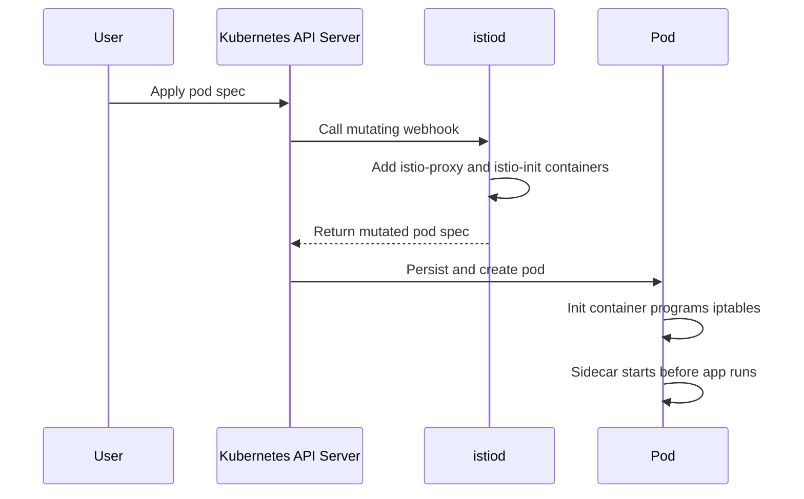
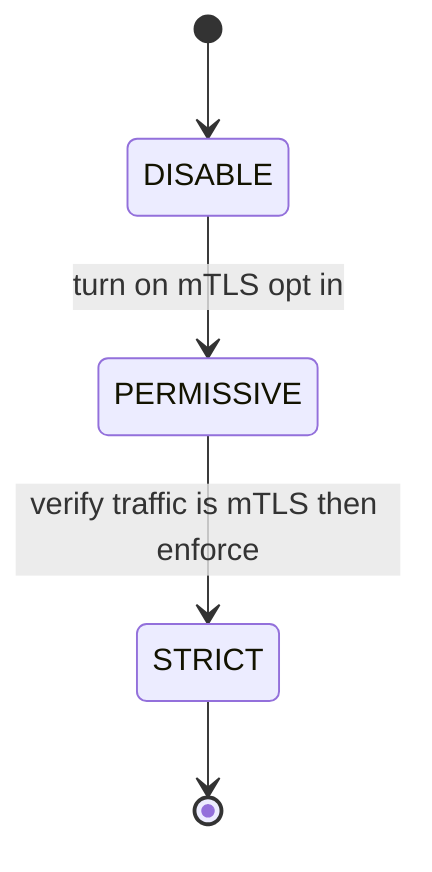

# Lecture 1 — Istio Architecture, Sidecar vs Ambient, and mTLS

> **Duration:** ~2 hours of reading + hands-on.
> **Outcome:** You can describe istiod's role and how a Service plus a CRD becomes Envoy config; distinguish sidecar mode from ambient mode by what each costs and can do; turn on mTLS with `PeerAuthentication` and verify it on the wire; and write an `AuthorizationPolicy` that enforces deny-by-default.

If you remember one sentence from this lecture, remember this one:

> **Istio is a control plane (istiod) that watches Kubernetes and your CRDs and pushes Envoy config to a data plane — and the only architectural decision that really changes the bill is whether that data plane is a sidecar per pod or ambient's per-node ztunnel.**

Last week you wrote Envoy config by hand. This week istiod writes it. Your job shifts from authoring listeners and clusters to authoring *intent* — "cart should mTLS to inventory," "10% of cart traffic goes to v2," "only the order service may call payment" — and letting the control plane translate that intent into the per-proxy config you already know how to read. The skill that makes you dangerous with Istio is connecting the CRD to the Envoy config it generates, which is exactly what `istioctl proxy-config` lets you see.

---

## 1. The architecture: one control plane, two possible data planes

### 1.1 istiod — the control plane

Modern Istio collapses what were once three components (Pilot, Citadel, Galley) into a single binary: **istiod**. It does three jobs:

1. **Configuration.** It watches the Kubernetes API — Services, Endpoints, Pods — and your Istio CRDs (`VirtualService`, `DestinationRule`, `PeerAuthentication`, `AuthorizationPolicy`). It validates them and translates them into Envoy xDS config, which it pushes to every proxy in the mesh over an ADS stream. This is *exactly* the xDS control plane from Week 7, Lecture 1, §2.2 — istiod is a production-grade `go-control-plane`.

2. **Certificate authority.** istiod is the mesh CA. It issues each workload a short-lived X.509 certificate whose identity is a **SPIFFE ID** derived from the workload's Kubernetes service account: `spiffe://cluster.local/ns/<namespace>/sa/<serviceaccount>`. It rotates these certs automatically (default lifetime is on the order of a day, rotated well before expiry). This is the machinery that makes mTLS "free" — you never touch a cert.

3. **Injection.** istiod runs the mutating admission webhook that adds the data-plane proxy to pods (in sidecar mode) at creation time.

```
        ┌──────────────────── istiod (control plane) ───────────────────┐
        │  watches: Services, Endpoints, Pods, Istio CRDs                │
        │  validates + translates -> Envoy xDS                           │
        │  CA: issues + rotates SPIFFE-identity certs                    │
        │  runs the sidecar injection webhook                            │
        └───────────────┬───────────────────────────────┬───────────────┘
                        │ xDS push (ADS)                 │ certs
        ┌───────────────▼───────────────┐   ┌───────────▼───────────────┐
        │  DATA PLANE (sidecar mode)     │   │ DATA PLANE (ambient mode)  │
        │  one Envoy per pod, iptables-  │   │ ztunnel per NODE (L4+mTLS) │
        │  intercepts all pod traffic    │   │ + waypoint per ns (L7 opt) │
        └───────────────────────────────┘   └────────────────────────────┘
```

### 1.2 Sidecar mode — the classic data plane

In sidecar mode, istiod's webhook injects two things into each pod:

- An **init container** (`istio-init`, or the equivalent done by the Istio CNI plugin) that programs **iptables** rules to redirect *all* of the pod's inbound and outbound traffic through the sidecar.
- The **sidecar container** (`istio-proxy`): a full Envoy. Every byte the app sends or receives now passes through this Envoy, which applies mTLS, routing, retries, telemetry — everything.

The cost is concrete: an Envoy per pod is tens to ~100+ MB of memory *per pod*, plus a small per-hop latency (the request goes app → local sidecar Envoy → network → remote sidecar Envoy → remote app — two extra proxy hops). At ten pods that's noise. At ten thousand pods it's a real line item, and it's the reason ambient exists.

> **The iptables interception is why "it works without the sidecar" is a clue, not a fix.** When a meshed pod can't talk and an un-meshed copy can, the difference is the sidecar's iptables redirect and mTLS expectations — which means the problem is in the mesh config (a `PeerAuthentication`, an `AuthorizationPolicy`, a port-name that isn't `grpc`/`http2`), not the app. We chase exactly this in the challenge.

### 1.3 Ambient mode — the sidecar-less data plane

Ambient mode (GA as of the 1.24 line) splits the data plane into two layers so you only pay for L7 where you need it:

- **ztunnel** ("zero-trust tunnel") runs as a **DaemonSet — one per node**, not one per pod. It carries **L4** traffic and **mTLS** for *every* pod on its node. So mTLS and identity become a per-node cost, not a per-pod cost. This is the cheap, always-on layer: enroll a namespace in ambient (`kubectl label namespace foo istio.io/dataplane-mode=ambient`) and every pod in it gets mutual TLS with zero per-pod proxies.
- **The waypoint proxy** is a full Envoy you deploy **per namespace or per service** *only when you need L7 features* — `AuthorizationPolicy` on HTTP attributes, `VirtualService` routing, retries, fault injection. Traffic that needs L7 is routed through the waypoint; traffic that only needs L4 + mTLS skips it and stays on the cheap ztunnel path.

```
   ambient: the L4 floor is free, L7 is opt-in
   ┌──────── node ────────┐         ┌──────── node ────────┐
   │  pod A    pod B       │  mTLS   │  pod C    pod D       │
   │    \       /          │ <-----> │    \       /          │
   │     ztunnel (L4+mTLS) │         │     ztunnel (L4+mTLS) │
   └───────────────────────┘         └───────────────────────┘
                 │ (only if L7 policy is needed)
                 ▼
         waypoint Envoy (per ns/service) — L7 routing/authz/retries
```

**The trade:** sidecar mode gives you full L7 on *every* hop unconditionally, at a per-pod cost. Ambient gives you mTLS and L4 cheaply everywhere and L7 only where you opt in. For a mesh whose main goal is "mTLS everywhere + telemetry," ambient is dramatically cheaper. For a mesh that needs rich L7 policy on nearly every hop, the sidecar's "it's already there" can be simpler. In 2026 the honest default for a *new* adoption is "start ambient, add waypoints where you need L7" — but you must be able to run and reason about both, which is why you'll do both this week.

---

## 2. The CRD-to-Envoy mapping (the load-bearing mental model)

Here is the table that makes Istio legible. Every CRD you write becomes Envoy config you already know.

| You write (Istio CRD) | istiod generates (Envoy) | What it controls |
|---|---|---|
| `Gateway` | A **listener** | The mesh's ingress/egress edge |
| `VirtualService` | **Routes** (in a route config) | Matching, weighted splits, retries, timeouts, fault injection |
| `DestinationRule` | **Cluster** config + subsets | Load balancing, connection pools, outlier detection, subset definitions |
| `ServiceEntry` | A **cluster** for an external host | Letting the mesh talk to things outside it |
| `PeerAuthentication` | TLS context on listeners/clusters | mTLS mode |
| `AuthorizationPolicy` | An **RBAC filter** in the HTTP filter chain | Allow/deny by principal/namespace/property |

When you can say "a `VirtualService` weighted split *is* an Envoy `weighted_clusters` route, and a `DestinationRule` subset *is* the cluster those weights point at" — which you can, because you wrote exactly that YAML by hand last week — Istio stops being magic. You'll prove the mapping with `istioctl proxy-config routes deploy/cart` and `istioctl proxy-config clusters deploy/cart`, which dump the *actual* Envoy routes and clusters istiod pushed.

### 2.1 How injection actually happens

The piece that connects "I labeled a namespace" to "there's an Envoy in my pod" is the **mutating admission webhook**. When you label a namespace `istio-injection=enabled` and a pod is created, the Kubernetes API server calls istiod's webhook *before the pod is persisted*. The webhook mutates the pod spec, adding:

- the **`istio-proxy`** sidecar container (the Envoy),
- an **`istio-init`** init container (or, with the CNI plugin, an equivalent) that programs the iptables rules redirecting the pod's traffic through the sidecar,
- the volumes and env the proxy needs (the SDS socket for certs, the proxy config).


*The mutating admission webhook rewrites a pod's spec before it's ever persisted — the app never knows a sidecar was added.*

```bash
# See the mutation: a meshed pod has containers it never declared.
kubectl get pod -n shop <cart-pod> -o jsonpath='{.spec.containers[*].name}'
# app istio-proxy        <-- you wrote 'app'; the webhook added 'istio-proxy'

kubectl get pod -n shop <cart-pod> -o jsonpath='{.spec.initContainers[*].name}'
# istio-init             <-- programs the iptables redirect
```

Two consequences worth holding onto. First, injection happens **at pod creation**, so labeling a namespace doesn't mesh existing pods — you must restart them (`kubectl rollout restart`) to get the sidecar. "I labeled the namespace but the pods are still 1/1" is almost always "the pods predate the label." Second, because the webhook is in the pod-admission path, if istiod (and thus the webhook) is unreachable when a pod is created, the pod creation can fail or proceed un-injected depending on the webhook's failure policy — another way istiod's availability touches the data plane.

For **ambient mode**, there's no pod mutation at all — you label the namespace `istio.io/dataplane-mode=ambient`, and the per-node ztunnel starts carrying that namespace's traffic with no per-pod change and no restart. That "enroll without restarting pods" property is one of ambient's quieter operational wins: meshing a namespace becomes a label, not a fleet-wide rollout.

### 2.2 Reaching outside the mesh: ServiceEntry and egress

One more CRD you'll meet: by default, the mesh knows about in-cluster Services, but a workload that calls an *external* host (a third-party API, a managed database) is reaching something the mesh has no cluster for. **`ServiceEntry`** adds an external host to the mesh's registry, creating a cluster for it so the sidecar can route to it — and so you can apply the same timeouts, retries, and telemetry to external calls that you apply internally:

```yaml
apiVersion: networking.istio.io/v1
kind: ServiceEntry
metadata: { name: payments-api, namespace: shop }
spec:
  hosts: ["api.payments.example.com"]
  ports:
  - { number: 443, name: https, protocol: TLS }
  resolution: DNS
  location: MESH_EXTERNAL          # it lives outside the mesh
```

This matters for two reasons. First, **observability**: without a `ServiceEntry`, calls to external hosts are lumped into an opaque "PassthroughCluster" and you lose per-destination metrics — adding the entry gives you the same RED metrics for `api.payments.example.com` you get for internal services. Second, **egress control**: a security-conscious mesh can be configured to *block* traffic to hosts that aren't declared via `ServiceEntry`, so a compromised pod can't exfiltrate to an arbitrary external address. That outbound-allowlist posture — "you may only reach the externals we've declared" — is a real zero-trust control, and it's the egress complement to the `AuthorizationPolicy` ingress controls in §4. For the capstone, your external dependencies (a payment API, an object store) are exactly what `ServiceEntry` brings under the mesh's observability and control.

---

## 3. mTLS by default

### 3.1 What mTLS gives you and why the mesh is the right place for it

Mutual TLS means both ends of every connection present a certificate and verify the other's. It gives you two things at once: **encryption in transit** (nobody on the network can read or tamper with the traffic) and **workload identity** (each side *knows*, cryptographically, which service it's talking to — not just which IP). That identity is the foundation authorization is built on: an `AuthorizationPolicy` that says "only the order service may call payment" can only mean anything if "the order service" is a verifiable identity, which mTLS provides.

The reason to do this at the mesh and not in each app: doing TLS correctly — cert issuance, rotation, validation, cipher selection — is hard, and a 15-team org doing it 15 times is 15 chances to get it wrong (an expired cert, a skipped verification, a hard-coded key). The mesh does it *once*, in the data plane, identically for everyone, with automatic rotation. That uniformity is the single strongest argument for adopting a mesh at all.

### 3.2 PeerAuthentication: the modes and the migration

`PeerAuthentication` sets the mTLS mode for a namespace or workload:

- **`DISABLE`** — no mTLS; plaintext only.
- **`PERMISSIVE`** — accept *both* mTLS and plaintext. This is the migration mode: a meshed server accepts plaintext from not-yet-meshed clients *and* mTLS from meshed ones.
- **`STRICT`** — accept *only* mTLS. Plaintext is refused. This is the destination state.


*The safe migration path — never jump straight to STRICT while un-meshed clients still exist.*

The mesh-wide default in recent Istio is permissive-by-default for backward compatibility, which means **a fresh install does not actually enforce encryption until you make it STRICT.** That gap is a classic finding: "we have a mesh, so we have mTLS" — no, you have the *capability*; you haven't turned on enforcement.

The safe migration, which avoids an outage, is:

```yaml
# Step 1: namespace-wide PERMISSIVE (the default, made explicit).
# Meshed servers accept both mTLS (from meshed clients) and plaintext (from not-yet-meshed ones).
apiVersion: security.istio.io/v1
kind: PeerAuthentication
metadata:
  name: default
  namespace: shop
spec:
  mtls:
    mode: PERMISSIVE
```

```yaml
# Step 2, after every client is meshed and you've verified mTLS is flowing:
# flip to STRICT. Now plaintext is refused — encryption is enforced, not just available.
apiVersion: security.istio.io/v1
kind: PeerAuthentication
metadata:
  name: default
  namespace: shop
spec:
  mtls:
    mode: STRICT
```

The discipline: **never go straight to STRICT on a namespace with un-meshed clients** — you'll cut them off. Go permissive, mesh everyone, *verify* with telemetry that the traffic is actually mTLS, then go strict. The verification step is the one people skip and regret.

### 3.3 Verifying mTLS is real

Three independent ways to confirm, in increasing strength:

```bash
# 1. The effective policy on a workload:
istioctl x describe pod <cart-pod>
# -> "Effective PeerAuthentication: STRICT"

# 2. The cert is actually loaded in the sidecar (SPIFFE identity present):
istioctl proxy-config secret deploy/cart -o json | jq '.dynamicActiveSecrets[].name'
# -> "default", "ROOTCA"

# 3. The mesh's own telemetry: in Kiali, the cart->inventory edge shows a padlock,
#    and the istio_requests_total metric carries connection_security_policy="mutual_tls".
```

The strongest single check is the telemetry label `connection_security_policy="mutual_tls"` on the request metric — it's the mesh *reporting* that the request it actually carried was mutually authenticated, not a config assertion. When you write the homework's mTLS-verification problem, that label is the evidence to quote.

---

## 4. Authorization: who may talk to whom

mTLS answers *who you are*. Authorization answers *what you may do*. They layer: `PeerAuthentication` establishes the verified identity; `AuthorizationPolicy` decides, per request, whether that identity is allowed.

### 4.1 Deny-by-default

The right posture for a zero-trust mesh is **deny-by-default**: nothing may talk to a workload unless a policy explicitly allows it. You establish that with an empty-spec allow policy (which, counterintuitively, denies everything because it allows *nothing*) or an explicit deny-all, then add allow rules:

```yaml
# Deny everything in the namespace by default. (An ALLOW policy that matches no
# rules = nothing is allowed = everything is denied.)
apiVersion: security.istio.io/v1
kind: AuthorizationPolicy
metadata:
  name: deny-all
  namespace: shop
spec:
  {}     # empty spec, ALLOW action by default -> matches nothing -> denies all
```

Then allow the specific, intended call paths — keyed on the **source principal**, which is the caller's SPIFFE identity:

```yaml
# Allow ONLY the cart service account to call inventory.
apiVersion: security.istio.io/v1
kind: AuthorizationPolicy
metadata:
  name: inventory-allow-cart
  namespace: shop
spec:
  selector:
    matchLabels:
      app: inventory
  action: ALLOW
  rules:
  - from:
    - source:
        principals: ["cluster.local/ns/shop/sa/cart"]   # cart's SPIFFE identity
    to:
    - operation:
        methods: ["POST"]                                # gRPC is POST under the hood
        paths: ["/inventory.v1.InventoryService/*"]      # only the inventory service methods
```

Now `cart` can call `inventory`, but if a compromised `frontend` pod tries, it gets `RBAC: access denied` — even though it's *in* the mesh with a valid cert. Identity is necessary but not sufficient; authorization is the second gate. The exercise has you prove both the allow and the deny with a probe.

### 4.2 The authn/authz layering, stated precisely

- **Authentication (`PeerAuthentication`)** is about the *channel*: is this a mutually-authenticated connection, and what identity does the peer cert assert? It's binary per connection.
- **Authorization (`AuthorizationPolicy`)** is about the *request*: given the authenticated identity, may *this* request (this method, this path, from this principal) proceed? It's per-request and can use HTTP attributes.

A request must pass *both*. STRICT mTLS with no AuthorizationPolicy = encrypted but anyone-in-the-mesh-may-call. AuthorizationPolicy with mTLS DISABLED = access rules keyed on an identity nobody verified (spoofable). You want both: STRICT + deny-by-default + explicit allows. That stack is what "zero-trust mesh" means concretely, and it's exactly what Week 21 (SPIFFE/SPIRE + OPA) deepens.

---

## 5. Reading the mesh: istioctl as ground truth

The diagnostic muscle for Istio is `istioctl`, and the lesson is the same as last week's `/config_dump`: **trust the proxy's actual config, not your CRD's intent.** The CRD is what you asked for; `proxy-config` is what istiod actually pushed.

```bash
# Is every proxy in sync with istiod's latest config? (SYNCED on all lines = healthy.)
istioctl proxy-status

# What clusters does cart's sidecar actually have? (Maps to your DestinationRules.)
istioctl proxy-config clusters deploy/cart

# What routes? (Maps to your VirtualServices — including canary weights.)
istioctl proxy-config routes deploy/cart -o json | jq '.[].virtualHosts[].routes'

# Validate CRDs for mistakes BEFORE they cause an outage:
istioctl analyze -n shop
```

`istioctl proxy-status` is the first thing to run when "I applied a VirtualService and nothing changed" — if a proxy is `STALE`, it hasn't received the push yet (or can't). `istioctl analyze` catches the typos that silently no-op a policy: a `host` that doesn't match a Service, a `PeerAuthentication` in the wrong namespace, a subset with no matching pods. These are the mesh equivalents of last week's typo'd cluster name, and the tooling names them — if you run it.

### 5.1 Proving the CRD became the Envoy config you expect

The most valuable thing `proxy-config` does is let you *confirm the translation*. You wrote a `PeerAuthentication: STRICT`; did istiod actually configure the cart sidecar's listeners to require mTLS? Check the listener's transport socket:

```bash
# Does cart's INBOUND listener actually require mTLS? (Look for the TLS context.)
istioctl proxy-config listeners deploy/cart -o json \
  | jq '.[] | select(.name | test("virtualInbound")) | .filterChains[].transportSocket.name'
# "envoy.transport_sockets.tls"   <-- the STRICT PeerAuthentication became a TLS transport socket

# And the SPIFFE identity in the cert the sidecar will present:
istioctl proxy-config secret deploy/cart -o json \
  | jq -r '.dynamicActiveSecrets[] | select(.name=="default") | .secret.tlsCertificate.certificateChain.inlineBytes' \
  | base64 -d | openssl x509 -noout -text | grep -A1 "Subject Alternative Name"
# URI:spiffe://cluster.local/ns/shop/sa/cart
```

This closes the loop the whole week is about: intent (the CRD) → control plane (istiod) → data plane (the Envoy config you can read). When something doesn't work, the bug is *somewhere on that path*, and `proxy-config` tells you how far the intent got. A STRICT policy that didn't produce a TLS transport socket on the listener means the policy didn't apply (wrong namespace, wrong selector) — and now you know *where* to look.

### 5.2 Certificate rotation — the thing you never see

A word on what makes mTLS sustainable: **automatic rotation**. istiod's CA issues each workload a short-lived cert (lifetime on the order of a day) and the sidecar's pilot-agent requests a fresh one well before expiry — by default at a fraction of the lifetime remaining. You never run a cron job, never get paged for an expired cert, never rotate a key by hand. This is the single biggest operational reason to do mTLS at the mesh rather than in each app: hand-rolled in-app TLS means hand-rolled rotation, and "the certificate expired at 3 a.m." is one of the most common, most avoidable outages there is. The mesh makes cert expiry a non-event.

The flip side, and a real failure mode: if the **CA itself** (istiod) is down for longer than the cert lifetime, certs can't rotate and connections start failing as they expire. So istiod's availability *is* part of your data path's availability, even though istiod isn't in the request path. The runbook line: "istiod down briefly is fine (proxies keep their current certs and config); istiod down longer than the cert lifetime is an outage as certs expire." Week 21's SPIFFE/SPIRE deep-dive revisits exactly this.

### 5.3 A note on trust domains and the SPIFFE identity

The identity baked into each cert is worth dwelling on because it's the foundation everything else rests on. The format is `spiffe://<trust-domain>/ns/<namespace>/sa/<service-account>` — for example `spiffe://cluster.local/ns/shop/sa/cart`. Three things follow:

- **Identity is the service account, not the pod.** Every pod running under the `cart` service account presents the *same* identity. So your authorization rules and your reasoning about "who can call whom" are at the service-account granularity — which is why assigning each service its own service account (rather than letting many services share `default`) is a real security practice, not a formality. If `cart` and `frontend` share a service account, an `AuthorizationPolicy` can't tell them apart.
- **The trust domain is the mesh boundary.** `cluster.local` is the default trust domain; in multi-cluster or federated setups, the trust domain is how you reason about *which* mesh an identity belongs to. Certs from a different trust domain are, by default, not trusted — which is what keeps two independent meshes from accidentally authenticating each other's workloads.
- **It's a SPIFFE-standard identity.** Istio didn't invent its own identity scheme; it uses SPIFFE, the same standard you'll deploy explicitly with SPIRE in Week 21. So the mental model you build here — verifiable, service-account-scoped, trust-domain-bounded workload identity — transfers directly when you replace istiod's built-in CA with a dedicated SPIFFE/SPIRE deployment for a stronger zero-trust posture.

The practical takeaway for *this* week: when you write an `AuthorizationPolicy` allowing `cluster.local/ns/shop/sa/cart`, you're naming a SPIFFE identity, and that identity is only as meaningful as your service-account hygiene. One service, one service account, is the discipline that makes mesh authorization actually mean what you think it means.

---

## 6. Recap

You should now be able to:

- Describe istiod's three jobs (config/xDS, CA/certs, injection) and trace a Service-plus-CRD into pushed Envoy config.
- Distinguish sidecar mode (per-pod Envoy, full L7, higher cost) from ambient mode (per-node ztunnel for L4+mTLS, opt-in waypoint for L7, lower cost), and state when each fits.
- Map each Istio CRD to the Envoy config it generates (`VirtualService`→routes, `DestinationRule`→cluster+subsets, etc.).
- Turn on mTLS safely via the permissive→strict migration and verify it three ways, strongest being the `connection_security_policy="mutual_tls"` telemetry label.
- Write a deny-by-default `AuthorizationPolicy` plus explicit allows keyed on SPIFFE principals, and explain the authn/authz layering.
- Use `istioctl proxy-status`, `proxy-config`, and `analyze` as the ground truth that the mesh is doing what you declared.

Next up: shaping traffic for a canary, injecting faults at the mesh layer, watching it in Kiali, and the sidecar surprises that bite every operator. Continue to [Lecture 2 — Traffic Management, Canary, and the Sidecar Tax](./02-traffic-management-canary-and-the-sidecar-tax.md).

---

## References

- *Istio — Architecture*: <https://istio.io/latest/docs/ops/deployment/architecture/>
- *Istio — Ambient overview*: <https://istio.io/latest/docs/ambient/overview/>
- *Istio — mTLS migration*: <https://istio.io/latest/docs/tasks/security/authentication/mtls-migration/>
- *Istio — Authorization concepts*: <https://istio.io/latest/docs/concepts/security/#authorization>
- *Istio — PeerAuthentication reference*: <https://istio.io/latest/docs/reference/config/security/peer_authentication/>
- *Istio — AuthorizationPolicy reference*: <https://istio.io/latest/docs/reference/config/security/authorization-policy/>
