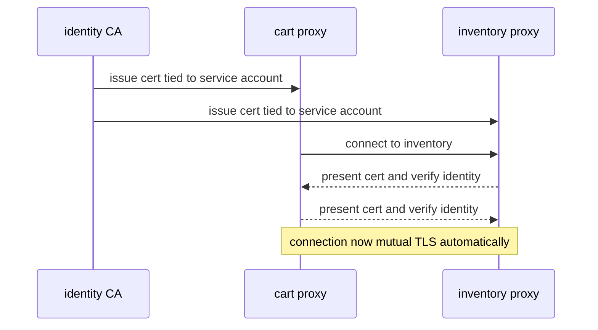
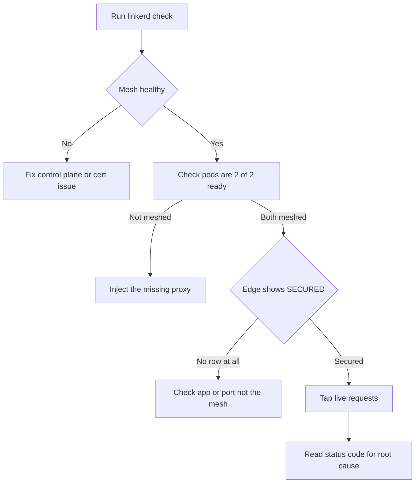

# Lecture 1 — Linkerd and the Rust Micro-Proxy: Simplicity as a Feature

> **Duration:** ~2 hours of reading + hands-on.
> **Outcome:** You can describe Linkerd's architecture and its `linkerd2-proxy`, explain *why* it chose a purpose-built Rust micro-proxy over Envoy, turn on its automatic mTLS, and articulate the "simplicity is a feature" philosophy as a genuine engineering position — not a marketing slogan.

If you remember one sentence from this lecture, remember this one:

> **Linkerd made the opposite bet from Istio: instead of the most powerful proxy configured by the richest control plane, it built the smallest proxy that does exactly what a mesh sidecar needs and nothing more — and it treats every feature it *doesn't* have as a feature it doesn't have to operate.**

Last week's Istio is the maximalist mesh: Envoy (a general-purpose proxy that can do almost anything), istiod (a control plane that exposes a large CRD surface), sidecar-or-ambient flexibility. That power has a cost, and you measured it: the sidecar tax, the config surface, the operational learning curve. Linkerd looked at the same problem and concluded that *most of that power is unused most of the time*, and that an unused feature is still an operational liability. So it built a mesh you can understand in an afternoon. This lecture is the case for that bet — and its honest limits.

---

## 1. Linkerd's architecture

Linkerd has the same two-layer shape as every mesh — a control plane and a data plane — but both are deliberately smaller.

### 1.1 The control plane

Linkerd's control plane is a handful of focused components:

- **destination** — the service-discovery and policy brain. Proxies ask it "where are the endpoints for this service, and what policy applies?" It's the rough analogue of istiod's xDS role, but with a much smaller surface.
- **identity** — the certificate authority. It issues each meshed workload a TLS identity (a cert tied to the workload's Kubernetes service account) and rotates it. This is what makes mTLS automatic — exactly the role istiod's CA plays.
- **proxy-injector** — the admission webhook that injects the `linkerd2-proxy` sidecar into pods (when the namespace or workload is annotated `linkerd.io/inject: enabled`).

There's an optional **viz** extension (the dashboard + metrics, `linkerd viz`) and a **multicluster** extension, but the *core* is just those three. The design intent: a small number of components, each doing one thing, that you can name and reason about. Compare the mental load of "destination, identity, proxy-injector" to enumerating everything istiod does.

```
        ┌──────────── Linkerd control plane ────────────┐
        │  destination  — discovery + policy             │
        │  identity     — the CA (automatic mTLS)        │
        │  proxy-injector — sidecar injection webhook    │
        └───────────────┬────────────────────────────────┘
                        │ tells proxies endpoints/policy; issues certs
        ┌───────────────▼────────────────┐
        │  data plane: linkerd2-proxy     │   one tiny Rust micro-proxy per pod
        │  (Rust, micro-proxy, per pod)   │   does ONLY mesh-sidecar work
        └─────────────────────────────────┘
```

### 1.1.5 A note on history: the original mesh

A bit of context that matters for the comparison: **Linkerd coined the term "service mesh."** Its 1.x line (JVM-based, 2016) predates Istio's popularity; the 2.x rewrite (the Rust proxy, the small control plane you see today) was a deliberate response to 1.x being too heavy. So Linkerd's minimalism isn't naïveté about what a mesh can do — it's the *informed* choice of a team that built a heavyweight mesh first, watched it strain, and rebuilt around "do less, weigh less." When Linkerd says simplicity is a feature, it's saying so from the other side of having shipped the complicated version. That history is worth knowing when someone frames Linkerd as "the simple one that can't do much" — it's the simple one *on purpose*, by a team that knows exactly what it left out.

It's also worth noting *why* the JVM-to-Rust move mattered so much. Linkerd 1.x's per-proxy footprint (a JVM per pod, with its memory and GC-pause behavior) was exactly the kind of "the sidecar is too heavy" problem that, years later, drove Istio toward ambient. Linkerd's answer was different from Istio's: not "remove the per-pod proxy" but "make the per-pod proxy so small it stops being the problem" — hence Rust, hence a micro-proxy that does only the sidecar job. The two projects looked at the same pain (per-pod proxy cost) and chose opposite remedies (shrink it vs eliminate it), which is precisely the kind of philosophical fork this week exists to make you see. Keep that fork in mind: it's the clearest illustration that these meshes aren't competing on a single axis but are *different answers to the same hard question*.

### 1.2 The data plane: `linkerd2-proxy`

Here is the heart of Linkerd's bet. Its sidecar is **`linkerd2-proxy`**: a proxy written **in Rust**, purpose-built for one job — being a service-mesh sidecar — and nothing else.

Why this matters, concretely:

- **It's small.** A general-purpose proxy like Envoy is a large, configurable system that can be an edge gateway, a mesh sidecar, a TCP proxy, an API gateway. Carrying all that generality into every pod costs memory. `linkerd2-proxy` implements *only* the sidecar feature set (transparent mTLS, HTTP/2 + gRPC load balancing, retries, timeouts, the golden-signals telemetry), so it's a fraction of the resident memory. You'll measure this — Linkerd's per-pod proxy memory is typically *much* smaller than an Envoy sidecar's.
- **It's memory-safe.** Rust's ownership model eliminates the class of memory-corruption bugs (use-after-free, buffer overflow) that plague C/C++ network code. For a component that sits in the path of every request and terminates TLS, that's a security argument, not just a tidiness one.
- **It's purpose-tuned.** Because it does one job, its latency profile and resource use are predictable. Linkerd publishes (and you'll verify) a tight, low-variance latency overhead — partly *because* the proxy isn't a general-purpose machine with many code paths.

> **The design philosophy, stated plainly:** Linkerd's team argues that a service-mesh sidecar should be a *micro-proxy* — small, single-purpose, boring — and that reaching for a full Envoy in every pod is solving a sidecar problem with a gateway tool. Whether you agree depends on whether you need Envoy's L7 richness; that's the real trade, and §4 is honest about it.

---

## 2. Automatic mTLS — on by default

This is where Linkerd's simplicity is most visible. In Istio, mTLS is *available* on install but *not enforced* until you apply a STRICT `PeerAuthentication` (Week 8 §3.2 — the gap the industry trips on). In Linkerd, **mTLS between meshed pods is automatic and on by default the moment both ends are meshed.** You don't write a `PeerAuthentication`; you mesh the workloads and they're talking mutual TLS.

How it works:

1. The **identity** control-plane component is the CA. When a proxy starts, it gets a cert tied to the pod's service account (a SPIFFE-style identity).
2. When two meshed proxies connect, they automatically upgrade the connection to mTLS, each presenting its cert and verifying the other's.
3. Certs are rotated automatically (short lifetimes), with no operator action.


*How two meshed proxies end up talking mTLS with zero operator config.*

```bash
# After meshing cart and inventory, mTLS is already on. Verify:
linkerd viz edges deployment -n shop
# shows cart -> inventory with SECURED (a mTLS lock), no config required
```

The trade against Istio: Linkerd gives you *less knob* here. There's no PERMISSIVE-vs-STRICT migration dance because meshed-to-meshed is just always encrypted — which is simpler, but means the migration story for a *partially* meshed namespace is "mesh everything" rather than "ride permissive for a while." For a greenfield mesh that's a feature; for incrementally meshing a large legacy namespace it's a different shape of work. Note this in your comparison.

For authorization (the "who may call whom" gate, Istio's `AuthorizationPolicy`), Linkerd has `Server` + `ServerAuthorization` + a newer `AuthorizationPolicy`. The model is the same idea — deny-by-default on a port, then allow specific identities — with, again, a smaller surface. The stretch goal has you write one and compare the config volume to Istio's.

### 2.1 Why automatic-on-by-default is more than convenience

It's worth being precise about *why* Linkerd's on-by-default mTLS matters beyond saving you a CRD, because it's a genuine security argument. In a mesh where mTLS is *available but off by default* (Istio's PERMISSIVE), there's a window — between "the mesh is installed" and "someone remembered to apply STRICT" — where the mesh creates a *false sense of security*: people believe traffic is encrypted because "we have a mesh," when in fact plaintext is still flowing. That gap is where compliance findings and post-incident "wait, that wasn't encrypted?" surprises live.

Linkerd closes the gap by construction: the moment two pods are meshed, their traffic is mutual TLS, full stop. There is no "we forgot to turn it on" state, because there's nothing to turn on. The cost — and it's a real one to put in the comparison — is that the *partial* state (some pods meshed, some not) is handled differently: a meshed pod talking to an un-meshed one falls back to plaintext for that specific connection (it can't do mTLS with a peer that has no identity), and Linkerd's tooling shows you which edges are secured and which aren't so you can finish meshing. So the migration story is "mesh everything, watch the `viz edges` SECURED column go all-green" rather than Istio's "ride PERMISSIVE while mixed, then flip STRICT." Both reach the same end state; Linkerd's path has fewer states to be in, and crucially no state where you *think* you're secure but aren't.

The general principle, which recurs across this course: **a secure default that's hard to turn off beats a secure option that's easy to forget to turn on.** Linkerd's mTLS is the former; Istio's (by default) is the latter, until you apply STRICT. Neither is wrong — Istio's flexibility is the price of its broader migration support — but the difference is exactly the kind of trade-off your ADR should name, because for a team that worries about "did we actually encrypt everything," on-by-default removes an entire class of mistake.

---

## 3. Installing and meshing — the simplicity in practice

The install is deliberately a two-step story:

```bash
# 1. Pre-flight: does the cluster meet Linkerd's requirements?
linkerd check --pre

# 2. Install the CRDs and the control plane.
linkerd install --crds | kubectl apply -f -
linkerd install | kubectl apply -f -

# 3. Confirm the control plane is healthy.
linkerd check
```

Meshing a workload is an annotation, applied by injecting it:

```bash
# Inject the proxy into cart + inventory (annotate, then re-apply):
kubectl get deploy -n shop -o yaml | linkerd inject - | kubectl apply -f -

# Or label the namespace so everything in it is meshed:
kubectl annotate namespace shop linkerd.io/inject=enabled
```

Confirm the proxy is present (the pod is now `2/2`) and the data is flowing securely:

```bash
linkerd viz stat deploy -n shop          # golden signals per workload
linkerd viz edges deploy -n shop         # who talks to whom, and whether it's mTLS
```

`linkerd check` is the recurring diagnostic — the Linkerd equivalent of `istioctl analyze` + `istioctl proxy-status` rolled into one. It validates the install, the certs, the proxy versions, and the data-plane health, and it tells you in plain language what's wrong. The simplicity shows up here too: one command, a checklist of green/red, human-readable failures.

> **The "it just works" claim, examined.** Linkerd markets ease of operation. In practice the claim mostly holds *for the feature set it supports* — install, mesh, mTLS, golden signals, retries, simple traffic splits. The moment you need something outside that set (rich L7 routing, complex policy, certain multi-cluster topologies), you're either reaching for the edge of Linkerd's capabilities or back to Istio. "Simple" and "less capable" are two sides of the same coin; the skill is knowing which side your org needs.

### 3.4.5 A worked diagnosis: "cart can't reach inventory"

To feel the diagnostic experience (which the homework asks you to compare to `istioctl`), walk a failure. `cart` can't reach `inventory` after meshing. The Linkerd method:

```bash
# 1. Is the mesh itself healthy? (Certs valid, control plane up, proxies current?)
linkerd check
# √√√ all green, OR a red line that names the problem (e.g. expired issuer cert)

# 2. Are both workloads actually meshed?
kubectl get pods -n shop
# cart 2/2, inventory 2/2  -> both have the proxy. If one is 1/1, that's the bug.

# 3. Is the edge secured and flowing?
linkerd viz edges deploy -n shop
# cart -> inventory  SECURED √   -> mTLS is up
# (no row at all -> no traffic is flowing; check the app/port, not the mesh)

# 4. Watch live requests to see what's actually happening:
linkerd viz tap deploy/cart -n shop
# req id=... :method=POST :authority=inventory... :status=403  <-- authz denial!
```


*The four-command diagnostic path from linkerd check down to a live request tap.*

In step 4, a `403` with the authz machinery tells you the `Server`/`AuthorizationPolicy` is denying the call — the Linkerd analogue of Istio's `RBAC: access denied`. A connection reset with no status points at the app or a port mismatch instead. The whole diagnosis took four commands, each with human-readable output, and `linkerd check` front-loaded the "is the mesh itself broken" question so you don't chase an app bug when the real problem is an expired cert. This is the operational simplicity made concrete — and it's exactly the experience you'll weigh against `istioctl proxy-status`/`proxy-config`/`analyze` when you compare config-and-debug volume in the homework. Neither is *better* in the abstract; Linkerd gives you fewer, friendlier commands, Istio gives you the full Envoy config to inspect. Which you'd rather hand a new on-call engineer is a real, weighable input to the ADR.

---

## 3.5 The data path: load balancing, retries, and timeouts

The `linkerd2-proxy` does the same core data-plane jobs as an Envoy sidecar, but with a deliberately smaller surface. Three behaviors matter for your cart topology.

**Latency-aware load balancing.** When `cart` calls `inventory` and there are several `inventory` pods, the proxy doesn't just round-robin. Linkerd's proxy uses an **exponentially weighted moving average (EWMA)** of observed latency per endpoint and a power-of-two-choices algorithm: for each request it samples two endpoints and sends to the one with the lower in-flight-weighted latency. The effect is that a momentarily slow pod (GC pause, cold cache) automatically receives less traffic *without* you configuring outlier detection — the load balancer routes around slowness as a built-in behavior, not a policy you turn on. This is one place Linkerd's "it just works" is genuinely earned: the thing you configured by hand as outlier detection in Envoy (Week 7) is, for the latency case, default behavior here.

**Retries.** Linkerd retries are configured on a route via its `HTTPRoute` (and the older service-profile mechanism), with a **retry budget** baked into the model — the same storm-prevention principle from Week 7, expressed as a budget rather than a raw retry count. Linkerd's defaults are conservative precisely because the team's philosophy is "a retry that amplifies an outage is worse than no retry," so you opt *into* retries on the routes that are idempotent and want them, rather than getting an unbudgeted `num_retries` by default.

```yaml
# A Linkerd HTTPRoute with a retry on the inventory read path (idempotent).
apiVersion: policy.linkerd.io/v1beta3
kind: HTTPRoute
metadata: { name: inventory-reads, namespace: shop }
spec:
  parentRefs:
  - { group: core, kind: Service, name: inventory, port: 50051 }
  rules:
  - matches:
    - path: { type: PathPrefix, value: "/inventory.v1.InventoryService/GetStock" }
    # retries are configured via annotations / the proxy's retry budget model;
    # the budget caps retries as a fraction of load (the Week 7 principle).
```

**Timeouts.** Per-route timeouts work the same way as everywhere — a request budget that bounds how long a call may hang. The discipline is identical to Week 7: every dependency call gets a timeout, and it tightens as you go upstream.

The point of this section is that Linkerd is *not* a toy — it does real load balancing, retries, and timeouts. It just exposes a smaller set of knobs and picks safer defaults, so the common cases need no configuration. The trade you're making is "fewer ways to express something" in exchange for "harder to misconfigure," which for most teams is the right trade.

## 3.6 Observability: the golden metrics, for free

Because the proxy sits in every request path, Linkerd computes the **golden signals** — success rate, request rate, and latency (p50/p95/p99) — for every meshed service automatically, with no application instrumentation. `linkerd viz stat` and the dashboard surface them per-workload and per-edge:

```bash
linkerd viz stat deploy -n shop
# NAME       MESHED  SUCCESS   RPS   LATENCY_P50  LATENCY_P95  LATENCY_P99
# cart       1/1     100.00%   50    2ms          5ms          7ms
# inventory  1/1     100.00%   50    1ms          3ms          5ms

linkerd viz routes deploy/inventory -n shop   # per-ROUTE golden signals
```

The relationship to your Week 6 OpenTelemetry instrumentation: the mesh gives you the *network-level* golden signals (the RED metrics — Rate, Errors, Duration — for every hop) for free, while your application OTel gives you the *business-logic* spans and custom metrics. They compose. As with Istio, trace *continuity* across the network still requires your app to propagate the tracing headers; the mesh measures the hops but doesn't stitch your application logic's spans together for you. The honest summary: Linkerd's observability is excellent for "is this service healthy and fast," and you still bring your own OTel for "what is this service *doing*."

There's a subtle but important point here that's identical across all three meshes and worth stating once: the mesh's metrics see **network success, not semantic success.** A service that returns a fast HTTP 200 with a body that says "internal error, please retry" is a *success* to Linkerd's `SUCCESS` column and a *failure* to the user. So the mesh's golden signals are necessary but not sufficient for a real SLO — they tell you the network is healthy, not that the answers are correct. When you wire Linkerd's metrics into a progressive-delivery controller (Flagger) or an alerting rule, pair them with at least one application-level correctness check, or you'll happily promote a canary that returns fast, wrong answers. This is the same caveat as Istio's RED metrics, and it generalizes: *the mesh measures the pipe, your app measures the payload.* A mature observability story uses both, and a canary policy that watches only the mesh is one fast-but-wrong response away from an incident it won't catch.

---

## 4. The honest limits

A fair lecture names what Linkerd gives up for its simplicity:

- **Less L7 richness than Istio/Envoy.** Linkerd supports the essential HTTP/gRPC features (retries, timeouts, traffic splits via the `HTTPRoute`/`TrafficSplit` story) but not the full breadth of Envoy's filter ecosystem. If your mesh needs heavy header-based routing, complex fault injection, WASM filters, or exotic L7 policy, Istio's Envoy data plane does more.
- **Still a sidecar (for now).** Linkerd's proxy is *tiny*, but it's still one-per-pod. Istio ambient and Cilium go further (no per-pod proxy at all). Linkerd's answer is "our sidecar is so small the per-pod cost barely matters" — which the benchmark lets you test, and which is a *different* answer from "no sidecar."
- **A smaller ecosystem and CRD surface.** Fewer integrations, fewer knobs, fewer ways to express a policy. For most teams that's a relief; for a team with an unusual requirement it can be a wall.

None of these makes Linkerd wrong. They make it *opinionated*. The org that benefits is the one whose needs fit inside Linkerd's opinions — and a large fraction of orgs' needs do. The org that's hurt is the one that needs the thing Linkerd left out, and discovers it after adopting. The ADR you write this week is precisely the artifact that forces you to check the fit *before* adopting.

---

## 5. Where Linkerd sits in the three-way picture

To set up Lecture 2's comparison, here's Linkerd's position on the axes:

- **Cost:** low — a tiny Rust sidecar, much lighter than an Envoy sidecar, though still per-pod.
- **Operational complexity:** lowest of the three — fewest components, `linkerd check` does most of the diagnosis, simplest mental model.
- **L7 depth:** moderate — the essentials, not Envoy's full breadth.
- **mTLS model:** automatic, on-by-default, its own identity CA — the simplest of the three to *get right*.
- **Multi-cluster:** supported via a gateway model; competent but not its strongest suit.
- **Maturity:** very mature, CNCF graduated, battle-tested at scale (the original service mesh, predates Istio's popularity).

Hold this next to last week's Istio (maximal features, higher cost/complexity) and next lecture's Cilium (eBPF, sidecar-less, CNI-and-mesh-as-one). Three philosophies, three positions on the same axes. That triangulation is the whole point of the week.

---

## 5.1 Traffic management the Linkerd way

Linkerd does canary and traffic shifting, but — true to form — with a smaller surface than Istio's `VirtualService`/`DestinationRule` pair. The modern mechanism is the Kubernetes-standard **Gateway API `HTTPRoute`** with weighted backends; the older one was the `TrafficSplit` CRD (SMI). The same 10/90 → 50/50 → 100/0 canary you ran on Istio looks like this:

```yaml
apiVersion: gateway.networking.k8s.io/v1beta1
kind: HTTPRoute
metadata: { name: cart-canary, namespace: shop }
spec:
  parentRefs:
  - { group: core, kind: Service, name: cart, port: 50051 }
  rules:
  - backendRefs:
    - { name: cart-v1, port: 50051, weight: 90 }    # stable
    - { name: cart-v2, port: 50051, weight: 10 }    # canary
```

Two things to notice. First, Linkerd leans on the **upstream Gateway API standard** rather than its own bespoke CRDs where it can — a deliberate "don't invent what Kubernetes already standardized" choice that lowers the concept count. Second, there's less to configure: no separate `DestinationRule` to define subsets, because the weighting points directly at the backing Services. Fewer moving parts is the recurring theme.

For progressive delivery, Linkerd integrates with **Flagger** exactly as Istio does — Flagger drives the `HTTPRoute` weights and rolls back on a metric breach. So the *automation* story is the same; what differs is the amount of hand-config underneath it. When you compare config volume in this week's homework, this is one of the rows that moves the needle.

The same-intent-fewer-resources pattern shows up across Linkerd's feature set. To reach a given outcome:

- **mTLS:** Istio needs `PeerAuthentication`; Linkerd needs *nothing* (automatic).
- **Canary:** Istio needs `DestinationRule` (subsets) + `VirtualService` (weights); Linkerd needs one `HTTPRoute`.
- **Authorization:** Istio needs `AuthorizationPolicy`; Linkerd needs `Server` + `AuthorizationPolicy` (similar count, smaller fields).
- **Outlier-style routing:** Istio needs `DestinationRule` outlier detection; Linkerd does latency-aware LB by default (no config).

Add those up across a real topology and the difference in total YAML — and total *concepts a team must learn* — is substantial. That's the concrete, countable form of "simplicity is a feature," and it's exactly what the homework's config-volume problem asks you to measure rather than assert.

## 5.2 Operating Linkerd: the diagnostic surface

The day-to-day operational experience is where Linkerd's "simplicity is a feature" claim is most tangible, and it's worth cataloguing because the homework asks you to compare it to Istio's `istioctl`:

- **`linkerd check`** — one command, a green/red checklist covering install health, cert validity and expiry, proxy versions, clock skew, and data-plane readiness. It's the analogue of `istioctl analyze` *and* `istioctl proxy-status` *and* a cert-expiry monitor, rolled into one human-readable run. When something's wrong, you run it first, and its failure messages are written to be actionable ("certificate will expire in 3 days; rotate with...").
- **`linkerd viz stat` / `routes` / `edges`** — golden signals and the security graph from the CLI, no separate dashboard required (though `linkerd viz dashboard` gives you the UI).
- **`linkerd viz tap`** — live per-request inspection (`tap deploy/cart` streams every request the cart proxy sees, with `tls=true` markers) — the equivalent of reading a sidecar's access log, but structured and filterable.

The contrast with Istio is instructive: `istioctl proxy-config` gives you the *full* Envoy config (more power, more to learn); `linkerd viz` gives you the *signals you usually need* (less power, less to learn). Neither is universally better — the question, again, is which matches your team. A team that wants to hand a new on-call engineer a mesh they can be productive on in a day weights Linkerd's surface heavily; a team that needs to debug exotic L7 behavior wants Istio's full Envoy introspection.

## 5.3 The honest cert story

One operational subtlety worth knowing before you adopt Linkerd: its identity system is rooted in a **trust anchor** (a root CA cert) and an **issuer** cert that the control plane uses to mint workload certs. By default the install can generate these, but for production you supply your own and — critically — you must **rotate the issuer cert before it expires**, or the whole mesh's mTLS breaks when it lapses. `linkerd check` warns you as expiry approaches (one of its most valuable checks), but the rotation itself is an operator responsibility. This is the Linkerd equivalent of the istiod-CA-availability concern from Week 8: the mesh's identity root is part of your data path's availability, and letting it expire is a self-inflicted, entirely avoidable outage. Mature shops automate the rotation and alert on `linkerd check`'s cert warnings well ahead of time.

## 5.4 The sidecar vs sidecar-less debate, from Linkerd's seat

This week's three meshes line up on a spectrum of "how much proxy per pod," and Linkerd occupies an interesting middle that's worth stating precisely, because it frames the whole debate:

- **Istio sidecar:** a full Envoy per pod — most capable, most expensive.
- **Linkerd:** a *tiny* Rust micro-proxy per pod — still one-per-pod, but small enough that Linkerd argues the per-pod cost is a non-issue.
- **Istio ambient / Cilium:** *no* per-pod proxy for L4 — the cost moves to a per-node component (ztunnel / eBPF).

Linkerd's position in this debate is distinctive: it did **not** chase sidecar-less. Its argument is that the sidecar model has real *correctness* advantages — the proxy shares the pod's network namespace and lifecycle, so it sees exactly the pod's traffic, fails when the pod fails, and scales when the pod scales, with no per-node component to become a bottleneck or a blast-radius. The cost people object to (memory) Linkerd addresses by making the proxy small, rather than by removing it. Whether that's the right call depends on your scale: at thousands of pods, even a 12 MiB proxy times N is real memory, and the per-node models win on raw cost; at hundreds of pods, the sidecar's simplicity and per-pod isolation may be worth more than the memory saved.

The mature take for 2026: **"sidecar vs sidecar-less" is not "old vs new" or "bad vs good" — it's a genuine trade between per-pod isolation/simplicity and per-node efficiency.** Istio ambient and Cilium bet on efficiency; Linkerd bets that a small-enough sidecar keeps the isolation benefits without the cost being decisive; Istio sidecar mode is still there for teams that want full L7 on every hop unconditionally. Your benchmark this week puts numbers on the efficiency side of that trade; your ADR weighs it against the isolation and operational sides. Don't let anyone tell you sidecars are simply obsolete — they're a point on a spectrum, and which point fits is exactly the decision you're learning to make.

## 5.5 When Linkerd is the wrong choice

To be fair to the comparison — and to write an honest ADR — name the orgs Linkerd does *not* fit:

- **Heavy L7 routing/policy.** A team that needs complex header-based routing on most hops, WASM filters, or an exotic Envoy filter will hit Linkerd's L7 ceiling. Istio's full Envoy is the better fit.
- **An existing eBPF/Cilium investment.** If you're already running Cilium for your CNI and network policy, adding Cilium's mesh features is cheaper than introducing a second system (Linkerd's sidecars) alongside it.
- **A mandate to eliminate per-pod proxies at extreme scale.** At tens of thousands of pods where per-pod memory is a dominant cost line, the per-node models (ambient, Cilium) can win decisively, and Linkerd's "small sidecar" answer may not be small enough.

For everyone else — and that's a large fraction of orgs — Linkerd's simplicity, automatic mTLS, and tiny proxy make it the *low-regret* default: the mesh you adopt when you want the benefits and the least operational drama. The skill is recognizing which camp your org is in *before* you adopt, which is what the ADR forces.

## 5.6 "Simplicity is a feature" as a real engineering position

It's worth taking Linkerd's central claim seriously as engineering, not dismissing it as marketing, because the principle generalizes far past meshes. The argument has three legs:

1. **Every feature is an operational liability, used or not.** A knob you don't turn is still code that can have a bug, a config field that can be set wrong, a thing a new engineer must learn exists before they can rule it out. The *surface area* of a system is a cost independent of which features you use. A mesh with a tenth the CRDs is a mesh with a tenth the ways to misconfigure it.

2. **Safe defaults beat powerful knobs for most teams.** Linkerd's automatic mTLS, its conservative retry budget, its latency-aware load balancing — these are *defaults that are right for the common case*, so the common case needs no configuration. A more powerful mesh that requires you to *configure* mTLS, retries, and LB correctly gives you more control and more chances to get it wrong. For the median team, "hard to misconfigure" is worth more than "infinitely configurable."

3. **You can't operate what you can't understand.** A mesh whose mental model fits in an afternoon can be operated, debugged, and reasoned about by the whole team. A mesh that takes weeks to understand concentrates that knowledge in a few people, who become a bottleneck and a bus-factor risk. Simplicity is, partly, a *resilience* property of the human system that runs the mesh.

The honest counterweight, which a fair ADR includes: simplicity that *can't do the thing you need* is not simplicity, it's inadequacy. The whole skill is distinguishing "Linkerd is simpler and does everything we need" (adopt it) from "Linkerd is simpler because it can't do the thing we'll need next year" (look harder). Linkerd's bet pays off precisely for the orgs whose needs fit its opinions — and the population of such orgs is large, which is why "simplicity is a feature" is a real position and not a cope. When you defend a Linkerd recommendation in the challenge, *this* is the argument; when you reject one, it's because the org genuinely needs what Linkerd left out.

---

## 6. Recap

You should now be able to:

- Describe Linkerd's control plane (destination, identity, proxy-injector) and its `linkerd2-proxy` data plane.
- Explain *why* Linkerd built a purpose-built Rust micro-proxy instead of using Envoy — size, memory-safety, predictability — and what that bet trades away (L7 richness).
- Turn on Linkerd's automatic, on-by-default mTLS and contrast it with Istio's available-but-not-enforced default.
- Install and mesh a workload with `linkerd install` / `linkerd inject`, and use `linkerd check` / `linkerd viz` as the diagnostic surface.
- State Linkerd's honest limits (less L7, still-a-sidecar, smaller ecosystem) and the kind of org each helps or hurts.
- Place Linkerd on the comparison axes against Istio, ready to add Cilium next.

Next up: Cilium's radically different answer — mTLS and L4 in the kernel via eBPF, no per-pod proxy at all — and the empirical three-way comparison plus the ADR that turns it into a decision. Continue to [Lecture 2 — Cilium, eBPF, and the Three-Way Comparison](./02-cilium-ebpf-and-the-three-way-comparison.md).

---

## References

- *Linkerd — Architecture*: <https://linkerd.io/2/reference/architecture/>
- *Linkerd — Why not Envoy (the Rust micro-proxy argument)*: <https://linkerd.io/2020/12/03/why-linkerd-doesnt-use-envoy/>
- *Linkerd — Automatic mTLS*: <https://linkerd.io/2/features/automatic-mtls/>
- *Linkerd — Authorization policy*: <https://linkerd.io/2/features/server-policy/>
- *Linkerd — Getting started*: <https://linkerd.io/2/getting-started/>
- *Linkerd — Proxy metrics (the golden signals)*: <https://linkerd.io/2/reference/proxy-metrics/>
- *Linkerd — Multi-cluster*: <https://linkerd.io/2/features/multicluster/>
