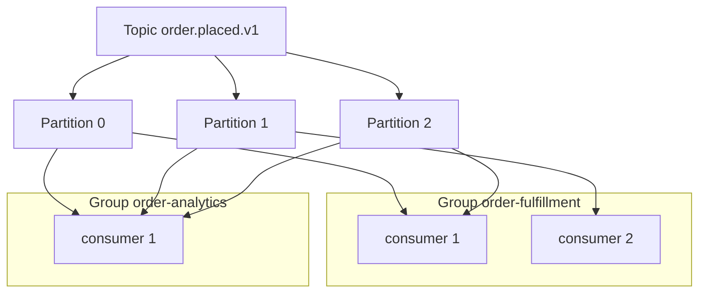
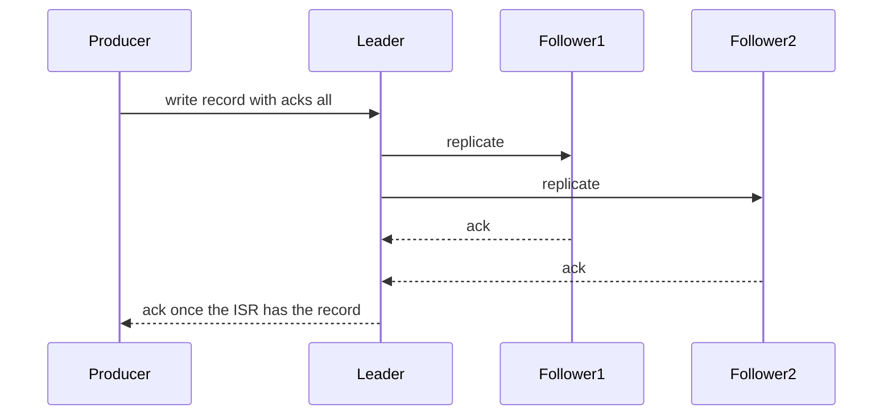

# Lecture 1 — The Log Is the Truth: Partitions, Offsets, Replication, and Delivery Semantics

> **Duration:** ~2 hours of reading + hands-on.
> **Outcome:** You can explain the Kafka log abstraction, choose a partition count and key from first principles, reason about the replication protocol well enough to say which `acks`/`min.insync.replicas` combinations can lose acknowledged data, and predict the delivery semantics a given producer/consumer config actually delivers.

If you remember one sentence from this entire week, remember this one:

> **Kafka is not a message queue. It is a distributed, replicated, append-only commit log, and the *consumer* owns the read position. A queue forgets a message the moment it is delivered; a log remembers it until retention expires, and every consumer reads independently at its own offset.**

That one difference is the source of everything good and everything surprising about Kafka. It is why a slow analytics consumer never blocks the fast order-fulfillment consumer reading the same topic. It is why you can stand up a brand-new read model six months from now and replay two years of `order.placed.v1` to build it. And it is why "the message was lost" is almost never the real bug — the real bug is an offset committed before the work was done, or a partition key that funneled every record onto one partition while the other eleven sat idle.

This lecture builds the model from the bottom: the log, the partition, the offset, the consumer group, the replication protocol, and finally the delivery semantics that fall out of all of it.

---

## 1. The log abstraction

Strip away the marketing and Kafka is one data structure: an **append-only log**. Records go on the end. Each record gets a position. Nothing in the middle is ever mutated. That is the whole substrate.

```
partition 0:   [ r0 ][ r1 ][ r2 ][ r3 ][ r4 ][ r5 ] <- new writes append here
                  ^                        ^      ^
               offset 0              consumer A   log-end offset (6)
                                     at offset 4
```

A few terms, precisely:

- A **topic** is a named log. `order.placed.v1` is a topic.
- A topic is split into **partitions**. Each partition is an *independent* append-only log. The split is the source of both ordering semantics and parallelism, and we will spend §2 on it.
- An **offset** is a monotonically increasing integer that identifies a record's position *within a single partition*. Offsets are not global across partitions — offset 1042 in partition 0 has nothing to do with offset 1042 in partition 1.
- A partition is physically stored as a sequence of **segment** files on a broker's disk. When the active segment reaches a size or age threshold it is closed and a new one is opened. Retention and compaction (Lecture 2) operate on whole segments, which is why retention is coarse-grained.
- The **log-end offset (LEO)** is the offset that will be assigned to the *next* record appended. The **high-water mark (HWM)** is the highest offset that has been replicated to the full in-sync replica set — and crucially, **a consumer can only read up to the high-water mark.** Records between the HWM and the LEO exist on the leader but are not yet "committed" and are invisible to consumers. Hold that thought; it is the seam where replication meets reads.

The radical part is the read model. In a traditional message broker (RabbitMQ, classic ActiveMQ, SQS), the broker tracks delivery: a message is delivered, acknowledged, and then *deleted*. The broker owns the state of "who has seen what." Kafka does the opposite. **The broker keeps every record until retention expires regardless of who has read it, and each consumer group stores its own read position (its committed offset) in a special internal topic, `__consumer_offsets`.** The broker does not know or care whether you have "processed" a record. It only knows the byte ranges on disk.

This inversion is why Jay Kreps could write, in the essay that is your Monday reading, that the log is "real-time data's unifying abstraction." A database's replication is a log. A message bus is a log. Event sourcing is a log. CDC (Week 14) is a log of a database's changes. Once you see that the log is the primitive and everything else is a view over it, the rest of this phase clicks into place.

---

## 2. Partitions and keys — the most consequential decision you make

A topic with one partition is a single ordered log with a single consumer's worth of throughput. That does not scale. So Kafka splits a topic into **N partitions**, and two things follow immediately, both of which you must internalize:

1. **Parallelism is bounded by partition count.** Within a consumer group, each partition is read by exactly *one* consumer. Twelve partitions means at most twelve consumers in a group doing useful work in parallel; a thirteenth consumer in the group sits idle. So your partition count is your maximum consumer parallelism, forever (until you repartition, which we will see is a migration, not a knob).

2. **Ordering is per-partition, and only per-partition.** Kafka guarantees that records within *one* partition are delivered to a consumer in offset order. It guarantees *nothing* about the relative order of records across partitions. If `order-A-placed` lands on partition 0 and `order-A-cancelled` lands on partition 3, a consumer may process the cancel before the place. **The only ordering Kafka gives you is per-partition ordering, and you control which records share a partition through the key.**

### 2.1 How the key chooses a partition

When a producer sends a record with a key, the default partitioner computes:

```
partition = murmur2(key_bytes) % number_of_partitions
```

`murmur2` is a fast non-cryptographic hash. The consequence: **all records with the same key go to the same partition**, and therefore are totally ordered relative to each other. Records with *no* key (a null key) are spread across partitions — historically round-robin, now "sticky" (batched onto one partition at a time for efficiency, rotating periodically).

This is the lever. If you need all events for a given order to be processed in order, you **key by `order_id`**. Every `order.placed`, `order.paid`, `order.shipped` for order `A` then lands on the same partition and is consumed in the order it was written. Events for order `B` land on (probably) a different partition and are processed in parallel — which is exactly what you want, because order `B`'s timeline is independent of order `A`'s.

> **Rule of thumb:** key by the entity whose events must stay ordered. For our marketplace, that is almost always the aggregate id — `order_id`, `cart_id`, `payment_id`. Never key by something low-cardinality (like `status` or `region`) — you will get a handful of hot partitions and waste the rest.

### 2.2 The hot-partition failure

The classic partitioning bug: you key by something with skew. Suppose you key `order.placed.v1` by `country_code` and 70% of your orders are from one country. That country's partition gets 70% of the traffic; the consumer assigned to it is saturated while five other consumers idle. Throughput collapses to single-partition throughput and lag climbs on one partition only. The diagnostic signature is unmistakable in `kafka-consumer-groups.sh --describe`: one partition's `LAG` climbing, the rest at zero. The fix is a higher-cardinality key (`order_id`), and you will reproduce exactly this fault in this week's challenge.

### 2.3 Choosing a partition count

Pick the partition count from three numbers:

- **Target throughput** (records/sec or MB/sec) divided by **per-partition throughput** (a Kafka partition comfortably does tens of MB/sec on commodity disks; treat ~10 MB/s as a conservative planning number). If you need 100 MB/s, you need at least ~10 partitions just for the producer side.
- **Consumer parallelism**: how many consumer instances do you want to run in the busy group? You need at least that many partitions, plus headroom.
- **Future growth**: partitions are cheap to over-provision modestly and expensive to add later (see below). A common heuristic is to size for ~2x your projected peak and round up to a number with convenient factors (12 divides evenly into 1, 2, 3, 4, 6, 12 consumers).

For `order.placed.v1` in our capstone, **12 partitions, replication factor 3** is a defensible starting point: it gives up to twelve fulfillment consumers, survives the loss of two brokers, and divides evenly for canary deployments.

Worked, with numbers, so the derivation is concrete rather than a vibe:

```
Target peak throughput:        20,000 orders/sec
Avg order event size:          ~256 bytes
Producer-side bytes/sec:       20,000 * 256  ≈ 5 MB/s   (modest)
Per-partition planning rate:   ~10 MB/s (conservative)
Partitions for producer load:  5 MB/s / 10 MB/s  -> 1 partition would suffice for bytes

Consumer parallelism target:   fulfillment does ~5 ms of work per order
  one consumer:                1000 ms / 5 ms  = 200 orders/sec per instance
  to handle 20,000/sec:        20,000 / 200    = 100 instances of work...
  ...but each instance can own multiple partitions, and 5 ms is pessimistic
  realistic target:            8-12 consumer instances at peak
Growth headroom (2x peak):     round up to 12 partitions

Decision: 12 partitions (consumer-parallelism-bound, not throughput-bound), RF 3.
```

Notice the binding constraint is **consumer parallelism**, not raw bytes — for most business-event topics the per-record processing work, not the network, sets the partition count. A clickstream firehose flips this (tiny processing, huge bytes), and you'd size on throughput. Knowing *which* constraint binds is the actual skill; the arithmetic is easy once you know which number to divide.

### 2.4 Why you can't just add partitions later

You *can* run `kafka-topics.sh --alter --partitions 24`. But adding partitions changes the modulus in `murmur2(key) % N`, so **every existing key now hashes to a (probably) different partition**. The per-key ordering guarantee breaks across the boundary: order `A`'s old events are on partition 3, its new events land on partition 17, and a consumer reading partition 17 will never see the old ones in order with the new. For a keyed topic, repartitioning is a **data migration** — you typically create a new topic with the new partition count, dual-write or replay, and cut over. Treat the partition count as part of the topic's contract, set it deliberately, and do not casually bump it. This is the single most common "we'll fix it later" decision that turns into a weekend.

### 2.5 How a partition is stored on disk (and why it's so fast)

It is worth a paragraph on *why* the append-only log is fast, because it dispels the "Kafka is magic" intuition and grounds the operational numbers above. A partition on a broker's disk is a directory of **segment** files, each a flat sequence of records, plus an index mapping offset → byte position and another mapping timestamp → offset. Writes are pure appends to the tail segment — the single fastest thing a disk can do, sequential I/O, no seeks, no in-place mutation. Reads, for a consumer keeping up, are served from the OS page cache (the data was just written and is still hot), and the broker streams bytes to the consumer's socket with `sendfile()` — a **zero-copy** path from page cache to network that never copies the data into the broker's JVM heap. That combination — sequential append, page-cache reads, zero-copy send — is why a single partition does tens of MB/s on commodity hardware. It is not magic; it is refusing to do the slow things (random I/O, in-place updates, byte copies) that a traditional database does. Redpanda (Lecture 2) keeps the same sequential-log idea but manages its own I/O instead of leaning on the page cache, which is the architectural fork worth remembering.

The operational consequence: a consumer that **keeps up** is cheap (page-cache reads, zero-copy), while a consumer that **falls far behind** is expensive — it reads cold data from disk, evicting the page cache that the keeping-up consumers and the producers depend on, which slows the whole broker. This is why a single badly-lagging consumer can degrade a cluster, and why "lag near zero" is not just a correctness signal but a *performance* signal. You will feel this in the mini-project benchmark.

---

## 3. Consumer groups and rebalancing

A **consumer group** is a set of consumer instances that cooperate to read a topic. The rules:

- Every partition of the subscribed topics is assigned to **exactly one** member of the group.
- A consumer instance may own several partitions; a partition is owned by exactly one instance.
- If you have more consumers than partitions, the extras are idle.
- **Different groups are independent.** Group `order-fulfillment` and group `order-analytics` both read all of `order.placed.v1`, each at its own offsets, neither affecting the other. This is the **fan-out** pattern, and it is free — adding a consumer group adds read load but never blocks the existing ones.


*Each partition is owned by exactly one consumer within a group, while independent groups fan out over the same topic for free.*

The **group coordinator** (a broker) tracks group membership and triggers a **rebalance** when membership changes — a consumer joins, leaves, or is presumed dead (it missed `max.poll.interval.ms`, the deadline by which a consumer must call `poll()` again).

### 3.1 The stop-the-world rebalance and its fix

The original "eager" rebalance protocol was brutal: on any membership change, *every* consumer revoked *all* its partitions, the coordinator recomputed the assignment, and everyone resumed. For the duration — which could be seconds — **the whole group stopped consuming.** On a 50-instance group, one rolling deploy meant 50 stop-the-world pauses.

KIP-429 introduced **incremental cooperative rebalancing** (`cooperative-sticky` assignor), which is the 2026 default you should use. Instead of revoking everything, only the partitions that actually need to move are revoked, and the rest keep flowing. A rolling deploy now causes small, localized reassignments instead of a global freeze. **Set `partition.assignment.strategy=cooperative-sticky` (or use a client that defaults to it) on every consumer group you run.** If you see whole-group consumption stalls on every deploy, an eager assignor is your first suspect.

### 3.2 The `max.poll.interval.ms` trap

A consumer must call `poll()` at least every `max.poll.interval.ms` (default 5 minutes). If your per-record processing is slow — say each `order.placed` triggers a 30-second downstream call — and you fetched a batch of 500, you can blow past the deadline, the coordinator declares you dead, and it rebalances your partitions to someone else. Then you finish your batch and try to commit, but you no longer own those partitions; the commit is rejected and you may reprocess. The signature is a **rebalance storm**: the group thrashes, lag oscillates wildly, and throughput tanks. The fixes are to lower `max.poll.records` (fetch fewer per poll), raise `max.poll.interval.ms`, or move slow work off the poll thread. You will diagnose a version of this in the challenge.

The assignor strategies, side by side, so you can recognize which one a misbehaving group is using:

| Assignor | How it assigns | Rebalance cost | Use it? |
|---|---|---|---|
| `range` | Per-topic, contiguous partition ranges per member | Stop-the-world; can imbalance with multiple topics | No — legacy default |
| `round-robin` | Partitions round-robined across all members | Stop-the-world | No — superseded |
| `sticky` | Minimizes movement, but still eager (revoke-all) | Stop-the-world, less reassignment churn | Rarely |
| `cooperative-sticky` | Minimizes movement *and* only revokes what moves | Incremental, no global freeze | **Yes — the 2026 default** |

If a group freezes entirely on every deploy, it is almost certainly on `range` or `round-robin`; switch it to `cooperative-sticky` and the freeze becomes a localized handoff.

### 3.3 Where offsets actually live

A subtle but load-bearing detail: when a consumer "commits an offset," where does that offset go? Not to a file on the consumer, and not to some side database — it goes to an **internal Kafka topic called `__consumer_offsets`**, keyed by `(group, topic, partition)`, and it is itself a **compacted** topic (Lecture 2 §2.2), so it keeps only the latest committed offset per key. This is the log eating its own tail: the consumer's position is stored as a record in a Kafka topic, replicated and durable like any other. When a consumer instance restarts or a partition rebalances to a new instance, the new owner reads the latest offset for that `(group, topic, partition)` key from `__consumer_offsets` and resumes there. This is why a consumer group's progress survives the death of every one of its instances — the position was never in the instances; it was in the log.

It also explains the **commit timing** that decides your delivery semantics (§5). "Commit before processing" writes the new offset to `__consumer_offsets` before the work is done; "commit after processing" writes it after. The offset topic doesn't know or care which you chose — it just stores the number you committed. The *correctness* of at-least-once vs at-most-once lives entirely in *when* you write that number relative to doing the work. Hold that: the broker provides the durable offset store; you provide the semantics by choosing when to update it.

### 3.4 Auto-commit is a foot-gun

Kafka clients default to `enable.auto.commit=true`, which commits the *current* offset on a timer (`auto.commit.interval.ms`, default 5 s) regardless of whether your processing finished. This is convenient and quietly wrong for anything that matters: the timer can fire after you've *fetched* records but before you've *processed* them, committing offsets for work not yet done. A crash then skips those records — at-most-once by accident, the worst kind, because it looks like at-least-once until the day it silently drops an order. **For any consumer whose processing has side effects you care about, set `enable.auto.commit=false` and commit manually after the work is durably done.** This is exactly what the exercise-3 consumer does, and exactly the bug the challenge plants. Auto-commit is fine for throwaway tail-the-log tooling and nothing else.

---

## 4. The replication protocol — and exactly when you lose data

A partition is replicated to **`replication.factor`** brokers. One replica is the **leader**; the rest are **followers**. All reads and writes go to the leader. Followers continuously fetch from the leader to stay caught up. The set of replicas that are "caught up enough" is the **in-sync replica set (ISR)**.

A follower is in the ISR if it has fetched up to the leader's log within `replica.lag.time.max.ms`. If a follower falls behind (slow disk, network blip), it is removed from the ISR until it catches back up. The ISR is dynamic, and its size is the load-bearing number for durability.

### 4.1 `acks` — how much the producer waits for

The producer's `acks` setting decides what "the write succeeded" means:

| `acks` | The producer considers the write done when... | Durability |
|---|---|---|
| `0` | the record is written to the socket. No broker ack at all. | **Fire-and-forget. Lost on any failure. At-most-once.** |
| `1` | the **leader** has written it to its log. | Survives nothing if the leader dies before a follower replicates it. |
| `all` (`-1`) | **every replica in the ISR** has written it. | Survives the loss of any replica that wasn't the only one in the ISR. The durable choice. |

### 4.2 `min.insync.replicas` — the durability floor

`acks=all` alone is not enough, because "the full ISR" could be just one replica if the others fell behind. `min.insync.replicas` is the *smallest* ISR size that an `acks=all` write will accept. With `replication.factor=3` and `min.insync.replicas=2`:

- If all 3 replicas are in sync, `acks=all` waits for all 3 — fully durable.
- If one replica falls behind (ISR shrinks to 2), `acks=all` still succeeds, waiting for 2 — still durable against one more failure.
- If two replicas fall behind (ISR shrinks to 1), `acks=all` writes are **rejected** with `NotEnoughReplicas`. The broker refuses to accept a write it cannot make durable. **This is the system protecting you** — you would rather fail the write loudly than accept it and lose it silently.

> **The durable trio for any topic you care about:** `replication.factor=3`, `min.insync.replicas=2`, producer `acks=all`. This survives the loss of one broker with zero acknowledged-data loss, and refuses writes (rather than losing them) if a second broker is also down. Memorize it. It is the answer to "what settings prevent data loss" in every interview and every production design review.


*acks all waits for the leader plus the in-sync replicas before the producer is told the write succeeded.*

### 4.3 The exact data-loss matrix

Here is the table that separates people who "use Kafka" from people who can be trusted to operate it. *Can an acknowledged write be lost?*

| Producer `acks` | `min.insync.replicas` | Acknowledged write can be lost? | Why |
|---|---|---|---|
| `0` | any | **Yes, trivially** | No ack; the record may never reach a broker. |
| `1` | any | **Yes** | Leader acks, then dies before any follower replicates. The new leader never had the record. |
| `all` | `1` | **Yes** | If the ISR is down to just the leader, `acks=all` == `acks=1`. Leader dies, record gone. |
| `all` | `2` (RF=3) | **No** (single failure) | The record is on ≥2 replicas before ack; any one can fail without loss. |

There is one more knob: **`unclean.leader.election.enable`**. If `true`, a broker that was *not* in the ISR can be elected leader when all ISR members are down — which means it can become leader missing committed records, silently truncating the log and losing acknowledged data to regain availability. **Keep it `false`** (the modern default) for any topic where data loss is unacceptable; you are trading availability for durability, which for an orders topic is the correct trade.

### 4.4 KRaft — life after ZooKeeper

Historically Kafka stored cluster metadata (topics, partitions, ISR, ACLs) in ZooKeeper, a separate Raft-ish system you had to run and operate. As of Kafka 3.x and mandatory in 4.0, that is replaced by **KRaft (Kafka Raft)**: a subset of brokers act as **controllers** running a Raft quorum that holds the metadata in an internal `__cluster_metadata` log. The practical upshot for you as an operator: one fewer system to run, faster failover, and metadata that is itself a log (of course it is). Strimzi (Lecture 2) provisions KRaft mode for you. You need to know it exists, that the controller quorum needs an odd number (3 or 5) for majority, and that "is ZooKeeper down?" is no longer a question you ask in 2026.

---

## 5. Delivery semantics — what you actually get

Now we can state the three delivery semantics precisely, because each is a *consequence* of producer and consumer configuration, not a checkbox.

### 5.1 At-most-once

The consumer **commits its offset before processing**. If it crashes after committing but before finishing the work, the record is skipped on restart — it was "delivered" (the offset advanced) but never processed. You lose records on failure but never reprocess. Rarely what you want for orders; occasionally right for pure telemetry where a dropped sample is harmless.

```python
records = consumer.poll()
consumer.commit()          # commit FIRST
process(records)           # if we crash here, these records are skipped on restart
```

### 5.2 At-least-once (the pragmatic default)

The consumer **processes the record, then commits the offset**. If it crashes after processing but before committing, the record is reprocessed on restart. You never lose a record but you may process it twice. **This is the correct default for almost everything**, and it is why the next requirement is non-negotiable.

```python
records = consumer.poll()
process(records)           # do the work first
consumer.commit()          # commit only after the work is durably done
```

> **At-least-once + idempotent processing is the workhorse pattern of event-driven systems.** Because a record may be delivered more than once, the consumer's effect must be idempotent: applying it twice equals applying it once. Charge a card *by* an idempotency key so the second delivery is a no-op; upsert into a read model *keyed* by the event id so a replay overwrites rather than duplicates. We build a real idempotent consumer in Week 11; this week, internalize that "at-least-once" is a promise you keep *safe* with idempotency, not with hope.

### 5.3 Exactly-once (within Kafka)

Kafka does offer exactly-once *semantics* (EOS), and it is real — within the boundary of Kafka itself. Two mechanisms combine:

1. **The idempotent producer** (`enable.idempotence=true`, the default in modern clients). The producer is assigned a producer id (PID) and stamps each record with a monotonic sequence number per partition. If a network hiccup causes the producer to *retry* a send, the broker sees the duplicate sequence number and **dedupes it**, so a retry does not append the record twice. This requires `acks=all` and `max.in.flight.requests.per.connection <= 5` (so the broker can detect out-of-order sequences). It eliminates duplicates *from producer retries* — a real and common source of duplicates — but only within a single producer session.

2. **Transactions** (`transactional.id`, `initTransactions`, `beginTransaction`, `sendOffsetsToTransaction`, `commitTransaction`). These let a **consume-transform-produce** pipeline atomically commit *both* the records it produced *and* the consumer offsets it advanced, as one unit. Combined with consumers reading at `isolation.level=read_committed` (which skips aborted-transaction records), you get exactly-once *for processing that stays inside Kafka* — read from topic A, transform, write to topic B, all-or-nothing.

The mechanism worth knowing one level deeper, because it explains a real failure mode: the idempotent producer's PID is paired with a **producer epoch**. When a producer with a `transactional.id` initializes, the broker bumps the epoch and **fences** any older producer instance using the same `transactional.id` — an older zombie that wakes up and tries to write gets a `ProducerFenced` error and is rejected. This is what prevents a network-partitioned-then-recovered producer from writing duplicates after a new instance took over: the old epoch is fenced. The practical consequence: each logical producer needs a *stable, unique* `transactional.id` (often derived from the consumer's partition assignment, per KIP-447), and two producers sharing a `transactional.id` will fence each other in a loop. If you ever see producers cycling `ProducerFenced` errors, a shared `transactional.id` is the cause.

The catch, and the reason Week 11 exists: **EOS holds within Kafka's boundary.** The moment your "transform" step charges a credit card, writes to Postgres, or calls an external API, you are outside the transaction. Kafka cannot atomically commit a Stripe charge and a Kafka offset. At that boundary, exactly-once becomes a *contract you build* — with idempotency keys and an outbox — not a primitive the broker hands you. We will spend all of Week 11 on that boundary. For now: know that Kafka EOS is genuine, know its `enable.idempotence` + transactions machinery, and know exactly where it stops.

### 5.4 Producer batching and the throughput/latency dial

One more producer detail you must understand before the exercises, because it is the dial you will turn in the benchmark. A Kafka producer does not send each record in its own network round-trip — that would be catastrophically slow. Instead it **batches**: records destined for the same partition accumulate in a buffer, and the producer sends a batch when either the batch fills (`batch.size`, bytes) or a small timer elapses (`linger.ms`). Two settings govern the trade:

- **`linger.ms`** — how long to wait for more records before sending a partial batch. `0` (the default) sends as soon as possible — lowest latency, smallest batches, most round-trips. A small positive value (5–20 ms) lets batches fill, trading a little latency for a lot of throughput, because one network round-trip now carries many records.
- **`batch.size`** — the max bytes per batch per partition. Larger batches amortize the per-request overhead and compress better, at the cost of more producer memory.
- **`compression.type`** (`lz4`, `zstd`, `snappy`, `gzip`) — compresses the *batch*, so bigger batches compress better. `lz4` and `zstd` are the modern choices: high ratio, low CPU. Compression is one of the biggest throughput wins and one of the most overlooked.

The mental model: **`linger.ms` is a throughput/latency dial.** Turn it toward 0 for a latency-critical path (a user waiting on a checkout ack); turn it up for a throughput-critical path (a firehose of clickstream events where 20 ms of added latency is invisible). The benchmark in the mini-project makes you feel this directly: the same producer at `linger.ms=0` and `linger.ms=10` produces very different throughput-vs-tail-latency curves on the same broker. There is no universally correct value — there is the value correct for *your* path's SLO, and knowing that the dial exists is what separates someone who "uses a Kafka producer" from someone who can tune one.

This interacts with idempotence: `enable.idempotence=true` caps `max.in.flight.requests.per.connection` at 5 so the broker can detect and reorder out-of-sequence batches, which is why you can have batching *and* exactly-once-producer dedup at the same time without sacrificing ordering. The defaults in modern clients (idempotence on, `acks=all`, a sane in-flight cap) give you durability and dedup out of the box; the lever you actually reach for is `linger.ms` and `compression.type` for the throughput/latency trade.

---

## 6. A worked example on the marketplace

Let's make it concrete on the services you've been building. Today the cart service, on checkout, makes a synchronous gRPC call to the order service and blocks until it returns. That couples their availability (if order is down, checkout fails), their throughput (cart waits at order's pace), and their deployment (a slow order deploy stalls checkout).

The event-driven version: on checkout, the cart service **produces** a record to `order.placed.v1`, keyed by `order_id`, with `acks=all` and idempotence on, and returns success to the user as soon as the broker acknowledges. The order service runs a consumer group `order-fulfillment` that reads `order.placed.v1` at its own pace and does the fulfillment work, committing its offset only after the work is durably done (at-least-once). A *second* group, `order-analytics`, reads the same topic to feed a dashboard — fan-out, free, never blocking fulfillment.

What you bought:
- **Decoupled availability:** order can be down for a deploy; checkout keeps accepting, the records wait in the log, fulfillment catches up when order returns. Lag rises and falls; nothing is lost.
- **Decoupled throughput:** a Black-Friday spike is absorbed by the log; fulfillment drains it at its own rate instead of pushing back into checkout.
- **Replayability:** the analytics group can reset its offsets to the beginning and rebuild its dashboard from the full history.

What you must now own:
- **Ordering** only holds per `order_id` — which is exactly why you keyed by it.
- **Idempotency** on the fulfillment side, because at-least-once means a record can arrive twice across a rebalance or a restart.
- **Lag as a first-class signal**, because a falling-behind fulfillment group is now your early warning that the system is saturated.

You will build exactly this — the Go producer and the Python consumer group — in this week's exercises.

---

## 7. Verifying it on a live cluster

The tool you will reach for constantly is `kafka-consumer-groups.sh --describe`. It is the `ros2 topic info -v` of this course — the one command that shows you the truth without echoing a single record:

```bash
$ kafka-consumer-groups.sh --bootstrap-server localhost:9092 \
    --describe --group order-fulfillment
GROUP             TOPIC            PARTITION  CURRENT-OFFSET  LOG-END-OFFSET  LAG  CONSUMER-ID
order-fulfillment order.placed.v1  0          1042            1042            0    consumer-1-a1b2
order-fulfillment order.placed.v1  1          1039            1041            2    consumer-2-c3d4
order-fulfillment order.placed.v1  2          1044            1044            0    consumer-1-a1b2
```

Read it like a doctor reads a chart:

- **`LAG` near zero and oscillating** — healthy. The group keeps up; a small lag is just the in-flight batch.
- **`LAG` climbing without bound on *all* partitions** — the group is globally too slow. Add consumers (up to the partition count), make processing faster, or both.
- **`LAG` climbing on *one* partition only** — a hot key (skewed partitioner) or one stuck consumer instance. Check the `CONSUMER-ID` column.
- **`CURRENT-OFFSET` stuck while `LOG-END-OFFSET` advances** — the consumer is alive on the wire but not committing: a processing hang, a rebalance loop, or an exception swallowed in the poll loop.
- **`CONSUMER-ID` empty / group has no members** — nobody is consuming. The group exists (offsets are stored) but no instance is running.

This is the diagnostic muscle the whole week builds. Redpanda's equivalent is `rpk group describe order-fulfillment`, which prints the same columns. Train the habit of reading the lag table *before* you touch code.

---

## 7a. The poison-message problem (a preview of operating consumers)

One failure mode that the lag table makes visible but does not solve, and that you must plan for from day one: the **poison message**. Suppose one record on `order.placed.v1` is malformed — a truncated JSON, an event whose schema your consumer can't parse, a payload that triggers a bug in your processing. A naive at-least-once consumer processes the batch, hits the poison record, throws, *doesn't commit*, and on the next poll gets the same batch — including the poison record — and throws again. It is now stuck in an infinite redelivery loop on one record, its `CURRENT-OFFSET` frozen while `LOG-END-OFFSET` climbs, lag growing without bound. The lag table shows the symptom (offset stuck, lag climbing) but the cause is one bad record, not a slow consumer.

The standard remedy is a **dead-letter topic (DLT)**: after N failed attempts on a record, the consumer publishes the offending record (plus the failure reason) to a separate `order.placed.v1.dlt` topic, commits past it, and continues. The poison record is now quarantined for a human to inspect instead of blocking the whole partition. This is the event-streaming analog of a `try/catch` that logs and moves on rather than crashing the process. The exercise-3 consumer shows the minimal version (log and commit past a malformed record); a production consumer routes to a DLT. The discipline to internalize: **an at-least-once consumer must have an answer for "what happens when one record can never be processed," or it will eventually wedge on a partition and you'll diagnose it as mysterious lag.** Plan the DLT before you need it.

---

## 7b. The settings cheat-sheet

The configuration that carries the durability and semantics you decided above, in one place to anchor the exercises:

| Setting | Where | Value for a topic you care about | Why |
|---|---|---|---|
| `replication.factor` | topic | `3` | Survive one broker loss (durable trio) |
| `min.insync.replicas` | topic/broker | `2` | Reject writes that can't be made durable |
| `acks` | producer | `all` | Wait for the full ISR before "success" |
| `enable.idempotence` | producer | `true` | Dedup producer retries (needs `acks=all`) |
| `max.in.flight.requests.per.connection` | producer | `5` (≤5) | Keep ordering with idempotence on |
| `compression.type` | producer | `lz4` or `zstd` | Throughput + disk win |
| `linger.ms` | producer | `0` latency-critical / `5–20` throughput | The throughput/latency dial |
| `enable.auto.commit` | consumer | `false` | Commit manually, after processing |
| `partition.assignment.strategy` | consumer | `cooperative-sticky` | No stop-the-world rebalance |
| `auto.offset.reset` | consumer | `earliest` (new groups) | Read history; beware on a huge topic |
| `unclean.leader.election.enable` | topic/broker | `false` | Never elect a behind replica leader |

Memorize the first four rows; they are the answer to "what prevents data loss," asked in every design review.

---

## 8. Recap

You should now be able to:

- State why the log abstraction — and the consumer owning its offset — makes fan-out free, replay possible, and slow consumers harmless.
- Explain the on-disk segment model and why sequential append + page-cache reads + zero-copy send make a partition fast.
- Choose a partition count from throughput and parallelism (with the worked arithmetic), choose a key from the ordering requirement, and explain why repartitioning a keyed topic is a migration.
- Explain consumer groups, the cooperative-sticky rebalance (and the assignor table), the `__consumer_offsets` topic, why auto-commit is a foot-gun, and the `max.poll.interval.ms` rebalance-storm trap.
- Reproduce the data-loss matrix from memory and name the durable trio (`RF=3`, `min.insync.replicas=2`, `acks=all`).
- Tune the producer throughput/latency dial (`linger.ms`, `batch.size`, `compression.type`) and explain the producer-epoch fencing behind transactions.
- Predict at-most-once vs at-least-once from commit ordering, explain why at-least-once + idempotency is the default, plan for poison messages with a dead-letter topic, and say exactly where Kafka EOS holds and where it stops.

Next: the alternative broker that rethinks the implementation while keeping the API, plus the retention and compaction decisions and how you operate the whole thing on Kubernetes. Continue to [Lecture 2 — Redpanda, Retention, and Operating the Cluster](./02-redpanda-retention-and-operating-the-cluster.md).

---

## References

- *The Log* — Jay Kreps: <https://engineering.linkedin.com/distributed-systems/log-what-every-software-engineer-should-know-about-real-time-datas-unifying-abstraction>
- *Apache Kafka — Design (replication, delivery semantics)*: <https://kafka.apache.org/documentation/#design>
- *KIP-98 — Idempotent producer and transactions*: <https://cwiki.apache.org/confluence/display/KAFKA/KIP-98+-+Exactly+Once+Delivery+and+Transactional+Messaging>
- *KIP-429 — Incremental cooperative rebalancing*: <https://cwiki.apache.org/confluence/display/KAFKA/KIP-429%3A+Kafka+Consumer+Incremental+Rebalance+Protocol>
- *KIP-500 — KRaft*: <https://cwiki.apache.org/confluence/display/KAFKA/KIP-500%3A+Replace+ZooKeeper+with+a+Self-Managed+Metadata+Quorum>
- *Confluent — Exactly-once semantics*: <https://www.confluent.io/blog/exactly-once-semantics-are-possible-heres-how-apache-kafka-does-it/>
