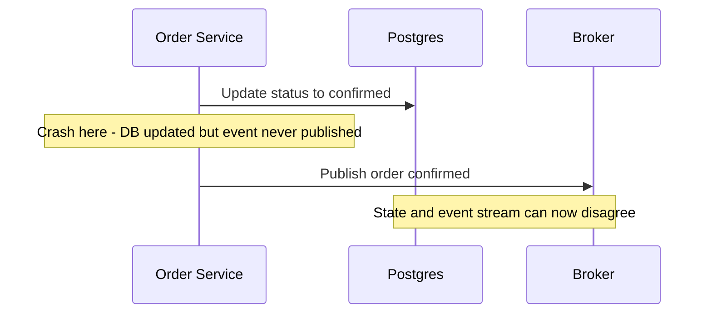
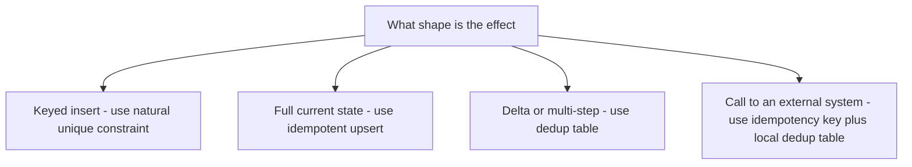

# Lecture 2 — The Outbox and Idempotent Consumers: Building the Guarantee Across the Boundary

> **Duration:** ~2 hours of reading + hands-on.
> **Outcome:** You can explain the dual-write problem precisely, implement the transactional outbox in Postgres, build an idempotent consumer three ways, and state for Kafka, JetStream, and Pulsar exactly what their EOS feature covers and where your idempotency must take over.

Lecture 1 drew the map: at-least-once delivery + idempotency + atomicity = exactly-once effect, and every broker's EOS feature stops at your database and external APIs. This lecture builds the machinery that spans that gap. Two parts that mirror Lecture 1's two pillars: (1) **atomicity** — the dual-write problem and the transactional outbox that fixes it; (2) **idempotency** — the consumer that absorbs duplicate delivery with zero double-effects. Then a precise side-by-side of the three brokers' EOS features, so you know which work the broker does and which work is yours.

---

## Part 1 — The dual-write problem and the transactional outbox

### 1.1 The dual write

Here is the most common correctness bug in event-driven systems, in five lines. The order service, on confirming an order, does two things:

```go
// THE DUAL WRITE — looks innocent, is broken.
db.Exec("UPDATE orders SET status = 'confirmed' WHERE id = $1", orderID)  // step 1
producer.Publish("order.confirmed.v1", orderID)                           // step 2
```

Two separate operations against two separate systems (Postgres and the broker). There is no transaction spanning them, because you cannot put a Kafka publish inside a Postgres transaction. So consider the crash windows:

- **Crash between step 1 and step 2.** Postgres committed `status='confirmed'`, but the event was never published. Downstream — the shipping service, the analytics read model — never hears about the order. The database and the event stream now **disagree**, silently and permanently. The order is confirmed in the source of truth but invisible to everything that reacts to events.
- **Publish succeeds, then the DB transaction rolls back** (in the inverse ordering). Now the event says "confirmed" but the database does not. Downstream ships an order the system doesn't believe exists.

Either way: **two systems, two writes, no atomicity, guaranteed eventual disagreement under failure.** And it is not rare — it happens every time a process dies, a pod is OOM-killed, or a network call times out between the two steps, which on a busy system is constantly. Retrying doesn't fix it (which step do you retry?); ordering the two steps differently just moves the inconsistency. The problem is structural: you are trying to make two systems agree without a transaction that spans them.


*Two separate writes with no shared transaction means a crash between them leaves the database and the event stream disagreeing.*

### 1.2 The transactional outbox — make it one write

The fix is to stop doing two writes. Instead, write the business change **and** the intent-to-publish in **one** Postgres transaction, to an `outbox` table:

```sql
-- One transaction, two rows, atomic. The event can never disagree with the state.
BEGIN;
  UPDATE orders SET status = 'confirmed' WHERE id = $1;
  INSERT INTO outbox (id, aggregate_id, event_type, payload, created_at)
    VALUES (gen_random_uuid(), $1, 'order.confirmed.v1', $2, now());
COMMIT;
```

Now the state change and the event are committed together or not at all. If the transaction commits, the `outbox` row is durably there; if it rolls back, neither the status nor the event exists. **The dual write is gone** — there is exactly one write, to one system, atomically.

A separate **relay** then reads unpublished `outbox` rows and produces them to the broker:

```
┌───────────┐   1 txn    ┌──────────────────┐
│ order svc │──────────► │ Postgres         │
└───────────┘            │  orders + outbox │
                         └────────┬─────────┘
                                  │ poll or CDC
                                  ▼
                         ┌──────────────────┐  publish   ┌────────┐
                         │ outbox relay     │──────────► │ broker │
                         └──────────────────┘            └────────┘
                            marks rows sent (at-least-once)
```

The relay publishes **at-least-once**: it reads a batch of unsent rows, publishes them, and marks them sent. If it crashes after publishing but before marking sent, it republishes on restart — a duplicate. **That is fine**, because the consumer is idempotent (Part 2). At-least-once from the relay + idempotent consumer = exactly-once effect. The outbox doesn't try to be exactly-once; it tries to be *atomic with the state* and *at-least-once to the broker*, and it leans on the idempotent consumer for the rest. That division of labor is the whole pattern.

### 1.3 Two ways to run the relay

- **Polling relay** (what you build in exercise 2): a loop that `SELECT ... WHERE sent = false ORDER BY created_at LIMIT 100 FOR UPDATE SKIP LOCKED`, publishes each, and `UPDATE ... SET sent = true`. Simple, correct, works anywhere. The cost is polling latency and DB load at high throughput, and the `FOR UPDATE SKIP LOCKED` is what lets multiple relay instances run safely without double-publishing the same row.
- **CDC relay** (Week 14, the better choice at scale): instead of polling, a change-data-capture tool (Debezium) tails Postgres's write-ahead log and emits each new `outbox` row as it's committed — no polling, no extra DB load, lower latency. Debezium even ships an "outbox event router" that does exactly this. We build the polling version now because it makes the mechanism visible; we replace it with CDC in Week 14. Know both, and know that CDC is strictly better for high throughput.

> **The `FOR UPDATE SKIP LOCKED` detail matters.** Without it, two relay instances both `SELECT` the same unsent rows and both publish them — duplicates on top of duplicates. With `SKIP LOCKED`, each instance locks the rows it's processing and the others skip them, so the relay scales horizontally without double-publishing. It's the same lock-free-handoff idea as a Kafka partition being owned by one consumer, expressed in SQL.

### 1.4 The schema and the relay query, concretely

The outbox table is deliberately simple — it is a queue expressed as a table:

```sql
CREATE TABLE outbox (
  id           uuid PRIMARY KEY DEFAULT gen_random_uuid(),
  aggregate_id text NOT NULL,          -- the entity (order_id) — becomes the broker key
  event_type   text NOT NULL,          -- order.confirmed.v1 — becomes the topic
  payload      jsonb NOT NULL,          -- the event body
  created_at   timestamptz NOT NULL DEFAULT now(),
  sent         boolean NOT NULL DEFAULT false,
  sent_at      timestamptz
);
-- A partial index makes "find unsent, oldest first" cheap even as the table grows.
CREATE INDEX outbox_unsent_idx ON outbox (created_at) WHERE NOT sent;
```

The polling relay's core query is the load-bearing line — it is what makes the relay both correct and horizontally scalable:

```sql
-- Claim a batch of unsent rows, locking them so peers skip them.
SELECT id, aggregate_id, event_type, payload
FROM outbox
WHERE NOT sent
ORDER BY created_at
LIMIT 100
FOR UPDATE SKIP LOCKED;     -- the magic: claim-and-skip for concurrent relays
-- ... publish each to the broker (acks=all) ...
-- ... then, in the SAME transaction that holds the locks:
UPDATE outbox SET sent = true, sent_at = now() WHERE id = ANY($claimed_ids);
COMMIT;
```

Two correctness details worth stating: the `UPDATE` to mark rows sent runs in the **same transaction** that claimed (locked) them, so a relay crash after publishing but before the `UPDATE` simply leaves the rows unsent (and locked-then-unlocked on rollback) to be re-claimed and **re-published** next round — at-least-once, absorbed by the idempotent consumer. And you should periodically **prune** sent rows (a `DELETE FROM outbox WHERE sent AND sent_at < now() - interval '7 days'`) or the table grows unbounded; the outbox is a transient relay buffer, not a permanent event store (that's the broker's job).

### 1.5 Polling vs CDC, side by side

When you migrate from the polling relay (this week) to the CDC relay (Week 14), here's the trade you're making, concretely:

| | Polling relay (this week) | CDC relay (Week 14, Debezium) |
|---|---|---|
| How it learns of new rows | `SELECT ... WHERE NOT sent` on a timer | Tails the Postgres WAL (logical replication) |
| Latency | Poll interval (e.g., 500 ms) | Milliseconds (as the WAL commits) |
| DB load | Repeated queries + `UPDATE`s | One logical-replication reader; no app queries |
| `sent` column needed? | Yes (to know what to publish) | No (the WAL position is the cursor) |
| Operational parts | Just your app + DB | Debezium connector + Kafka Connect |
| When to prefer | Low/medium throughput; minimal moving parts | High throughput; latency matters; already run Kafka Connect |

The polling relay is the right *first* implementation — it's transparent, has no extra infrastructure, and you can reason about every line. CDC is the right *scale* implementation. Both produce the same at-least-once-to-the-broker guarantee; the consumer's idempotency is identical for both. Build the polling version this week to *see* the mechanism; you'll swap in CDC in Week 14 without touching the consumer.

---

## Part 2 — The idempotent consumer

The outbox made the producer side atomic and at-least-once. Now the consumer must absorb the resulting duplicates with zero double-effects. There are three idiomatic ways; you should know all three and when each fits.


*Which idempotency pattern fits depends on the shape of the effect, not a default reflex for the dedup table.*

### 2.1 Pattern A — the dedup table

Record every processed event id in a dedup table, inside the **same transaction** as the effect:

```sql
BEGIN;
  -- This insert is the dedup gate. If we've seen this event_id, it conflicts and we skip.
  INSERT INTO processed_events (event_id, processed_at) VALUES ($1, now())
    ON CONFLICT (event_id) DO NOTHING;
  -- Only proceed with the effect if the insert actually inserted (i.e., first time).
  -- The application checks rows-affected; if 0, this is a duplicate — roll back and ack.
  UPDATE inventory SET stock = stock - 1 WHERE sku = $2;
COMMIT;
```

The critical detail: **the dedup-table insert and the effect must be in the same transaction.** If you record "processed" in one transaction and do the effect in another, a crash between them reintroduces the dual-write problem one level down — you might mark an event processed but never apply it, or apply it but never mark it. Atomic together, or the whole pattern leaks. This is the most robust and most general idempotency technique, and it's what the exercise-3 consumer uses.

### 2.2 Pattern B — the natural unique constraint

Sometimes the effect *is* an insert, and you can put the idempotency key directly on it:

```sql
-- A charge is an insert keyed by order_id. The second delivery conflicts and no-ops.
INSERT INTO charges (order_id, amount_cents, charged_at)
  VALUES ($1, $2, now())
  ON CONFLICT (order_id) DO NOTHING;
```

No separate dedup table — the `charges` table's own unique constraint on `order_id` *is* the dedup. The second delivery of "charge order A" hits the conflict and does nothing. This is the cleanest pattern when the effect is naturally a keyed insert; it's why "charge by idempotency key" is the canonical example.

### 2.3 Pattern C — the idempotent upsert

When the effect is "set the current value," an upsert is naturally idempotent because re-applying it yields the same state:

```sql
-- A read-model projection: re-applying the same event overwrites with the same value.
INSERT INTO order_read_model (order_id, status, total_cents, updated_at)
  VALUES ($1, $2, $3, now())
  ON CONFLICT (order_id) DO UPDATE
    SET status = EXCLUDED.status, total_cents = EXCLUDED.total_cents, updated_at = now();
```

A duplicate delivery overwrites the row with identical values — no harm. This is how CQRS read models (Week 14) stay correct under at-least-once delivery: every projection is an idempotent upsert, so replay and redelivery are both safe by construction. The subtlety: this only works if the event carries the *full* new state, not a delta. `SET status = 'shipped'` is idempotent; `SET stock = stock - 1` is not — for deltas you need Pattern A or B.

### 2.4 The external-API case — the idempotency key on the wire

The hardest case is when the effect is a call to someone else's system (Stripe, a shipping carrier). You can't put their write in your transaction. The answer is the **idempotency key on the API call itself**: every serious external API accepts an `Idempotency-Key` header, and a repeated call with the same key returns the original result instead of doing the work again.

```python
# The idempotency key is DERIVED FROM THE EVENT (order_id), stable across retries.
# Stripe (and any serious payment API) dedups on it server-side.
charge = stripe.PaymentIntent.create(
    amount=order["total_cents"],
    currency="usd",
    idempotency_key=f"charge-{order['order_id']}",   # stable, not random!
)
```

The key must come from the event (`order_id`), not be generated fresh each attempt — a per-attempt key defeats the dedup. Combine this with a dedup table recording "I called Stripe for order A" and you are robust even against the API being slow: you check your dedup table first (fast local skip), and the idempotency key is the backstop if you call anyway.

The full consumer loop, putting the local dedup gate and the external idempotency key together, so you see how they compose:

```python
def handle(msg, conn):
    event_id = msg.headers["event-id"]      # stable, from the relay/outbox row id
    order = json.loads(msg.value)

    with conn.transaction():                 # one transaction: dedup gate + local record
        cur = conn.execute(
            "INSERT INTO processed_events (event_id) VALUES (%s) "
            "ON CONFLICT (event_id) DO NOTHING", (event_id,))
        if cur.rowcount == 0:
            return                            # duplicate: already handled, skip and ack

        # First time. Call the external API WITH a stable, event-derived key. If we
        # crash after this returns but before COMMIT, the redelivery will re-enter this
        # block (the dedup row rolled back), call Stripe again with the SAME key, and
        # Stripe returns the SAME charge — no double-charge. Belt (dedup) + suspenders (key).
        stripe.PaymentIntent.create(
            amount=order["total_cents"], currency="usd",
            idempotency_key=f"charge-{order['order_id']}")

    msg.ack()                                 # ack AFTER the transaction commits
```

Notice the layering: the **local dedup table** makes the common case fast (a duplicate is a single conflicting insert, no network call), and the **external idempotency key** is the backstop for the narrow window where you crash *after* calling Stripe but *before* committing the dedup row — in that window the redelivery calls Stripe again, but the stable key makes Stripe's side a no-op. Either layer alone has a hole; together they are airtight. This belt-and-suspenders structure is what a production idempotent consumer actually looks like, and it's what the exercise-3 and mini-project consumers implement.

### 2.5 The chaos test — prove it

A pattern you can't test you don't trust. The proof obligation for an idempotent consumer is the **chaos test**: run a load of N distinct events, kill the consumer mid-batch (before it commits), restart it (it redelivers from the last committed offset), and verify the *effect* happened exactly once:

```
events delivered (incl. redelivered duplicates): 1063
unique orders charged:                           1000
double-charges:                                  0     <-- the line that decides it
```

`double-charges: 0` is the contract. You build and run this exact test in the mini-project, and a nonzero count is a failing grade — not because the idea is wrong, but because the *implementation* leaked (a dedup insert in a separate transaction, a per-attempt idempotency key, an effect that wasn't actually idempotent). The chaos test is what turns "I think it's idempotent" into "I proved it's idempotent under the exact failure it's meant to survive."

### 2.6 Choosing among the three patterns

A quick decision guide so you reach for the right one instead of always defaulting to the dedup table:

| Your effect is... | Use | Why |
|---|---|---|
| A keyed insert (a charge per order) | **Natural unique constraint** (Pattern B) | The table's own PK *is* the dedup; no extra table |
| Setting full current state (a projection) | **Idempotent upsert** (Pattern C) | Re-applying yields the same row; replay-safe by construction |
| A delta or multi-step effect (decrement stock) | **Dedup table** (Pattern A) | Deltas aren't naturally idempotent; the dedup gate makes them so |
| A call to an external system (Stripe, carrier) | **Idempotency key on the API** (§2.4) + a dedup table | The external system dedups on the key; the table is your local fast-path and backstop |

The dedup table is the general-purpose answer that always works, so when in doubt use it. But a natural unique constraint or an upsert is *simpler* (no extra table, no rows-affected check) when the effect's shape allows it — and a senior engineer reaches for the simplest pattern the effect permits, not the heaviest one reflexively.

### 2.7 A note on the saga (Week 12's seed)

Real checkout isn't one effect — it's several: reserve inventory, charge payment, create a shipment. This is a **saga**: a sequence of local transactions across services, where if a later step fails you must **compensate** the earlier ones (release the inventory, refund the charge). This week you'd hand-wire that as a chain of idempotent consumers, each emitting the next event via its outbox, each with compensation logic scattered across services. It works — and you'll feel both that it's *correct* (every step idempotent, every emit atomic) and that it's *scattered* (the saga's shape lives in no single place; you reconstruct it by reading five consumers). That scatter is exactly the pain Week 12's **Temporal** removes by making the saga a single, readable, durable workflow. Hold the discomfort; it motivates next week. For now, the point is: idempotency and the outbox are the *primitives* a saga is built from, whether you orchestrate it (Temporal) or choreograph it (chained events). Get the primitives right this week; choose the coordination style next week.

---

## Part 3 — Kafka EOS vs JetStream dedup vs Pulsar transactions, precisely

Now the side-by-side that tells you which work the broker does and which is yours. Read every row asking: *does this survive a crash between charging a card and committing the offset?* The answer is always "only if you added idempotency" — the broker feature alone never does.

| Aspect | Kafka / Redpanda | NATS JetStream | Pulsar |
|---|---|---|---|
| **Producer-retry dedup** | Idempotent producer (PID + seq); on by default | Dedup window (`Nats-Msg-Id`), **time-bounded** | Producer sequence id within a transaction |
| **Atomic produce + offset/ack** | Transactions + `sendOffsetsToTransaction`; consumer at `read_committed` | Explicit-ack consumer; no cross-system transaction | Transactions across topics + acks |
| **Scope of the guarantee** | Within Kafka (consume-transform-produce) | Within the dedup window + within JetStream | Within Pulsar |
| **Survives a DB write in the transform?** | **No** — Postgres is outside the Kafka transaction | **No** | **No** |
| **Survives an external API call?** | **No** — Stripe is outside | **No** | **No** |
| **What you must add** | Outbox + idempotent consumer | Outbox + idempotent consumer (don't lean on the window) | Outbox + idempotent consumer |

The conclusion is the same across all three, and it is the headline of the week: **the broker's EOS feature dedups its own retries and makes its own internal pipeline atomic, and that is all. The instant your processing touches a system the broker doesn't control, the guarantee is yours to build — with the outbox (atomic with your state) and the idempotent consumer (absorbs duplicate delivery).** A senior engineer never says "we use Kafka EOS so we can't double-charge." They say "Kafka EOS dedups producer retries inside Kafka; the no-double-charge guarantee comes from the idempotency key on the charge and the dedup table in the consumer's transaction." Know the difference, and you will never be the person who shipped a double-charge because they trusted a broker feature past its boundary.

---

## Part 4 — Choosing a broker (the honest 2026 comparison)

You now know three brokers well enough to choose between them with evidence. The decision factors:

| Factor | Kafka / Redpanda | NATS JetStream | Pulsar |
|---|---|---|---|
| Raw throughput | Highest, battle-tested at extreme scale | High; excellent latency | High; scales storage and serving separately |
| Operational footprint | Brokers + KRaft (or Redpanda: one binary) | Single lightweight binary; very simple | Brokers + bookies + metadata; most parts |
| Multi-tenancy | Topic-level; ACLs | Accounts/subjects; good isolation | First-class namespaces/tenants; the strongest |
| Long retention | KIP-405 tiered storage | Limited; not its strength | Tiered storage is core; the strongest |
| Subject/routing expressiveness | Flat topic names | Rich subject hierarchy + wildcards | Topics + flexible subscriptions |
| Ecosystem (connectors, tools) | Largest by far | Growing | Solid (StreamNative) |
| Best fit | The default event spine; CDC; huge ecosystem | Edge/IoT, request-reply, simple ops, low latency | Multi-tenant SaaS, long retention, elastic scaling |

The senior summary for 2026: **"Kafka (or Redpanda for the simpler footprint) is the default event spine — the ecosystem and the CDC story make it the safe choice. Reach for NATS JetStream when you want one tiny binary, sub-millisecond latency, and rich subject routing, especially at the edge. Reach for Pulsar when multi-tenancy and infinite cheap retention are first-order requirements and you can afford to operate the broker/bookie split. And remember: whichever you pick, exactly-once effect is still your outbox and your idempotent consumer — the broker choice changes the engine, not the contract."**

As a decision tree you can run in an interview or a design review:

```
Do you need a huge connector/CDC ecosystem (Debezium, Connect, Streams)?
  └─ Yes -> Kafka (or Redpanda if you want one binary and tail-latency predictability).

Is multi-tenancy (many isolated tenants) OR infinite cheap retention a hard requirement?
  └─ Yes -> Pulsar (namespaces + tiered storage are first-class).

Do you want minimal ops, sub-ms latency, rich subject routing, edge/IoT footprint?
  └─ Yes -> NATS JetStream (one small binary; request-reply + queue groups + streams).

Default, no strong pull in any direction?
  └─ Kafka/Redpanda — the safe, ubiquitous choice nobody gets fired for.
```

And the constant across every branch, worth repeating because it is the whole point of the week: **the exactly-once-effect guarantee is the outbox + the idempotent consumer, which you wrote, not the broker, which you rented.** Swapping brokers swaps the publish call and the subscribe/ack call; it does not swap the dedup table, the same-transaction discipline, or the stable idempotency key. That portability — proven by the mini-project running the same consumer logic on two brokers — is how you know the guarantee is really yours and not an accident of one vendor's feature.

---

## 4a. The one diagram to remember

If you internalize one picture from this week, make it this — the labeled boundary:

```
        YOUR SERVICE (Postgres)        |   THE BROKER        |   CONSUMER (Postgres + API)
  ┌──────────────────────────────┐     |  ┌──────────────┐   |  ┌───────────────────────────┐
  │ 1 txn: business row + outbox  │     |  │ at-least-once │  |  │ dedup gate + effect (1 txn)│
  │   (ATOMICITY — your job)      │ ──► │  │ delivery      │ ─►│  │ + stable idempotency key   │
  └──────────────────────────────┘     |  │ (broker's job)│   |  │   (IDEMPOTENCY — your job)  │
       relay publishes (SKIP LOCKED)    |  └──────────────┘   |  └───────────────────────────┘
                                        |  EOS feature ends here ↑
```

The broker owns the middle: at-least-once delivery (and, if you turn it on, dedup of its own retries). You own both ends: **atomicity** on the left (the outbox makes the event inseparable from the state) and **idempotency** on the right (the dedup gate + stable key make redelivery a no-op). The broker's "exactly-once" feature lives entirely inside the middle box and ends at its edges. Draw this on a whiteboard when someone asks how your system avoids double-charges; the labeled boundary *is* the answer.

---

## 5. Recap

You should now be able to:

- Explain the dual-write problem — two systems, two writes, no atomicity, guaranteed disagreement under failure — and why retrying or reordering doesn't fix it.
- Implement the transactional outbox: state change + outbox row in one transaction (with the schema and the `SKIP LOCKED` claim query), an at-least-once relay (polling now, CDC at scale) publishing it.
- Build an idempotent consumer three ways — dedup table (same transaction as the effect), natural unique constraint, idempotent upsert — plus the external-API idempotency-key case layered with a local dedup gate, and prove it with a chaos test (`double-charges: 0`).
- State, for Kafka/JetStream/Pulsar, exactly what each EOS feature covers and where it stops, run the broker-choice decision tree, and explain why the guarantee is portable across brokers.
- Draw the labeled boundary diagram and recognize the saga as the next coordination question (Week 12).

Next: the exercises put all of this on real brokers — JetStream and Pulsar stood up, a Postgres outbox relay in Go, and an idempotent consumer chaos-tested to zero double-charges. Continue to [the exercises](../exercises/README.md).

---

## References

- *Pattern: Transactional outbox* — microservices.io: <https://microservices.io/patterns/data/transactional-outbox.html>
- *Pattern: Idempotent consumer* — microservices.io: <https://microservices.io/patterns/communication-style/idempotent-consumer.html>
- *Debezium — outbox event router*: <https://debezium.io/documentation/reference/stable/transformations/outbox-event-router.html>
- *Why dual writes are a bad idea* — Kleppmann/Confluent: <https://www.confluent.io/blog/using-logs-to-build-a-solid-data-infrastructure-or-why-dual-writes-are-a-bad-idea/>
- *NATS JetStream — dedup window*: <https://docs.nats.io/using-nats/developer/develop_jetstream/model_deep_dive>
- *Apache Pulsar — transactions*: <https://pulsar.apache.org/docs/transactions/>
- *Postgres — `SELECT ... FOR UPDATE SKIP LOCKED`*: <https://www.postgresql.org/docs/current/sql-select.html#SQL-FOR-UPDATE-SHARE>
