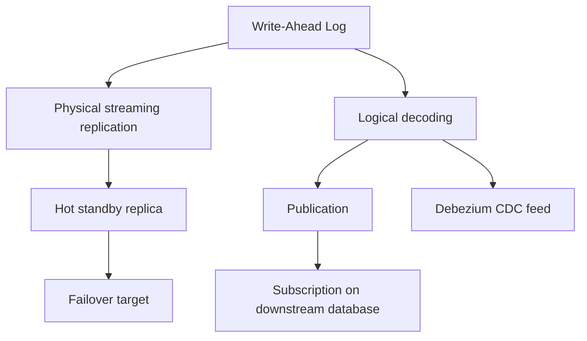
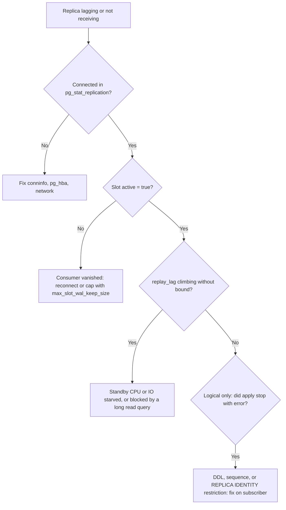

# Lecture 1 — Replication: Physical, Logical, and the WAL That Powers Both

> **Duration:** ~2 hours of reading + hands-on.
> **Outcome:** You can explain what physical and logical replication each ship on the wire, stand up a streaming replica and a logical replica, measure their lag, promote a standby to primary, and choose the right replication mode for read scaling, high availability, cross-version migration, or a CDC feed.

If you remember one sentence from this entire week, remember this one:

> **Every replication feature in Postgres — read replicas, high-availability standbys, point-in-time recovery, logical subscribers, and the Debezium CDC feed you build next week — is a different consumer of one append-only log: the WAL. Understand the WAL and you understand all of them at once.**

Backend engineers tend to treat "add a read replica" as a cloud-console checkbox and never ask what crosses the network. That works until the day the replica lags an hour behind under load, or a replication slot quietly fills the primary's disk, or a logical subscriber silently stops because you ran a DDL it can't replicate. This lecture makes you immune to all three by starting one layer down, at the log.

---

## 1. The WAL: the spine of everything

Postgres never writes a change directly to the data files and calls it done. Before a change touches a table's heap pages, Postgres writes a record describing that change to the **Write-Ahead Log (WAL)** and flushes it to disk. Only then is the transaction durable. This is the "write-ahead" guarantee: the log is ahead of the data. If the server crashes after the WAL flush but before the data pages are written, recovery replays the WAL and the data files catch up.

That single mechanism — *describe the change in an ordered log, then apply it* — is exactly what replication needs. A standby server doesn't need the primary's data files; it needs the primary's *stream of WAL records*, which it replays against its own copy. Replication is recovery that never ends.


*The WAL is the single log that both physical replication and logical decoding read from.*

A position in the WAL is a **Log Sequence Number (LSN)**, printed as `16/B374D848` — a 64-bit byte offset into the logical WAL stream. Almost every diagnostic this week is a comparison of two LSNs: "how far behind the primary's current LSN is this standby's replayed LSN?" The byte distance between them is your replication lag.

The behavior of the WAL is governed by `wal_level`, which has three settings that matter:

| `wal_level` | What the WAL contains | Enables |
|---|---|---|
| `minimal` | Just enough to crash-recover this server | Nothing remote. Cannot replicate. |
| `replica` | Enough for a byte-for-byte standby to replay | Physical streaming replication, PITR, hot standby |
| `logical` | `replica` plus enough to *decode* row-level changes | Everything in `replica`, **plus** logical replication and CDC |

The cost ladder is real: `logical` writes more WAL than `replica`, which writes more than `minimal`. You pay for what you enable. For this course you will run `wal_level = logical` because next week's Debezium feed requires it — but know that on a write-heavy system the jump from `replica` to `logical` is a measurable WAL-volume increase you budget for.

```ini
# postgresql.conf on the primary
wal_level = logical            # enables both physical and logical replication
max_wal_senders = 10           # how many concurrent replication connections
max_replication_slots = 10     # how many slots (physical + logical) can exist
```

---

## 2. Physical (streaming) replication

Physical replication ships **raw WAL** from the primary to one or more standbys. The standby runs a `walreceiver` process that connects to the primary's `walsender`, streams WAL records as they're produced, and replays them block-for-block. The result is a **byte-identical** copy of the primary, down to the physical page layout.

Properties that fall out of "byte-identical":

- The standby must be the **same major version** and the same architecture. You cannot stream-replicate Postgres 15 to Postgres 16.
- It replicates **everything** — every table, every index, DDL, sequences, large objects. You cannot select a subset.
- A standby can serve **read-only queries** while it replays (this is **hot standby**), which is how you build read replicas to offload reporting and read traffic.

### 2.1 Building a streaming replica

The standby is bootstrapped with a base backup of the primary, then pointed at the primary to stream the WAL that accumulated since.

```bash
# On the standby host: clone the primary's data directory.
# -R writes a standby.signal file and the primary_conninfo automatically.
# -X stream copies WAL during the backup so the clone is consistent.
# -C -S replica1 creates a physical replication slot named replica1.
pg_basebackup \
  --host=primary.internal --port=5432 --username=replicator \
  --pgdata=/var/lib/postgresql/16/standby \
  --wal-method=stream --create-slot --slot=replica1 \
  --write-recovery-conf --progress
```

The `--write-recovery-conf` flag writes these into the standby's config for you:

```ini
# postgresql.auto.conf on the standby
primary_conninfo = 'host=primary.internal port=5432 user=replicator application_name=replica1'
primary_slot_name = 'replica1'
```

And the presence of a `standby.signal` file in the data directory tells Postgres "start in standby mode, replay forever." Start the standby and it connects, catches up, and stays caught up.

On the primary you need a replication role and an `hba` rule permitting it:

```sql
-- On the primary:
CREATE ROLE replicator WITH REPLICATION LOGIN PASSWORD 'change-me';
```

```
# pg_hba.conf on the primary — allow the replication connection
host    replication    replicator    10.0.0.0/24    scram-sha-256
```

### 2.2 Replication slots — the feature that is also a footgun

A **replication slot** is a primary-side bookmark. It records the oldest WAL position a consumer still needs (`restart_lsn`) and **guarantees the primary will not recycle that WAL** until the consumer has consumed past it. This is what lets a standby disconnect for a while (network blip, restart) and reconnect without missing WAL.

That guarantee is also how you run a primary out of disk. If a standby using a slot goes away and **never comes back**, the slot's `restart_lsn` is frozen, the primary keeps every WAL segment from that point forward, and `pg_wal/` grows until the disk fills and the primary stops accepting writes. This is one of the most common Postgres outages in the wild.

The defense is `max_slot_wal_keep_size`: cap how much WAL a slot may pin. Past the cap, the slot is invalidated (the lagging standby will need a fresh base backup), but the primary survives.

```ini
# postgresql.conf on the primary — never let a dead slot kill the primary.
max_slot_wal_keep_size = 32GB
```

> **Rule of thumb:** every replication slot you create is a promise to consume it. Monitor `pg_replication_slots.active` and alert on any slot that is `f` (inactive) for more than a few minutes. An inactive slot is a disk-fill timer.

### 2.3 Measuring lag

On the **primary**, `pg_stat_replication` has one row per connected standby:

```sql
SELECT
    application_name,
    state,                                    -- streaming, catchup, ...
    pg_wal_lsn_diff(sent_lsn, replay_lsn)  AS replay_lag_bytes,
    write_lag, flush_lag, replay_lag         -- as time intervals
FROM pg_stat_replication;
```

`replay_lag_bytes` is the byte distance between what the primary has sent and what the standby has replayed. Under healthy async replication this is a small, *bounded* number that rises and falls with write volume. If it climbs without bound, your standby can't keep up — it's CPU-starved, I/O-starved, or blocked by a long read query holding back replay (the `hot_standby_feedback` / `max_standby_streaming_delay` tradeoff).

On the **standby**, you can see how stale your reads are in wall-clock terms:

```sql
SELECT now() - pg_last_xact_replay_timestamp() AS replication_delay;
```

This is the number you quote to product when they ask "how stale can a read replica be?" — and the number your read-routing layer should respect before it sends a freshly-written-then-immediately-read request to a replica (read-your-writes across async replication is a classic correctness bug).

### 2.4 Synchronous vs asynchronous commit

By default, streaming replication is **asynchronous**: the primary commits and acknowledges the client *without* waiting for any standby. Fast, but a primary crash can lose the last few committed transactions that hadn't reached a standby yet.

For zero-data-loss failover you want **synchronous** commit: the primary waits for at least one standby to confirm the WAL before acknowledging the client.

```ini
# postgresql.conf on the primary
synchronous_commit = on
synchronous_standby_names = 'ANY 1 (replica1, replica2)'   # wait for any 1 of 2
```

The phrase `ANY 1 (replica1, replica2)` is doing real work: it means "wait for any one of these two to confirm." Writing `FIRST 1 (replica1)` instead would make `replica1` a **single point of write failure** — if it's down, every commit blocks. The `ANY N (...)` quorum form is almost always what you want, because it tolerates losing any single standby without blocking writes. This is the same quorum reasoning from the consensus weeks, applied to commit acknowledgement.

The cost is latency: every commit now pays a network round-trip to a standby. On a low-latency LAN this is sub-millisecond; across regions (Week 19) it can dominate your write latency budget, which is exactly why cross-region synchronous replication is a decision, not a default.

### 2.5 Failover and promotion

When the primary dies, a standby must become the new primary. You **promote** it:

```sql
-- On the standby, as superuser:
SELECT pg_promote();          -- returns true; the standby stops replaying and becomes writable
```

After promotion the former standby is a full primary accepting writes. The hard parts of failover are not the promotion itself — they are (a) *detecting* the primary is actually dead and not just slow (fencing, to avoid split-brain where two nodes both think they're primary), (b) *reconfiguring* the other standbys to follow the new primary, and (c) *redirecting* application traffic. Production deployments use a manager — **Patroni** (the de-facto standard on Kubernetes and bare metal), or **repmgr** — that handles detection, fencing via a distributed lock (etcd/Consul/ZooKeeper — the same coordination services from Week 2), promotion, and follower reconfiguration. You will not hand-roll failover in production; you will run Patroni. But you must understand `pg_promote()` so you know what Patroni is doing on your behalf.

---

## 3. Logical replication

Physical replication ships raw bytes. **Logical replication** ships *meaning*: the primary decodes the WAL into row-level change events — "INSERT into orders these values," "UPDATE this row's status to SHIPPED" — and streams those logical changes to subscribers. This is a fundamentally different and more flexible tool, and it is the foundation of next week's CDC work.

The mechanism is **logical decoding**: an output plugin (`pgoutput`, built in) reads the WAL and reconstructs the logical changes. A **publication** on the primary declares *what* to replicate; a **subscription** on the downstream declares *that it wants it*.

```sql
-- On the source (publisher):
CREATE PUBLICATION orders_pub FOR TABLE orders, order_items;

-- On the destination (subscriber), which has matching table definitions:
CREATE SUBSCRIPTION orders_sub
    CONNECTION 'host=primary.internal dbname=shop user=replicator password=...'
    PUBLICATION orders_pub;
```

That's it. The subscriber takes an initial snapshot of the published tables, then streams every subsequent change. Behind the subscription, Postgres creates a logical replication slot on the publisher, so the same WAL-retention discipline from §2.2 applies — an abandoned subscription pins WAL.

### 3.1 What logical replication can do that physical cannot

- **Selective replication.** Publish only some tables, or even some *rows* and *columns* (row filters and column lists, since Postgres 15). A reporting database can subscribe to just the three tables it needs.
- **Cross-version replication.** A Postgres 15 publisher can replicate to a Postgres 16 subscriber. This is *the* near-zero-downtime major-version upgrade strategy: stand up the new version as a logical subscriber, let it catch up, then cut over.
- **Cross-platform and into non-Postgres sinks.** Because the stream is logical change events, anything that speaks the protocol can consume it — which is exactly what Debezium does to get changes into Kafka.
- **Write on the subscriber.** A logical subscriber is a normal, writable database. You can replicate `orders` into it *and* have local tables alongside.

### 3.2 What logical replication cannot do (the restrictions that bite)

These are the restrictions that produce silent or confusing failures. Memorize them.

- **DDL is not replicated.** `CREATE TABLE`, `ALTER TABLE ADD COLUMN` on the publisher do **not** flow to subscribers. If you add a column to `orders` on the publisher and start writing it, the subscriber's apply will **error** because its table doesn't have the column. You must run the DDL on the subscriber *first*. (Replicating DDL is a long-standing roadmap item; in 2026 you still coordinate schema changes by hand or with a migration tool that targets both ends.)
- **Sequences are not replicated.** The `nextval()` state of a sequence does not flow. After a cutover you must manually advance the subscriber's sequences past the highest used value, or you get duplicate-key errors. This is the single most common failed-cutover cause.
- **A primary key (or `REPLICA IDENTITY`) is required for updates/deletes.** To replicate an `UPDATE` or `DELETE`, the subscriber must be able to find the row. With no primary key you must set `REPLICA IDENTITY FULL` (replicate the whole old row to identify it) — which is expensive. Tables without a PK are a logical-replication landmine.
- **TRUNCATE, large objects, and some operations** have their own caveats — check the docs before relying on them.

> **The mental model:** physical replication is a *clone* — everything, byte-identical, same version, all-or-nothing. Logical replication is a *feed* — selective, version-flexible, writable, but it only carries DML for the tables you publish, and *you* own the schema and sequence coordination.

### 3.3 Choosing the right replication for the job

| You want to… | Use | Why |
|---|---|---|
| Offload read traffic / reporting to a hot standby | Physical streaming | Cheapest, simplest, full byte-identical read replica |
| Zero-data-loss HA failover | Physical, synchronous | The standby is a promotable, complete copy |
| Replicate a *subset* of tables to another DB | Logical | Selective; physical is all-or-nothing |
| Near-zero-downtime major-version upgrade | Logical | Cross-version; physical requires same major version |
| Feed changes into Kafka / a search index / a lakehouse | Logical decoding (Debezium) | The change stream is consumable by non-Postgres sinks |
| Point-in-time recovery after an `oops DELETE` | WAL archiving + base backup | Replay WAL to a chosen moment; replication won't undo a replicated mistake |

Note the last row's warning: replication **faithfully replicates your mistakes**. A `DELETE FROM orders;` runs on every replica milliseconds later. Replication is not backup. You still need WAL archiving and base backups for PITR. Keep these two ideas separate or you will learn the difference during an incident.

---

## 4. A worked example: primary + replica on the `orders` table

Let's make this concrete on the table you'll partition this week and stream next week.

```sql
-- On the primary: the orders table the order-service writes.
CREATE TABLE orders (
    order_id     bigserial PRIMARY KEY,
    customer_id  bigint      NOT NULL,
    status       text        NOT NULL DEFAULT 'PLACED',
    total_cents  bigint      NOT NULL,
    created_at   timestamptz NOT NULL DEFAULT now()
);
```

Bring up a physical replica with the `pg_basebackup` command from §2.1. Then, from the **primary**, write a row and watch it appear on the replica:

```sql
-- Primary:
INSERT INTO orders (customer_id, total_cents) VALUES (42, 1999);

-- Replica (read-only) — within milliseconds:
SELECT order_id, customer_id, total_cents FROM orders WHERE customer_id = 42;
```

Now prove the lag is bounded. On the primary, in one `psql`:

```sql
SELECT application_name, state,
       pg_wal_lsn_diff(sent_lsn, replay_lsn) AS replay_bytes
FROM pg_stat_replication \watch 1
```

Generate write load (`pgbench`, or a loop of inserts) and watch `replay_bytes` rise and fall but stay bounded. That bounded number, oscillating under load and returning toward zero, is the **"lag is bounded" promise** from the week README. If instead it climbs monotonically, your replica can't keep up — that is the diagnosis, visible without echoing a single row.

To see the *logical* path, add a publication and a second database as a subscriber, then `INSERT` again and confirm only the published tables flow, and that an `ALTER TABLE orders ADD COLUMN note text;` on the publisher (without first running it on the subscriber) breaks apply — the §3.2 DDL restriction, reproduced on purpose. Exercise 1 walks the physical path end to end; the logical path is in the homework.

---

## 4a. Read routing and the read-your-writes hazard

Once you have a hot-standby read replica, the obvious move is to send read traffic to it and keep the primary for writes. This is the single biggest reason teams stand up a physical replica, and it has one sharp edge you must design around: **read-your-writes consistency does not survive asynchronous replication.**

Picture the sequence: a user updates their profile (write goes to the primary), the app immediately reloads the profile page (read routed to a replica), and the replica hasn't replayed that write yet because of replication lag. The user sees their *old* profile and files a bug. Nothing is broken — the replica is just a few milliseconds behind — but the *experience* is a correctness violation. This is not a rare edge case; it is the default behavior of naive read routing, and it bites every team that adds replicas without thinking about it.

There are three standard mitigations, in increasing order of cost and correctness:

- **Route read-your-writes paths to the primary.** The simplest rule: any read that immediately follows a write in the same user flow goes to the primary. Bulk reporting and browsing reads go to replicas. This is coarse but effective and is what most shops start with.
- **Sticky-to-primary for a window.** After a user writes, pin that user's reads to the primary for a few seconds (longer than your p99 replication lag), then let them drift back to replicas. A session flag or a short-lived cookie carries the stickiness.
- **LSN-aware routing.** Capture the primary's commit LSN (`pg_current_wal_lsn()`) right after the write, carry it forward, and only route a subsequent read to a replica whose `pg_last_wal_replay_lsn()` has caught up to that LSN; otherwise fall back to the primary. This is the most correct and the most plumbing; it's worth it for systems where staleness is a genuine correctness bug rather than a UX annoyance.

The honest framing for 2026: **a read replica is a throughput tool, not a transparent one.** It scales reads, but it introduces a staleness window your application must reason about per read path. Treat "which reads can tolerate replica staleness?" as an explicit design question, the same way Week 14 will treat read-model staleness — it is the same question, one tier up.

---

## 5. The failure-mode decision tree for replication

When a replica is "broken," walk this tree before you touch anything:

```
Replica not receiving / lagging.
│
├─ Is the replica process even connected?  (pg_stat_replication on primary)
│   ├─ No  → connection problem. Check primary_conninfo, pg_hba.conf,
│   │        the replication role, network/firewall, max_wal_senders.
│   └─ Yes ↓
│
├─ Is the slot active?  (pg_replication_slots.active = 't'?)
│   ├─ No  → the consumer disconnected; WAL is piling up. Reconnect it or
│   │        you'll fill the primary's disk. Check max_slot_wal_keep_size.
│   └─ Yes ↓
│
├─ Is replay_lag climbing without bound?
│   ├─ Yes → the standby can't keep up. CPU/IO starvation, or a long read
│   │        query on the standby blocking replay (max_standby_streaming_delay).
│   └─ No (bounded) → replication is healthy. The problem is elsewhere.
│
└─ Logical only: did apply STOP with an error?  (subscriber logs)
    └─ Almost always a DDL/sequence/PK restriction from §3.2.
       Run the DDL on the subscriber, fix REPLICA IDENTITY, advance sequences.
```


*Work the checks top to bottom: connection, slot activity, lag, then logical-only apply errors.*

Tape this next to your monitor with the partition decision tree from Lecture 2. Between them you can diagnose most storage-tier "it's slow / it's stale / it stopped" pages in minutes instead of hours.

---

## 5a. Replication is not backup — keep the two ideas apart

This deserves its own section because conflating them causes real data loss. Replication and backup *feel* similar — both make copies of your data — but they protect against different failures, and one cannot substitute for the other.

**Replication protects against node failure.** A primary dies; a standby takes over. The data is continuously, near-instantly copied, so failover loses little or nothing. But replication is *faithful*: it copies every change, including your mistakes. Run `DELETE FROM orders;` on the primary and that delete replays on every standby within milliseconds. Run a bad migration that corrupts a table and the corruption replicates. Replication gives you availability across *infrastructure* failure; it gives you nothing against *logical* failure — a bad command, a buggy deploy, a malicious actor.

**Backup protects against logical failure.** A point-in-time backup (a base backup plus archived WAL) lets you restore the database to a chosen *moment* — say, one minute before the `DELETE`. This is **point-in-time recovery (PITR)**, and it is the only thing that gets your data back after an `oops`. You configure it by archiving WAL segments (`archive_mode = on`, `archive_command`) to durable storage and taking periodic base backups; to recover, you restore a base backup and replay archived WAL up to a `recovery_target_time`.

```ini
# postgresql.conf — WAL archiving for PITR (separate from replication slots)
archive_mode = on
archive_command = 'test ! -f /archive/%f && cp %p /archive/%f'   # ship each WAL segment
```

The two are complementary, not interchangeable:

| Failure | Replication helps? | Backup/PITR helps? |
|---|---|---|
| Primary's disk dies | **Yes** — fail over to a standby | Yes, but slower (restore) |
| `DELETE FROM orders;` by mistake | **No** — replicated to every standby | **Yes** — PITR to just before it |
| Bad migration corrupts a table | **No** — corruption replicates | **Yes** — PITR to before the migration |
| Whole datacenter loss | Yes, if a standby is in another DC | Yes, if backups are off-site |

> **The rule a senior engineer never violates:** you run replication *and* backups, always. A team that "has replicas, so we're covered" learns during their first fat-fingered `DELETE` that replicas faithfully replicated the disaster. Three replicas of a deleted table are three copies of nothing.

---

## 6. Recap

You should now be able to:

- Explain the WAL as the single log that every replication feature consumes, and what `wal_level = replica` vs `logical` enables.
- Distinguish replication (protects against node failure) from backup/PITR (protects against logical failure), and run both.
- Stand up a streaming physical replica with `pg_basebackup` and a replication slot, and explain why an inactive slot is a disk-fill timer.
- Measure replication lag from both the primary (`pg_stat_replication`) and the standby (`pg_last_xact_replay_timestamp`).
- Configure synchronous replication with an `ANY N (...)` quorum and explain the write-latency tax and why `FIRST 1` is a write SPOF.
- Promote a standby with `pg_promote()` and name what a real failover manager (Patroni) adds around it.
- Set up logical replication with `PUBLICATION`/`SUBSCRIPTION`, and recite the restrictions — DDL, sequences, primary keys — that cause its confusing failures.
- Choose physical vs logical replication for read scaling, HA, version upgrades, and CDC.

Next up: what to do when one big table is the problem — declarative partitioning — plus the bloat, pooling, and sharding decisions that keep a single Postgres honest under load. Continue to [Lecture 2 — Partitioning, Bloat, Pooling, and the Sharding Decision](./02-partitioning-bloat-pooling-and-sharding.md).

---

## References

- *High Availability, Load Balancing, and Replication* — Postgres docs: <https://www.postgresql.org/docs/16/high-availability.html>
- *Streaming Replication & Log-Shipping Standbys*: <https://www.postgresql.org/docs/16/warm-standby.html>
- *Logical Replication*: <https://www.postgresql.org/docs/16/logical-replication.html>
- *Write-Ahead Logging*: <https://www.postgresql.org/docs/16/wal-intro.html>
- *`pg_stat_replication` view*: <https://www.postgresql.org/docs/16/monitoring-stats.html#MONITORING-PG-STAT-REPLICATION-VIEW>
- *Replication slots*: <https://www.postgresql.org/docs/16/view-pg-replication-slots.html>
- *Patroni — HA for Postgres*: <https://patroni.readthedocs.io/en/latest/>
