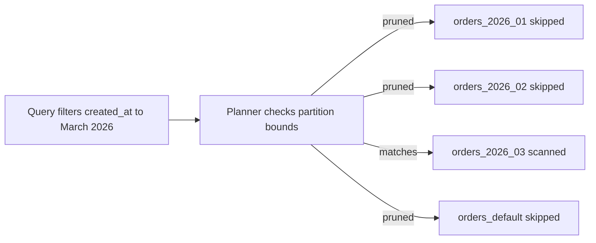
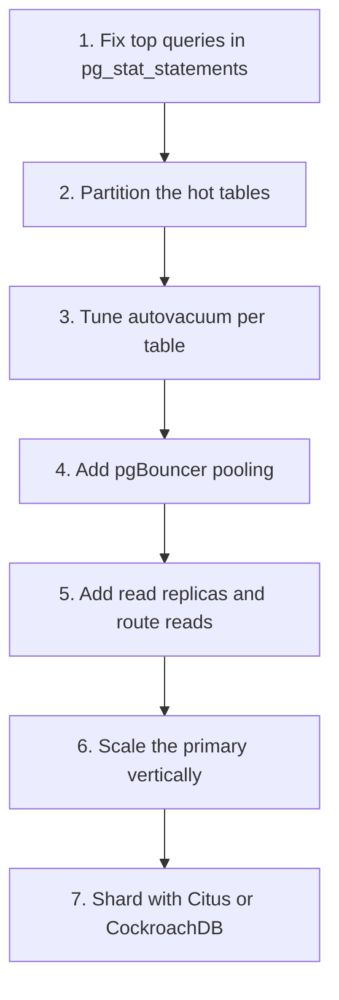

# Lecture 2 — Partitioning, Bloat, Pooling, and the Sharding Decision

> **Duration:** ~2 hours of reading + hands-on.
> **Outcome:** You can choose and write a partitioning strategy for a hot table, see and control MVCC bloat, read `pg_stat_statements` to find the query that actually costs you, configure pgBouncer for the right pooling mode, and make the call on when single-node Postgres has genuinely run out and sharding is the lesser evil.

Lecture 1 was about copying the data to more machines. This lecture is about making **one** machine hold and serve far more than you thought it could — because the cheapest distributed system is the one you didn't have to build. Four parts: (1) partitioning the hot table, (2) MVCC, HOT, and bloat, (3) query observability and connection pooling, (4) the horizontal escape hatch and when to take it.

The thesis of the whole lecture:

> **Before you shard, you partition the hot tables, kill the bloat, pool the connections, and fix the top five queries in `pg_stat_statements`. Most "we need to shard" conversations are really "we never did those four things" conversations. Do them first; they are an afternoon each and they buy you years.**

---

## Part 1 — Declarative partitioning

A 50-million-row `orders` table is not, by itself, a problem. A 50-million-row `orders` table where every query scans all 50 million rows, where `VACUUM` takes an hour and locks things up, and where dropping last year's data means a `DELETE` that bloats the table for a week — *that* is the problem. Partitioning splits one logical table into many physical **partitions** so that queries touch only the relevant ones, maintenance runs per-partition, and dropping old data is an instant `DROP TABLE`.

Postgres has **declarative partitioning**: you declare the partition key and the boundaries, and the planner routes inserts and prunes reads automatically. Queries don't change — they still target the parent table `orders`.

### 1.1 The three strategies

```sql
-- RANGE: partition by a continuous value (almost always time). The default choice
-- for an orders/events/logs table, because you query and expire data by time.
CREATE TABLE orders (
    order_id     bigint      NOT NULL,
    customer_id  bigint      NOT NULL,
    status       text        NOT NULL DEFAULT 'PLACED',
    total_cents  bigint      NOT NULL,
    created_at   timestamptz NOT NULL,
    PRIMARY KEY (order_id, created_at)        -- the partition key must be in the PK
) PARTITION BY RANGE (created_at);

-- LIST: partition by a discrete, enumerable value (region, tenant tier).
CREATE TABLE customers (
    customer_id bigint NOT NULL,
    region      text   NOT NULL,
    PRIMARY KEY (customer_id, region)
) PARTITION BY LIST (region);

-- HASH: partition by a hash of a high-cardinality key to spread writes evenly
-- when there is no natural range/list and you just want to break up contention.
CREATE TABLE events (
    event_id bigint NOT NULL,
    user_id  bigint NOT NULL,
    payload  jsonb,
    PRIMARY KEY (event_id, user_id)
) PARTITION BY HASH (user_id);
```

The constraint that catches everyone: **the partition key must be part of every unique constraint, including the primary key.** Postgres cannot enforce a global unique index across partitions, so `PRIMARY KEY (order_id)` alone is illegal on a table partitioned by `created_at` — you write `PRIMARY KEY (order_id, created_at)`. This changes your uniqueness semantics and you must design for it deliberately.

### 1.2 Creating partitions

For `RANGE` by month:

```sql
CREATE TABLE orders_2026_01 PARTITION OF orders
    FOR VALUES FROM ('2026-01-01') TO ('2026-02-01');
CREATE TABLE orders_2026_02 PARTITION OF orders
    FOR VALUES FROM ('2026-02-01') TO ('2026-03-01');
CREATE TABLE orders_2026_03 PARTITION OF orders
    FOR VALUES FROM ('2026-03-01') TO ('2026-04-01');

-- A DEFAULT partition catches rows that match no other partition, so an insert
-- for an un-provisioned month doesn't error. Useful as a safety net; dangerous
-- if it silently becomes a giant catch-all. Monitor it.
CREATE TABLE orders_default PARTITION OF orders DEFAULT;
```

The bounds are `[FROM, TO)` — inclusive low, exclusive high — so `'2026-02-01'` belongs to February, not January. Off-by-one on partition bounds is a classic bug; the half-open interval is what makes adjacent months tile cleanly with no gap and no overlap.

### 1.3 Partition pruning — the entire point

When a query's `WHERE` clause constrains the partition key, the planner **prunes** partitions that cannot match and never scans them:

```sql
EXPLAIN SELECT * FROM orders
WHERE created_at >= '2026-03-01' AND created_at < '2026-04-01';
```

```
 Append  (cost=0.00..123.45 rows=1000 width=...)
   ->  Seq Scan on orders_2026_03 orders_1
         Filter: (created_at >= '2026-03-01' AND created_at < '2026-04-01')
```

One partition in the plan, not twelve. That is the **"pruning fires" promise** from the week README. Contrast with a query that *doesn't* constrain the partition key — `WHERE status = 'PLACED'` — which must scan **every** partition, because the planner can't rule any out. The lesson is sharp: **partitioning only helps queries that filter on the partition key.** Choose the partition key to match how you actually query. If 90% of reads filter by `created_at`, partition by `created_at`. If they filter by `customer_id`, that's your key. Partitioning on the wrong column is worse than not partitioning, because you pay the per-partition overhead and get none of the pruning.


*Partition pruning skips every partition except the one matching the query filter.*

There are two flavors of pruning: **plan-time** (the planner removes partitions while building the plan, when the bounds are constants) and **execution-time** (the executor removes them at run time, when the value comes from a parameter or a join — visible as `(never executed)` subplans in `EXPLAIN ANALYZE`). Both are good; you want to see them in your plans.

### 1.4 Online conversion and rolling partitions

You rarely create a partitioned table from scratch — you convert a flat one that's already in production, without taking it offline. The pattern:

1. Create a new partitioned table `orders_new` with the same columns.
2. Create the partitions.
3. Backfill in batches (or `ATTACH` the old table as one big partition and split later).
4. Swap names in a single transaction.

`ATTACH PARTITION` and `DETACH PARTITION` are the surgical tools. `DETACH PARTITION ... CONCURRENTLY` removes a partition without an `ACCESS EXCLUSIVE` lock, so you can roll off last year's data live. For the create-ahead/expire-behind lifecycle, **`pg_partman`** runs a background worker that creates next month's partition before you need it and detaches partitions past your retention window — so the partition set rolls forward with no human in the loop. Exercise 2 has you do the conversion by hand once (so you understand it), then the mini-project automates it.

---

## Part 2 — MVCC, HOT, and bloat

To run Postgres at scale you must understand why it gets *fatter* than its data, and what to do about it.

### 2.1 Why updates create garbage

Postgres uses **MVCC** (Multi-Version Concurrency Control). An `UPDATE` does **not** overwrite a row in place. It writes a **new** version of the row (a new tuple) and marks the old version dead. A `DELETE` marks the row dead without writing a new one. This is what lets readers never block writers and writers never block readers — each transaction sees the row version valid as of its snapshot. The price is **dead tuples**: every update and delete leaves a corpse in the heap that must be cleaned up later.

The cleanup is **`VACUUM`**: it reclaims the space dead tuples occupy, making it available for reuse, and it updates the visibility map and planner statistics. `VACUUM` does **not** return space to the operating system in the normal case — it makes the space reusable *within* the table. The table stays the same size on disk and the freed space is refilled by future inserts/updates. That's usually what you want; a steady-state table at a stable size with regular vacuuming is healthy.

**Bloat** is what happens when dead tuples accumulate faster than `VACUUM` reclaims them, or when a burst of updates/deletes leaves space that's never refilled. A bloated table is much bigger on disk than its live data, which slows every scan (more pages to read) and wastes cache and storage.

### 2.2 HOT — the optimization that avoids index churn

A normal `UPDATE` must also update **every index** on the table, because the new tuple is at a new physical location and the indexes point at locations. On a table with six indexes, one update is seven writes.

**HOT (Heap-Only Tuple)** is the optimization that avoids this. If an update does **not** change any indexed column, *and* there's room on the same heap page, Postgres places the new tuple on the same page and chains it from the old one — the indexes still point at the old location and follow the chain to the live version. No index entries are written. On an update-heavy table, keeping updates HOT-eligible (by not indexing the hot, frequently-updated columns, and by leaving `fillfactor` headroom on the page) is one of the highest-leverage tuning moves there is.

```sql
-- Leave 15% of each page free so HOT updates have somewhere to go.
ALTER TABLE orders SET (fillfactor = 85);
```

You can see HOT working in `pg_stat_user_tables`: `n_tup_hot_upd` vs `n_tup_upd`. A high HOT ratio means your updates are cheap; a low one means every update is churning indexes and you should ask whether you're indexing a column you keep updating.

### 2.3 autovacuum and reading bloat

**autovacuum** is the background process that runs `VACUUM` and `ANALYZE` automatically when a table accumulates enough dead tuples (default: 20% of the table, `autovacuum_vacuum_scale_factor = 0.2`). On a big, hot table that 20% threshold is millions of dead tuples — far too lax. You tune it *per table*:

```sql
-- Vacuum orders far more aggressively: at 1% dead + a small base, not 20%.
ALTER TABLE orders SET (
    autovacuum_vacuum_scale_factor = 0.01,
    autovacuum_vacuum_threshold    = 1000,
    autovacuum_vacuum_cost_limit   = 2000   -- let it work faster
);
```

Read your bloat from `pg_stat_user_tables`:

```sql
SELECT relname,
       n_live_tup, n_dead_tup,
       round(100 * n_dead_tup / NULLIF(n_live_tup + n_dead_tup, 0), 1) AS dead_pct,
       last_autovacuum
FROM pg_stat_user_tables
ORDER BY n_dead_tup DESC
LIMIT 10;
```

For ground-truth bloat (not just dead-tuple counts), `pgstattuple` measures actual live/dead/free bytes:

```sql
CREATE EXTENSION IF NOT EXISTS pgstattuple;
SELECT * FROM pgstattuple('orders');   -- tuple_len, dead_tuple_len, free_space...
```

When a table is *already* badly bloated, ordinary `VACUUM` won't shrink it on disk. Your options:

- **`VACUUM FULL`** — rewrites the table compactly and returns space to the OS, but takes an **`ACCESS EXCLUSIVE` lock** for the duration. The table is offline. Never run this on a hot table in business hours.
- **`pg_repack`** — rebuilds the table/index online with only a brief lock at the end. This is the production answer to "the table is bloated and I can't take it offline."

### 2.4 Transaction-ID wraparound — the scary one

MVCC tags every tuple with the transaction ID (XID) that created it, and XIDs are a 32-bit counter that wraps around. `VACUUM` "freezes" old tuples so they remain visible after the counter wraps. If autovacuum falls so far behind that the oldest unfrozen XID approaches the wraparound horizon, Postgres will, as a last resort, **stop accepting writes** to protect the data. This is a real and famous way to take a database down. You monitor it with `datfrozenxid`/`relfrozenxid` and `age()`, and you never, ever disable autovacuum. If you see wraparound warnings in the log, treat them as a sev-1.

---

## Part 3 — Query observability and connection pooling

### 3.1 `pg_stat_statements`: optimize total time, not felt slowness

`pg_stat_statements` records normalized query templates with execution counts and timing. The single most important mental shift it teaches: **optimize the query with the highest *total* time, not the one that feels slowest.** A query that takes 2 seconds and runs once a day costs you 2 seconds. A query that takes 8 milliseconds and runs 50,000 times a minute costs you minutes per minute. The second one is your problem; the first one is a distraction.

```sql
CREATE EXTENSION IF NOT EXISTS pg_stat_statements;   -- requires it in shared_preload_libraries

SELECT
    round(total_exec_time::numeric, 1) AS total_ms,
    calls,
    round(mean_exec_time::numeric, 2)  AS mean_ms,
    round(100 * total_exec_time / sum(total_exec_time) OVER (), 1) AS pct,
    query
FROM pg_stat_statements
ORDER BY total_exec_time DESC
LIMIT 15;
```

The `pct` column — this query's share of all execution time — is the one you read first. The query at the top of that list is where an index, a rewrite, or a partition prune pays off most. This is the access-log discipline applied to the database: you don't tune the query you *think* is slow, you tune the one the data says costs the most.

Pair it with `EXPLAIN (ANALYZE, BUFFERS)` on the offending query to see whether it's reading from cache (`shared hit`) or disk (`shared read`), and whether it's using the index you expect. `auto_explain` logs the plan of any query over a threshold automatically, so you catch the bad plan in production without reproducing it.

### 3.2 pgBouncer: why Postgres connections are expensive

Each Postgres connection is a separate **OS process** with its own memory. A few hundred is fine; a few thousand idle connections eat gigabytes of RAM and slow the whole server, because Postgres was never designed for tens of thousands of connections. But modern app fleets — dozens of pods, each with a connection pool — easily try to open thousands. The fix is a **connection pooler** in front of Postgres that multiplexes many client connections onto a small set of real backend connections.

**pgBouncer** is the standard. It has three pooling modes, and choosing wrong is a correctness bug, not just a performance one:

| Mode | A server connection is held for… | Reuse | Caveats |
|---|---|---|---|
| `session` | the whole client session | Low | Safe; behaves like a direct connection. Barely helps the C10k problem. |
| `transaction` | one transaction | **High** | The workhorse. But a server connection is shared across clients between transactions. |
| `statement` | one statement | Highest | No multi-statement transactions allowed. Rarely used. |

```ini
; pgbouncer.ini
[databases]
shop = host=primary.internal port=5432 dbname=shop

[pgbouncer]
listen_addr = 0.0.0.0
listen_port = 6432
auth_type = scram-sha-256
auth_file = /etc/pgbouncer/userlist.txt
pool_mode = transaction          ; the right default for a stateless web fleet
max_client_conn = 5000           ; clients may open this many to pgBouncer
default_pool_size = 25           ; ...multiplexed onto this many backends per db/user
```

The math is the point: 5,000 application clients are served by 25 backend connections. Postgres sees 25 cheap processes; the app sees a pool that never blocks.

### 3.3 The transaction-pooling footguns

`transaction` mode is the high-reuse mode you almost always want, but because a backend is handed to a *different* client between transactions, anything that persists **across** transactions on a connection breaks:

- **Server-side prepared statements.** A statement prepared on one transaction may execute on a different backend next time and not exist there. Historically you set `server_reset_query` and avoided server-prepared statements; modern pgBouncer (1.21+) supports tracking prepared statements in transaction mode, but you must enable `max_prepared_statements` and understand the limits. Many ORMs need configuration here.
- **Session `SET`s.** `SET search_path`, `SET timezone`, `SET ROLE` set on one transaction leak to whoever gets that backend next — or vanish, depending on `server_reset_query`. Set these per-transaction, or in the connection string, not as sticky session state.
- **Advisory locks and `LISTEN`/`NOTIFY`.** These are session-scoped. They do not work correctly under transaction pooling. If you use `LISTEN/NOTIFY` (e.g., for cache invalidation), that connection must use `session` mode — often a second, small `session`-mode pool alongside the main `transaction`-mode one.
- **`WITH HOLD` cursors and temp tables** that outlive a transaction: same problem.

The senior summary for 2026: **run `transaction` mode for the stateless request path; carve out a separate `session`-mode pool for the few features that genuinely need session state; and know that PgCat (Rust) is the increasingly common alternative when you also want load balancing across replicas and sharding in the pooler itself.** Postgres core is also growing its own built-in pooling, but as of 2026 an external pooler is still standard.

---

## Part 4 — The horizontal escape hatch

You have replicated for reads (Lecture 1), partitioned the hot tables, killed the bloat, fixed the top queries, and pooled the connections. The single primary is *still* the write bottleneck — one machine cannot absorb the write throughput. **Now** you consider sharding: splitting the data across multiple primaries by a distribution key.

### 4.1 Citus — Postgres that shards itself

**Citus** is an extension that turns a cluster of Postgres nodes into a distributed database. You pick a **distribution column** (e.g., `customer_id`); Citus shards distributed tables across worker nodes by a hash of that column, and a **coordinator** node plans queries, pushing work down to the workers and combining results.

```sql
-- On the Citus coordinator:
SELECT create_distributed_table('orders', 'customer_id');     -- shard by customer
SELECT create_reference_table('products');                    -- small table, copied to every node
```

Citus shines when your workload is **multi-tenant** or naturally partitions by one key: queries that filter by the distribution column hit a single shard and are fast; tables co-located on the same distribution key join locally on each worker. Citus hurts when you do **cross-shard joins** that aren't co-located, or aggregates that must gather from every shard — those pay network and coordination cost. The skill is choosing a distribution column that matches your access pattern so the common queries stay single-shard. It remains *real Postgres* — your extensions, types, and SQL work — which is its biggest advantage over a from-scratch system.

### 4.2 CockroachDB — Postgres-wire, not Postgres-internals

**CockroachDB** speaks the Postgres wire protocol (your `psql` and most drivers connect) but is a **from-scratch distributed SQL database**: data lives in **ranges** that are individually Raft-replicated (the consensus from Week 2, applied per key-range), it is `SERIALIZABLE` by default, and it survives node and even region loss automatically. You get horizontal write scale and built-in HA without a coordinator or a separate failover manager.

The honest caveats: it is **wire-compatible, not internals-compatible.** Postgres extensions, many built-in functions, some `pg_catalog` behaviors, and certain SQL features differ or are absent. Performance characteristics differ — distributed transactions across ranges have latency that a single-node Postgres transaction does not. It is a different database that happens to speak Postgres, not a faster Postgres.

### 4.3 The decision

| Signal | Lean toward |
|---|---|
| Single primary's *writes* are the wall, after partitioning + pooling | Sharding (Citus or Cockroach) |
| Workload is multi-tenant / partitions cleanly by one key; you want to keep real Postgres + extensions | **Citus** |
| You need automatic multi-region survival and `SERIALIZABLE`, and can live without Postgres extensions | **CockroachDB** |
| You *haven't* yet partitioned hot tables, fixed top queries, or added pgBouncer | **None — do those first.** Sharding is the most expensive option; spend the cheap ones first. |

> **The senior position, stated plainly:** sharding multiplies your operational complexity — rebalancing, cross-shard transactions, distributed query planning, schema changes across shards. It is the right answer *eventually* for genuinely huge write workloads, and the wrong answer for the large majority of teams who reach for it before exhausting vertical scale, partitioning, and pooling. Measure the wall. Then, and only then, shard.

### 4.4 The cheap wins you exhaust before sharding, in order

Because this is the most expensive decision in the week, it's worth stating the order of cheap wins explicitly. When write or read pressure rises, walk this list top-to-bottom before anyone says "shard":

1. **Fix the top five queries in `pg_stat_statements`.** An afternoon. Often a single missing index removes a query that was 40% of your total execution time. This is the highest-leverage thing you will ever do and it's free.
2. **Partition the hot tables** so maintenance is per-partition, old data drops instantly, and time-range queries prune. An afternoon of DDL plus a backfill.
3. **Tune autovacuum per table** so bloat stops growing and scans stop reading dead space. A config change.
4. **Add pgBouncer** so thousands of app connections collapse onto dozens of backends. A config file and a deploy.
5. **Add read replicas and route reads** so the primary only handles writes and read-your-writes paths. A `pg_basebackup` and a routing rule.
6. **Scale the primary vertically** — more RAM (bigger cache), faster disks (NVMe), more cores. Boring, effective, and far cheaper than a distributed system in engineer-hours.

Only when *write* throughput remains the wall after all six do you reach step seven, sharding. The reason this order matters is economic: steps 1–6 cost hours-to-days of one engineer's time and add near-zero ongoing operational burden. Sharding costs weeks of design plus a permanent tax on every future schema change, every cross-shard query, and every on-call rotation. A team that shards at step three instead of step seven has bought a decade of complexity to avoid an afternoon of indexing. Knowing this order — and being the person in the room who insists on walking it — is a large part of what "senior data-platform engineer" means.


*Walk the six cheap wins before reaching for step seven, sharding.*

---

## 5. The partitioning-and-storage decision tree

```
A query / the storage tier is slow.
│
├─ Is it one query dominating pg_stat_statements by total_exec_time?
│   └─ Yes → index it / rewrite it / make it prune. (Part 3.1) Cheapest win.
│
├─ Is the hot table bloated (n_dead_tup high, dead_pct high)?
│   └─ Yes → tune autovacuum per-table; pg_repack to reclaim. (Part 2)
│
├─ Is the big table scanned end-to-end on a time/tenant predicate?
│   └─ Yes → partition by that key; confirm pruning in EXPLAIN. (Part 1)
│
├─ Are thousands of connections starving the server?
│   └─ Yes → pgBouncer, transaction mode (+ a session pool for stateful bits). (Part 3.2)
│
├─ Read throughput is the wall?
│   └─ Yes → add hot-standby read replicas; route reads. (Lecture 1)
│
└─ WRITE throughput is *still* the wall after all of the above?
    └─ Now consider Citus or CockroachDB. (Part 4) Not before.
```

---

## 6. Recap

You should now be able to:

- Choose `RANGE` / `LIST` / `HASH` partitioning for a table's access pattern, write the DDL (with the partition key in the PK), and prove pruning in `EXPLAIN`.
- Convert a flat table to partitioned online with `ATTACH`/`DETACH`, and automate the lifecycle with `pg_partman`.
- Explain MVCC dead tuples, HOT updates and `fillfactor`, and read bloat from `pg_stat_user_tables` and `pgstattuple`.
- Tune autovacuum per-table and choose between `VACUUM`, `VACUUM FULL`, and `pg_repack`; respect XID wraparound.
- Rank queries by total time in `pg_stat_statements` and fix the one that actually costs the most.
- Configure pgBouncer in transaction mode, name the prepared-statement / `SET` / advisory-lock footguns, and carve out a session pool where needed.
- State honestly when single-node Postgres has run out and choose between Citus and CockroachDB — and refuse to shard before partitioning, pooling, and query-tuning are done.

Next: the exercises put this on a real instance — a streaming replica, an online partition conversion, and a bloat-and-statements investigation. Continue to [the exercises](../exercises/README.md).

---

## References

- *Table Partitioning* — Postgres docs: <https://www.postgresql.org/docs/16/ddl-partitioning.html>
- *Routine Vacuuming* (MVCC, bloat, wraparound): <https://www.postgresql.org/docs/16/routine-vacuuming.html>
- *HOT README* — Postgres source: <https://github.com/postgres/postgres/blob/REL_16_STABLE/src/backend/access/heap/README.HOT>
- *`pg_stat_statements`*: <https://www.postgresql.org/docs/16/pgstatstatements.html>
- *pgBouncer config & features*: <https://www.pgbouncer.org/config.html>
- *pg_partman*: <https://github.com/pgpartman/pg_partman>
- *Citus distributed tables*: <https://docs.citusdata.com/en/stable/develop/api_metadata.html>
- *CockroachDB architecture*: <https://www.cockroachlabs.com/docs/stable/architecture/overview>
- *`pg_repack`*: <https://github.com/reorg/pg_repack>
