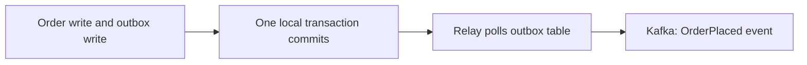
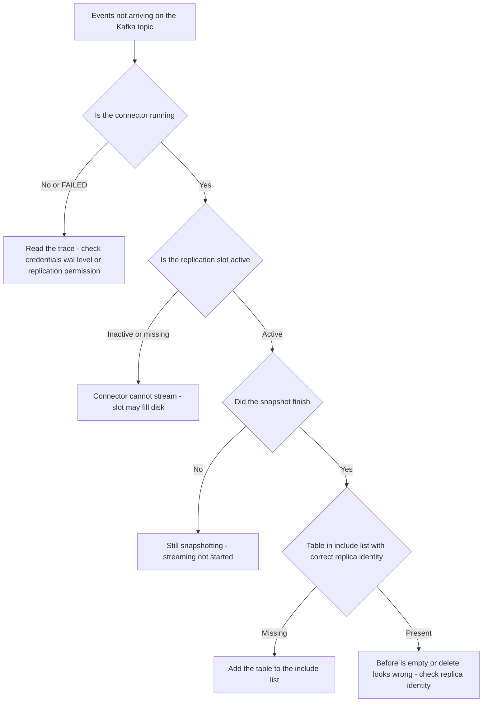

# Lecture 1 — Change Data Capture: The Dual-Write Problem, the Outbox, and Debezium

> **Duration:** ~2 hours of reading + hands-on.
> **Outcome:** You can explain precisely why a dual write is unsafe, solve it with the transactional outbox at the application level, deploy a Debezium Postgres connector that derives events from the WAL, and read the anatomy of a change event well enough to build consumers against it.

If you remember one sentence from this entire week, remember this one:

> **You cannot atomically write to your database and publish to your message broker, because they are two systems with no shared transaction — so stop trying. Make the event stream a *consequence* of the commit, not a second write alongside it.**

Every event-driven system eventually confronts this. A team adds Kafka, writes "save the order, then publish `OrderPlaced`," ships it, and three months later discovers orders in the database with no corresponding event, and events with no corresponding order. They add retries, then a try/catch, then a "reconciliation job," and the complexity metastasizes. The root cause is a category error: treating two writes to two systems as if they were one transaction. This lecture makes you immune.

---

## 1. The dual-write problem, stated precisely

Here is the code every team writes first:

```python
def place_order(order):
    db.insert(order)                       # write 1: the database
    kafka.produce("OrderPlaced", order)    # write 2: the broker
```

This looks atomic. It is not. There is no transaction spanning `db` and `kafka` — they are separate systems. Consider the failure interleavings:

- **Crash after write 1, before write 2.** The order is in the database; no event was published. Downstream consumers (the search index, the analytics pipeline, the shipping service) never hear about the order. The order exists but is invisible to everything that reacts to events.
- **Write 2 succeeds, then the transaction in write 1 *rolls back*** (a constraint violation, a deadlock retry that gives up). Now there's an `OrderPlaced` event for an order that does not exist. Consumers ship a phantom order.
- **Write 1 succeeds, write 2 throws, you retry write 2, the retry succeeds — but a consumer already processed nothing, or processed twice.** You're now hand-rolling delivery semantics in application code.

You cannot fix this with ordering ("publish first, then write") — you just move which side gets the phantom. You cannot fix it with a try/catch — the crash happens *between* the lines, where no handler runs. You cannot fix it with retries alone — a retry after a crash requires durable intent to retry, which is itself a write you didn't make atomically. **The two-writes-to-two-systems shape is the problem, and no amount of defensive code around it helps.**

The two real solutions both share one idea: **make the event derive from a single atomic commit.**

---

## 2. The transactional outbox pattern

The first solution stays inside your application's control. The insight: you *can* atomically write two rows to **the same database** in one transaction. So write the business change *and* a description of the event you want to publish, together, to an `outbox` table — one local ACID transaction, all-or-nothing. Then a separate relay process reads the outbox and publishes to Kafka, at its own pace, with at-least-once delivery.

```sql
-- One transaction. Both rows commit or neither does. No distributed transaction.
BEGIN;
  INSERT INTO orders (order_id, customer_id, status, total_cents, created_at)
  VALUES (1001, 42, 'PLACED', 1999, now());

  INSERT INTO outbox (id, aggregate_type, aggregate_id, event_type, payload, created_at)
  VALUES (gen_random_uuid(), 'order', '1001', 'OrderPlaced',
          '{"order_id":1001,"customer_id":42,"total_cents":1999}'::jsonb, now());
COMMIT;
```

Now the order and the *intent to publish an event about it* are atomically linked. A relay then does:

```
loop:
  rows = SELECT * FROM outbox WHERE published = false ORDER BY created_at LIMIT 100
  for row in rows:
      kafka.produce(topic=row.event_type, key=row.aggregate_id, value=row.payload)
      mark row published (or DELETE it)
```

If the relay crashes after producing but before marking the row published, it re-produces on restart — **at-least-once**, which is fine because consumers are idempotent (Lecture 2 / Week 11). The crucial property is that the relay can *never* produce an event for an order that doesn't exist, nor miss one that does, because the outbox row and the order row committed together. The phantom-and-missing failures of §1 are structurally impossible.


*The order row and the outbox row commit atomically; the relay drains the outbox into Kafka afterward.*

This is the **transactional outbox pattern**, and it is the correct default for a service that needs to publish events about its own data. Its one cost is the relay — you have to run something that drains the outbox.

---

## 3. Log-based CDC: let the database's own log be the relay

The outbox pattern has you write an extra row and run a relay. **Log-based change data capture** removes even that: instead of writing an explicit event, you let the database's commit log *be* the event stream. Recall from Week 13 that Postgres writes every change to the WAL before it touches the data files, and that `wal_level = logical` makes that WAL *decodable* into row-level changes. CDC reads that decoded stream and turns each committed change into an event — automatically, for free, faithfully ordered by commit order.

The implications are striking:

- **There is no second write.** You just `INSERT`/`UPDATE`/`DELETE` as normal. The change event is a *consequence* of your commit, reading the very log Postgres already wrote for durability. The dual-write problem cannot exist because there is only one write.
- **It captures everything, including changes you didn't think to publish.** A row updated by a migration, a manual `psql` fix, another service writing the same table — all captured. The stream is the *truth* of what happened to the table, not what the application remembered to announce.
- **It's low-overhead.** Reading the WAL is cheap; the database already produced it.

The tradeoff versus the outbox: with raw table-level CDC, your event shape is *the table's row shape*. If you rename a column, your event contract changes. The outbox lets you decouple the event contract from the table schema (you control the `payload`). In practice, teams use **both**: raw CDC for replicating data and feeding analytics, and an **outbox table captured by CDC** (Debezium's outbox event router) when they want clean, schema-stable domain events. You get the outbox's contract control *and* CDC's no-relay operation.

> **The decision:** dual write — never. Outbox with your own relay — when you want full control and can run the relay. Log-based CDC (Debezium) — when you want the database's log to be the stream with no relay to operate. Outbox table + Debezium — when you want both clean domain events and no relay. The last is the 2026 default for a service publishing domain events from Postgres.

---

## 4. Debezium: the log-based CDC platform

**Debezium** is the open-source CDC platform that productionizes all of this. It runs as a set of **Kafka Connect** connectors. For Postgres, the Debezium connector:

1. Connects to Postgres as a replication client, creating a **logical replication slot** (the same slots from Week 13 — and yes, an abandoned Debezium slot fills your disk exactly as Lecture 13 warned).
2. Takes an **initial snapshot** of the configured tables (so a brand-new consumer sees current state, not just future changes).
3. Then **streams** the WAL via `pgoutput`, decoding each committed change into a structured event and producing it to a Kafka topic, one topic per table by default (`<server>.<schema>.<table>`).

### 4.1 Configuring the connector

A Debezium Postgres connector is registered as JSON against the Kafka Connect REST API:

```json
{
  "name": "orders-connector",
  "config": {
    "connector.class": "io.debezium.connector.postgresql.PostgresConnector",
    "database.hostname": "primary",
    "database.port": "5432",
    "database.user": "debezium",
    "database.password": "dbz",
    "database.dbname": "shop",
    "topic.prefix": "shop",
    "plugin.name": "pgoutput",
    "slot.name": "debezium_orders",
    "publication.name": "dbz_pub",
    "table.include.list": "public.orders,public.order_items",
    "snapshot.mode": "initial",
    "tombstones.on.delete": "true"
  }
}
```

The Postgres side needs a replication-capable role and `wal_level = logical` (Week 13). Debezium creates the slot and publication itself if it has permission, or you pre-create them:

```sql
CREATE ROLE debezium WITH REPLICATION LOGIN PASSWORD 'dbz';
GRANT SELECT ON ALL TABLES IN SCHEMA public TO debezium;   -- for the snapshot
CREATE PUBLICATION dbz_pub FOR TABLE orders, order_items;  -- or let Debezium make it
```

Once registered, every change to `orders` produces an event to topic `shop.public.orders`.

### 4.2 The anatomy of a change event

This is the single most important thing to read fluently this week. A Debezium change event for an `UPDATE` looks like this (payload shown; the schema half omitted for brevity):

```json
{
  "payload": {
    "before": {
      "order_id": 1001, "customer_id": 42, "status": "PLACED", "total_cents": 1999
    },
    "after": {
      "order_id": 1001, "customer_id": 42, "status": "SHIPPED", "total_cents": 1999
    },
    "source": {
      "version": "2.x", "connector": "postgresql", "db": "shop",
      "schema": "public", "table": "orders",
      "lsn": 23456789, "txId": 555, "ts_ms": 1789900000000
    },
    "op": "u",
    "ts_ms": 1789900000123
  }
}
```

Read it field by field:

- **`op`** — the operation: `c` (create/insert), `u` (update), `d` (delete), `r` (read, emitted during the initial snapshot). Your consumer switches on this.
- **`before`** — the row *before* the change. For an `INSERT` it's `null`; for an `UPDATE`/`DELETE` it depends on `REPLICA IDENTITY` (§4.3).
- **`after`** — the row *after* the change. For a `DELETE` it's `null`.
- **`source`** — provenance: which DB/schema/table, the **LSN** (the WAL position — your ordering key and your dedup key), the transaction ID, and timestamps. The LSN is gold: it gives you a total order and a stable idempotency key.
- **`ts_ms`** — when the change was committed (`source.ts_ms`) vs when Debezium processed it (top-level `ts_ms`). The gap between them is your CDC lag.

A **delete** produces an event with `after: null`, and (if `tombstones.on.delete` is true) a follow-up **tombstone** — a message with a key but a `null` value — which tells log-compacted topics "this key is gone, you may garbage-collect it." Tombstones trip up consumers that assume every message has a value; handle the `null` value explicitly.

### 4.3 `REPLICA IDENTITY` — why your `before` is sometimes empty

By default (`REPLICA IDENTITY DEFAULT`), Postgres only logs the **primary key** in the `before` image of an update or delete — not the full old row. So Debezium's `before` for an update contains just the PK, and you can't see what the *old* `status` was. If your consumer needs the full prior state (to compute a diff, to validate a transition), you must set:

```sql
ALTER TABLE orders REPLICA IDENTITY FULL;   -- log the whole old row in before
```

This is more WAL volume (you're logging the full old row on every update), so it's a deliberate tradeoff: `FULL` when you need the prior image, `DEFAULT` when the PK is enough. Forgetting this is the most common "why is `before` empty?" confusion in Debezium. (Recall from Week 13 that a table with *no* primary key needs `REPLICA IDENTITY FULL` even to replicate updates at all.)

### 4.4 Snapshot vs streaming

When a connector starts for the first time, the table already has history the WAL no longer contains (the WAL doesn't go back to the beginning of time). So Debezium first **snapshots**: it reads the current contents of each table and emits them as `op: "r"` events, so a new consumer can build complete current state. Then it switches to **streaming** the WAL for everything after the snapshot. The snapshot of a huge table can be slow and lock-sensitive; `snapshot.mode` and incremental snapshots (snapshotting in chunks without blocking streaming) exist for exactly the 50M-row tables you built last week. Know that the first start reads the whole table; plan for it.

---

## 5. A worked example on the `orders` table

Put it together on the table from Week 13. With `wal_level = logical`, the `debezium` role, and the connector registered, run an update:

```sql
UPDATE orders SET status = 'SHIPPED' WHERE order_id = 1001;
```

Consume the topic and watch the event arrive:

```bash
kcat -b localhost:9092 -t shop.public.orders -C -o end -q | jq '.payload | {op, before: .before.status, after: .after.status, lsn: .source.lsn}'
# {"op":"u","before":null,"after":"SHIPPED","lsn":23456789}   # before is null: REPLICA IDENTITY DEFAULT
```

Set `REPLICA IDENTITY FULL`, update again, and now `before.status` is `"SHIPPED"` → `after.status` is the new value — the full prior image is there. That before/after pair, keyed and ordered by LSN, is everything a downstream read model or event store needs. **This is the change stream the rest of the week consumes.** Exercise 1 walks the full deployment; the projector and event store (Lecture 2) consume it.

---

## 5a. Operating Debezium: the things that page you

Reading change events is the easy part. Operating a CDC pipeline so it doesn't take down your *source* database is where the experience lives. Three operational facts every Debezium operator learns, usually the hard way.

**The slot is a disk-fill timer, exactly as in Week 13.** Debezium streams via a logical replication slot, and that slot pins WAL on the primary until Debezium has consumed past it. If Debezium falls behind — Kafka is down, Connect is wedged, the connector is paused — the slot's `restart_lsn` stops advancing and `pg_wal/` grows without bound until the primary's disk fills and it stops accepting writes. **Your analytics pipeline can take down your transactional database.** You monitor `pg_replication_slots` for the Debezium slot, alert on `active = false` and on growing `pg_wal_lsn_diff(pg_current_wal_lsn(), restart_lsn)`, and you set `max_slot_wal_keep_size` as the circuit breaker that sacrifices the connector (it'll need a re-snapshot) to save the primary. This is the single most important operational fact about Debezium, and it is the Week 13 lesson reappearing one layer up.

**The initial snapshot is the riskiest moment.** When a connector starts fresh, it snapshots every included table — a full read of your 50M-row `orders` table. On older configurations this could hold locks; modern Debezium uses a lock-free snapshot by default, but it still drives heavy read I/O on your primary while it runs. For large tables, use **incremental snapshots**: Debezium snapshots in chunks, interleaved with streaming, so a huge table doesn't block the live change feed and doesn't hammer the primary in one burst. Plan the first connector start for a low-traffic window, or use incremental snapshots from the outset.

**Schema changes are coordinated, not automatic.** When you `ALTER TABLE orders ADD COLUMN`, Debezium *does* pick up the new column in the change event (it reads the table's current schema), but every downstream consumer must be ready for the new field's appearance, and any consumer with a strict schema (a typed deserializer, an Avro schema registry) may reject events until its schema is updated. The discipline is the same as logical replication's DDL coordination from Week 13: stage schema changes so producers and consumers move together, and use a schema registry with compatibility rules (backward-compatible additive changes) so a new field doesn't break an old consumer. Debezium plus a schema registry is the standard production shape precisely because it turns "someone added a column" from an outage into a compatibility check.

The throughline: a CDC pipeline is plumbing attached to your most important database, and plumbing that backs up floods the room it's in. Operate it with the same care as the primary itself.

## 6. The CDC failure-mode decision tree

When the change stream is "not flowing," walk this tree before touching the connector:

```
Events not arriving on the Kafka topic.
│
├─ Is the connector RUNNING?  (GET /connectors/orders-connector/status)
│   ├─ No / FAILED → read the trace. Usually bad credentials, missing wal_level,
│   │                or no replication permission. Fix and restart the task.
│   └─ Yes ↓
│
├─ Does the replication slot exist and is it active?  (pg_replication_slots)
│   ├─ Inactive / missing → connector can't stream. Also: an inactive Debezium
│   │                        slot pins WAL and fills the disk (Week 13 §2.2).
│   └─ Active ↓
│
├─ Did the SNAPSHOT finish?  (connector logs: "snapshot completed")
│   ├─ No → it's still snapshotting a big table; streaming hasn't started yet.
│   └─ Yes ↓
│
├─ Is the table in table.include.list and does it have the right REPLICA IDENTITY?
│   ├─ Missing from include list → no events for it. Add it.
│   └─ Present ↓
│
└─ Events arrive but `before` is empty / a delete looks wrong
    → REPLICA IDENTITY. Set FULL if you need the prior image. (§4.3)
```


*Walk this tree top to bottom before touching the connector config.*

Tape this next to the read-model/idempotency tree from Lecture 2. Between them you can diagnose most "my CDC pipeline stopped / looks wrong" pages in minutes.

---

## 5c. The outbox event router: best of both, in practice

§3 said the 2026 default is an **outbox table captured by Debezium**. It's worth seeing exactly how that works, because it resolves the one real downside of raw table CDC — that your event contract is tied to your table's column names.

With raw table CDC, the event a consumer sees is literally the `orders` row: rename the `total_cents` column to `amount_cents` for a refactor, and every consumer's parsing breaks, because the change event's `after` now has a differently-named field. Your *internal* schema change leaked into your *external* event contract. That coupling is exactly what bounded contexts (Week 4) tell you to avoid.

The **outbox pattern captured by CDC** breaks the coupling. You write a domain event — shaped how you *want consumers to see it* — into an `outbox` table, in the same transaction as the business change (no dual write). Debezium captures the `outbox` table, and its **outbox event router** SMT (single message transform) reshapes each outbox row into a clean event on a per-event-type topic.

```sql
-- The outbox row: YOU control this shape; it's your published contract.
INSERT INTO outbox (id, aggregate_type, aggregate_id, event_type, payload)
VALUES (gen_random_uuid(), 'order', '1001', 'OrderPlaced',
        '{"orderId":1001,"customerId":42,"amountCents":1999}'::jsonb);
```

```json
{
  "transforms": "outbox",
  "transforms.outbox.type": "io.debezium.transforms.outbox.EventRouter",
  "transforms.outbox.route.by.field": "event_type",
  "transforms.outbox.table.field.event.payload": "payload"
}
```

Now `OrderPlaced` events land on their own topic with your chosen field names, and you can refactor the `orders` table freely — rename columns, change types, split it — as long as the *outbox-writing code* still produces the agreed event shape. The internal schema and the external contract are decoupled, and you *still* have no dual write (the outbox row commits atomically with the business change) and *still* run no relay (Debezium drains the outbox from the WAL).

> **The decision, refined:** raw table CDC when you want a faithful replica of the data for analytics or a read model and the table shape *is* an acceptable contract. Outbox + Debezium router when you're publishing **domain events** that other teams consume and you need the event contract to be stable across your internal refactors. Most platforms use both — raw CDC into the lakehouse and read models, outbox events for cross-team domain notifications.

## 6a. Log-based vs query-based CDC

Not all CDC reads the WAL. It's worth knowing the alternative, because you'll meet it and you need to know why log-based won.

**Query-based (polling) CDC** captures changes by *querying* the table on a schedule: `SELECT * FROM orders WHERE updated_at > :last_seen`. You add an `updated_at` (or a monotonic version) column, poll for rows changed since you last looked, and emit them. It's simple and needs no special database privileges.

It also has fundamental holes:

- **It misses deletes.** A deleted row doesn't appear in a `WHERE updated_at > ...` query — it's gone. You either never capture deletes (data drift) or bolt on soft-deletes (a `deleted_at` column and "never actually delete"), which is its own complexity.
- **It misses intermediate states.** If a row changes from `A` to `B` to `C` between two polls, you capture only `C`. The `B` is lost. For a change *stream*, losing intermediate states is often unacceptable.
- **It taxes the source.** Every poll is a query against your OLTP table, competing with the real workload — and to catch changes promptly you must poll frequently, which multiplies the tax.
- **It depends on a reliable `updated_at`.** A trigger or app bug that forgets to bump `updated_at` silently drops that change forever.

**Log-based CDC** (Debezium reading the WAL) has none of these holes: it sees *every* change including deletes and every intermediate state, in commit order, by reading a log the database already wrote — so the source tax is minimal and there's no `updated_at` to forget. The only costs are the `wal_level = logical` setup and the replication-slot discipline.

> **The 2026 default is log-based.** Query-based CDC survives in constrained environments (a managed database that won't give you logical replication, a legacy source with no log access) and as a quick hack. But when you can read the log — and on Postgres you almost always can — you read the log. It's strictly more faithful for strictly less ongoing cost. This is why "Debezium changed the conversation": it made faithful log-based CDC a configuration, not a research project.

## 6b. Ordering, partitioning, and the one key rule

A change stream is only useful if consumers can reason about *order*, and order in Kafka is per-partition, not global. This interacts with CDC in a way that bites teams who don't plan for it.

Debezium produces each table's changes to a topic, and within a topic, order is guaranteed only **within a partition**. By default, Debezium keys each change event by the table's **primary key**, so all changes to the *same row* land on the same partition and are therefore delivered **in order**. That is exactly the guarantee you need: a consumer sees order 1001's `OrderPlaced` before its `OrderShipped` before its `OrderDelivered`, because they share a key and thus a partition.

What you do **not** get is a global order across *different* rows or *different* tables. Order 1001's events and order 2002's events may interleave arbitrarily across partitions; the `orders` topic and the `order_items` topic have no cross-topic ordering at all. This is why a read model that needs to join `orders` and `order_items` can't rely on "I'll see the order before its items" — it must handle either arriving first (buffer, or upsert idempotently and let the join resolve when both are present).

The one key rule, then: **key your change events by the entity whose ordering you depend on**, which for table CDC is the primary key, and design consumers so that anything requiring cross-entity ordering is resolved by *state* (idempotent upserts that converge regardless of arrival order), not by assuming an order the partitioning doesn't provide. The LSN in every event (Lecture 1 §4.2) gives you a *total* order when you genuinely need to reconstruct one — you sort or dedup by LSN — but you pay for that with buffering or post-hoc sorting, so you use it only where per-key ordering isn't enough.

This is the same partition-key lesson from Week 10's Kafka, applied to CDC: the key controls which changes are ordered with respect to each other, and choosing it wrong (or assuming an order you didn't buy) is a subtle, intermittent bug that only shows under load when partitions interleave.

## 7. Recap

You should now be able to:

- State precisely why a dual write is not atomic and why no defensive coding fixes the two-systems shape.
- Distinguish log-based CDC from query-based (polling) CDC, and explain why log-based captures deletes and intermediate states that polling misses.
- Reason about per-partition ordering, why Debezium keys by primary key, and why cross-entity ordering must be resolved by idempotent state, not assumed.
- Implement the transactional outbox: the business change and an outbox row in one local transaction, drained by a relay, yielding at-least-once delivery with no phantoms.
- Explain log-based CDC: the event stream as a consequence of the commit, read from the WAL, with no second write.
- Deploy a Debezium Postgres connector (slot, publication, `pgoutput`, include list) and reason about snapshot-then-stream.
- Read a change event — `op`, `before`, `after`, `source`/LSN, tombstones — and use the LSN as an ordering and dedup key.
- Set `REPLICA IDENTITY FULL` when you need the prior image, and pay the WAL cost knowingly.
- Reason about per-partition ordering and the outbox event router for stable domain-event contracts.

The single mental shift to carry out of this lecture: **stop thinking of events as something you publish, and start thinking of them as something that falls out of your commits.** A dual-writing engineer asks "did I remember to publish the event?" — a question with a wrong answer waiting on every crash. A CDC engineer never asks it, because there is nothing to remember: the commit *is* the event, derived from the log the database wrote anyway. That inversion — from "publish an event" to "the commit produces an event" — is what makes the entire event-driven half of this course safe. Everything downstream (read models, event stores, the lakehouse, sagas) consumes that derived stream, and all of them inherit its one crucial property: the stream cannot disagree with the database, because it *is* the database's log, read out loud.

Next up: what to *do* with the change stream — CQRS read models, event sourcing, and the taxonomy that keeps you from confusing the two. Continue to [Lecture 2 — CQRS, Event Sourcing, and the Taxonomy](./02-cqrs-event-sourcing-and-the-taxonomy.md).

---

## 8. One more failure interleaving, named

To cement §1, here is the dual-write failure interleaving teams find hardest to believe until it happens, written out fully so you recognize it in a postmortem.

A service handles "cancel order": it runs `UPDATE orders SET status='CANCELLED'` (commits), then publishes `OrderCancelled`. The publish *succeeds*. But the Kafka *acknowledgement* is lost on the way back — a network blip, a momentary partition — so the service *thinks* the publish failed and retries. The retry also succeeds. Now there are **two** `OrderCancelled` events for one cancellation. A non-idempotent refund consumer issues **two refunds**. The customer is paid twice; finance has a hole; and the bug is invisible in the happy path and reproduces only under packet loss.

Notice this is the *mirror* of the missing-event case: dual writes don't only *drop* events, they also *duplicate* them, because the only way to recover from "did my publish land?" without atomicity is to retry, and retries duplicate. So a dual write threatens you from both sides — phantom events, missing events, *and* duplicate events — and the standard defensive instinct (retry on uncertainty) makes the duplication side *worse*. Outbox/CDC closes the missing and phantom sides (the event derives atomically from the commit); idempotent consumers (Lecture 2) close the duplicate side (a duplicate `OrderCancelled` refunds once). You need both halves: derive the event correctly *and* consume it idempotently. Neither alone is enough, which is why this week teaches them together.

## References

- *Debezium Postgres connector*: <https://debezium.io/documentation/reference/stable/connectors/postgresql.html>
- *Transactional outbox pattern*: <https://microservices.io/patterns/data/transactional-outbox.html>
- *Debezium outbox event router*: <https://debezium.io/documentation/reference/stable/transformations/outbox-event-router.html>
- *Postgres logical replication protocol (`pgoutput`)*: <https://www.postgresql.org/docs/16/protocol-logical-replication.html>
- *`REPLICA IDENTITY`*: <https://www.postgresql.org/docs/16/sql-altertable.html#SQL-ALTERTABLE-REPLICA-IDENTITY>
- *Kafka Connect*: <https://kafka.apache.org/documentation/#connect>
