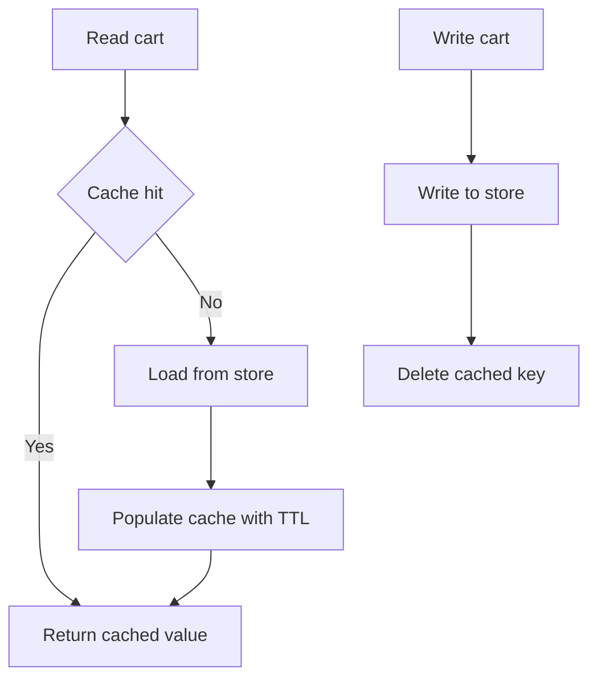
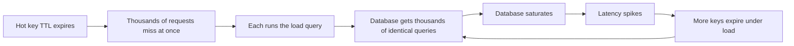

# Lecture 1 — Cache Patterns, Invalidation, and the Stampede

> **Duration:** ~2 hours of reading + hands-on.
> **Outcome:** You can name and distinguish the four cache patterns (look-aside, read-through, write-through, write-back) by what each guarantees and costs; pick an invalidation strategy for a given read/write ratio and staleness budget; and reproduce *and fix* a cache stampede with request coalescing and probabilistic early expiration.

If you remember one sentence from this lecture, remember this one:

> **A cache is a second, faster copy of your data, and every cache problem is the same problem in disguise: keeping that copy from disagreeing with the source of truth, or surviving the moment the copy isn't there.**

A cache buys you two things: **latency** (an in-memory `GET` is tens of microseconds; a Postgres query with a join is single-digit-to-tens of milliseconds) and **load relief** (every read the cache serves is a read the database never sees). You pay for both with a correctness liability — the cached copy can be stale — and an availability liability — the cache can be down, or worse, can take your database down when it fails. This lecture is about managing those liabilities deliberately. The mistake the whole industry makes is adding a cache for the latency win and discovering the liabilities in production.

---

## 1. The four patterns

There are exactly four canonical ways to wire a cache between your application and your store. They differ on two axes: **who loads the cache on a miss** (the app, or the cache itself) and **how writes propagate** (through the cache, or around it). Get the pattern right and the rest of the week's mechanics fall into place; get it wrong and no amount of TTL tuning saves you.

### 1.1 Look-aside (cache-aside) — the default, and the one you'll use

In look-aside, **the application owns the cache logic**. The flow:

- **Read:** check the cache. On a **hit**, return it. On a **miss**, load from the store, *populate the cache*, and return.
- **Write:** write to the store, then **invalidate** (delete) the cached key — so the next read misses and reloads the fresh value.

```python
# Look-aside read (cache-aside). The app orchestrates cache + store.
def get_cart(cart_id: str) -> dict:
    key = f"cart:{cart_id}"
    cached = redis.get(key)
    if cached is not None:
        return json.loads(cached)            # HIT
    row = db.query_cart(cart_id)             # MISS -> load from source of truth
    redis.set(key, json.dumps(row), ex=300)  # populate with a 5-minute TTL
    return row

# Look-aside write: update the store, then INVALIDATE (not update) the cache.
def update_cart(cart_id: str, items: list) -> None:
    db.update_cart(cart_id, items)           # source of truth first
    redis.delete(f"cart:{cart_id}")          # invalidate; next read reloads
```

**Why delete, not update, the cache on write?** Because updating the cache from the write path re-introduces a race: two concurrent writes can populate the cache in the *opposite* order they hit the database, leaving a permanently-stale value. Deleting is idempotent and race-tolerant — the worst case is an extra miss, never a wrong value. "Invalidate, don't update" is the single most important look-aside discipline, and the one people get wrong. (There's a subtler race even with delete — the "stale set" race — that we return to in §3.4.)

**Why look-aside is the default:** it's resilient to cache failure (a dead cache means every read misses and hits the store — slow, but correct), it caches only what's actually read (no wasted memory on cold keys), and the app has full control. The cost: every cache-miss read path has the load-and-populate logic, and you own the invalidation. It is the pattern for the `cart` read path this week.


*Look-aside: the app loads and populates on a miss, and invalidates the cache on every write.*

### 1.2 Read-through — the cache loads on miss

Read-through moves the load-on-miss *into the cache layer* (or a library that wraps it), behind a uniform read interface. The app just calls `cache.get(key)`; on a miss, the cache itself calls a loader function to fetch from the store and populate. It's look-aside with the miss-handling centralized — useful when many call sites read the same data and you don't want the load logic duplicated.

```python
# Read-through: the cache wrapper owns the miss path. The caller just "gets".
class ReadThroughCache:
    def __init__(self, redis, loader, ttl=300):
        self.redis, self.loader, self.ttl = redis, loader, ttl

    def get(self, key: str):
        cached = self.redis.get(key)
        if cached is not None:
            return json.loads(cached)
        value = self.loader(key)                       # the cache loads on miss
        self.redis.set(key, json.dumps(value), ex=self.ttl)
        return value

cart_cache = ReadThroughCache(redis, loader=lambda k: db.query_cart(k.split(":")[1]))
cart = cart_cache.get("cart:42")                       # caller doesn't know it missed
```

The trade vs look-aside is mostly ergonomic: read-through centralizes the miss logic (one place to add coalescing, metrics, error handling) at the cost of a less transparent control flow. Functionally the consistency story is identical to look-aside — you still invalidate on write.

### 1.3 Write-through — the cache is always fresh

In write-through, **writes go through the cache to the store synchronously**: the write updates the cache *and* the store as one operation, and only returns once both are done. The cache is therefore always consistent with the store (for the keys it holds), so reads are never stale.

```python
# Write-through: the write updates BOTH the store and the cache, synchronously.
def update_cart_write_through(cart_id: str, items: list) -> None:
    key = f"cart:{cart_id}"
    db.update_cart(cart_id, items)                     # store first (durability)
    redis.set(key, json.dumps({"items": items}), ex=300)  # then refresh the cache
    # Both done before returning -> the cache can never be staler than the store.
```

The win is **read freshness**: a read after a write always sees the new value. The costs: **slower writes** (every write pays the cache write too), and **cache churn** — you write keys to the cache that may never be read (cold data takes memory). Write-through pairs well with read-through for read-heavy data that *is* read after it's written. It does *not* solve durability — the store is still the source of truth — and if the cache write fails after the store write, you must decide whether to fail the request or tolerate the inconsistency (usually: invalidate instead, falling back to look-aside semantics).

### 1.4 Write-back (write-behind) — fast writes, real risk

In write-back, **writes hit the cache and return immediately; the cache flushes to the store asynchronously** (batched, on a timer, or on eviction). Writes are as fast as a cache write, and you can coalesce many writes to the same key into one store write — a huge win for write-heavy counters and aggregations.

```python
# Write-back (write-behind): write to cache now, flush to the store LATER.
def increment_view_count(item_id: str) -> None:
    redis.incr(f"views:{item_id}")     # instant; the store is NOT touched yet
    # A background flusher periodically drains accumulated counts to Postgres:
    #   for key in dirty_keys: db.add_views(item_id, redis.getdel(key))
    # 10,000 increments become ONE database write. That's the write-back win.
```

The catch is **durability**: if the cache dies before a flush, the un-flushed writes are *lost*. For a view counter that's an acceptable trade (you lose a few counts). For a payment or an order it is categorically wrong — never write-back the source of truth for money. Write-back is the pattern for high-volume, loss-tolerant aggregates, and a footgun everywhere else. Knowing *which* data tolerates the loss is the entire skill.

### 1.5 The pattern decision table

| Pattern | Who loads on miss | Write path | Read freshness | Write speed | Failure mode |
|---|---|---|---|---|---|
| **Look-aside** | App | Store, then invalidate | Bounded-stale (TTL) | Normal | Dead cache → slow but correct |
| **Read-through** | Cache/lib | Store, then invalidate | Bounded-stale (TTL) | Normal | Same as look-aside, centralized |
| **Write-through** | (paired w/ read-through) | Store + cache, sync | Always fresh | Slower (two writes) | Cache write fail → inconsistency or fallback |
| **Write-back** | App/lib | Cache now, store async | Fresh in cache | Fastest | Cache dies → **lost writes** |

The honest default for the `cart` read path: **look-aside with a TTL and explicit invalidation on write.** It's correct under cache failure, cheap on memory, and the staleness is bounded by the TTL and tightened by the invalidation. Everything else this lecture adds — coalescing, XFetch, CDC invalidation — is hardening *on top of* look-aside, not a different pattern.

### 1.6 The look-aside read path, end to end

To anchor the pattern before we harden it, here is a complete, honest look-aside read path in Go, with the cache-failure-is-survivable property built in. Read it as the skeleton everything else in this lecture bolts onto:

```go
// A complete look-aside cart read. Note three deliberate properties:
//   (1) a cache error does NOT fail the request — it falls through to the store;
//   (2) on a miss we populate with a TTL;
//   (3) the store is always the authority, the cache is always a copy.
func (s *CartService) GetCart(ctx context.Context, id string) (Cart, error) {
    key := "cart:" + id

    // 1. Try the cache. A cache ERROR is logged and ignored, not returned —
    //    the cache is optional, so its failure degrades us to "slow", not "down".
    if raw, err := s.rdb.Get(ctx, key).Bytes(); err == nil {
        s.metrics.Hit()                 // hit-rate is the cache's real KPI
        return decodeCart(raw)
    } else if err != redis.Nil {
        s.log.Warn("cache read failed; falling through to store", "err", err)
        // fall through — do NOT return err
    }
    s.metrics.Miss()

    // 2. Load from the source of truth.
    cart, err := s.db.QueryCart(ctx, id)
    if err != nil {
        return Cart{}, err              // a STORE error is a real error; do not cache it
    }

    // 3. Populate the cache best-effort. A failed SET is logged, not fatal.
    if raw, err := encodeCart(cart); err == nil {
        if err := s.rdb.Set(ctx, key, raw, 5*time.Minute).Err(); err != nil {
            s.log.Warn("cache populate failed", "err", err)
        }
    }
    return cart, nil
}
```

Three things to notice, because they're the difference between a toy and a production cache: a **cache read error falls through** (the cache is optional); a **store error is returned and never cached** (don't poison the cache with a transient failure); and **hit/miss is counted** (so you can see the cache's actual job). This is the read path the exercises start from and the mini-project hardens with coalescing and XFetch.

---

## 2. Invalidation: the actually-hard problem

"There are only two hard things in computer science: cache invalidation and naming things." The joke endures because invalidation is genuinely a distributed-consistency problem: the cache and the store are two replicas, and invalidation is the protocol that keeps them from diverging. Here are the strategies, weakest-but-simplest to strongest-but-costliest.

### 2.1 TTL-only

Set a TTL; let the value expire; the next read reloads. No write-path coordination at all — the staleness is simply bounded by the TTL.

- **Pro:** dead simple, no write-path coupling, self-healing (a wrong value evaporates in TTL seconds).
- **Con:** *every* cached value is stale for up to TTL seconds after a change. For a product price or stock count, a 5-minute stale window may be unacceptable; for a rarely-changing config, it's fine. TTL-only is a **staleness budget** you're explicitly buying.

The TTL choice is a tuning knob between freshness (short TTL → fresher, more misses, more backend load) and load relief (long TTL → staler, fewer misses). There is no universally right value; there is only the value that fits *this* data's change rate and *this* read's staleness tolerance.

### 2.2 Write-through-on-change (invalidate on write)

The look-aside discipline from §1.1: on every write to the store, delete (or refresh) the cached key. Now the cache is fresh-within-a-write, not fresh-within-a-TTL.

- **Pro:** near-immediate consistency; the stale window shrinks from "TTL" to "the few milliseconds between the store write and the cache delete."
- **Con:** **every write path must know to invalidate.** Miss one — a batch job, an admin tool, a second service that writes the same table — and that path silently corrupts the cache. This is *exactly* the bug in this week's challenge: a write path that updates Postgres but forgets the cache.

The structural weakness: invalidation-on-write couples *every writer* to the cache. In a polyglot, multi-service system (which is the whole point of C22), the writers are many and you don't control them all. Which is why the strongest strategy decouples invalidation from the writers entirely.

### 2.3 Event-driven invalidation (CDC)

Instead of asking every writer to invalidate, invalidate from the **source of truth's own change log**. You already built this in Week 14: Debezium streams every `cart`/`orders` row change off Postgres into Kafka. A small consumer turns those change events into targeted cache deletes:

```python
# A Kafka consumer turns Postgres change events (Debezium, Week 14) into cache
# invalidations. No writer has to know about the cache — the change log does.
for event in debezium_consumer:                  # CDC stream off Postgres
    if event.table == "carts" and event.op in ("u", "d"):
        cart_id = event.after["id"] if event.after else event.before["id"]
        redis.delete(f"cart:{cart_id}")          # invalidate from the SOURCE OF TRUTH
```

- **Pro:** *no writer is coupled to the cache.* Any path that changes the row — your service, a batch job, a DBA's manual `UPDATE`, another service — produces a CDC event, which invalidates the cache. The change log is the single, authoritative trigger. This is the only invalidation strategy that survives a system where you don't control every writer.
- **Con:** eventual consistency with a small lag (the CDC pipeline latency — typically sub-second), and the operational cost of the pipeline itself (which you already pay for from Week 14). The stale window is "CDC lag," usually much tighter than a TTL and far more reliable than hoping every writer remembers.

This is the senior move: in a system with many writers, **invalidate from the change log, not from the write paths.** You still keep a TTL as a backstop — if the CDC consumer is down, the TTL eventually heals the staleness — but the primary invalidation is event-driven.

### 2.4 Versioned / immutable keys — never invalidate at all

The cleverest strategy sidesteps invalidation: encode a version into the key so a change writes a *new* key, and the old one just expires unused.

```python
# Versioned key: the cart's version is part of the key. A new version is a NEW
# key, so there is no invalidation race AT ALL — you never delete, you just stop
# referencing the old key, which expires on its own.
def get_cart_versioned(cart_id: str, version: int) -> dict:
    key = f"cart:{cart_id}:v{version}"      # version baked into the key
    cached = redis.get(key)
    if cached is not None:
        return json.loads(cached)
    row = db.query_cart(cart_id)
    redis.set(key, json.dumps(row), ex=600)
    return row
# The reader must know the current version (from a cheap version counter, or a
# header, or an ETag). When the cart changes, the version bumps, the key changes,
# and the old cached value is simply never read again -> it TTLs out harmlessly.
```

- **Pro:** **no invalidation race exists**, because you never mutate or delete a live key — every value is immutable for its version. This is the gold standard for content-addressable or versioned data (rendered HTML fragments, computed reports, anything with a natural version or content hash).
- **Con:** you need a cheap, authoritative way to know the current version (a version counter, an ETag, a content hash), and you accumulate old-version keys until they expire (a small memory cost). When you *have* a version, this beats every other strategy — there's no race to get wrong.

### 2.5 The invalidation decision

| Strategy | Stale window | Writer coupling | Best for |
|---|---|---|---|
| **TTL-only** | Up to the TTL | None | Slow-changing data, generous staleness budget |
| **Invalidate on write** | ~ms (the write→delete gap) | Every writer | Single-writer, you control all write paths |
| **CDC (event-driven)** | ~CDC lag (sub-second) | None | Many/uncontrolled writers (the C22 polyglot system) |
| **Versioned keys** | Zero (immutable) | None (version bump) | Data with a natural version/content hash |

The mature setup *combines* them: versioned keys where you have a version; CDC invalidation as the primary trigger for the rest; and a TTL backstop under everything so that no failure leaves a value stale forever. Defense in depth applied to staleness.

---

## 3. The cache stampede (thundering herd)

Now the failure mode that turns a cache from a load-shield into a load-*amplifier*. It is the single most common way a cache takes down the database it was supposed to protect.

### 3.1 The mechanism

A **hot key** — say `cart:trending` or a popular product — is served from the cache thousands of times a second. It has a TTL. When that TTL expires, the very next requests all **miss simultaneously**, and every one of them runs the load-from-store path *at the same time*. Instead of one database query, the database gets thousands, in a burst, for the same data. If the load is expensive (a join, an aggregation), that burst can saturate the database, slow every query, push more keys to time out, and cascade into an outage. **The cache didn't protect the database; it batched up a synchronized assault on it.**

```
   t=0..299s     cache serves cart:trending  (DB sees ~0 load for this key)
   t=300s        TTL expires
   t=300.001s    5,000 in-flight requests ALL miss ALL run the load query
                 -> DB gets 5,000 identical expensive queries in one millisecond
                 -> DB saturates -> latency spikes -> more TTLs expire under load
                 -> CASCADE
```

The cruel irony: the *hotter* the key, the *worse* the stampede, because more concurrent requests are in flight at the instant of expiry. A fixed TTL on a hot key is a self-synchronizing outage generator. There are two fixes, and a robust system uses both.


*A synchronized TTL expiry turns one hot key into a self-reinforcing database cascade.*

### 3.2 Fix 1 — request coalescing (single-flight)

The first defense: when N concurrent requests miss the same key, **only one of them runs the load**; the other N−1 wait for that single load and share its result. The load happens *once*, the database sees *one* query, and all N requests get answered.

In Go, this is `golang.org/x/sync/singleflight`, which exists precisely for this:

```go
// Single-flight: N concurrent misses for the same key run the loader ONCE.
import "golang.org/x/sync/singleflight"

var group singleflight.Group

func GetCart(ctx context.Context, cartID string) (Cart, error) {
    key := "cart:" + cartID
    if v, err := rdb.Get(ctx, key).Result(); err == nil {
        return decode(v), nil // HIT
    }
    // MISS: coalesce. If 5,000 goroutines call this for the same key at once,
    // the loader runs ONCE; the other 4,999 block on its single result.
    v, err, _ := group.Do(key, func() (any, error) {
        cart, err := db.QueryCart(ctx, cartID) // the ONE database query
        if err != nil {
            return nil, err
        }
        rdb.Set(ctx, key, encode(cart), 5*time.Minute)
        return cart, nil
    })
    if err != nil {
        return Cart{}, err
    }
    return v.(Cart), nil
}
```

The same idea works cross-process with a **distributed lock**: the first request to miss takes a short-lived Redis lock (`SET lock:cart:trending <token> NX EX 5`); whoever gets the lock does the load and populates the cache; everyone else either waits briefly and re-reads the cache, or serves the (just-expired) stale value while the lock-holder refreshes. In-process single-flight handles the within-one-instance herd; the distributed lock handles the across-instances herd. For a fleet of cart pods you often want both: single-flight inside each pod, plus a distributed lock so 10 pods don't each run one load (10 queries instead of 5,000 — better, but a lock makes it 1).

### 3.3 Fix 2 — probabilistic early expiration (XFetch)

Coalescing fixes the herd *at* expiry. The more elegant fix prevents the synchronized expiry from happening at all: **recompute the value a little *before* its hard TTL, with a probability that rises as expiry nears**, so the refresh is staggered across requests instead of synchronized at one instant. This is the **XFetch** algorithm (Vattani–Chierichetti–Lowenstein, VLDB 2015).

The idea: alongside the value, store how long the last recompute *took* (`delta`) and when it was written. On each read, compute a random "should I recompute early?" test:

```
recompute early if:   now - delta * BETA * ln(random())  >=  expiry_time
```

where `random()` is a uniform draw in (0,1] and `BETA` (≈1) tunes aggressiveness. Because `ln(random())` is increasingly negative for small draws, the recompute probability climbs as `now` approaches `expiry_time` — so some lucky request refreshes the key *before* it hard-expires, populating a fresh value while the old one is still being served to everyone else. The herd never forms because the key is (almost) never actually absent.

```python
import math, random, time

def xfetch_get(redis, key, recompute, ttl=300, beta=1.0):
    """XFetch: probabilistically recompute BEFORE the hard TTL to avoid the herd."""
    packed = redis.get(key)
    if packed is not None:
        value, delta, expiry = unpack(packed)   # delta = last recompute cost (s)
        # The earlier-as-expiry-nears test. delta * beta * -ln(rand) is the
        # "early window"; if we're inside it, refresh proactively.
        if time.time() - delta * beta * math.log(random.random()) < expiry:
            return value                          # still fresh enough; serve it
    # Either a real miss, or the probabilistic test fired -> recompute.
    start = time.time()
    value = recompute()                           # the expensive load
    delta = time.time() - start                   # remember how long it took
    expiry = time.time() + ttl
    redis.set(key, pack(value, delta, expiry), ex=ttl + 10)  # small TTL margin
    return value
```

The beauty of XFetch: the recompute is **decentralized** (no lock, no coordination — each request independently rolls the dice) yet **staggered** (the probability curve spreads the refreshes out), and the more expensive the value is to compute (`delta` large), the *earlier* it starts trying to refresh — exactly the keys that most need protection get it most. In practice you use XFetch *and* single-flight: XFetch keeps the key from going fully absent; single-flight catches the rare case where it does. The exercise has you implement both and measure that the database query count under a stampede drops from thousands to single digits.

### 3.4 The stale-set race (one more correctness trap)

A subtle look-aside bug worth naming, because it survives all the above. Sequence:

1. Request A misses, reads the *old* value V1 from the store (it's mid-flight).
2. A write updates the store to V2 and deletes the cache key.
3. Request A — still holding V1 — populates the cache with the now-stale V1.
4. The cache now serves V1 indefinitely (until TTL), even though the store says V2.

The standard mitigations: (a) **short TTL backstop** so a stale-set self-heals; (b) **delete again after a small delay** ("delayed double delete") so A's late set is wiped; or (c) **versioned keys / compare-and-set** so a set can only succeed if it's writing a version at least as new as what's there. The honest answer is that look-aside with delete-on-write has a narrow stale-set window, and you close it with a TTL backstop plus (for data that can't tolerate even a brief stale window) a versioned key. This is the "cache invalidation is hard *because the abstraction is leaky*" point made concrete: the simple mental model ("delete on write = fresh") has a race the abstraction hides.

---

## 4. The operational posture

Three rules that keep a cache from becoming the outage:

- **The cache must be optional, not required.** If your service *cannot answer* when the cache is down, you didn't add a cache — you added a second database with worse durability. Look-aside gives you this for free: a dead cache means every read misses to the store (slow, but up). Test it: kill the cache under load and confirm the service degrades to "slow" not "down." (This is the resilience discipline Week 18 formalizes.)
- **Cap the blast radius of a cache failure.** When the cache dies and every read suddenly hits the database, you've created a stampede across *every* key at once. Defend the database with the same load-shedding and circuit-breaking you'll build in Week 18 — a dead cache should make the system slow, then shed load, not topple the store.
- **Measure hit rate, not just latency.** A cache with a 99% hit rate and a cache with a 50% hit rate look identical on a latency p50 but are wildly different load-relief stories. Hit rate is the cache's actual job; latency is the symptom. Next week (Week 17) you instrument hit rate as a first-class metric with an exemplar that jumps to the trace of a miss — so a hit-rate regression is a page, not a surprise.
- **Beware caching errors and empty results.** A subtle correctness trap: if your load-on-miss caches whatever the store returns — including a transient error or an empty result — you can poison the cache with a wrong value for a full TTL. Two cases to handle deliberately: (1) *never cache an error* (a timeout or a 500 from the store) as if it were data; on a load failure, return the error and leave the key un-cached so the next request retries. (2) *Negative caching* (caching "this key does not exist") is sometimes desirable — it stops a flood of requests for a non-existent cart from hammering the store — but use a *short* TTL, because the moment that cart *is* created, the negative entry is stale. The rule: cache *successful, real* loads; handle errors and absences as their own, shorter-lived cases.

---

## 5. Recap

You should now be able to:

- Name the four cache patterns and choose look-aside (with TTL + invalidate-on-write) as the default for a read path, knowing when write-through or write-back earns its keep.
- State the invalidation strategies — TTL-only, invalidate-on-write, **CDC/event-driven**, versioned keys — and pick CDC for a system with many uncontrolled writers, versioned keys where a version exists.
- Explain the cache-stampede mechanism (a hot key's synchronized expiry batching a herd of identical loads onto the store) and fix it with **single-flight coalescing** and **probabilistic early expiration (XFetch)**.
- Name the stale-set race that survives naive look-aside, and close it with a TTL backstop and/or versioned keys.
- State the operational posture: the cache is optional (degrade to slow, not down), cap a cache-failure stampede, and measure hit rate as the cache's real KPI.

Next up: the engines that implement all this — Redis vs Memcached vs Dragonfly — Redis Cluster's hash slots, the deployment topologies, and the licensing saga that reshaped the open-source cache landscape. Continue to [Lecture 2 — Engines, Cluster, and the Licensing Saga](./02-engines-cluster-and-the-licensing-saga.md).

---

## References

- *Redis — Client-side caching / patterns*: <https://redis.io/docs/latest/develop/reference/client-side-caching/>
- *AWS — Caching strategies (look-aside / write-through / write-behind)*: <https://docs.aws.amazon.com/AmazonElastiCache/latest/dg/Strategies.html>
- *Vattani et al. — Optimal Probabilistic Cache Stampede Prevention (XFetch)*: <https://www.vldb.org/pvldb/vol8/p886-vattani.pdf>
- *Go `singleflight`*: <https://pkg.go.dev/golang.org/x/sync/singleflight>
- *Redis — Keyspace notifications*: <https://redis.io/docs/latest/develop/use/keyspace-notifications/>
