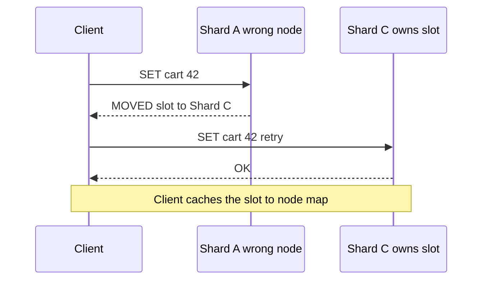
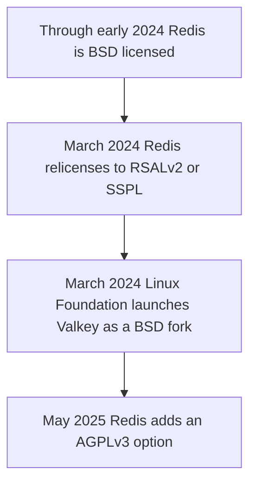

# Lecture 2 — Engines, Redis Cluster, and the Licensing Saga

> **Duration:** ~2 hours of reading + hands-on.
> **Outcome:** You can compare Redis, Memcached, and Dragonfly by their architectures and pick the right one; explain Redis Cluster's 16384 hash slots, hash tags, and `MOVED`/`ASK` redirection; choose a deployment topology (standalone/Sentinel/Cluster) and reason about its consistency cost; and state the Redis licensing saga and what it changed.

Lecture 1 gave you the patterns and the stampede. This lecture is about the *things that run the cache* — the engines and their topologies — because the pattern is portable but the operational behavior is not. A look-aside cache on standalone Redis, on a 3-shard Redis Cluster, and on Dragonfly behave very differently under failure, under multi-key operations, and at scale, and you must choose deliberately.

The sentence to carry through:

> **Redis, Memcached, and Dragonfly all speak roughly the same protocol, so the *pattern* code barely changes between them — what changes is the architecture underneath: how it uses cores, how it shards, how it fails over, and what license it ships under.**

---

## 1. The three engines

### 1.1 Redis — the single-threaded event loop with rich types

Redis is the default for a reason: it's an in-memory data-structure server. Beyond `GET`/`SET` strings it gives you hashes, lists, sorted sets (the backbone of leaderboards and rate limiters), sets, streams, HyperLogLog, bitmaps, and geospatial indexes. It has optional persistence (RDB snapshots and the AOF append-only log), replication, Sentinel for HA, and Cluster for sharding. For the `cart` cache, its hashes and sorted sets are genuinely useful (a cart is naturally a hash of item→quantity).

The defining architectural fact: **the Redis command-execution core is single-threaded.** One thread processes commands one at a time off an event loop. This is a feature *and* a ceiling:

- **The feature:** every command is atomic with respect to every other (no locks, no data races in your data model), and the model is dead simple to reason about. `INCR` is atomic, `SETNX` is atomic, a `MULTI/EXEC` transaction runs without interleaving.
- **The ceiling:** a single Redis instance uses *one CPU core* for command execution, no matter how many cores the box has. (Recent Redis offloads I/O to extra threads, but command execution is still serial.) So a single Redis maxes out at the throughput of one core — typically a few hundred thousand ops/sec — and to go faster you must *shard* (Redis Cluster) across many instances, each on its own core.

This single-core ceiling is the exact gap Dragonfly was built to close.

### 1.2 Memcached — the simple, multi-threaded slab cache

Memcached is older, simpler, and deliberately narrow: a multi-threaded, pure key→blob cache with **LRU eviction and no persistence**. No data structures, no replication, no cluster protocol (sharding is client-side by consistent hashing). What it has:

- **Multi-threading:** Memcached uses multiple worker threads, so a single instance scales across cores for the plain get/set-a-blob workload where Redis (single-core) would bottleneck.
- **The slab allocator:** memory is carved into fixed-size *slab classes* (e.g., 64B, 128B, 256B…). An item goes into the smallest class that fits. This nearly eliminates external fragmentation and makes memory behavior predictable — but wastes the slack within a class (a 70-byte item in a 128-byte slab wastes 58 bytes), and a workload whose item sizes don't match the slab classes can suffer "slab calcification."

Memcached's pitch: for a pure "cache opaque blobs by key, evict by LRU, no persistence needed" workload, it's simple, multi-threaded, and very fast, with a small predictable memory model. Its limits are the flip side: no data structures (you serialize everything to a blob), no persistence (a restart is a cold cache), no built-in replication. Choose Memcached when you want exactly a fast volatile blob cache and nothing more; choose Redis when you want data structures, persistence, or replication.

One Memcached failure mode worth naming because it surprises people: **slab calcification**. Memory is assigned to slab classes *as items arrive*, and historically a class, once grown, didn't easily give memory back to another class. So if your workload starts with many small items (filling the 128-byte class) and later shifts to large items (needing the 1-KB class), the large class can be starved even though the small class holds memory it no longer needs — and you get evictions in one class while another sits half-empty. Modern Memcached mitigates this (slab rebalancing / automatic page reassignment), but the lesson stands: Memcached's predictable slab model is predictable *until your item-size distribution shifts*, and then you must understand slabs to diagnose "why am I evicting when I have free memory." It's the flip side of the "simple and predictable" pitch.

### 1.3 Dragonfly — the multi-threaded, shared-nothing Redis

**Dragonfly** is a from-scratch in-memory store, wire-compatible with both the **Redis and Memcached protocols**, built to fix Redis's single-core ceiling. Its core architectural bet is **shared-nothing multi-threading**: the keyspace is partitioned across threads, each thread *exclusively owns* its slice of keys, and there are no shared locks on the hot path. A command is routed to the thread that owns its key and runs there. The result: a single Dragonfly process scales *vertically* across all the cores on a big box — one Dragonfly on a 32-core machine can do what would otherwise need a 32-instance Redis Cluster.

What this buys you:

- **Vertical scale without sharding.** Where Redis says "one core per instance, shard to grow," Dragonfly says "use the whole box." For many workloads this means *no cluster at all* — one Dragonfly instance replaces a multi-node Redis Cluster, eliminating the cluster's operational complexity (hash slots, resharding, multi-key constraints).
- **High memory efficiency** and a snapshotting design that doesn't fork-and-double-memory the way Redis's RDB snapshot can under write load.
- **Drop-in protocol compatibility:** your `redis` client library, your `GET`/`SET`/`INCR`, your sorted-set leaderboard code — all of it works against Dragonfly unchanged. That's what makes the migration this week a *benchmark*, not a rewrite.

The trade-offs to be honest about: Dragonfly is younger than Redis, its ecosystem (modules, managed offerings, battle-tested operational runbooks) is smaller, and shared-nothing multi-threading changes the atomicity story for *multi-key* operations that span threads (it handles them, but the mechanics differ from Redis's single global lock). For the single-key-dominated cache workload of this week, none of that bites; for an exotic multi-key Lua-script-heavy workload, test carefully.

### 1.4 The engine decision

| | Redis | Memcached | Dragonfly |
|---|---|---|---|
| **Threading** | Single-threaded core (I/O threads aside) | Multi-threaded | Multi-threaded, shared-nothing |
| **Data types** | Rich (hashes, sorted sets, streams…) | Blobs only | Redis-compatible rich types |
| **Persistence** | RDB + AOF | None | Snapshots |
| **Replication / HA** | Replicas + Sentinel | None (client-side) | Replicas |
| **Sharding** | Redis Cluster (16384 slots) | Client-side hashing | Often unneeded (vertical scale) |
| **Scale story** | Shard across instances | Add threads/nodes | Use all cores on one box |
| **License (2026)** | RSALv2/SSPL or AGPLv3 | BSD | BSL-1.1 → Apache 2.0 |
| **Pick it when** | You want data structures + ecosystem | Pure fast volatile blob cache | Vertical scale, want to avoid a cluster |

For C22's `cart` cache: start on Redis (or Valkey) for the data structures and the familiar operational model; benchmark Dragonfly to see whether one vertically-scaled instance beats a Redis Cluster on your workload. The migration is a config change and a benchmark, which is exactly the homework.

A compact "when each genuinely wins" to keep in your head:

- **Redis / Valkey wins when** you need the rich data structures (sorted sets for leaderboards and sliding-window rate limiters, streams, geo), the mature ecosystem (modules, managed offerings, a decade of runbooks), or you're already operating it well and the single-core ceiling isn't binding. Valkey specifically wins when a license policy demands permissive OSS.
- **Memcached wins when** the workload is *exactly* "cache opaque blobs by key, LRU-evict, no persistence" and you value the simplicity and the predictable slab memory — a classic fronting-a-database read cache with uniform-ish item sizes and no need for structures or durability.
- **Dragonfly wins when** the single-core ceiling *is* binding and you'd otherwise run a Redis Cluster purely for throughput — Dragonfly's vertical scale can replace the cluster with one box, deleting the hash-tag/resharding/CROSSSLOT complexity, at the cost of a younger ecosystem. Its license (BSL→Apache) is clean for most uses.

None of these is "the best cache." Each is the best cache *for a workload shape*, and naming the shape is the skill.

---

## 2. Redis Cluster: how sharding actually works

When one Redis instance's single core isn't enough and you stay on Redis (rather than switching to Dragonfly's vertical scale), you shard with **Redis Cluster**. The mechanism is worth understanding precisely because its constraints — especially around multi-key operations — leak into your application design.

### 2.1 The 16384 hash slots

Redis Cluster does not hash keys directly onto nodes. Instead it defines a fixed space of **16384 hash slots**, and every key maps to a slot by:

```
slot = CRC16(key) mod 16384
```

The 16384 slots are then *distributed across the shards*. A 3-shard cluster might own slots 0–5460, 5461–10922, 10923–16383. To find which node holds a key: hash the key to a slot, look up which node owns that slot.

```
key "cart:42"  -> CRC16("cart:42") mod 16384 = (say) slot 9001
                  slot 9001 is owned by shard B (slots 5461-10922)
                  -> the key lives on shard B
```

**Why a slot layer instead of hashing keys straight to nodes?** Because the slot layer *decouples the key→slot mapping (fixed forever) from the slot→node mapping (changeable)*. To reshard — add a node, rebalance load — you move *slots* (and the keys in them) between nodes; the `CRC16(key) mod 16384` part never changes. Resharding is "move slot ranges," an online operation, not "rehash the world."

Why 16384 and not, say, a power of two like 65536? It's a deliberate trade: the cluster gossip protocol exchanges a bitmap of which slots each node owns, and 16384 bits is 2 KB per heartbeat — small enough to gossip cheaply, large enough to spread keys finely across a realistic number of nodes (you'll never have more than a few thousand). It's an engineering compromise, documented as such.

### 2.2 The multi-key problem and hash tags

Here's the constraint that leaks into your code: **a multi-key operation (`MGET`, `MSET`, a transaction, a Lua script touching several keys) only works if all the keys are in the same slot.** Otherwise Redis Cluster returns a `CROSSSLOT` error — it can't atomically operate across shards. By default, related keys (`cart:42`, `wishlist:42`, `recent:42`) hash to *different* slots, so you can't `MGET` them in one call.

The fix is **hash tags**: if a key contains a substring in `{...}`, *only that substring is hashed*. So you deliberately co-locate related keys:

```
KEYS WITHOUT a hash tag (scatter across slots):
  cart:42      -> CRC16("cart:42")     mod 16384 -> slot X
  wishlist:42  -> CRC16("wishlist:42") mod 16384 -> slot Y (different!)
  -> MGET cart:42 wishlist:42  ->  CROSSSLOT error

KEYS WITH a hash tag {42} (same slot, because only "42" is hashed):
  {42}:cart      -> CRC16("42") mod 16384 -> slot Z
  {42}:wishlist  -> CRC16("42") mod 16384 -> slot Z (SAME!)
  -> MGET {42}:cart {42}:wishlist  ->  works; both on slot Z
```

The design lesson: in a sharded cache, **keys that must be operated on together must be hash-tagged together**, and you choose the tag (usually a tenant/user/cart id) at schema-design time. Get it wrong and you discover at scale that your multi-key reads error out across shards. The exercise has you compute slots and prove the hash-tag co-location.

### 2.3 MOVED, ASK, and the smart client

When a client sends a key to the wrong node (it guessed, or the cluster resharded), the node replies with a redirection:

- **`MOVED <slot> <node>`** — "this slot permanently lives on that node; update your slot map and go there." A cluster-aware client caches the slot→node map and retries against the right node; it also refreshes its whole map on a `MOVED` because the topology changed.
- **`ASK <slot> <node>`** — "this slot is *currently migrating*; for *this one request*, ask the target node (with an `ASKING` prefix), but don't update your map — the slot isn't fully moved yet." `ASK` is the transient redirection during a live reshard.

A "smart" cluster client (`redis-cli -c`, or any cluster-mode library) handles all of this for you: it learns the slot map, routes each key to its owner, follows `MOVED`/`ASK`, and refreshes on topology change. The reason to understand it anyway: when a multi-key op fails with `CROSSSLOT`, or latency spikes during a reshard (lots of `ASK` redirections), you need to know what the client is doing under you.


*A client hits the wrong shard, follows the MOVED redirect, and remembers the correct node next time.*

### 2.4 Watching it happen: a reshard walkthrough

The mechanics become concrete when you watch a key follow a redirection. On a 3-shard cluster:

```bash
# Which slot does cart:42 hash to, and which node owns it right now?
redis-cli -c CLUSTER KEYSLOT cart:42          # -> 15749 (the slot)
redis-cli -c CLUSTER NODES | grep master      # which node owns slots 10923-16383?

# Without -c, hitting the WRONG node returns a MOVED redirection you can see:
redis-cli -h shard-A SET cart:42 hello
# (error) MOVED 15749 10.0.0.30:6379          <-- "that slot lives on shard C"

# With -c, the client follows the MOVED transparently:
redis-cli -c -h shard-A SET cart:42 hello     # -> OK (client went to shard C for you)

# Now RESHARD: move 1000 slots from shard C to a new shard D, online, live:
redis-cli --cluster reshard 10.0.0.10:6379 \
  --cluster-from <shard-C-id> --cluster-to <shard-D-id> \
  --cluster-slots 1000 --cluster-yes
# During the move, keys in migrating slots return ASK (one-shot redirect to D);
# after the move, they return MOVED (permanent). No key is lost; the client follows.
```

The point to internalize: **resharding moves slot ranges while the cluster serves traffic.** A migrating slot returns `ASK` for its in-flight keys (the client asks the target *this once*) and flips to `MOVED` once the move completes (the client updates its map). The 16384-slot indirection (§2.1) is precisely what makes this online — you never rehash a key, you only re-home a slot.

The cost this imposes on *your* design: every multi-key operation and every transaction must keep its keys in one slot (hence hash tags, §2.2), or it breaks the moment those keys land on different shards. Sharding isn't free; it's throughput bought with a constraint on your key schema. This is exactly the operational complexity Dragonfly's vertical-scale model lets you skip — one of the strongest practical arguments in its favor when the only reason you'd shard is raw throughput.

---

## 3. Topology and the consistency cost

Three deployment shapes, in increasing capability and cost:

### 3.1 Standalone

One Redis (or Dragonfly) instance. Simple, fast, no failover — if it dies, the cache is gone until you restart it (and the data is gone unless you persist). For a cache, "the data is gone" is usually survivable: a cold cache means a burst of misses to the store (a stampede across all keys — see §3.4 of Lecture 1), but no data *loss* in the source-of-truth sense. Standalone is fine for a cache you can afford to lose and rebuild, which is most caches — *if* you've ensured the cache is optional and the store can survive the cold-start herd.

### 3.2 Sentinel — HA without sharding

**Redis Sentinel** is a separate set of processes that *monitor* a primary and its replicas, detect a primary failure, and *promote a replica* automatically, then tell clients about the new primary. It gives you high availability (automatic failover) without sharding — one logical primary, replicated, that survives a node death. Use Sentinel when the cache must stay *up* across a node failure but fits on one node's worth of memory and one core's worth of throughput.

A minimal Sentinel config and the client wiring that goes with it:

```ini
# sentinel.conf — monitor a primary named "cartcache"; 2 Sentinels must agree
# (quorum) that it's down before failing over.
sentinel monitor cartcache 10.0.0.10 6379 2
sentinel down-after-milliseconds cartcache 5000   # 5s of no response = subjectively down
sentinel failover-timeout cartcache 60000
```

```python
# The client connects to the SENTINELS, not directly to the primary, and asks
# them who the current primary is. After a failover, the Sentinels hand the
# client the NEW primary's address — the client doesn't hard-code an IP.
from redis.sentinel import Sentinel
sentinel = Sentinel([("sentinel-1", 26379), ("sentinel-2", 26379),
                     ("sentinel-3", 26379)], socket_timeout=0.5)
primary = sentinel.master_for("cartcache", socket_timeout=0.5)   # current primary
primary.set("cart:42", "...")                                     # follows failover
```

The key operational property: the client discovers the primary *through* the Sentinels, so a failover is transparent — the app reconnects to the promoted replica without a config change or a redeploy. (Three Sentinels with a quorum of two is the standard layout, so a single Sentinel failure can't trigger or block a failover by itself.)

### 3.3 Cluster — sharding (and HA per shard)

**Redis Cluster** (the 16384-slot machinery of §2) shards the keyspace across multiple primaries, each with its own replicas for per-shard failover. Use Cluster when the data or the throughput exceeds one node — and accept the multi-key constraints (hash tags) that sharding imposes. Note the tradeoff with Dragonfly: where Redis says "shard with Cluster," Dragonfly often says "scale up one instance across cores," trading the cluster's operational complexity for a bigger box.

### 3.4 The consistency cost: asynchronous replication and the lost-write window

Here is the distributed-systems point that ties this week back to Phase 1. **Redis replication is asynchronous.** A write is acknowledged to the client as soon as the primary applies it — *before* it has reached the replicas. So there is a window where the primary has a write the replicas don't. If the primary fails in that window and a replica is promoted (by Sentinel or Cluster), **the un-replicated writes are lost.** This is the CAP/PACELC reality from Week 1, made concrete: Redis failover chooses availability over consistency, and the price is a lost-write window on failover.

```
   primary: SET cart:42 v8   -> ACK to client (write "succeeded")
            ... not yet replicated ...
   primary CRASHES
   Sentinel promotes a replica that only has v7
   -> the v8 write is LOST. A reader now sees v7. The client thinks v8 stuck.
```

For a **cache**, this is usually acceptable — a lost cached write just means a stale or missing key, which the source of truth (Postgres) heals on the next miss-and-reload. The cache losing v8 is fine *because* the cache is not the source of truth; v8 is safe in Postgres, and the next read repopulates. **This is exactly why you never write-back the source of truth to a cache** (Lecture 1 §1.4): if the cache *were* authoritative for that write, the async-replication lost-write window would lose real data. The cache's weak consistency is tolerable precisely because it's a *copy*. Internalize this: the topology choice (standalone/Sentinel/Cluster) and the replication model determine *how lossy and how stale* your cache can be under failure, and the whole reason that's acceptable is that the cache is never the truth. (aphyr's classic "Call me maybe: Redis" Jepsen analysis is the canonical deep-dive on exactly this failover behavior — read it to see the lost-write window measured.)

There is a knob — `WAIT` — that lets a client block until a write reaches N replicas:

```bash
# Block until this write is acknowledged by at least 1 replica, or 100ms passes.
redis-cli SET cart:42 v8
redis-cli WAIT 1 100
# returns the number of replicas that acked. If it returns 0, the write is NOT
# yet replicated -> still in the lost-write window.
```

But `WAIT` is not a true synchronous-replication guarantee (it's a best-effort barrier, and a failover can still lose a write that `WAIT` reported as replicated under certain partition timings), and it adds latency to every write you apply it to — which defeats much of the point of a cache. The pragmatic stance: for a cache, *don't* fight the async model with `WAIT`; accept the lost-write window, lean on the source of truth to heal it, and reserve strong-consistency machinery for the database tier where it belongs. If you find yourself wanting `WAIT` on every cache write, that's a signal you're treating the cache as a database — step back and ask why the data isn't in Postgres.

This connects straight back to Phase 1: a cache is an **AP** component in CAP terms (it stays available and serves possibly-stale data under partition), and that's the *correct* choice for a cache, because the **CP** component — the one that must not lose or contradict a write — is your Postgres source of truth. Putting the right consistency model on each tier is the whole architectural point: strong where it must be (the database), eventually-consistent-and-fast where it can be (the cache).

---

## 4. Eviction, memory, and persistence — the operational knobs

Before the licensing saga, three operational properties decide whether a cache behaves well under pressure: how it evicts when full, how it uses memory, and whether it persists. These are where "I set up a cache" becomes "I run a cache that survives Black Friday."

### 4.1 Eviction policies: what to throw away when memory fills

A cache has bounded memory. When it fills, it must *evict* something to make room. Redis exposes this as `maxmemory` plus a `maxmemory-policy`:

- **`noeviction`** — refuse writes when full (return an error). Correct for a *data store*, dangerous for a *cache*: a full cache that rejects writes stops caching, and your hit rate craters. Only use this if Redis is being used as a database, not a cache.
- **`allkeys-lru`** — evict the least-recently-used key across all keys. The classic cache policy: keep what's hot, drop what's cold. The sensible default for a pure cache.
- **`allkeys-lfu`** — evict the least-*frequently*-used key (approximated). Better than LRU when a key is accessed in bursts then idle — LFU keeps the genuinely popular keys over the recently-but-rarely touched ones. Often the best choice for a read cache with a stable hot set.
- **`volatile-lru` / `volatile-ttl`** — evict only among keys that have a TTL set, by LRU or by nearest expiry. Useful when you mix "cache" keys (with TTLs, evictable) and "must-keep" keys (no TTL) in one instance — though mixing those concerns in one instance is itself a smell.

```bash
# Configure Redis as a proper cache: cap memory, evict the least-frequently-used.
redis-cli CONFIG SET maxmemory 2gb
redis-cli CONFIG SET maxmemory-policy allkeys-lfu
# Watch evictions — a rising evicted_keys is the signal you're memory-bound:
redis-cli INFO stats | grep evicted_keys
```

The operational lesson: **pick `allkeys-lru` or `allkeys-lfu` for a cache, and watch `evicted_keys`.** A cache that's evicting heavily is undersized — it's churning hot keys out before they're reused, so your hit rate and your database-load-relief both suffer. The fix is more memory (or fewer/smaller cached values), and the *symptom* is in `INFO stats`. Memcached's model is simpler — it's LRU within each slab class — but the same principle holds: eviction pressure means undersized.

### 4.2 Memory: the slab model vs the allocator

Memcached's slab allocator (Lecture §1.2) trades internal fragmentation (wasted slack within a slab class) for predictable, fragmentation-free memory. Redis uses a general-purpose allocator (jemalloc by default), which packs varied value sizes more tightly but can suffer fragmentation over time (the `mem_fragmentation_ratio` in `INFO memory` tells you how much — a ratio well above 1.0 means the OS has handed Redis more memory than it's logically using). Dragonfly's design emphasizes high memory efficiency and avoids the fork-and-double-memory spike that Redis's snapshotting can cause under write load (next section). For sizing: **measure the working set, add headroom for fragmentation and replication buffers, and watch the fragmentation ratio** — a cache that quietly bloats to twice its working set will hit `maxmemory` and start evicting hot keys when you least expect it.

### 4.3 Persistence: RDB, AOF, and "is a cache even supposed to persist?"

Redis can persist — **RDB** (periodic point-in-time snapshots, compact, fast to load, but loses writes since the last snapshot) and **AOF** (an append-only log of every write, more durable, larger, slower to replay). For a *cache*, persistence is usually optional and sometimes undesirable: the whole point of a cache is that it's a rebuildable copy, so losing it on restart is survivable (a cold start, with the cold-cache stampede risk from Lecture 1 §3.1). You might enable RDB for *faster warm starts* (a restarted cache loads its snapshot instead of cold-missing every key) while accepting that the snapshot is slightly stale — the source of truth heals it.

The trap: Redis's RDB snapshot uses `fork()`, and on a write-heavy instance the copy-on-write pages mean the snapshot can transiently *double* memory usage. A cache sized to fill its box, with RDB enabled, can OOM *during the snapshot*. The fixes: leave headroom, use AOF instead (no fork-doubling), or use Dragonfly (whose snapshotting avoids the fork-and-double). The lesson that matters for a cache: **persistence is a warm-start optimization, not a durability requirement — the source of truth is the durability requirement — so enable it deliberately, sized for the snapshot's memory spike, or not at all.**

This is the same theme as Lecture 1's "the cache is a copy": you persist a cache for *speed of recovery*, never because the cache is the truth. If losing the cache would lose data, you've built a database with a cache's durability guarantees, which is the write-back footgun (Lecture 1 §1.4) wearing a different hat.

---

## 5. The licensing saga (and why an open-source course cares)

C22 is open-source-first, so the 2024–2025 Redis license upheaval is not trivia — it directly shapes which cache you'd choose for an OSS-committed platform.

**The timeline:**

- **Through early 2024:** Redis was BSD-licensed — permissively open source, the default everyone reached for.
- **March 2024:** Redis Inc. relicensed Redis (the community server) from BSD to a **dual RSALv2 / SSPL** model — *source-available*, not OSI-open-source. The motivation was to prevent cloud providers from offering managed Redis without contributing back. The effect: Redis was no longer "open source" in the OSI sense, which broke the assumption a lot of infrastructure was built on.
- **March 2024 (days later):** the **Linux Foundation launched Valkey**, a fork of the last BSD Redis, backed by AWS, Google, Oracle, and others. Valkey is **BSD-licensed** — the drop-in, genuinely-open-source continuation of Redis. Major distros and cloud providers moved their "Redis" offerings to Valkey.
- **May 2025:** Redis Inc. **added an AGPLv3 option** for Redis 8+, returning a copyleft-open-source license to the mix (alongside the source-available ones) — a partial walk-back in response to the community split.


*The Redis licensing saga: one relicensing event forked the ecosystem and forced a partial walk-back.*

**What this means operationally, in 2026:**

- **Valkey** is the licenses-clean, BSD, drop-in OSS Redis. If your constraint is "must be permissively open source," Valkey is the answer, and it's protocol- and command-compatible — your code doesn't change.
- **Dragonfly** is BSL-1.1 (source-available now, converting to Apache 2.0 after a delay) — a different architectural bet *and* a different license; clean for most uses, but read the BSL terms for your case.
- **Redis community** is now AGPLv3 *or* the source-available licenses — fine for many uses, but AGPL's copyleft and SSPL's terms are exactly the kind of license clause a platform team must check before adopting.

A practical checklist for the license decision, because "is it open source?" is no longer a yes/no for the Redis ecosystem:

- **Are you redistributing the cache binary or offering it as a service?** If so, SSPL/AGPL terms bite hardest — read them with legal.
- **Does your org policy require OSI-approved or permissive licenses?** Then Valkey (BSD) is the clean Redis-compatible answer.
- **Is the cache purely internal infrastructure you operate for your own app?** Then most of these licenses are fine in practice — but document the choice so a future audit isn't a surprise.

The reason a *caching* lecture spends this much on licenses: caches are everywhere, "just use Redis" was the reflex for a decade, and that reflex now silently picks a source-available license. An open-source-first platform that didn't notice the 2024 change can find itself shipping under terms it never chose. Noticing is the senior move.

The senior takeaway, and the one this course holds: **the protocol is commoditized; the license is the decision.** Redis, Valkey, and Dragonfly are wire-compatible enough that the *engineering* choice (single-core-shard vs vertical-scale, data structures vs blobs) and the *license* choice (BSD vs source-available vs AGPL) are separable — and for an open-source-first platform, the license is often the deciding constraint. Know the landscape so the choice is deliberate, not a default you inherited from a tutorial written before March 2024.

---

## 6. A worked engine decision

Abstract comparisons are easy; the homework asks you to *decide*, so let's walk a decision the way you'd walk it at a design review, with the cart workload as the case.

**The workload.** The cart read path serves, say, 200k reads/sec at peak with a 95% hit rate, values around 1–2 KB (a cart serialized to JSON), a working set of a few GB, and a clear hot set (popular carts and trending items). There's some structure (a cart is naturally a hash), but nothing exotic — no heavy Lua, no giant sorted sets.

**Walking the options:**

- **One Redis (or Valkey) instance.** 200k reads/sec is near the ceiling of a single Redis core. You'd be running hot, with no headroom for spikes, and any CPU-heavy command (a big `KEYS`, a slow Lua) would stall the single thread and spike p99 for *everyone*. Verdict: feasible but tight; you're one bad command from a latency incident.
- **Redis Cluster (3+ shards).** Sharding spreads the 200k across cores/nodes, each shard on its own thread. This works and is the battle-tested path — *but* it imposes the multi-key constraint (hash-tag the cart's related keys), the resharding operation when you grow, and the `CROSSSLOT` errors you'll hit if you forget a tag. You're buying throughput with operational complexity.
- **One Dragonfly instance on a multi-core box.** Dragonfly's shared-nothing threading uses all the cores on one machine, so 200k reads/sec is comfortable on a single instance — no cluster, no hash tags, no resharding, no `CROSSSLOT`. You trade Redis's larger ecosystem and longer track record for a simpler topology that scales vertically. For *this* workload (single-key-dominated, no exotic commands), the trade is attractive.

**The decision, stated honestly:** for a single-key-dominated cart cache at this scale, *Dragonfly on a big box* removes the Redis Cluster's whole complexity surface, and *Valkey* is the answer if a license policy demands permissive OSS and the scale fits a shard topology you're willing to operate. There is no universally right answer — there's the answer that fits *this* workload's scale, command mix, operational appetite, and license constraint. The homework's memo is exactly this decision, made for a named org, with *your* benchmark numbers instead of my illustrative ones.

The meta-lesson: **the engine decision is a multi-axis trade — throughput, command mix, operational complexity, ecosystem maturity, and license — and a senior engineer names all five axes and weights them for the specific case, rather than reaching for "Redis, obviously" by reflex.** That reflex was right for a decade; the 2024 license change and Dragonfly's architecture made it a real decision again.

---

## 7. Recap

You should now be able to:

- Compare Redis (single-threaded core, rich types, shard-to-scale), Memcached (multi-threaded, slab-allocated blob cache, no persistence), and Dragonfly (shared-nothing multi-threaded, vertical scale, Redis-compatible) and pick the right one.
- Explain Redis Cluster's 16384 hash slots, `CRC16(key) mod 16384`, the slot→node decoupling that makes resharding online, and why 16384 is the gossip-vs-granularity compromise.
- Use **hash tags** (`{...}`) to co-locate keys that must be operated on together, and explain the `CROSSSLOT` error and `MOVED`/`ASK` redirection.
- Choose standalone / Sentinel / Cluster for a workload and reason about the **asynchronous-replication lost-write window** on failover — and why a cache tolerates it precisely because it's a copy, not the truth.
- State the Redis licensing saga (BSD → RSALv2/SSPL → Valkey fork → AGPL option) and choose Valkey or Dragonfly for an open-source-first platform.

Next: the exercises put all of this on your cart topology — look-aside with coalescing, a stampede you induce and fix, and the cluster-slot mechanics. Continue to [the exercises](../exercises/README.md).

---

## References

- *Redis — Cluster specification (hash slots, redirection)*: <https://redis.io/docs/latest/operate/oss_and_stack/reference/cluster-spec/>
- *Dragonfly — Architecture*: <https://www.dragonflydb.io/docs/managing-dragonfly/architecture>
- *Memcached — Wiki (slab allocation, threading)*: <https://github.com/memcached/memcached/wiki>
- *Redis — "Dual source-available licensing" (2024)*: <https://redis.io/blog/redis-adopts-dual-source-available-licensing/>
- *Valkey — Documentation*: <https://valkey.io/docs/>
- *aphyr — Call me maybe: Redis (failover consistency)*: <https://aphyr.com/posts/283-jepsen-redis>
