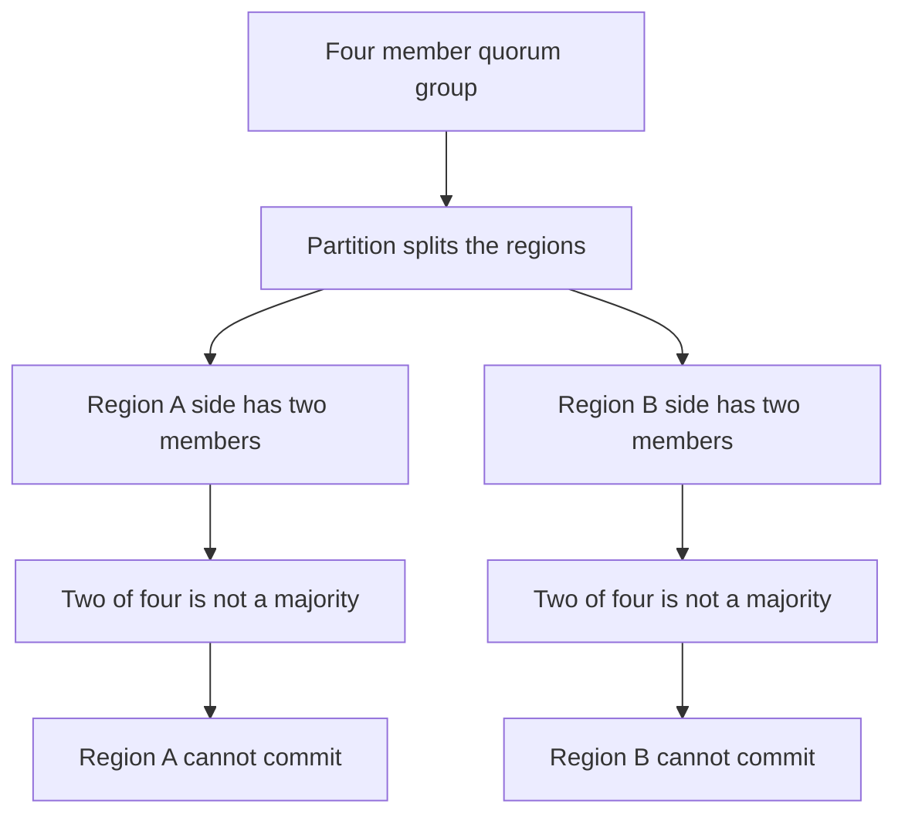
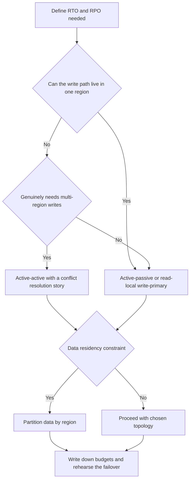

# Lecture 1 — Active-Active, Active-Passive, and the RTO/RPO Budget

> **Duration:** ~2 hours of reading + hands-on.
> **Outcome:** You can distinguish active-active from active-passive by what each costs and protects against; define RTO and RPO and connect them to synchronous vs asynchronous replication; reason about why quorum across regions costs a round-trip and why an even region count is a split-brain trap; and state, for a given workload, which topology you'd choose and why.

If you remember one sentence from this lecture, remember this one:

> **A second region does not double your reliability — it doubles your write-coordination problem, and the only way to reason about it is to denominate every choice in two budgets: RTO (how long down) and RPO (how much data lost).**

For eighteen weeks the system had one home. One region means one source of truth: the latest value lives in exactly one place, the write path never leaves a single failure domain, and "what is the current state" has an unambiguous answer. This week you give that up, and in giving it up you inherit the speed of light, the partition between your regions, and the oldest question in the field made operational. The skill that makes you dangerous with multi-region is not standing up a second cluster — that's the easy part. It's being able to say, with numbers, *which* topology a workload needs and *what* it costs.

---

## 1. The two topologies

### 1.1 Active-passive

In **active-passive**, one region is the **active** region — it serves all traffic and accepts all writes — and one or more **passive** regions stand by, kept up to date by replication, ready to take over if the active region fails.

```
        ACTIVE-PASSIVE
   ┌─────────────────┐         ┌─────────────────┐
   │   region A      │  async  │   region B      │
   │   (ACTIVE)      │ ──────> │   (PASSIVE)      │
   │  reads + writes │  repl.  │  replica, idle  │
   │  PRIMARY DB     │         │  standby DB      │
   └─────────────────┘         └─────────────────┘
         all traffic                  waiting
```

What it buys:

- **Simplicity.** There is exactly one write path, exactly one source of truth, and no conflict to resolve — because only one region ever accepts a write. The passive region is a copy that follows. Everything you know about a single-region system stays true *until* the failover.
- **A real DR posture.** If the active region dies, you promote the passive one and continue. You have survived a region loss.

What it costs:

- **Idle capacity.** The passive region's compute is mostly doing nothing but consuming replication — you pay for a standby you hope never to use. (Mitigations exist: serve *reads* from the passive region's replica, run it smaller and scale on failover — but the write path is idle by design.)
- **A failover step.** Taking over is not instantaneous. Someone or something must *detect* the failure, *promote* the replica to primary, *fence* the old primary, and *redirect* traffic. That sequence is your RTO, and it is never zero.
- **The data lost in the gap.** If replication was asynchronous (it usually is — see §3), the passive region is slightly behind. The writes that hadn't replicated when the active region died are lost. That gap is your RPO.

### 1.2 Active-active

In **active-active**, *multiple* regions serve traffic and accept writes *at the same time*. There is no idle standby; every region is doing real work.

```
        ACTIVE-ACTIVE
   ┌─────────────────┐  bidirectional  ┌─────────────────┐
   │   region A      │  replication +  │   region B      │
   │   (ACTIVE)      │ <─────────────> │   (ACTIVE)       │
   │  reads + writes │  CONFLICT?      │  reads + writes  │
   └─────────────────┘                 └─────────────────┘
       half the users                      half the users
```

What it buys:

- **Capacity and locality.** Every region serves its local users with local latency, and the total write capacity is the sum of all regions, not one region's worth.
- **A lower write-side RTO.** When a region dies, the *other* region was already accepting writes — there's no "promote a passive primary" step for the write path. The surviving region just keeps going for everyone.

What it costs — and this is the whole reason active-active is hard:

- **The conflict problem.** If region A and region B both accept a write to the *same* data at the *same* time, they will disagree. Now you must *resolve* that conflict, and the naive resolution — **last-write-wins (LWW)** — silently throws away one of the two writes. Two users incremented the same counter; LWW keeps one increment and loses the other. Active-active turns "store the write" into "store the write *and* have a correct answer for what happens when two regions wrote conflicting values." That problem is exactly what Week 3's CRDT theory exists to solve, and exactly what Week 20 makes you do in production.

> **The honest framing.** Active-passive is a *replication* problem; active-active is a *consensus-or-convergence* problem. The architecture slide makes active-active look like "active-passive but both sides are useful," and that framing is a trap: the moment two regions both accept writes, you own a distributed-disagreement problem that active-passive never has. Choose active-active because you *need* its locality/capacity and you've solved the conflict, not because it sounds stronger than active-passive.

### 1.3 The choice, stated as a decision

The decision is not "which is better" — it's "which does *this workload* need":

- Choose **active-passive** when: writes can tolerate living in one region; the workload is write-light or latency-tolerant on writes; you want the simplest correct system; or your data-residency constraints (§ Lecture 2) make multi-region writes legally messy. This is the right default for most systems most of the time.
- Choose **active-active** when: you genuinely need local write latency in multiple regions (a global user base where cross-region write latency is unacceptable); you need write capacity beyond one region; or you need to survive a region loss with *no* write-path RTO at all — **and** you have a conflict-resolution story (a CRDT, a partitioned key space, or single-writer-per-key) so that "both regions wrote" has a correct answer.

Most real systems are *partially* active-active: stateless services and read paths active everywhere, but the *write* path for any given piece of data pinned to one region (single-writer-per-key) so there's no conflict — with true active-active reserved for the specific fields where convergence is solved. The cart in your capstone is exactly this: active-active via a CRDT (Week 20), while inventory stays single-writer-per-SKU. Per-field, per-table reasoning — not a single global "we are active-active" — is the senior posture.

---

## 2. RTO and RPO: the two numbers that drive everything

Every multi-region decision reduces to two budgets. Learn them as a pair; they trade against each other and against cost.

### 2.1 RTO — Recovery Time Objective

**RTO is how long until service is restored after a failure.** It is a *time*. "Our RTO is 5 minutes" means: from the moment the active region fails, service is back within 5 minutes.

RTO is a sum of steps, and naming the steps is how you shrink it:

```
RTO = detect + decide + promote + fence + reroute + (DNS TTL)
       │        │        │        │       │          └─ clients cached the old record (Lecture 2)
       │        │        │        │       └─ flip traffic to the new primary
       │        │        │        └─ make the old primary unable to write (split-brain guard)
       │        │        └─ promote the replica to primary
       │        └─ human or automation decides to fail over
       └─ notice the active region is actually down (health checks)
```

The largest, sneakiest terms are usually **detect** (a flaky health check that takes a minute to declare death) and **DNS TTL** (clients keep hitting the dead region until their cached record expires — Lecture 2 §1.3). A "30-second RTO" plan with a 5-minute DNS TTL has an *effective* RTO of over 5 minutes for cached clients. The lab makes you measure the real, end-to-end RTO, not the optimistic database-promotion-only RTO.

### 2.2 RPO — Recovery Point Objective

**RPO is how much data you can afford to lose**, measured as the age of the last write that made it to the surviving region. It is also a *time* — but it means *data*. "Our RPO is 10 seconds" means: at failover, we may lose up to the last 10 seconds of writes.

The crucial identity:

> **Your RPO at failover equals your replication lag at the moment of failure.**

If the replica was 400 ms behind when the primary died, the 400 ms of writes that hadn't replicated are gone — that's your realized RPO, and the count of lost writes is exactly the writes in that window. This is why **you monitor replication lag continuously**: lag is not a performance metric, it is your *live RPO*. A replica that drifts to 30 seconds behind under load has silently raised your RPO to 30 seconds, and you find out at the worst possible time unless you're watching. Exercise 3 makes you measure the lost-write count and confirm it matches the lag — making the RPO=lag identity concrete.

### 2.3 The relationship, and the cost dimension

RTO and RPO are different axes, and a system has both:

- **RTO≈0, RPO≈0** is the dream and the most expensive thing in computing: instant takeover with zero data loss. It requires synchronous replication (for RPO) *and* an always-hot second region with automatic, fenced failover (for RTO). Active-active with synchronous cross-region commit approaches it — at enormous write-latency cost (§3).
- **RTO high, RPO low**: backup-and-restore. You lose almost no data (frequent backups) but take hours to restore. Fine for a system that can be down.
- **RTO low, RPO high**: warm standby with lazy async replication. Fast takeover, but you might lose a chunk of recent writes.

The third axis is **cost**: lower RTO and lower RPO both cost money (idle hot standby, synchronous replication's latency, more regions). The job is to pick the *highest* RTO and RPO your business can tolerate, because that's the *cheapest* correct system — not the lowest, which is the most expensive. "What RTO/RPO does this workload actually need" is a business question you answer with the product owner, and over-specifying it (demanding RPO=0 for data nobody would miss) is a classic, expensive mistake.

---

## 3. Replication: synchronous vs asynchronous, and why the speed of light decides

RTO and RPO are *objectives*; the replication mechanism is what makes them *achievable*. The single most important physical fact this week:

> **The speed of light puts a floor on cross-region latency: tens of milliseconds across a continent, 100+ milliseconds across an ocean — and a synchronous write pays that floor on every commit.**

### 3.1 Asynchronous replication

In **asynchronous** replication, the primary commits the write *locally* and acknowledges the client immediately, then ships the change to the replica afterward. The write is fast (no cross-region wait), but the replica is always slightly behind.

- **Write latency:** local (fast). The cross-region distance is *not* on the write path.
- **RPO:** = the replication lag (non-zero). The writes in flight when the primary dies are lost.
- **This is the default**, and correctly so, for most multi-region systems. You accept a small RPO to keep writes fast.

### 3.2 Synchronous replication

In **synchronous** replication, the primary does *not* acknowledge the client until the replica has confirmed it received (and possibly applied) the write. The replica can never be behind, so:

- **Write latency:** local + the cross-region round-trip. Every commit waits for the ocean. A 100 ms inter-region RTT means *every write* takes at least 100 ms longer.
- **RPO:** ≈0. The replica has the write before the client is told it succeeded, so nothing is lost at failover.
- **The trap:** synchronous *cross-region* replication is usually the wrong default. You bought RPO≈0 at the cost of crippling every write with an ocean of latency, and you *added* a failure mode — if the remote replica is unreachable, your primary either blocks (the write hangs) or degrades to async (silently dropping your RPO guarantee). Postgres's `synchronous_commit` levels (`remote_write` vs `remote_apply`) and `synchronous_standby_names` let you tune exactly how much you wait for; the stretch goal has you measure the latency hit so the tradeoff is a number, not a claim.

```
   ASYNC: client <- ack (local commit)  ... later ... ship to replica
          fast write, RPO = lag

   SYNC:  client <- ack (only after replica confirms across the ocean)
          slow write (+RTT), RPO ≈ 0
```

### 3.3 The design rule that follows

Because synchronous cross-region writes are so costly, the dominant production pattern is:

> **Keep the write path inside one region; replicate asynchronously to the others; accept a small RPO.**

This is **read-local/write-primary** (Lecture 2 §2): every region serves *reads* from its local async replica (fast, local), but *writes* go to the single primary region. You pay the cross-region latency only on writes (a minority of traffic for most systems), reads are always local, and your RPO is the (small, monitored) async lag. It's the pragmatic sweet spot, and it's what the lab builds. Active-active (Week 20) is what you reach for *only* when even cross-region write latency is unacceptable and you've solved conflict resolution.

### 3.4 A note on Postgres's `synchronous_commit` levels

It helps to see that "synchronous vs asynchronous" is not a binary but a dial, because Postgres exposes the dial directly via `synchronous_commit`. The levels, from cheapest/least-durable to most-durable/most-expensive:

| `synchronous_commit` | The primary waits for... | RPO at failover | Write cost |
|---|---|---|---|
| `off` | nothing (not even local flush) | up to a few hundred ms of *local* writes | lowest |
| `local` | the local WAL flush only | the async replication lag | low (no cross-region wait) |
| `remote_write` | the replica to *receive* the WAL | ≈0 if the replica's OS survives | local + cross-region RTT |
| `remote_apply` | the replica to *apply* the WAL (replica is queryable-consistent) | ≈0, fully | local + cross-region RTT + apply |

The two rows that matter for this week: **`local`** is the async-cross-region default (fast writes, RPO = lag), and **`remote_apply`** is the synchronous-cross-region option (RPO≈0, every write pays the ocean). The stretch goal has you flip between `local` and `remote_apply` and *measure the write-latency delta* — turning "synchronous is expensive" into a number on your own setup. The senior point: you don't have to choose globally; you can run most writes at `local` and elevate the few writes that genuinely need RPO≈0 to `remote_apply`, paying the cross-region cost only where the data demands it. Per-transaction durability tuning is a real, underused technique.

### 3.5 Why the speed of light is not negotiable

Engineers new to multi-region sometimes hope a faster network or a better database will make synchronous cross-region writes cheap. It won't, and it's worth being precise about why: the floor is **physics**, not engineering. Light travels ~300,000 km/s in vacuum and ~200,000 km/s in fiber. A round trip across a continent (say 4,000 km each way) is at minimum ~40 ms of pure propagation, before any processing, queueing, or routing — and transoceanic is 100+ ms. No database, no protocol, no amount of money moves that floor; it's the same constraint whether you're Google or a two-person startup. So a synchronous write that waits for a cross-region acknowledgment *cannot* be faster than that round-trip, ever. This is why the design rule (§3.3) is a rule and not a preference: you arrange your architecture so the speed-of-light tax lands on the *fewest, least-latency-sensitive* operations (cross-region writes in active-passive; or, in active-active, you avoid the synchronous round-trip entirely by using a CRDT that needs no coordination — Week 20). Fighting the speed of light is the most common, most expensive multi-region mistake; designing *around* it is the competence.

---

## 4. Quorum across regions

The third piece of theory: when your source of truth is a **consensus group** (Raft or Paxos — Week 2), spreading it across regions has specific, costly consequences.

### 4.1 Quorum costs a round-trip

A consensus group commits a write only when a **majority (quorum)** of its members acknowledge. If the members are in different regions, a commit must wait for a majority *across regions*, which means at least one inter-region round-trip on the commit path. So a globally-distributed consensus group (etcd, a CockroachDB range, a Spanner-style system) pays cross-region latency on writes — the same speed-of-light tax as synchronous replication, because quorum commit *is* a form of synchronous replication.

### 4.2 Even numbers are a split-brain trap

A consensus group needs an *odd* number of voting members so a majority always exists. Spread two regions evenly (2 + 2 = 4 members) and a partition between the regions leaves *neither* side with a majority (2 of 4 is not a majority), so *both* sides stall — or, worse, if misconfigured, both sides think they're authoritative and you get **split-brain**. The fixes:

- **Three regions** (or 3/5/7 members spread so no single region holds a majority alone): any single-region loss still leaves a majority among the survivors.
- **Two regions plus a witness/arbiter** in a third location: a tiny voting-only member that breaks ties. Two data regions, one cheap witness — a common, economical layout. The stretch goal has you add exactly this.


*Splitting a four-member quorum evenly across two regions leaves neither side with a majority.*

### 4.3 Why this matters even for read-local/write-primary

Even if you're *not* running a cross-region consensus group for your data, you almost certainly *are* running one for **coordination** — the thing that decides *which region is primary*. That decision (leader election, the failover trigger) is itself a consensus problem, and if you run the coordinator across two regions evenly, a partition can leave you unable to elect a new primary (no quorum) — so a region partition becomes an outage even though both regions are individually healthy. Patroni, etcd, and Consul all face this; the layout (odd members, no single region with a majority, or a witness) is how you make automated failover *safe* under partition rather than a split-brain generator. The challenge this week is what happens when you get the fencing wrong.

---

## 5. Putting it together: the decision, with numbers

You now have the full vocabulary. The decision procedure for a workload:

1. **What RTO and RPO does this data actually need?** (A business question. Over-specifying is expensive.)
2. **Can the write path live in one region?** If yes → active-passive (or read-local/write-primary), async replication, RPO = monitored lag, RTO = a measured failover. Simplest correct system.
3. **Does it genuinely need multi-region writes?** (Truly global write latency requirements, or write capacity beyond one region.) If yes → active-active — and now you owe a conflict-resolution story (CRDT / single-writer-per-key / partition-by-region). That's Week 20.
4. **Is there a data-residency constraint?** (Lecture 2.) If EU data must stay in the EU, that can *forbid* a naive active-active that replicates everywhere, forcing a partitioned layout. Geography becomes correctness, not latency.
5. **Write down the budgets and the layout**, then *measure* them in a drill. An RTO/RPO you didn't measure under load is a hope, not a number.


*The five-question decision procedure for choosing a multi-region topology.*

The recurring discipline: **multi-region is a set of tradeoffs you choose and write down, not a feature you turn on.** The team that "went multi-region" without a documented RTO/RPO budget and a *rehearsed* failover discovers at 3 a.m. that their standby was never actually replicating, or that their DNS TTL made the failover take ten minutes, or that two regions both took writes and silently lost data. The team that wrote the budget and ran the drill knows their numbers and trusts them. This week makes you the second team.

---

## 4b. Multi-region is CAP made operational

If Week 1's CAP/PACELC felt abstract, this week is where it becomes a Tuesday decision. The partition between your two regions is *the* "P" of CAP, and the moment it happens you are forced to choose:

- **Choose consistency (CP):** refuse writes in the minority region (or refuse them everywhere until quorum returns) so the data never diverges. This is what a cross-region quorum system (§4) does — it gives up availability in the partitioned region to preserve a single consistent state. Active-passive with a strict single primary is a CP-leaning choice: the side without the primary can't write.
- **Choose availability (AP):** let *both* regions keep accepting writes during the partition, accepting that they'll diverge and must reconcile on heal. This is what active-active does — and it's *only* safe if you have a convergent merge (a CRDT, Week 20), because otherwise reconciliation means data loss.

And PACELC adds the part this lecture has hammered: **else (no partition), you still trade Latency against Consistency.** Synchronous cross-region replication is the "C" choice (RPO≈0, high latency); async is the "L" choice (low latency, RPO=lag). So your two big decisions — sync-vs-async and active-passive-vs-active-active — are *exactly* the PACELC tradeoffs, made concrete and denominated in RTO/RPO/dollars.

The payoff of seeing it this way: **you cannot have all of consistency, availability, and partition-tolerance across regions — the partition *will* happen, and you must have decided in advance which of C or A you give up when it does.** A team that hasn't decided will decide *badly, under pressure, at 3 a.m.* — usually by accidentally choosing "availability" (both regions keep writing) without the convergent merge that makes it safe, and silently losing data. Deciding in advance, writing it in the runbook, and rehearsing it is how you turn CAP from a trivia answer into an operational guarantee.

## 4a. Common misconceptions, named and corrected

Before the decision procedure, a list of the beliefs that get teams into trouble — each is wrong, and naming them is half of avoiding them.

- **"A second region doubles our availability."**
  No. A second region adds a *new* failure mode (the partition between regions) and a *new* coordination problem (where writes go). It improves availability *only if* you've engineered the failover and the data story correctly. A badly-built two-region system is often *less* reliable than one good region, because it has more moving parts and a failover that's never been tested.

- **"Active-active means we never have downtime."**
  Only for the *write path*, and only if conflict resolution is solved. A region loss in active-active still loses any data that hadn't replicated (RPO), and a *correctness* bug in the merge (Week 20's LWW footgun) can lose data with no downtime at all.

- **"We'll just make replication synchronous so we never lose data."**
  Synchronous cross-region replication makes *every write* pay the cross-region round-trip and *adds* a failure mode (the primary blocks or silently degrades if the remote replica is unreachable). RPO≈0 is expensive; you buy it only where the data demands it.

- **"The standby is ready; we're covered."**
  A standby is ready *only if you've tested failing over to it*. The single most common multi-region surprise is discovering, at failover, that the standby's replication had silently broken weeks ago and it's hours behind (or empty). An untested standby is a liability dressed as insurance.

- **"DNS failover is instant."**
  DNS records are cached for their TTL, so clients keep hitting the dead region for up to TTL after you flip the record (Lecture 2). "Instant" failover with a 5-minute TTL is a 5-minute failover for cached clients.

- **"More regions is always better."**
  More regions means more replication paths, more coordination cost, and (for quorum systems) more round-trips and more split-brain surface. Two or three well-run regions beat five poorly-run ones. Add regions for a *reason* (residency, latency, capacity), not for a number.

Each of these is a real postmortem waiting to happen, and each is corrected by the same discipline: write down the budget, choose the topology deliberately, and *rehearse the failover*.

## 5a. Three worked decisions

The decision procedure is abstract until you run it on real workloads. Here are three, each a different answer, to calibrate your judgment.

### 5a.1 A user-session store

The data: a user's session (logged-in state, a shopping context, recent activity). The questions:

- **RTO/RPO needed?** A few seconds of downtime is annoying but survivable (the user retries). Losing the last few seconds of session updates is also survivable (the user re-navigates). So a modest RTO (tens of seconds) and a modest RPO (a few seconds) are fine.
- **Write path in one region?** Sessions are write-heavy but low-stakes, and a user is naturally pinned to a home region (session affinity). So: **read-local/write-primary with session affinity** — the user's session lives primary in their home region, served locally, replicated async to a failover region.
- **Verdict:** active-passive (per-user, via home-region affinity), async replication, RPO = the small monitored lag. No conflict problem, because each session has one primary. Cheapest correct system.

### 5a.2 A globally-edited collaborative document

The data: a document many users edit concurrently from anywhere in the world. The questions:

- **RTO/RPO needed?** Users expect their edits to *never* be lost and to see each other's changes with low latency, globally.
- **Write path in one region?** No — a user in Tokyo and a user in Frankfurt both edit *the same* document, and routing both through one primary means one of them pays a transpacific round-trip on every keystroke. Unacceptable.
- **Conflict story?** Yes — concurrent edits to a document have a *correct merge* (a sequence CRDT, Week 20). So active-active is *enabled* by the merge.
- **Verdict:** **active-active**, because the workload genuinely needs local write latency in multiple regions *and* has a conflict-resolution story. This is the workload that *justifies* active-active's complexity — the cart and the collaborative doc are the canonical examples, and both lean on Week 20.

### 5a.3 A financial ledger

The data: a record of charges and balances. The questions:

- **RTO/RPO needed?** RPO must be **≈0** — you cannot lose an acknowledged charge, ever. RTO can be a little higher (a brief outage is survivable; a lost charge is not).
- **Write path in one region?** It *can* be, and given the RPO≈0 requirement, it probably *should* be — writes live in one region with *synchronous* local replicas (RPO≈0 within the region) and *asynchronous* cross-region DR with a documented, small, manually-reconciled tail.
- **Conflict story?** None acceptable — a CRDT would converge a balance to a *wrong* value under concurrency (Week 20 §3). So active-active for the ledger is *out*.
- **Verdict:** **active-passive with synchronous in-region replication** (RPO≈0 locally), async cross-region DR. The RPO≈0 requirement forbids the cheap async-everywhere design and forbids active-active; the cost is accepted because the data demands it. Note the contrast with §5a.1: same "active-passive" label, very different replication mode, because the RPO requirement differs by orders of magnitude.

The lesson across all three: **the same decision procedure produces three different answers, and the deciding inputs are the RPO requirement and whether a correct merge exists.** A session store and a ledger are both "active-passive," but one is cheap async and the other is expensive synchronous, because their RPO needs differ. A document is active-active *only because* a correct merge exists. Run the procedure per workload; never copy a topology from another system without re-running the questions.

---

## 6. Recap

You should now be able to:

- Distinguish active-passive (one write path, idle standby, a failover step — a *replication* problem) from active-active (multiple write paths, no idle capacity, a *conflict* problem).
- Define RTO (how long down — a sum of detect/decide/promote/fence/reroute/TTL) and RPO (how much data lost — equal to the replication lag at failure).
- Connect RPO to replication mode: async = fast writes + RPO=lag; synchronous = RPO≈0 + every write pays the cross-region round-trip, which is why synchronous cross-region is usually the wrong default.
- Explain why quorum across regions costs an inter-region round-trip per commit and why an even region count is a split-brain trap (fix: three regions, or two-plus-a-witness).
- Reach a topology decision for a workload — and know that "write down the budgets and rehearse the failover" is the deliverable, not "we have a second region."

### The one-page cheat sheet

Keep this where you can see it during the lab:

```
TOPOLOGY
  active-passive   one write path; idle standby; a failover step; a REPLICATION problem
  active-active    many write paths; no idle standby; a CONFLICT problem (needs a merge)

THE TWO BUDGETS
  RTO = how long DOWN   = detect + decide + fence + promote + reroute + DNS TTL
  RPO = how much DATA   = the replication lag at the moment of failure

REPLICATION
  async   fast writes, RPO = lag           <- the default
  sync    RPO ~ 0, every write pays the RTT <- only where the data demands it

THE DESIGN RULE
  keep the write path in ONE region; replicate ASYNC; accept a small, MONITORED RPO
  (read-local / write-primary) — go active-active only when you MUST and the merge is solved

QUORUM ACROSS REGIONS
  costs an inter-region round-trip per commit
  even member count = split-brain trap  ->  use 3 regions, or 2 + a witness

THE DISCIPLINE
  multi-region is a set of tradeoffs you CHOOSE and WRITE DOWN, then REHEARSE.
  an RTO/RPO you didn't MEASURE under load is a hope, not a number.
```

Next up: how clients actually *find* the right region (DNS, anycast, GSLB and the TTL tax), why data has gravity, how residency law turns geography into correctness, and the controlled failover step by step. Continue to [Lecture 2 — Geo-Routing, Data Gravity, and the Failover](./02-geo-routing-data-gravity-and-the-failover.md).

---

## References

- *AWS — Disaster recovery options in the cloud (RTO/RPO taxonomy)*: <https://docs.aws.amazon.com/whitepapers/latest/disaster-recovery-workloads-on-aws/disaster-recovery-options-in-the-cloud.html>
- *PostgreSQL — High availability and replication*: <https://www.postgresql.org/docs/current/high-availability.html>
- *PostgreSQL — `synchronous_commit`*: <https://www.postgresql.org/docs/current/runtime-config-wal.html#GUC-SYNCHRONOUS-COMMIT>
- *Google SRE Book — Managing critical state (distributed consensus)*: <https://sre.google/sre-book/managing-critical-state/>
- *Designing Data-Intensive Applications — Ch. 5 (Replication), Ch. 9 (Consistency and Consensus)*, Martin Kleppmann.
