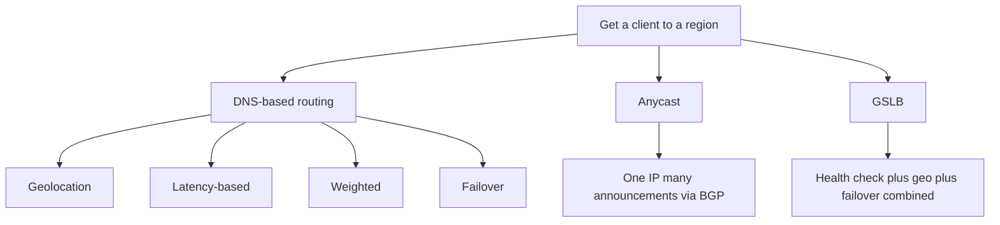
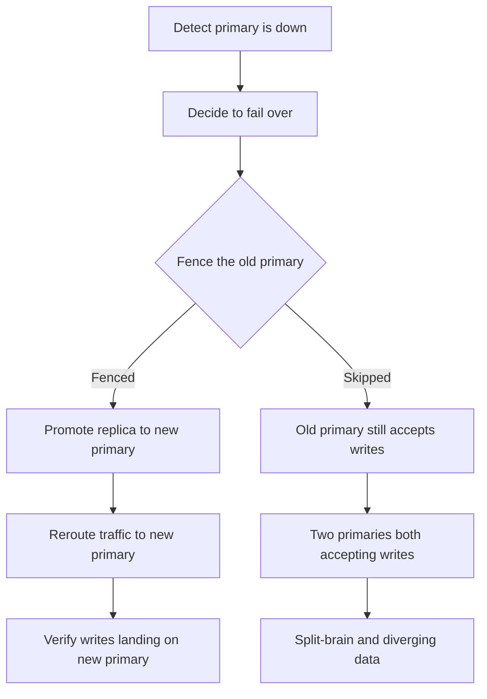

# Lecture 2 — Geo-Routing, Data Gravity, and the Controlled Failover

> **Duration:** ~2 hours of reading + hands-on.
> **Outcome:** You can design a geo-routing layer (DNS/anycast/GSLB), explain the DNS-TTL tax on your effective RTO, articulate the data-gravity problem and why residency law makes geography a correctness constraint, and perform a controlled failover step by step — including the split-brain guard and the fail-back question that catches teams.

Lecture 1 gave you the topologies and the budgets. This lecture is the *operational* half: how clients reach the right region, why data — not compute — is the hard part, and how a failover actually runs without producing two primaries that both think they're in charge.

The sentence to carry through:

> **Routing traffic to a region is easy; moving data to a region is hard; and the moment of failover is where every shortcut you took in routing and data shows up at once.**

Three parts: (1) geo-routing and the TTL tax, (2) data gravity and residency, (3) the controlled failover.

---

## Part 1 — Geo-routing: how clients find a region

### 1.1 The three mechanisms

A multi-region system needs a way to send each client to a region. There are three families, and they compose.

**DNS-based routing (GeoDNS / latency-based / weighted records).** The authoritative DNS server returns a *different* answer for `api.example.com` depending on who's asking and what's healthy:

- **Geolocation routing:** EU clients get the EU region's IP, US clients get the US region's IP — by the resolver's location.
- **Latency-based routing:** each client gets the region with the lowest measured network latency to them.
- **Weighted routing:** split traffic by a configurable ratio (10% to the new region) — a *canary at the DNS layer*, the regional cousin of the Week 8 mesh canary.
- **Failover routing:** a health-checked record that returns the primary's IP while it's healthy and *switches* to the secondary's IP when the primary's health check fails. This is the DNS expression of active-passive failover.

**Anycast.** *One* IP address is announced (via BGP) from *many* physical locations, and the network itself routes each client's packets to the *nearest* announcement. The client doesn't choose a region; the network's routing does, at the IP layer. Anycast is how CDNs and large DNS providers put "the same IP" in every region. Its failover is beautiful: withdraw the BGP announcement from a dead region and the network reroutes to the next-nearest *automatically*, with no DNS TTL to wait on — which is exactly why anycast failover can be faster than DNS failover.

**GSLB (Global Server Load Balancing).** A control layer (often DNS-based, sometimes proxy-based) that combines health checking, geo/latency awareness, and failover into one managed thing — "route to the nearest *healthy* region, fail over automatically." Commercial GSLBs and the cloud providers' global load balancers are this; you can approximate it with health-checked DNS, which is what the lab does with CoreDNS.


*The three families of geo-routing, and the four policies DNS-based routing splits into.*

### 1.2 They compose

Real systems layer these. A common stack: anycast gets the client to the nearest *edge* (low-latency TLS termination, a CDN), and then DNS/GSLB or application logic routes the *request* to the right *backend region* based on the user's home region and health. The edge is anycast (network-routed, fast); the backend region selection is policy (geo, residency, health). You don't pick one mechanism; you pick the right one at each layer.

### 1.3 The DNS TTL tax — the term everyone forgets

Here is the operational gotcha that wrecks RTO estimates. A DNS record carries a **TTL** (time-to-live): resolvers and clients are allowed to *cache* the answer for TTL seconds. So when you fail over by changing the DNS record:

> **Clients that already cached the old record keep sending traffic to the dead region for up to TTL seconds after you flip it.**

Your database might promote in 5 seconds, but if the failover record had a 300-second TTL, cached clients keep hitting the dead region for up to 5 minutes. Your *effective*, user-visible RTO is the failover RTO *plus* the TTL. This is why failover-critical records run **low TTLs** (30s, sometimes less) — you trade more DNS query volume for a tighter failover window. And it's why anycast failover (no DNS cache to wait on) is attractive for the tightest RTOs. The lab's geo-routing exercise makes you *see* this: set a TTL, fail over, and watch cached clients keep hitting the old region until the TTL expires.

> **The lesson:** RTO is end-to-end. The database-promotion time is the part you measure first and the part that's least often the bottleneck. Detection latency and DNS TTL are the terms that actually dominate, and a failover plan that ignores them is optimistic fiction. Measure the *real* RTO — first failed request to first successful request on the new region — which is what Exercise 3 does.

### 1.4 A worked failover record

Make the TTL tax concrete with the actual DNS records. A health-checked failover setup for `api.example.com` has two records and a health check:

```
; primary record — points at region A while A is healthy
api.example.com.   30   IN   A   203.0.113.10     ; region A, TTL = 30s

; on A's health check failing, the GSLB/authority swaps to:
api.example.com.   30   IN   A   198.51.100.20    ; region B, TTL = 30s
```

The timeline of a failover, second by second:

```
t=0s    region A dies
t=0-6s  health checks detect the failure (3 failed probes at 2s)
t=6s    GSLB swaps the A record to region B's address
t=6s    NEW resolutions get region B immediately
t=6-36s CACHED clients (resolved before t=6) keep getting region A
        until their cached record's 30s TTL expires
t=36s   all clients have re-resolved and reach region B
```

So the *fresh-resolution* RTO is ~6s, but the *worst-case cached-client* RTO is ~36s (6s detection + up to 30s TTL). If you'd set the TTL to 300s, the worst case becomes ~306s — a five-minute outage for cached clients, from a database that recovered in seconds. This is why **the TTL is a design parameter of your RTO, not an afterthought.** The cost of a low TTL is more DNS query volume (every 30s instead of every 300s, a 10× increase) — usually a fine trade for a failover-critical record, and exactly the trade the lab makes you reason about. For records that *aren't* failover-critical (a static asset host), a high TTL is fine and saves queries; the low-TTL discipline is specifically for the records a failover must move fast.

### 1.5 Geo-routing is also a steady-state optimization

Failover is the dramatic use of geo-routing, but its everyday job is **latency**: send each user to their *nearest* healthy region so their requests are fast even when nothing is failing. A user in Frankfurt resolving `api.example.com` should get the EU region; a user in Virginia should get the US region — not because of failover, but because routing them to the far region would add a transatlantic round-trip to every request. Latency-based and geolocation routing do this in steady state, and failover routing is the *exception path* layered on top ("nearest *healthy* region"). The two compose into the GSLB behavior: **route to the nearest region that's healthy, and when the nearest one fails, route to the next-nearest.** Anycast does the same at the network layer (nearest announcement, automatically). So your geo-routing layer earns its keep every day on latency, and earns its keep on the worst day on failover — design it for both.

---

## Part 2 — Data gravity and residency

### 2.1 Why data is the hard part

Compute is easy to make multi-region: services are (or should be) stateless, so you run a copy in each region and you're done. **Data is the hard part**, and the reason has a name: **data gravity**. Data attracts the services that use it (a service wants to be near its data for latency), and data resists being moved (it's large, it's consistency-sensitive, and the act of replicating it is the entire RTO/RPO problem from Lecture 1). So:

> **Multi-region is a *data* problem wearing a *compute* costume.** Standing up a second region's worth of stateless services is an afternoon. Deciding how the *data* lives in two places — one primary or two, sync or async, what happens on conflict — is the whole week.

This is why **read-local/write-primary** is the pragmatic default (Lecture 1 §3.3): it acknowledges data gravity by keeping the *authoritative* data (the write path) in one region while letting each region serve *reads* from a local async replica. Reads are local and fast; writes pay the cross-region trip but are a minority; and there's one source of truth, so no conflict. It's the design that respects data gravity instead of fighting it.

```
   READ-LOCAL / WRITE-PRIMARY
   region A (PRIMARY)              region B
   ┌───────────────────┐  async   ┌───────────────────┐
   │ app  ──read──> DB │ ───────> │ DB(replica) <─read─ app │
   │ app  ──write─> DB │          │       ▲                 │
   └─────────▲─────────┘          └───────│─────────────────┘
             └──────── writes from region B go HERE ────────┘
        local reads everywhere; all writes to the one primary
```

### 2.2 Session affinity: stick the user to their data

A corollary of data gravity: a user's *session* and a user's *data* want to live in the same region. If a user's data is primary in region A, routing their requests to region B means every one of their writes crosses to A anyway — you got the latency hit *and* the routing complexity. So systems use **session affinity** (a.k.a. sticky regions, "home region"): each user is assigned a home region where their data lives, and their traffic is routed there. The user in the EU is pinned to the EU region; their cart, their orders, their writes all live and route there. This both honors data gravity (the user is near their data) and *sets up* the residency story below (the user's data is *in* their region, which may be legally required).

The failover wrinkle: when a user's home region dies, their traffic must move to a *failover* region that has a replica of their data — which is exactly the active-passive replica from Lecture 1. Session affinity and the failover plan are the same design viewed from two angles: "where does this user normally go" and "where do they go when that region is gone."

### 2.3 Data residency: geography as correctness

The deepest reason multi-region is a *data* problem and not a latency optimization: **the law can require certain data to stay in certain regions.** GDPR and a growing list of data-localization laws mandate that, for example, EU residents' personal data is stored and processed within the EU (or only transferred under specific legal mechanisms). When that's the rule:

> **Geography stops being a performance choice and becomes a correctness constraint.** "EU user data lives in the EU region" is no longer "it's faster that way" — it's "it is *illegal* otherwise."

This has a sharp architectural consequence: **residency can forbid the active-active design you'd otherwise choose.** A naive active-active replicates all data to all regions for availability — but if that data includes EU personal data, replicating it to the US region is a compliance violation. So residency forces a **partitioned-by-region** layout: EU users' data is primary in the EU and *not* replicated outside it; US users' data is primary in the US; the system is "active-active" only in the sense that both regions are active, but each region is the *sole* home for its own users' regulated data — there is no cross-region replication of the regulated rows at all. The stretch goal and homework make you model exactly this: a residency tag that forbids a row from leaving its region, and the layout that constraint forces.

The senior takeaway: before you choose a multi-region topology, ask the lawyers, not just the latency budget. A residency constraint can override the entire decision tree from Lecture 1 §5, and discovering it *after* you've built active-active is an expensive, sometimes career-defining, mistake.

---

## Part 3 — The controlled failover

### 3.1 The steps, in order

A failover is a *sequence*, and doing it in the wrong order produces split-brain. The steps:

1. **Detect.** Health checks declare the primary region dead. (Tune for fast-but-not-flaky: too sensitive and you fail over on a blip; too slow and detection dominates your RTO.)
2. **Decide.** A human or an automated controller (Patroni, a custom operator) decides to fail over. Automated is faster (lower RTO) but must be *correct* — an automated failover that triggers on a transient is worse than a slightly slower human one.
3. **Fence the old primary.** *Before* promoting the replica, make the old primary **unable to accept writes** — STONITH ("shoot the other node in the head"), revoke its leadership lease, or block its write port. **This step is the split-brain guard, and skipping it is the #1 multi-region failover bug.** If the old primary is merely *unreachable from your health checker* but still *up and accepting writes from some clients*, and you promote the replica without fencing the old one, you now have **two primaries**, both taking writes, diverging. (This is the challenge this week.)
4. **Promote the replica.** Promote the standby to primary (`pg_promote()` / `pg_ctl promote`). It can now accept writes. At this instant, your realized RPO is locked in: whatever hadn't replicated from the old primary is lost.
5. **Reroute.** Flip the geo-routing (DNS record / GSLB / anycast withdrawal) so traffic goes to the new primary. Remember the TTL tax (Part 1 §1.3): cached clients lag by up to the TTL.
6. **Verify.** Confirm writes are landing on the new primary and the system is healthy. *Now* your RTO clock stops — first successful write on the new primary, not "we ran promote."

```
   FAILOVER ORDER (the order is the correctness)
   detect ─> decide ─> FENCE old primary ─> promote replica ─> reroute ─> verify
                         └── skip this and you get TWO primaries (split-brain) ──┘
```


*Fencing before promotion is the fork between a clean failover and split-brain.*

### 3.2 The fail-back question — harder than the failover

Most teams rehearse the *failover* and never rehearse the **fail-back** — bringing the recovered region back into service — and fail-back is where the subtle disasters live.

When the dead region comes back, it comes back as a *stale, formerly-primary* node. It has the old data (including, possibly, writes that never replicated — the data you "lost" at failover is sitting on its disk). You must **NOT** simply turn it back on as a primary:

- It would be a *second* primary (split-brain again), or
- Its stale data would overwrite the new primary's newer data if you re-sync the wrong direction.

The correct fail-back:

1. Bring the recovered region back as a **replica** of the *current* primary first — re-sync it *from* the new primary so it catches up. (This may require reconciling or discarding the unreplicated writes on its disk — a real, sometimes manual, data-reconciliation step.)
2. *Only once it's caught up and healthy as a replica*, optionally fail *back* to it as primary — which is itself a planned failover with all the same steps and the same fencing.

> **Fail-back is a failover in reverse, plus a data-reconciliation problem.** The unreplicated writes stranded on the old primary at failover are the hardest part: do you discard them (accepting the data loss your RPO already promised) or do you try to merge them back in (a manual, error-prone reconciliation)? Naming this in your runbook — "on fail-back, the old primary's unreplicated writes are discarded / reconciled by [process]" — is the difference between a controlled fail-back and a second incident.

### 3.3 What "measured RTO/RPO" actually requires

Lecture 1 said an RTO/RPO you didn't measure is a hope. Here's what measuring it requires, and what the lab makes you do:

- **Drive real write traffic during the failover.** A failover with no traffic measures nothing. You need writes in flight so you can see which ones succeed, which fail, and which are lost.
- **Measure RTO as first-failed-request to first-successful-request on the new primary** — the end-to-end, user-visible recovery, including detection and (in a full setup) TTL — not just the database promotion time.
- **Measure RPO as the count of writes that were acknowledged-or-in-flight on the old primary but absent from the new one** — and confirm it matches the replication lag at the moment of failure (the Lecture 1 RPO=lag identity).

Exercise 3 does exactly this: it drives writes, kills the primary, measures the recovery window and the lost-write count, and prints the two numbers. The mini-project makes you put those numbers in a runbook with a target ("RTO < 60s, RPO < 5s") and *demonstrate you hit it*. That demonstrated, measured failover — not a paragraph claiming "we support failover" — is the deliverable.

### 3.4 The drill is the deliverable

The recurring discipline of this week, restated for the failover: **an un-rehearsed failover is not a DR plan; it's a wish.** The standby that was never actually replicating (a broken subscription nobody monitored), the promote script that has a typo, the DNS TTL nobody accounted for, the missing fence step — every one of these is invisible until you fail over, and they are all *catastrophically* visible at 3 a.m. during a real region loss. The only way to know your RTO/RPO numbers are real is to **run the drill** — kill the primary on purpose, in a controlled window, with traffic, and measure. The teams that do this have boring failovers. The teams that don't have postmortems. Week 22's gameday is where you do this for real on the capstone; this week is the rehearsal of the rehearsal.

### 3.4a A worked failover runbook (the shape)

The mini-project asks for a runbook; here is the shape, so you know what "good" looks like. A runbook is *executable under stress* — numbered, copy-pasteable, with the decision points marked.

```
RUNBOOK: region-a (primary) loss

0. CONFIRM the loss (don't fail over on a blip)
   - check: are MULTIPLE health signals red? (DB unreachable AND app 5xx AND
     synthetic probe failing) — one red signal is suspicious, three is dead
   - check: is it region A that's down, or is it the MONITOR that can't see A?
     (try reaching A from a different vantage point) — UNREACHABLE != DEAD
   - GO/NO-GO: only proceed if A is confirmed down or confirmed unreachable-and-unsafe

1. FENCE region-a (BEFORE promoting B — the split-brain guard)
   $ <make A read-only / scale A's primary to 0 / revoke A's lease>
   - CONFIRM the fence took: A must be unable to accept writes

2. PROMOTE region-b's replica to primary
   $ psql "$PGB" -c "SELECT pg_promote();"
   - CONFIRM: pg_is_in_recovery() is now false on B

3. REROUTE traffic to region-b
   $ <flip the write DNS record / GSLB to B>
   - NOTE: cached clients lag by up to the TTL (~30s)

4. VERIFY
   - writes are landing on B; error rate recovering
   - RTO CLOCK STOPS HERE (first successful write on B)

5. RECORD
   - measured RTO, measured RPO (lost writes), the timeline — for the postmortem

LATER: FAIL-BACK (do NOT rush this)
   - bring A back as a REPLICA of B first (re-sync)
   - reconcile/discard A's stranded unreplicated writes (state the policy)
   - only then, as a PLANNED failover, consider handing writes back to A
```

The two things this runbook gets right that a bad one gets wrong: **the GO/NO-GO at step 0** (unreachable ≠ dead — confirm before you act) and **fencing at step 1, before promotion** (the split-brain guard). A runbook that jumps straight to "promote B" is the challenge's incident, pre-written.

### 3.5 Automated vs human failover

A design question that sits inside "decide": who pulls the trigger?

- **Human failover.** An on-call engineer is paged, assesses, and runs the failover. *Pros:* a human can tell a real region loss from a transient blip, can reason about partial failures, and won't fail over on a flaky health check. *Cons:* slower (paging + assessment adds minutes to RTO), and a stressed human at 3 a.m. makes mistakes — which is why the runbook must be *executable without thinking*.
- **Automated failover.** A controller (Patroni, a custom operator) detects and fails over with no human. *Pros:* fast (seconds, not minutes), consistent, available at 3 a.m. without waking anyone. *Cons:* it must be *correct* — an automated failover that triggers on a transient is worse than a slightly slower human one, and (as the challenge shows) an automated failover that promotes without fencing manufactures split-brain.

The mature posture is **automated failover with strong guards**: the controller fails over automatically *but* only after it has **positively fenced** the old primary, and only on a detection signal tuned to distinguish real loss from a blip. The guard — "never promote without confirming the old primary cannot write" — is what makes automation safe. You get the speed of automation *and* the correctness a careful human would enforce, encoded as a rule the controller can't skip. The capstone's progressive-delivery story (automatic rollback on SLO breach, Week 8) is the same shape applied to deploys; here it's applied to region failover.

### 3.6 Detection: the term you tune most

Of all the RTO terms, **detection** is the one you'll tune most, because it trades two failure modes against each other:

- **Too sensitive:** you fail over on a transient network blip, a brief GC pause, a momentary health-check timeout — an unnecessary failover that *causes* an incident (the very disruption you were trying to avoid). Worse, if it flaps, you can ping-pong between regions.
- **Too slow:** detection dominates your RTO. A 60-second health-check timeout means 60 seconds of detection before you even *start* failing over — so your RTO can't be under a minute no matter how fast the rest is.

The tuning levers are the probe **interval** (how often you check), the **timeout** per probe, and the **failure threshold** (how many consecutive failures before declaring death). A common shape is "probe every 2s, 2s timeout, 3 consecutive failures to declare dead" — ~6 seconds of detection, fast enough for a tight RTO, slow enough to ride out a single blip. The lab's geo-router health check (Exercise 2) makes this loop explicit so you can *see* the detection term in your measured RTO, and the homework makes you reason about where to set it for the cart.

---

## Part 4 — The routed control plane and cross-region networking

The lab connects two Kind clusters "via a routed control plane." A word on what that simulates, because the networking is a real part of multi-region you shouldn't hand-wave.

### 4.1 What "two regions" needs at the network layer

For two regions to be one system, they need:

- **A path for replication.** The primary's WAL/changes must reach the replica region. In production this is the WAN — a VPC peering, a transit gateway, a VPN, or a dedicated interconnect. In the lab it's the link between your two Kind clusters. This path's *latency* is the cross-region RTT (the speed-of-light floor), and its *availability* is part of your replication's availability — if the link dies, the replica stops receiving and your RPO grows.
- **A path for cross-region service calls (if any).** In read-local/write-primary, region B's writes must reach region A's primary — another cross-region hop. In active-active (Week 20), the CRDT sync traffic crosses here.
- **Service discovery across regions.** A workload in B that needs A's primary must be able to *find* it (a DNS name, a stable address) that survives a failover (the name repoints to the new primary). This is where the geo-routing layer (Part 1) and the in-cluster discovery meet.

### 4.2 The partition is a network event

The "partition" you induce in the lab is, concretely, *blocking the link* between the regions. When that link is down:

- replication stops (the replica stops receiving WAL → lag grows → RPO grows),
- cross-region calls fail (B can't reach A's primary),
- and — critically — **each region may still be individually healthy and serving local traffic.** This is the dangerous case from the challenge: A is up and writable, B is up, but they can't see each other. A naive "B can't reach A, so A must be dead, promote B" produces split-brain. The partition is a *network* event, not a *region-death* event, and conflating the two is the bug.

### 4.2a The asymmetry of failover and recovery traffic

One subtlety worth internalizing: failover and recovery put *different* loads on the network, and forgetting the recovery side bites teams.

- **At failover**, the surviving region suddenly takes *all* the traffic (its own plus the dead region's). If region B was running at 60% capacity serving its own users, and now it must also serve region A's users, it's at 120% — **overloaded**. So a real active-passive plan must provision the standby for the *combined* load, or scale it up *as part of* the failover (which adds to the RTO). "We failed over and then B fell over from the load" is a real, embarrassing second incident.
- **At recovery (fail-back)**, the recovered region must *re-sync* — pull all the writes it missed during the outage from the current primary. If the outage was long, that's a large catch-up replication burst over the cross-region link, which competes with live replication traffic and can itself cause lag. So fail-back has a *throughput* cost (the re-sync) on top of its correctness cost (the reconciliation).

The lesson: **capacity-plan for the failed-over state, not just the steady state.** A two-region active-passive setup where the standby can't hold the full load isn't a DR plan; it's a slower way to have an outage. The mini-project's budget should note the standby's capacity headroom, not just the RTO/RPO.

### 4.3 Why the lab is an honest simulation

Two Kind clusters with a blockable link reproduce *exactly* the properties that matter: separate failure domains (kill one cluster, the other is unaffected), a cross-region latency you inject, and a partition you can induce and heal. The *absolute* numbers differ from a real WAN (your laptop's link is faster than a transatlantic cable), which is why you inject latency to make the speed-of-light floor visible. But the *shape* — the lag, the partition, the failover, the split-brain risk — is identical. That's the point of the lab design: the concepts are scale-invariant, so you learn the real lessons on hardware you own.

---

## 5. Recap

You should now be able to:

- Design a geo-routing layer across DNS (geo/latency/weighted/failover records), anycast (one IP, network-routed, BGP-withdrawal failover), and GSLB (managed health-checked routing) — and explain how they compose.
- Quantify the **DNS TTL tax**: cached clients hit the dead region for up to TTL after cutover, so effective RTO = failover RTO + TTL, which is why failover records run low TTLs and anycast failover is attractive for the tightest RTOs.
- Articulate **data gravity** (multi-region is a data problem, not a compute one) and why read-local/write-primary plus session affinity respects it.
- Explain how **data residency** turns geography into a correctness constraint that can *forbid* active-active and force a partitioned-by-region layout — and that you ask the lawyers before the latency budget.
- Run a **controlled failover** in the correct order (detect → decide → **fence** → promote → reroute → verify), with fencing as the split-brain guard.
- Handle **fail-back** as a failover-in-reverse plus a data-reconciliation of the old primary's stranded writes — and know it's the step teams skip and regret.
- State what a *measured* RTO/RPO requires (traffic, end-to-end timing, lost-write count = lag) and why the drill is the deliverable.

Next: the exercises put a two-region topology, replication, geo-routing, and a measured failover on your cart/inventory stack. Continue to [the exercises](../exercises/README.md).

---

## The five questions to ask before a multi-region failover

A quick pre-flight checklist, distilled from this lecture, for any failover plan:

1. **Is the standby actually replicating?** (Monitor it — a silently-broken standby is the #1 surprise.)
2. **What's the replication lag right now?** (That's your RPO if you fail over this second.)
3. **What's the DNS TTL on the failover record?** (That's added to your effective RTO.)
4. **Does the failover fence the old primary before promoting?** (No fence = split-brain risk.)
5. **Have you rehearsed this exact failover?** (An un-rehearsed plan is a wish.)

If you can't answer all five with confidence, your "DR plan" is a document, not a capability. The lab and mini-project exist to turn those five answers into measured, demonstrated facts.

## The failover cheat sheet

Keep this next to the runbook:

```
GEO-ROUTING
  DNS (geo/latency/weighted/failover)   client picks region; cached for TTL
  anycast (one IP, many announcements)  network picks; BGP-withdrawal failover (no TTL)
  GSLB                                  managed: nearest HEALTHY region, auto-failover

THE TTL TAX
  effective RTO = failover RTO + DNS TTL
  -> failover-critical records run LOW TTLs (30s) ; anycast avoids the tax entirely

DATA GRAVITY
  compute is easy (stateless, copy per region) ; DATA is the hard part
  read-local/write-primary + session affinity respects gravity
  RESIDENCY (GDPR) makes geography CORRECTNESS, can FORBID active-active

THE FAILOVER ORDER (the order IS the correctness)
  detect -> decide -> FENCE old primary -> promote replica -> reroute -> verify
            (GO/NO-GO: unreachable != dead)   ^^^^^^ skip this = split-brain

FAIL-BACK
  recovered region comes back as a REPLICA first (re-sync)
  reconcile/discard its stranded unreplicated writes
  then, as a PLANNED failover, hand writes back

THE DELIVERABLE
  a MEASURED failover (RTO + RPO under load) + a runbook an on-call can run.
  the drill is the deliverable; an un-rehearsed failover is a wish.
```

The whole week in one line: **route to the nearest healthy region, keep the data's gravity in mind, fence before you promote, and measure the failover — because a multi-region system you didn't rehearse is a single-region system with extra ways to lose data.**

One last connection to the capstone: the `cart-multiregion` you build sits under everything Phase 4 adds. Week 20 makes the cart genuinely active-active (a CRDT) on this two-region base; Week 21 secures every cross-region hop (SPIFFE/SPIRE + OPA); Week 22's gameday runs the region-failover drill on exactly this topology. So the measured failover and the runbook you produce here aren't a throwaway exercise — they're the foundation the rest of the course stress-tests. Build them so the numbers are real and the runbook is executable, because in three weeks someone (you) will kill the primary region under 1k RPS and grade what happens against what you wrote.

---

## References

- *AWS Route 53 — routing policies (geo/latency/weighted/failover)*: <https://docs.aws.amazon.com/Route53/latest/DeveloperGuide/routing-policy.html>
- *Cloudflare — anycast*: <https://www.cloudflare.com/learning/cdn/glossary/anycast-network/>
- *PostgreSQL — promoting a standby*: <https://www.postgresql.org/docs/current/warm-standby.html#STANDBY-SERVER-OPERATION>
- *Patroni — automated Postgres failover (and how fencing works)*: <https://patroni.readthedocs.io/en/latest/>
- *GDPR — data transfers / localization*: <https://gdpr.eu/data-transfers/>
- *Google SRE Workbook — Implementing SLOs*: <https://sre.google/workbook/implementing-slos/>
