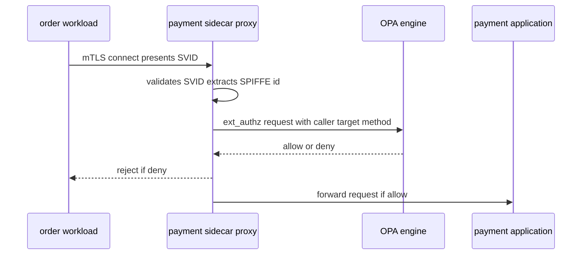
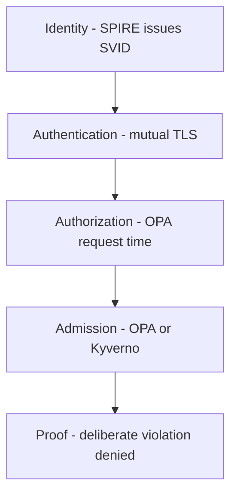

# Lecture 2 — OPA, Rego, Policy as Code, and Admission Control

> **Duration:** ~2 hours of reading + hands-on.
> **Outcome:** You can write OPA/Rego policy authorizing service calls by SPIFFE identity; explain the input/data/decision model and deny-by-default; distinguish the two enforcement gates (admission "what may run" vs request-time "what may talk"); choose between Gatekeeper and Kyverno; and close the zero-trust loop with a deliberate violation the policy denies.

Lecture 1 gave you verifiable identity. This lecture turns identity into *authorization* — the second half of zero trust. Identity answers "who are you"; without an authorization layer, every verified identity could still call everything, which is encrypted-but-not-zero-trust. OPA is where "what may you do" lives, as code.

The sentence to carry through:

> **Zero trust = verified identity (SPIFFE) AND explicit authorization (OPA) — a valid identity is *necessary but not sufficient*, and the policy that says which identity may do what is code: versioned, tested, and enforced.**

Three parts: (1) OPA and Rego for request-time authz, (2) admission control and the two gates, (3) Gatekeeper vs Kyverno and closing the loop.

---

## Part 1 — OPA and Rego: authorization as code

### 1.1 What OPA is

**OPA** (Open Policy Agent) is a general-purpose **policy engine**: you give it an `input` (a request, described as JSON) and it returns a **decision** (allow/deny, or richer) by evaluating policy written in **Rego**. OPA is *decoupled* from what it's protecting — the same engine authorizes microservice calls, Kubernetes admissions, API gateway requests, Terraform plans. You write policy once, in one language, and enforce it everywhere. That decoupling — **policy as code, separate from the application code** — is the whole value: authorization logic isn't scattered through every service's `if user.role == ...` checks; it's centralized, versioned, and testable.

Why decoupling matters in practice: when authorization lives *inside* each service (an `if` check in cart, another in payment, another in order), three problems follow. The logic *drifts* (each team implements "who may call me" slightly differently); it's *untestable as a whole* (you can't ask "what can a compromised cart reach?" without reading every service); and a *policy change* (tighten access to payment) means redeploying every service that checks it. OPA fixes all three: one policy, in one place, in one language, that you can test as a unit and change without touching application code. For a polyglot system (Go, Python, Rust — like the capstone), this is decisive: you don't reimplement authorization in three languages with three chances to get it wrong; you write it once in Rego and every service consults the same engine.

### 1.2 The input / data / decision model

A Rego policy works on three things:

- **`input`** — the request being decided: for service authz, "the caller's SPIFFE ID, the target service, the method." OPA evaluates against *this specific* request.
- **`data`** — the policy's reference data: lookup tables, the allow-matrix, role mappings. The relatively-static facts the policy consults.
- **the decision** — what the policy computes, conventionally a rule named `allow` (a boolean) or a richer result.

```rego
package authz

# DENY BY DEFAULT: allow is false unless a rule below makes it true.
default allow := false

# Allow if the caller's SPIFFE identity is permitted to call the target service.
allow if {
    some rule in data.access_rules
    rule.caller == input.caller_spiffe_id     # the verified SPIFFE ID from the SVID
    rule.target == input.target_service
    input.method in rule.methods
}
```

### 1.1a Where OPA runs: sidecar, library, or service

A quick note on deployment, since "OPA evaluates the policy" is vague. OPA runs in a few shapes:

- **As a sidecar** next to each service (or the mesh proxy), evaluating per-request authz locally — low latency, no network hop to a central OPA.
- **As a library** embedded in the application (the Go SDK), for in-process decisions.
- **As a central service** that proxies/services query — simpler to operate, but adds a network hop and a shared dependency.

For request-time mesh authz, the common shape is OPA *as a sidecar* (or the mesh's built-in OPA integration) reached via Envoy's `ext_authz` filter — so the decision is local and fast. For admission control, OPA runs as the Gatekeeper controller (a cluster-wide validating webhook). The policies are the same Rego; the deployment shape differs by use case. The mini-project uses the ext_authz-sidecar shape so the policy gates live calls with minimal latency.

### 1.2a Rego in 90 seconds

Rego is small enough to read after a brief orientation. The few constructs you need this week:

- **A rule** computes a value or a boolean. `allow if { ... }` makes `allow` true when the body holds.
- **The body is a conjunction.** Every line in `{ ... }` must hold (logical AND) for the rule to fire. Lines that introduce a variable and constrain it act as both binding and filter.
- **`some x in collection`** iterates: the rule fires if *any* element satisfies the body (an existential — "there exists a rule that allows this").
- **`default allow := false`** sets the value when no other rule makes it true — this is deny-by-default.
- **`input` and `data`** are the two inputs: the request and the reference data.
- **`x in y`** is membership; `==` is equality.

That's enough to read the whole authz policy: "`allow` is false by default; it becomes true if *there exists* a rule in `data.access_rules` whose caller, target, and method all match the `input`." No loops, no mutation, no control flow — just "does some rule make this true?" Rego's declarativeness is the point: a policy is a *statement of what's allowed*, not a procedure, which is what makes it testable and auditable. If you can read that one `allow` rule, you can read 90% of the Rego you'll write this week.

### 1.3 Deny-by-default and SPIFFE-keyed rules

The right posture, identical to Week 8's `AuthorizationPolicy`, is **deny-by-default**: `default allow := false`, then explicit rules that grant access. Nothing is permitted unless a rule says so — so a new service, a forgotten path, or a compromised workload with an *unlisted* identity is denied by omission, not by an oversight you have to remember.

The crucial detail: the rules are keyed on the **caller's SPIFFE identity** (from Lecture 1), not an IP, a hostname, or a header. `input.caller_spiffe_id` is the verified identity from the caller's SVID — something an attacker can't forge (they'd need an SVID they were never attested for). So a rule like "`spiffe://shop/ns/shop/sa/order` may call `payment`" is *enforceable*, because "order" is cryptographically proven, not asserted. This is the join between the two lectures: **OPA authorizes the SPIFFE identity that SPIRE made verifiable.**

```rego
# data.access_rules — the explicit allow-matrix (the policy's reference data)
access_rules := [
    {"caller": "spiffe://shop/ns/shop/sa/order", "target": "payment",   "methods": ["Charge", "Refund"]},
    {"caller": "spiffe://shop/ns/shop/sa/cart",  "target": "inventory", "methods": ["Reserve", "Release"]},
    {"caller": "spiffe://shop/ns/shop/sa/order", "target": "inventory", "methods": ["Commit"]},
]
# Note what's ABSENT: cart -> payment is NOT here, so cart calling payment is DENIED.
# That omission is the zero-trust control: cart has a valid identity and STILL can't
# reach payment, because no rule grants it. Identity is necessary, not sufficient.
```

### 1.4 Policy is tested, like code

Because Rego is code, you **test** it — `opa test` runs Rego unit tests that assert "this caller/target/method is allowed" and "this one is denied." This is a real advantage over scattered in-app checks: your authorization is a tested artifact, and a change that accidentally opens a hole *fails a test* before it ships. The exercise's policy ships with its test suite, and the mini-project requires the allow-matrix to be test-covered — because an *untested* authz policy is exactly how the over-broad rule (the Challenge) slips through.

A taste of the tests:

```rego
# the key zero-trust assertion: cart is DENIED payment (valid identity, no rule)
test_cart_cannot_call_payment if {
    not allow with input as {
        "caller_spiffe_id": "spiffe://shop/ns/shop/sa/cart",
        "target_service": "payment",
        "method": "Charge",
    }
}

# and the legitimate path still works:
test_order_can_charge_payment if {
    allow with input as {
        "caller_spiffe_id": "spiffe://shop/ns/shop/sa/order",
        "target_service": "payment",
        "method": "Charge",
    }
}
```

The `test_cart_cannot_call_payment` assertion is the one that matters most: it encodes the *intended denial* as a test, so if someone later adds an over-broad rule that accidentally lets cart reach payment, *this test fails in CI* and the hole never ships. This is the structural difference between policy-as-code and scattered in-app checks: you can write a test that says "this must remain forbidden" and have CI enforce it forever. An over-broad rule (the Challenge) ships precisely when there's no such test; adding it is the cheap insurance against the most dangerous policy bug there is.

### 1.5 How the SPIFFE identity reaches OPA

A practical question: how does `input.caller_spiffe_id` get populated with the *verified* identity? The chain:

1. The caller (`order`) connects to the target (`payment`) over **mTLS**, presenting its SVID (from SPIRE, Lecture 1).
2. The target's proxy (an Envoy sidecar, or the mesh) **validates** the SVID against the trust bundle and extracts the SPIFFE ID from the cert's URI SAN. This is now a *verified* identity, not a claim.
3. Before forwarding the request to the application, the proxy calls OPA via **`ext_authz`** (Envoy's external authorization filter), passing the verified SPIFFE ID, the target, and the method as `input`.
4. OPA evaluates the policy and returns allow/deny. On deny, the proxy rejects the request *before it reaches the application* — exactly like Week 8's `AuthorizationPolicy` RBAC denial.


*The proxy validates the caller's SVID and asks OPA before the request ever reaches the application.*

The crucial property: `input.caller_spiffe_id` comes from the *validated mTLS peer certificate*, so it's unforgeable. An attacker can't set it by adding a header — the proxy ignores any client-supplied identity header and uses *only* the cryptographically-verified cert identity. This is why keying authorization on the SPIFFE identity (rather than an IP, a hostname, or a header) makes the policy a *real control*: the thing the rule matches on cannot be spoofed. The mini-project wires exactly this ext_authz path so the policy governs *live* calls, not just `opa eval` tests.

---

## Part 2 — Two enforcement gates: what may run vs what may talk

OPA enforces at two distinct gates, and conflating them is a common confusion. They answer different questions.

### 2.1 Request-time authorization — "what may talk"

The gate Part 1 described: **per-request authorization of service-to-service calls.** When `order` calls `payment`, the call is checked (by an OPA sidecar, an Envoy ext_authz filter, or in-app) against the policy: is *this caller's SPIFFE identity* authorized for *this method* on *this target*? This is the runtime, per-request gate — it decides **what may talk to what**, and it's where the SPIFFE-keyed allow-matrix lives. A denied call gets rejected *before it reaches the target's application code* (exactly like Week 8's `AuthorizationPolicy` RBAC denial), so a disallowed call never even touches `payment`.

### 2.2 Admission control — "what may run"

The other gate is **admission control**: when someone tries to *create* a Kubernetes resource (a Pod, a Deployment), a **validating admission webhook** asks OPA "may this resource be created?" *before it's persisted*. This decides **what may run in the cluster**, enforcing rules like:

- no **privileged** pods (a container running as root with host access — a lateral-movement amplifier),
- required **labels** / ownership metadata (so everything is attributable),
- **image provenance** (only images from trusted registries / with valid signatures — the supply-chain control),
- no `:latest` tags, resource limits required, no host-network, and so on.

Admission control is a *zero-trust control too*, just at a different layer: it shrinks the attack surface by *refusing to run* the things an attacker would want (a privileged pod they could escape from, an unsigned image they could have poisoned). Where request-time authz stops a compromised workload from *talking* to things it shouldn't, admission control stops the dangerous workload from *existing* in the first place.

A Gatekeeper constraint that denies privileged pods, to make it concrete — a ConstraintTemplate (the Rego) plus a Constraint (the instance):

```rego
# ConstraintTemplate (the Rego logic): deny any container running privileged.
violation[{"msg": msg}] {
    c := input.review.object.spec.containers[_]
    c.securityContext.privileged == true
    msg := sprintf("privileged container is not allowed: %v", [c.name])
}
```

```yaml
# Constraint (the instance): apply the template to all Pods.
apiVersion: constraints.gatekeeper.sh/v1beta1
kind: K8sNoPrivileged
metadata: { name: no-privileged-pods }
spec:
  match:
    kinds: [{ apiGroups: [""], kinds: ["Pod"] }]
```

Apply both, and `kubectl apply` of a privileged pod is *rejected by the webhook* before it's persisted — the cluster simply refuses to run it. Why this is a zero-trust control: a privileged pod can escape to the node and from there to *everything*, sidestepping all your request-time authz. Refusing to run privileged pods removes that escalation path entirely. Image-provenance constraints (only signed images from trusted registries) do the same for the supply-chain path: an attacker who poisons an image can't get it admitted. Admission control is the "shrink what can go wrong" gate, complementing the "limit what each thing can do" request-time gate.

```
   the two gates
   ┌─ admission (what may RUN) ──┐     ┌─ request-time (what may TALK) ──┐
   │ kubectl apply pod           │     │ order --gRPC--> payment          │
   │   -> webhook -> OPA: allow?  │     │   -> ext_authz -> OPA: allow?    │
   │   deny privileged/unsigned   │     │   deny if SPIFFE id not in rules │
   └──────────────────────────────┘     └──────────────────────────────────┘
   shrinks the attack surface           denies lateral movement
```

### 2.3 Both are needed

A complete zero-trust posture uses *both* gates. Admission control alone ("only safe pods run") doesn't stop a *legitimate* pod from being compromised and calling things it shouldn't — that's request-time authz. Request-time authz alone doesn't stop a privileged, escapable pod from being deployed in the first place — that's admission. Together: **only safe, attributable workloads run (admission), and even those may only talk to what policy explicitly allows (request-time).** The mini-project's "deliberate violation that gets denied" exercises the request-time gate; the admission gate is the stretch/Friday work.

---

## Part 3 — Gatekeeper vs Kyverno, and closing the loop

### 3.1 The admission-control choice

For the admission gate specifically, there are two dominant tools, and choosing between them is a real decision:

- **OPA Gatekeeper** — admission control built on OPA/Rego. You write **ConstraintTemplates** (Rego policy) and **Constraints** (instances of them). *Strengths:* the full power and expressiveness of Rego; you reuse the same policy language as your request-time authz; rich logic. *Costs:* you (and your team) must learn Rego, which has a learning curve.
- **Kyverno** — a **Kubernetes-native** policy engine. Policies are written in **YAML** (no Rego), using a validate/mutate/generate model that feels like writing Kubernetes manifests. *Strengths:* lower learning curve (it's YAML, it's k8s-native, it can *mutate* and *generate* resources too); great ergonomics for "require this label," "block `:latest`." *Costs:* less expressive than Rego for complex logic; a separate language from your request-time OPA.

The decision, made operational:

- Choose **Gatekeeper** when you want *one policy language* across admission *and* request-time authz, or you need Rego's expressiveness for complex constraints, and your team is willing to learn Rego.
- Choose **Kyverno** when your admission needs are the common cases (labels, image rules, no-privileged, mutation/defaulting) and you value the low-friction YAML, k8s-native experience — and you're fine using a different mechanism for request-time service authz.

Many orgs run **Kyverno for admission** (the ergonomic win for the common policies) and **OPA for request-time service authz** (where Rego's per-request logic shines) — using each where it's strongest rather than forcing one everywhere. The homework/stretch has you write the *same* "deny privileged pod" policy in both and compare, so the choice is evidence-based, not a coin flip.

The *same* "no privileged pods" rule in Kyverno, for contrast with the Gatekeeper Rego above:

```yaml
apiVersion: kyverno.io/v1
kind: ClusterPolicy
metadata: { name: no-privileged }
spec:
  validationFailureAction: Enforce
  rules:
  - name: deny-privileged
    match:
      any: [{ resources: { kinds: ["Pod"] } }]
    validate:
      message: "privileged containers are not allowed"
      pattern:
        spec:
          containers:
          - =(securityContext):
              =(privileged): "false"
```

Notice the difference in *feel*: the Kyverno policy is pure YAML with a pattern-match — it reads like a Kubernetes manifest, no Rego, no ConstraintTemplate/Constraint split. For *this* common case, Kyverno is unmistakably more ergonomic. The Gatekeeper version, though, is Rego — so if you *also* need that expressiveness elsewhere (or want one language across admission and request-time authz), Gatekeeper pays off. That's the whole tradeoff in one example: Kyverno's YAML is easier for the 80% of admission policies that are pattern-matches; Gatekeeper's Rego is more powerful for the 20% that need real logic and for sharing a language with your OPA request-time authz. Writing both (the homework) is how you *feel* the tradeoff instead of taking someone's word for it.

### 3.1a Mutation and defaulting — a Kyverno-leaning case

One capability worth calling out, because it shifts the decision: Kyverno can **mutate** and **generate** resources, not just validate them. It can *add* a missing label, *inject* a default securityContext, *generate* a NetworkPolicy for every new namespace. Gatekeeper is primarily *validating* (allow/deny), though it has some mutation support. So if a big part of your admission story is "fix up resources to meet standards" (default the securityContext, add ownership labels) rather than just "reject bad ones," Kyverno's mutate/generate is a real pull. For a pure deny-the-bad-stuff posture, either works; for a "enforce *and* auto-remediate" posture, Kyverno's mutation is the ergonomic answer. Naming this in your decision memo (the homework) shows you understand the choice is about *what kind of admission policy you're writing*, not just syntax preference.

### 3.2 Closing the zero-trust loop on the cart

Now assemble everything into the loop the week exists to close, on the multi-region cart:

1. **Identity (SPIRE).** Every `cart`/`inventory`/`payment` workload, in both regions, has a SPIRE-issued SVID — a verifiable `spiffe://shop/...` identity, attested, short-lived, no secret zero (Lecture 1).
2. **Authentication (mTLS).** Every hop is mutually authenticated by those SVIDs — `cart`→`inventory`, `order`→`payment`, region-A↔region-B. A peer that can't present a valid SVID can't even establish the connection.
3. **Authorization (OPA, request-time).** Every call is authorized against the deny-by-default Rego allow-matrix keyed on the caller's SPIFFE identity. `order` may call `payment`; `cart` may *not* (no rule grants it).
4. **Admission (OPA/Kyverno).** Only safe, attributable workloads may run (no privileged pods, signed images).
5. **The proof — a deliberate violation.** Deploy a workload (or make a call) that *should* be denied — `cart` trying to call `payment`, or a forged/wrong identity — and *demonstrate the policy denies it*. This is the canonical check: the loop is **enforcing**, not decorating. A real, identified `cart` workload, in the mesh with a valid SVID, is *still denied* `payment`, because authorization is a second gate that identity alone doesn't open.


*Each layer of the zero-trust loop builds on the one before it, closed by proving a denial on purpose.*

> **The deliberate-violation discipline.** Zero trust you didn't *test with a violation* is zero trust you're *assuming*. The single most important thing you do this week is make a call that should fail and *watch it fail* — because the failure mode of a security control isn't "it errors loudly," it's "it silently allows what it should deny" (the Challenge's over-broad policy). You verify the deny the way you verified a measured failover (Week 19) and a lossless convergence (Week 20): by producing the negative result on purpose and confirming it. `cart` is denied `payment` → the loop is closed → and you *saw* it, you didn't hope it.

### 3.3 The senior posture: defense in depth, identity at the core

The recurring discipline: **zero trust is layers, and identity is the layer they all rest on.** mTLS without authorization is a private channel to an unknown-permission party; authorization without verifiable identity is rules about a spoofable claim; admission control without request-time authz lets a compromised legitimate pod roam; request-time authz without admission lets a dangerous pod exist to be compromised. The *complete* posture is all of them, and *all of them* depend on the SPIFFE identity being real (attested, unforgeable, no secret zero). Get the identity right (Lecture 1) and the authorization layers (this lecture) have something solid to stand on; get it wrong (spoofable identity, leaked secret-zero) and every layer above it is theater. That's why the week front-loads SPIFFE/SPIRE: it's the foundation, and OPA is what you build on it.

### 3.4 The defense-in-depth stack, named

To make "layers" concrete, here is the full zero-trust stack for the cart, bottom to top, with what each layer stops:

```
   layer                  stops...                              from this week
   -----------------------------------------------------------------------
   admission control      a privileged/unsigned pod RUNNING     Gatekeeper/Kyverno
   workload identity      a forged identity (can't attest)      SPIFFE/SPIRE (L1)
   mTLS                   a peer that can't prove who it is     SVID-based mTLS
   request-time authz     a valid identity TALKING out of scope OPA/Rego (this L)
   least privilege        each id over-reaching                 the deny-by-default matrix
   short-lived SVIDs      a stolen credential lasting           auto-rotation (L1)
   -----------------------------------------------------------------------
   net effect: a compromise of ONE workload yields ONE narrow, expiring identity
               that can RUN nothing dangerous and TALK to nothing unallowed.
```

No single layer is sufficient — that's the *defense in depth* point. mTLS without authz: encrypted but anyone-may-call. Authz without mTLS: rules about a spoofable identity. Admission without request-time: safe pods that can still over-reach if compromised. The breach-resistant posture is *all* of them, stacked, each catching what the others miss. And every layer's effectiveness depends on the identity being real — which is why, one more time, identity is the foundation and the rest is what you build on it.

### 3.5 The deliberate-violation discipline, restated

The single most important *practice* of the week: **prove the deny.** A security control's failure mode is not "it errors loudly" — it's "it silently allows what it should deny." You cannot tell a working zero-trust loop from a broken one by looking at the green dashboards; both look fine until someone tries the forbidden thing. So you *try the forbidden thing on purpose*: make `cart` call `payment` and watch it get denied, make a forged identity connect and watch mTLS reject it, `kubectl apply` a privileged pod and watch admission refuse it. The negative result, produced deliberately, is the only proof the loop enforces. This is the same discipline as Week 19's measured failover and Week 20's lossless-convergence check: don't assert the property, *demonstrate* it by producing the result on purpose. A zero-trust posture you didn't test with a violation is a zero-trust posture you're *hoping* works.

---

## 4. Recap

You should now be able to:

- Explain OPA as a decoupled policy engine and Rego's `input`/`data`/decision model, and write a deny-by-default service-authz policy keyed on the caller's **SPIFFE identity**.
- State that authorization is **policy as code** — versioned and *tested* (`opa test`) — and why that beats scattered in-app checks (and catches the over-broad rule before it ships).
- Distinguish the two gates: **admission** ("what may run" — refuse privileged/unsigned pods, via a validating webhook) and **request-time authz** ("what may talk" — per-request service-to-service decisions) — and why a complete posture needs both.
- Choose between **Gatekeeper** (Rego, expressive, one language across gates) and **Kyverno** (YAML, k8s-native, ergonomic for the common cases) with evidence, and know the common "Kyverno for admission + OPA for request-time" split.
- Close the zero-trust loop on the cart (identity → mTLS → request-time authz → admission) and **prove it with a deliberate violation** — a valid-but-unauthorized identity that the policy *denies* — because identity is necessary but not sufficient.
- Explain how the verified SPIFFE identity reaches OPA (validated mTLS cert → URI SAN → ext_authz `input`) and why keying on it is unforgeable where IP/header is not.
- Recognize the over-broad-rule footgun (a wildcard rule defeats deny-by-default) and the structural fix (explicit least-privilege rules + a test asserting the deny).
- Name the defense-in-depth stack (admission, identity, mTLS, request-time authz, least privilege, short-lived SVIDs) and what each layer stops, and why no single layer suffices.
- Internalize the **deliberate-violation discipline**: a security control's failure mode is silent allow, so you prove the deny by producing the forbidden result on purpose.

The single takeaway of the whole week: **identity is the new perimeter, and zero trust is verified identity (SPIFFE/SPIRE) plus explicit, tested, least-privilege authorization (OPA) at every hop — proven, not assumed.** A compromise of one workload then yields only that workload's narrow, expiring identity, which can run nothing dangerous (admission) and talk to nothing unallowed (request-time authz). That confinement of the blast radius — from "the whole network" to "one expiring identity" — is what zero trust buys, and the `cart-zerotrust` mini-project is where you build and *demonstrate* it.

Next: the exercises put SPIRE, a SPIFFE-keyed Rego policy, and a deliberate-violation probe on your cart topology. Continue to [the exercises](../exercises/README.md).

## 4a. The authorization cheat sheet

```
OPA / REGO
  input    the request (caller SPIFFE id, target, method)
  data     the allow-matrix (reference data)
  allow    the decision; default allow := false (DENY BY DEFAULT)
  test     opa test asserts allows AND denies -> catches the over-broad rule in CI

KEY ON THE SPIFFE IDENTITY (not IP/header)
  the proxy validates the SVID, extracts the URI-SAN SPIFFE id, passes it to OPA
  -> unforgeable; a client-supplied identity header is ignored

TWO GATES
  admission (what may RUN)   Gatekeeper(Rego) / Kyverno(YAML) — deny privileged/unsigned
  request-time (what may TALK) OPA ext_authz — deny calls no rule allows

GATEKEEPER vs KYVERNO
  Gatekeeper  Rego; powerful; one language with request-time authz; learning curve
  Kyverno     YAML; k8s-native; mutate/generate; ergonomic for common policies
  common split: Kyverno for admission, OPA for request-time service authz

THE FOOTGUN (the Challenge)
  deny-by-default + an OVER-BROAD rule (caller/target/method = *) = a back door
  the default only governs what NO rule matches; a wildcard rule matches everything
  fix: explicit least-privilege rules, no wildcards, a test that asserts the deny

THE PROOF
  a deliberate VIOLATION that gets DENIED. identity necessary, NOT sufficient.
  cart has a valid SVID and is STILL denied payment -> the loop enforces.
```

The one line to leave with: **zero trust is verified identity AND explicit, tested, least-privilege authorization — and you prove it works by making a forbidden call and watching it fail, not by trusting that it would.**

---

## References

- *OPA — Policy language (Rego)*: <https://www.openpolicyagent.org/docs/latest/policy-language/>
- *OPA — Policy testing (`opa test`)*: <https://www.openpolicyagent.org/docs/latest/policy-testing/>
- *OPA — Gatekeeper*: <https://open-policy-agent.github.io/gatekeeper/website/docs/>
- *Kyverno — documentation*: <https://kyverno.io/docs/>
- *NIST SP 800-207 — Zero Trust Architecture (dynamic, enforced authorization)*: <https://csrc.nist.gov/pubs/sp/800/207/final>
