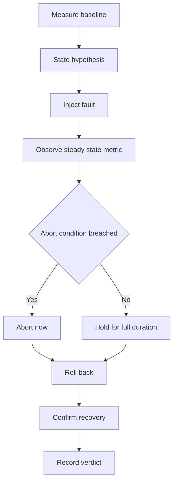

# Lecture 1 — Chaos Engineering Principles, the Experiment, and the Tooling

> **Duration:** ~2 hours of reading + hands-on.
> **Outcome:** You can state Netflix's four principles and turn each into a rule; design a hypothesis-driven chaos experiment with a steady-state metric, a bounded blast radius, and an abort condition; describe Chaos Mesh's architecture and how it injects faults without touching your code; and author the six canonical fault types as CRDs.

If you remember one sentence from this lecture, remember this one:

> **A chaos experiment is a falsifiable hypothesis about steady-state behavior, run by varying a real-world event, with the smallest blast radius that can still test the claim — and the metric that decides the verdict is chosen before you inject the fault, not after.**

Twenty-one weeks of building gave you a system with a resilience *story*: the outbox guarantees exactly-once, the region fails over in sixty seconds, the cart CRDT converges after a partition. Stories are hypotheses you haven't tested. This week you test them — not by reading the code again, but by reaching into the running system and breaking the exact thing the story says you survive, while a metric watches. The skill that makes you dangerous with chaos is not the tooling; it's the discipline of writing the hypothesis and choosing the metric *first*, so the experiment can come back and tell you "no."

---

## 1. The four principles, and the rule each one becomes

Chaos engineering has a canonical statement — the [Principles of Chaos Engineering](https://principlesofchaos.org/) — that came out of Netflix's experience running a system too big to reason about by inspection. There are four principles. Each one sounds abstract until you turn it into an operational rule you actually follow.

### 1.1 Build a hypothesis around steady-state behavior

**The principle:** define the system's "steady state" as a measurable output — a metric that, under normal conditions, stays in a known band. Then form a hypothesis that this steady state *continues* during a disruption.

**The rule it becomes:** *every experiment starts with a written, falsifiable hypothesis and the single metric that decides it.* Not "let's kill a pod and see." That's not an experiment; it's poking. The experiment is:

> **Hypothesis:** "When I kill one of the three `cart` pods, the cart-read error rate stays below the 1% SLO and p99 latency stays below 200 ms, because the Service load-balances to the surviving pods and the deployment reschedules the killed one."
> **Steady-state metric:** `sum(rate(cart_read_errors_total[1m])) / sum(rate(cart_read_total[1m]))` and the p99 histogram, watched for the experiment's duration.
> **Verdict:** the metric stays in band (hypothesis HELD) or it doesn't (REFUTED — a finding).

The metric is the heart of it. Steady state is not "the system is up"; it's a *number that means working*. RED metrics (Rate, Errors, Duration) from Week 17 are exactly this. If you can't name the metric, you can't run the experiment, because you have no way to tell "it survived" from "it limped."

### 1.2 Vary real-world events

**The principle:** inject the failures that *actually happen* — hardware dies, networks partition, dependencies slow down, disks fill, a deploy goes bad — not contrived ones. The value of an experiment is proportional to how realistic the event is.

**The rule it becomes:** *your experiments are drawn from your incident history and your architecture's real failure modes, not a generic menu.* For your capstone, the real-world events are specific: a Kafka broker dies (you run a 3-broker cluster; brokers die), a region's network partitions (you're active-active across two regions; the link between them is the most likely thing to break), the Postgres primary fails (single-writer-per-SKU depends on it), a Temporal worker outage (your payment workflow runs there), a certificate expires (mTLS everywhere). The six experiments this week map one-to-one onto those. You are not injecting random chaos; you are injecting *your* chaos.

### 1.3 Run experiments in production

**The principle:** the only environment that behaves like production is production. Staging has different scale, different data, different traffic shape. A bug that only appears at 1k RPS with real cardinality won't appear in your 10-RPS staging cluster.

**The rule it becomes — and the nuance:** *aim for production, but climb a ladder to get there, and never skip the rungs.* The honest version of this principle for a course (and for any sane org's first year) is the **non-prod → staging → prod ladder**: you prove the experiment is safe and bounded in a non-prod cluster, then staging, then a small blast-radius slice of prod, then wider. "Run in production" is the *destination*, not the first step. The teams that got burned by chaos engineering are the ones that read "run in production" as "start in production." For this week, your two Kind clusters are your non-prod and staging; the capstone's two-region deployment is as close to prod as the course gets. Run the ladder.

### 1.4 Minimize the blast radius

**The principle:** an experiment should affect the smallest possible slice of the system that can still test the hypothesis. You are deliberately injecting failure; the goal is to learn, not to cause an outage.

**The rule it becomes:** *every experiment is scoped (which pods, which percent) and time-boxed (a duration), and has an abort condition that stops it the instant it does real harm.* In Chaos Mesh terms, the `selector` scopes *which* targets, `mode` scopes *how many* (`one`, `fixed: 1`, `percent: 50`), and `duration` time-boxes it. The abort condition is the human or automated rule: "if the steady-state SLI breaches the SLO for more than 60 seconds, halt and roll back." This is the principle that separates chaos engineering from negligence. A blast radius of "all pods, no time limit, no abort" is not an experiment; it's a self-inflicted outage you'll write a *real* postmortem for.

> **The synthesis — the "minimum viable experiment":** the smallest, shortest, most-bounded fault that can still falsify your hypothesis. If killing one pod tests the claim, don't kill three. If 60 seconds shows the effect, don't run for an hour. Start small, widen only after the small version holds. This is the discipline that makes "break your own system" a professional practice instead of a liability.

---

## 2. The anatomy of a chaos experiment

Every experiment this week — and every drill in the capstone — has the same five parts. Write them down *before* you touch the cluster. This is the experiment design template:

1. **Hypothesis.** A falsifiable claim about steady state under the fault, with the *reason* you believe it ("because the Service load-balances to survivors"). The reason matters: when the hypothesis is refuted, the reason is the first thing that was wrong.
2. **Steady-state metric.** The single SLI that decides the verdict, with its normal band and the SLO threshold. You watch it before (baseline), during (the experiment), and after (recovery).
3. **The fault.** The exact event, scoped and bounded: which targets (`selector`), how many (`mode`), how long (`duration`). For your capstone, this is one of the six.
4. **Abort condition.** The pre-agreed signal that halts the experiment: usually "the steady-state SLI breaches the SLO for N seconds." Decided *before* you inject, so nobody negotiates it mid-fault.
5. **Rollback.** How you cleanly end the fault and confirm recovery — for Chaos Mesh, usually `kubectl delete` the chaos CRD, then watch the metric return to baseline. "Recovered" means the metric is back in band, not that the CRD is gone.

The experiment runs as the following loop, run once per experiment — it is the gameday in miniature:

1. **measure baseline** — establish the steady-state band; confirm the system is healthy.
2. **state hypothesis** — the falsifiable claim + reason, written down.
3. **inject fault** — the scoped, bounded `*Chaos` CRD.
4. **observe steady-state metric** — the verdict window; hold for the full `duration`.
5. **abort if breached** — if the abort condition trips, stop now.
6. **roll back** — `kubectl delete` the chaos CRD.
7. **confirm recovery** — metric back in band; for stateful invariants, run the audit.
8. **record verdict** — HELD or REFUTED, with the timeline.


*The eight-step experiment loop, from baseline to verdict, with the abort branch short-circuiting straight to rollback.*

### 2.1 Why the hypothesis has to come first

The single most common chaos-engineering mistake is running the fault and *then* deciding whether the result was fine. That's not science; it's rationalization. If you inject a broker loss, see the consumer lag spike to 40 seconds, and *then* ask "is 40 seconds OK?", you'll talk yourself into yes, because the alternative is admitting a problem two weeks before the demo. The fix is to commit to the verdict criterion before you can see the result: "the hypothesis is that consumer lag stays under 10 seconds." Now 40 seconds is unambiguously a refutation, and a refutation is a finding, and a finding is the point.

A refuted hypothesis is a *win*. It found a gap between your designed resilience and your actual resilience, in a controlled experiment, on a Tuesday, with a metric watching — instead of at 3 a.m. during a real broker failure with users watching. The gameday that refutes a hypothesis earned its time. The gameday that confirms every hypothesis either tested nothing interesting or had metrics too blunt to see the truth.

---

## 3. Chaos Mesh: the architecture and how injection actually works

You'll run **Chaos Mesh**, a CNCF chaos-engineering platform. Like Istio, it's a control plane plus a per-node data plane, and understanding the split is what lets you debug it.

### 3.1 The components

```
        ┌──────────────── chaos-controller-manager ─────────────────┐
        │  watches: *Chaos CRDs (PodChaos, NetworkChaos, ...)        │
        │  schedules + reconciles experiments; enforces duration     │
        │  selects targets via the selector; tells the daemon to act │
        └───────────────┬────────────────────────────┬──────────────┘
                        │ "inject fault on pod X"     │
        ┌───────────────▼────────────┐   ┌────────────▼─────────────┐
        │  chaos-daemon (DaemonSet)   │   │  chaos-dashboard (UI/API) │
        │  ONE per node; does the     │   │  author/observe           │
        │  actual injecting:          │   │  experiments               │
        │  - tc / netem (network)     │   └───────────────────────────┘
        │  - iptables (partition)     │
        │  - cgroups / stress-ng (CPU)│
        │  - a failpoint/FUSE (I/O)   │
        │  - kills the container (pod)│
        └─────────────────────────────┘
```

- **`chaos-controller-manager`** — the control plane. It watches your `*Chaos` CRDs, resolves the `selector` to a concrete set of target pods, enforces the `duration` (it knows when to *stop* the fault), and instructs the daemon on the right node to inject. It's the brain; it doesn't touch traffic itself.
- **`chaos-daemon`** — a **DaemonSet, one pod per node**, running privileged. This is the data plane: it enters the target pod's network/PID/mount namespaces and does the actual injecting using standard Linux primitives — `tc`/`netem` for network delay and loss, `iptables` for partitions, cgroups + `stress-ng` for CPU/memory pressure, a FUSE/failpoint layer for I/O faults, and a plain container kill for `PodChaos`. **Because it works at the kernel/namespace layer, it injects faults into your app without any app changes.** Your Rust cart service doesn't know it's being chaos-tested; the daemon adds 200 ms of latency to its network namespace from the outside.
- **`chaos-dashboard`** — a UI + API to author and observe experiments. Handy for exploration; for reproducibility you'll commit the CRDs as YAML (chaos-as-code), the same discipline as everything else this course.

### 3.2 The key insight: faults are injected at the infra layer, not the app layer

This is what makes chaos engineering with a tool like Chaos Mesh practical: **you don't instrument your application to be chaos-testable.** Compare to fault-injection-in-code (you'll do that in Week 23 at the unit level), where you add a "fail here 1% of the time" hook. That's valuable, but it only tests faults you *anticipated* and wired in. Infra-layer injection tests faults your app has *no idea about* — a partition it never coded for, a disk that fills under it, a pod that vanishes mid-request. The app's real behavior under a real-shaped fault is exactly what you want to observe, and you get it for free by injecting below the app.

The cost of this power: the daemon is privileged (it manipulates namespaces and kernel networking), so Chaos Mesh's own RBAC and the blast-radius scoping matter — a chaos tool with cluster-wide reach is a sharp instrument. The `selector`/`mode`/`duration` discipline isn't just good experiment design; it's how you keep a privileged fault-injector safe.

---

## 4. The six canonical experiments

These six are the spine of the week and map onto your capstone's named failure modes. Each is a Chaos Mesh CRD kind. Here's what each tests and a minimal, scoped example.

### 4.1 PodChaos — the pod vanishes

The simplest, most common fault: a pod dies. Tests whether your replication and load-balancing actually deliver availability.

```yaml
apiVersion: chaos-mesh.org/v1alpha1
kind: PodChaos
metadata: { name: cart-pod-kill, namespace: shop }
spec:
  action: pod-kill              # SIGKILL one pod (also: container-kill, pod-failure)
  mode: one                     # blast radius: exactly ONE pod
  selector:
    namespaces: [shop]
    labelSelectors: { app: cart }
  duration: "60s"               # time-boxed
```

**Hypothesis:** killing one of three `cart` pods keeps cart-read error rate < 1% and p99 < 200 ms (the Service routes to survivors; the Deployment reschedules). **Watch:** the cart RED dashboard. **The trap it catches:** a missing `PodDisruptionBudget`, a slow readiness probe that sends traffic to a not-ready replacement, or a singleton you *thought* was replicated.

### 4.2 NetworkChaos — partition, loss, delay

The richest fault for distributed systems. Tests timeouts, retries, circuit breakers, and — for your active-active cart — CRDT convergence after a partition heals.

```yaml
apiVersion: chaos-mesh.org/v1alpha1
kind: NetworkChaos
metadata: { name: region-partition, namespace: shop }
spec:
  action: partition             # also: delay, loss, duplicate, corrupt, bandwidth
  mode: all
  selector:
    namespaces: [shop]
    labelSelectors: { region: west }
  direction: both
  target:                       # partition west from east
    mode: all
    selector:
      namespaces: [shop]
      labelSelectors: { region: east }
  duration: "5m"
```

**Hypothesis (partition):** during a 5-minute west↔east partition, each region keeps serving cart reads/writes locally (active-active), and after heal the cart CRDT converges to a single state with no lost items. **Hypothesis (delay):** a 200 ms injected delay on the cart→inventory call keeps user-visible p99 acceptable because cart's retries + timeout budget absorb it. **The trap it catches:** a timeout longer than your retry budget (a slow dependency cascades), or a CRDT merge that loses writes instead of converging.

### 4.3 StressChaos — CPU and memory pressure

A pod doesn't die; it gets *slow* because a noisy neighbor (or its own load) eats the CPU. Tests autoscaling, load-shedding, and tail latency.

```yaml
apiVersion: chaos-mesh.org/v1alpha1
kind: StressChaos
metadata: { name: order-cpu-stress, namespace: shop }
spec:
  mode: one
  selector:
    namespaces: [shop]
    labelSelectors: { app: order }
  stressors:
    cpu: { workers: 4, load: 90 }   # 4 workers pinning ~90% CPU
  duration: "120s"
```

**Hypothesis:** under CPU stress on one `order` pod, the HPA/KEDA scales out and p99 recovers within the scale-up window, or load-shedding keeps the error rate bounded. **The trap it catches:** an HPA that scales on the wrong metric (CPU request set so high it never triggers), or tail latency that quietly violates the SLO without erroring — the "brownout" nobody alerts on.

### 4.4 IOChaos / disk-fill — the filesystem turns hostile

Disks fill (logs, a runaway temp file, a stuck compaction) and I/O slows. Tests how stateful components (Postgres, Kafka, Temporal) behave when their storage misbehaves.

```yaml
apiVersion: chaos-mesh.org/v1alpha1
kind: IOChaos
metadata: { name: kafka-io-latency, namespace: kafka }
spec:
  action: latency               # add latency to filesystem ops (also: fault -> errno)
  mode: one
  selector:
    namespaces: [kafka]
    labelSelectors: { app: kafka }
  volumePath: /var/lib/kafka     # the mount to afflict
  path: "**/*"
  delay: "100ms"
  percent: 50                    # half of I/O ops delayed 100ms
  duration: "120s"
```

Disk-*fill* (ENOSPC) is often done by a `StressChaos` memory/disk filler or a sidecar that `dd`s a large file onto the volume — Chaos Mesh's I/O fault can also return `ENOSPC` via `action: fault`. **Hypothesis:** Kafka under 100 ms I/O latency keeps producing/consuming with bounded lag because of its page cache and batching; a *full* disk, by contrast, takes the broker offline (which is the broker-loss drill). **The trap it catches:** a stateful service with no graceful-degradation path when its disk slows or fills — it hangs instead of shedding.

### 4.5 The Kafka broker-loss drill (the capstone's Drill B rehearsal)

Not a new CRD — it's a `PodChaos` aimed at a broker — but it deserves its own treatment because it tests the most important invariant in your system: **exactly-once.**

```yaml
apiVersion: chaos-mesh.org/v1alpha1
kind: PodChaos
metadata: { name: kafka-broker-loss, namespace: kafka }
spec:
  action: pod-kill
  mode: one
  selector:
    namespaces: [kafka]
    labelSelectors: { app: kafka, "strimzi.io/broker-role": "broker" }
  duration: "90s"
```

**Hypothesis:** killing one of three brokers mid-traffic causes a brief produce/consume stall while leadership re-elects, but **(a)** no messages are lost (ISR + `acks=all` + `min.insync.replicas=2` hold the durability line), and **(b)** the exactly-once consumer does **not** double-process — the outbox + idempotency keys mean a redelivered message is a no-op. **The verdict isn't "it recovered"; it's an idempotency-key audit proving zero double-charges.** This is Lecture 2's deep drill and Exercise 3.

### 4.6 The stretch faults: DNS and clock skew

Two more real-world events worth knowing exist:

- **DNS chaos** (`DNSChaos`): make a hostname fail to resolve or resolve wrong. Tests whether your service caches DNS too long, or melts down when a dependency's name briefly doesn't resolve. A shockingly common real outage cause.
- **TimeChaos** (clock skew): shift a pod's clock. Tests anything that depends on time agreement — token expiry, lease deadlines, your Week 2 fencing tokens, certificate validity. Distributed systems that assume synchronized clocks break here, which is the whole reason you spent Week 2 on logical clocks.

These are stretch because they're sharper and less common, but naming them completes the menu of "real-world events" principle 1.2 asks you to vary.

### 4.7 Choosing `mode`: the blast-radius dial

The `mode` field is the blast-radius dial, and getting it right is most of "minimize blast radius" in practice. The options:

- **`one`** — exactly one matching pod, chosen at random. The default for a first experiment: smallest possible blast radius that still tests "does losing *a* pod hurt?"
- **`fixed`** with `value: N` — exactly N pods. Use when you want to test losing a specific count (e.g. "lose 2 of 3 — does the majority survive?").
- **`fixed-percent`** / **`percent`** with `value: "50"` — a percentage of matches. Use to test proportional loss ("half the cart fleet vanishes").
- **`all`** — every matching pod. The biggest hammer. **Only ever use `all` with a tight `selector` and a `duration`**, because `all` with a broad selector is an outage, not an experiment. `all` is right for "kill every pod in *one* region" (the selector scopes it to that region); it's catastrophic for "kill every pod with label `app`."

The discipline: **start at `one`, widen deliberately.** Your first cart pod-kill is `mode: one`. Only after that hypothesis holds do you re-state a *new* hypothesis ("availability survives losing the majority") and widen to `fixed: 2` or `percent: "67"`. Each widening is a new experiment with its own hypothesis, not a casual escalation. The teams that got burned widened the blast radius without re-stating the hypothesis — they killed more pods "to see what happens," which is poking, not experimenting.

### 4.8 The `selector`: scoping which targets

The `selector` is how you say *which* pods, and it's the other half of blast-radius control. It supports `namespaces`, `labelSelectors`, `expressionSelectors`, `annotationSelectors`, `nodes`, and `pods` (named explicitly). The precision matters: a selector of `labelSelectors: { app: cart }` hits every cart pod across both regions; adding `region: west` scopes it to one region. For your active-active capstone, region-scoped selectors are how you test "lose one region" without touching the other — the partition experiment (§4.2) does exactly this by selecting `region: west` and targeting `region: east`.

A subtle trap: a selector that matches *nothing* (a typo'd label) produces an experiment that injects no fault and reports success — a false "the hypothesis held" because nothing was actually tested. Always confirm the selector matched the pods you intended: `kubectl get pods -l app=cart,region=west` should return the targets *before* you apply the chaos. The mesh-equivalent lesson from Week 8 applies here too: the CRD is your intent; confirm it resolved to the targets you meant.

---

## 5. Observability is the prerequisite, not the nice-to-have

Here's the rule that ties the whole lecture together: **chaos without observability is just downtime.** Every experiment's verdict comes from a metric. If you can't see the steady-state SLI in real time during the fault, you're not running an experiment — you're hoping. This is why Week 17 (the OpenTelemetry/Prometheus/Grafana pipeline) and Week 18 (the SLIs/SLOs) are hard prerequisites for this week, not background.

Concretely, before any experiment you must have:

- **The RED dashboard** for the target service (rate, errors, duration) open and live.
- **The steady-state SLI** identified as a specific Prometheus query, with its normal band and SLO threshold.
- **The abort alert** — ideally a Prometheus alert that fires (and, in the stretch, automatically halts the experiment) when the SLI breaches.

The gameday's single most embarrassing failure mode is injecting a fault, watching the dashboard, and realizing you don't actually have the metric that would tell you whether the hypothesis held. Find that gap *now*, building the experiments, not Friday in front of the cohort. If a planned experiment has no metric to judge it, either build the metric or drop the experiment — an unjudgeable experiment is worse than none, because it manufactures false confidence.

### 5.1 Steady state is a band, not a point

A subtlety that trips people: "steady state" is not a single value, it's a *band*. Your cart error ratio isn't exactly 0.001 forever; it wanders between, say, 0.0005 and 0.002 as load shifts. So the hypothesis isn't "the metric stays at 0.001" — it's "the metric stays inside its normal band, which we've established is below the 1% SLO." Before any experiment you spend a few minutes *establishing the band*: watch the SLI under steady load with no fault and note its natural range. Then, during the fault, a breach is the metric leaving that band in the direction that matters — not every wiggle.

This matters for the abort condition too. If your normal error ratio occasionally touches 2% under a traffic spike with no fault at all, then "abort if error > 1%" is a hair-trigger that'll fire on noise. The abort threshold has to sit *outside* the natural band, with a duration that filters transients ("> 5% for 60 s"). Setting it requires knowing the band, which requires watching steady state first. This is why "establish the baseline" is the literal first step of every experiment, not a formality.

### 5.2 The three windows: before, during, after

Every experiment is read across three windows, and each tells you something different:

- **Before (baseline):** establishes the band and confirms the system is actually healthy. Injecting a fault into an already-degraded system gives you an uninterpretable result — you can't attribute the breach to your fault. If the baseline isn't clean, *don't inject* — fix the system first.
- **During (the fault):** the steady-state SLI relative to the band/SLO. This is the verdict window. Hold the fault for its full `duration` (unless aborted) so you see the *sustained* effect, not just the transient at injection.
- **After (recovery):** the SLI returning to the band, *and* — for stateful invariants — the correctness audit. The recovery window is where "it recovered" and "it recovered correctly" diverge (Lecture 2 §2.3). A clean SLI recovery with a failed audit is the most dangerous outcome there is: it looks fine and isn't.

The scribe records all three windows with timestamps. "Inject at 14:03:10, SLI left band at 14:03:14, peaked 0.34 at 14:03:31, fault removed 14:04:40, SLI back in band 14:05:02, audit clean" is a complete experiment record. That record is the raw material for the postmortem, and writing it *live* — not reconstructing it from memory afterward — is what keeps the postmortem factual.

---

## 6. The tooling landscape: Chaos Mesh, Litmus, Gremlin

You'll run Chaos Mesh, but you should be able to place it among the alternatives, because "which chaos tool" is a real architecture decision and a likely interview question.

- **Chaos Mesh (CNCF, what you'll run).** CRD-per-fault: a `PodChaos`, a `NetworkChaos`, etc. The model is "chaos-as-code" — your experiments are Kubernetes resources you commit to git, apply, and delete. Strengths: deep Kubernetes-native fault coverage (network, I/O, time, kernel), a clean CRD surface that fits GitOps, and the `Schedule`/`Workflow` resources for continuous and chained chaos. It's the natural fit for a team already living in CRDs (which, after 21 weeks of Istio and Strimzi, you are).
- **LitmusChaos (CNCF, the alternative).** Built around an **experiment hub** — a catalog of pre-built, parameterized experiments — and **chaos workflows** that sequence them, with a heavier UI/portal and a "ChaosEngine + ChaosExperiment" CRD split. Strengths: the hub's library means less authoring; the workflow model is first-class. The trade: more moving parts than Chaos Mesh's lean CRDs. For an org that wants a curated catalog and a portal, Litmus; for an org that wants minimal, git-committed fault definitions, Chaos Mesh. You'll reproduce one experiment on Litmus in the stretch so the comparison is yours, not a blog's.
- **Gremlin (commercial SaaS).** A hosted control plane with a polished blast-radius UI, "status checks" (automated health gating), a large fault catalog, and enterprise features (RBAC, audit, scheduling, multi-cloud). What you pay for is the *operational wrapper* around chaos — the safety rails, the reporting, the "halt all experiments" button — not fundamentally different faults. The honest "when you'd pay for it" line: a large org running chaos across many teams in production, where the centralized safety controls and audit trail are worth real money. For a course and most mid-size orgs, the open-source tools cover the substance.

The decision framework: the *faults* are commodity (everyone can kill a pod or add latency). What differs is the **safety and operations wrapper** — blast-radius controls, automated abort, scheduling, RBAC, audit, reporting. Choose the tool whose wrapper matches your org's chaos maturity and scale. A two-person team starting out wants Chaos Mesh's simplicity; a 200-engineer org running prod chaos daily wants either a hardened Litmus install or Gremlin's hosted controls.

### 6.1 Infra-layer chaos vs application-layer fault injection

It's worth being precise about where Chaos Mesh's faults live versus the fault injection you'll do in Week 23, because they're complementary, not competing:

- **Infra-layer chaos (this week, Chaos Mesh).** Injects below the app — at the network namespace, the cgroup, the filesystem, the pod lifecycle. The app has *no idea* and no code for it. This tests the app's *real, emergent* behavior under faults it never anticipated: a partition it never coded for, a disk that fills under it, a pod that vanishes mid-request. The value is precisely that it tests the unanticipated.
- **App-layer fault injection (Week 23, in-code).** A hook inside the app — "throw here 1% of the time," a Pact-driven failing response, a property-based test that feeds adversarial inputs. This tests faults you *anticipated* and wired a probe for. The value is precision and determinism: you can target a specific code path and reproduce it exactly in a unit test.
- **Mesh-layer fault injection (Week 8, Istio).** A middle layer: the `VirtualService` fault (latency/abort) injects at the proxy without app code, but it's scoped to a route and is more deterministic than kernel-level chaos. Good for testing caller resilience to a slow/erroring dependency.

The mature posture uses all three: in-code property and contract tests catch anticipated faults deterministically in CI (cheap, fast, every commit); mesh fault injection tests caller resilience per-route in staging; and infra-layer chaos tests the unanticipated, emergent, whole-system behavior in the gameday. This week is the third; next week is the first. Neither replaces the other — a system that passes its property tests can still melt down under a real partition, and a system that survives the gameday can still ship a contract-breaking change. You need the whole ladder.

### 6.2 A note on chaos in CI vs the gameday

One more distinction worth holding: a *scheduled, small, automated* chaos experiment (the `Schedule` resource, the "continuous chaos" stretch) and a *live, human-run* gameday are different instruments. The scheduled experiment is a regression guard — a small, safe, bounded fault that fires every hour and pages if a previously-held hypothesis starts failing, catching the day someone removes a `PodDisruptionBudget`. The gameday is a *learning* exercise — humans in the room, novel faults, diagnosis practice, the surprise that points at a mental-model gap. You want both: continuous chaos to catch regressions automatically, periodic gamedays to learn things automation can't. Don't let a green continuous-chaos dashboard convince you you've "done chaos engineering" — automation catches the known; the gameday finds the unknown.

---

## 7. Recap

You should now be able to:

- State Netflix's four principles and the rule each becomes: hypothesis-first with a metric; vary *your* real failure modes; aim for prod via the non-prod→staging→prod ladder; minimize blast radius (the minimum viable experiment).
- Write a five-part experiment: hypothesis (with a reason), steady-state metric, the scoped+bounded fault, the abort condition, and the rollback — all *before* injecting.
- Explain why the hypothesis and metric must precede the fault, and why a refuted hypothesis is a win, not a failure.
- Describe Chaos Mesh's controller-manager / chaos-daemon / dashboard split and how the daemon injects faults at the kernel/namespace layer without app changes.
- Author the six canonical faults — `PodChaos`, `NetworkChaos`, `StressChaos`, `IOChaos`/disk-fill, the Kafka broker-loss drill — each scoped with `selector`/`mode`/`duration`, and name the trap each one catches.
- State why observability is a hard prerequisite: every verdict is a metric, and chaos without a metric is just downtime.
- Place Chaos Mesh among the alternatives (Litmus, Gremlin) and explain that faults are commodity while the safety/ops wrapper is what differs — and how infra-layer chaos complements app-layer fault injection and continuous-chaos automation.

Next up: the gameday itself — the runbook, the roles, the broker-loss/exactly-once drill in full, and the blameless postmortem that turns a finding into an action item. Continue to [Lecture 2 — The Gameday and the Blameless Postmortem](./02-the-gameday-and-the-blameless-postmortem.md).

---

## References

- *Principles of Chaos Engineering*: <https://principlesofchaos.org/>
- *Chaos Mesh — Architecture / Overview*: <https://chaos-mesh.org/docs/>
- *Chaos Mesh — PodChaos*: <https://chaos-mesh.org/docs/simulate-pod-chaos-on-kubernetes/>
- *Chaos Mesh — NetworkChaos*: <https://chaos-mesh.org/docs/simulate-network-chaos-on-kubernetes/>
- *Chaos Mesh — StressChaos*: <https://chaos-mesh.org/docs/simulate-heavy-stress-on-kubernetes/>
- *Chaos Mesh — IOChaos*: <https://chaos-mesh.org/docs/simulate-io-chaos-on-kubernetes/>
- *LitmusChaos — Docs*: <https://docs.litmuschaos.io/>
