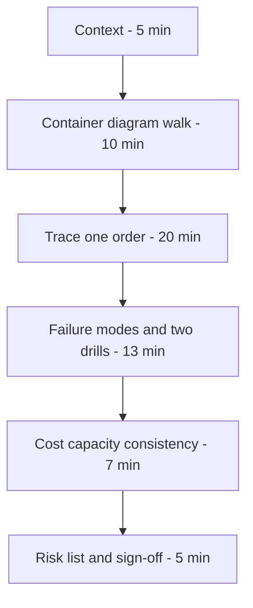
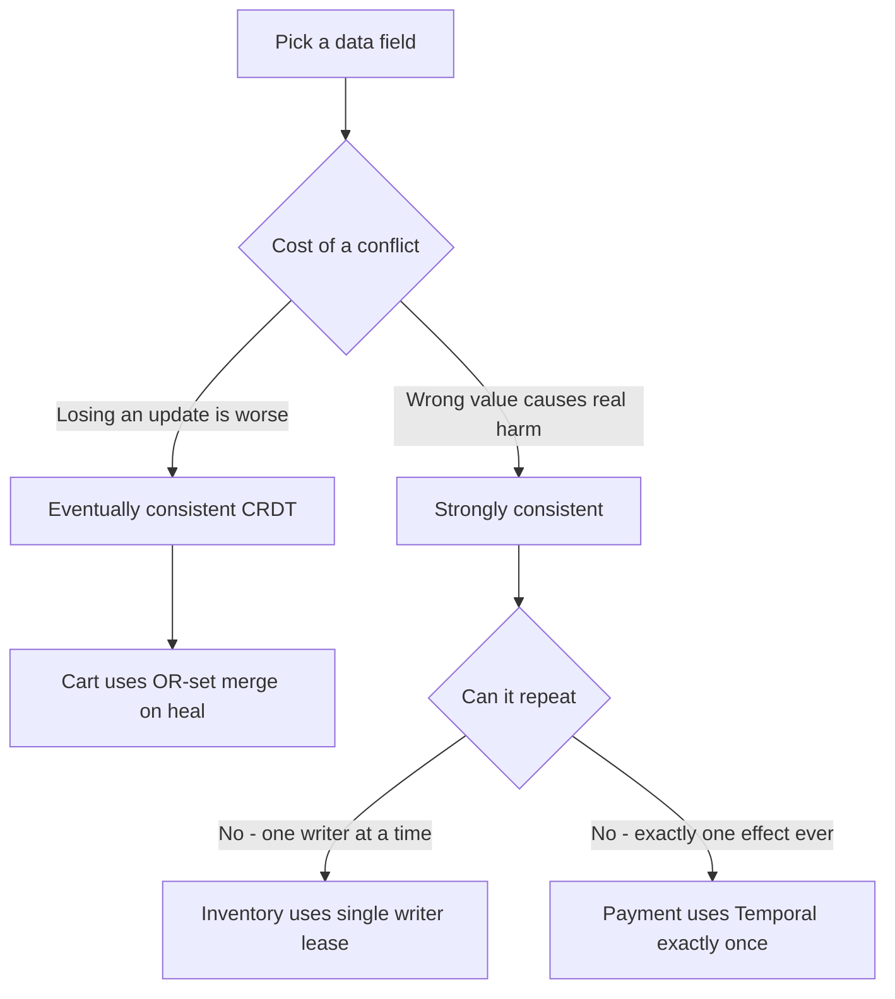

# Lecture 1 — Defending an Architecture: The Staff-Engineer Review

> **Reading time:** ~75 minutes. **Hands-on time:** ~45 minutes (you draft your review packet and rehearse the trace-an-order walk).

This is the lecture that turns "I built a distributed system" into "I can defend a distributed system." You have spent twenty-three weeks accumulating the primitives — consensus, CRDTs, mesh, event streaming, multi-region, zero-trust, chaos. This week you assemble them into the Polyglot Marketplace Backbone and stand in front of people whose job is to find the failure mode before your users do: the cohort and **two external reviewers**, in the capstone defense the syllabus mandates for Friday. That meeting has a name — the **architecture review** — and at a real company it is the gate between a design and the engineer-years that build it. If you have never sat in one, you imagine it as a hostile interrogation. It is not. A good architecture review is a structured collaboration with a known agenda, a known artifact set, and a known question bank. By the end of this lecture you will know the agenda, the artifacts you bring, the exact questions a staff engineer asks a *distributed-systems* design, and how to walk a single order through your system on camera without losing the room.

If you remember one sentence from this lecture, remember this one:

> **A review is a one-hour search for the risks that would otherwise take six months to find in production — and the move that reads most senior is to name your own biggest risk before anyone asks.**

---

## 1.1 — What an architecture review is actually for

An architecture review exists to surface, in one hour, the risks that would otherwise surface in production over six months. That is the whole job. Everything in the format serves that goal.

It is **not** a status update. It is not "here is what I built, please clap." The reviewers do not care that you used Istio; they care whether you can say *why* a mesh and not a library, what the sidecar costs, what breaks if a region goes dark, whether your cart actually converges after a partition, and whether your payment can double-charge under broker loss. The deliverable of the meeting is a list of risks, each tagged **accept**, **mitigate now**, or **mitigate later**, with an owner. A review that ends without that list failed, no matter how good the diagrams were.

There are three kinds of review you meet in industry, and the capstone defense simulates all three at once:

1. **The design review** (before you build). The system is a document; reviewers stress the *plan*. Cheapest place to find a mistake.
2. **The pre-production review** (before you launch). The system runs; reviewers stress the *implementation* and ask the operational questions: how do you roll back, what pages you, what's the blast radius.
3. **The post-incident review** (after it broke). The blameless postmortem; reviewers stress the *gap* between what you thought would happen and what did.

Your capstone defense is a pre-production review with two postmortems bolted on (Drills A and B). That is deliberate: it's the most demanding combination, and it's exactly what a hiring panel runs when they put you in front of a whiteboard and say "walk me through a distributed system you built and operated."

Why does the format work? Because it forces the conversation onto the *risks* and away from the *features*. Left to their own devices, engineers presenting a system narrate what they built — "and then I added Istio, and then I added Temporal" — which tells a reviewer nothing about whether the system is correct. The review format inverts that: the agenda (§1.3) spends its central twenty minutes tracing one request and naming the failure at each hop, and the question bank (§1.4) is entirely about what *breaks*. The features are assumed; the risks are interrogated. An engineer who internalizes this stops *presenting* their system and starts *stress-testing* it out loud, which is the senior move. The very best capstone defenders run the review on themselves before Friday — they sit alone with their diagram and ask "what's the single point of failure, where do I lose data, what pages me at 3am" until they have an answer to every one. Then the actual review holds no surprises, because they already found the risks the reviewers would.

---

## 1.2 — The artifact set you bring to the table

You do not walk into a review and start typing in a terminal. You bring a packet — the thing the reviewers read *before* the meeting so the hour is spent on questions, not catching up. The capstone packet maps one-to-one onto the syllabus's required deliverables:

1. **The C4 architecture document (2,000 words).** Context, container, and component diagrams (component-level for two key services), plus the prose that defends the design. This is the pre-read. If you cannot draw the system at the container level on one page, you do not understand it yet.

2. **The SLO sheet.** One table, one row per user-facing service (order, cart, search, the BFFs). Columns: the SLI, the SLO target, the measured value, the error budget, the burn-rate alert. Reviewers read this first because it defines what "working" means before they ask whether it works.

3. **The two chaos-drill postmortems.** Drill A (region failover) and Drill B (broker loss). What you broke, what happened, what you expected, the gap, the action items. These are the artifacts that separate engineers who have *operated* systems from engineers who have only *built* them. A reviewer reads them to learn whether you can run an incident, not just write code — which is exactly the staff-engineer signal a hiring panel is hunting for.

4. **The cost / capacity model.** The order-service capacity memo from Week 23, plus the per-order cost. Reviewers test whether your numbers are real (measured) and whether your sizing survives a 2x.

5. **The runbook (6 pages).** Five named failure modes: region loss, broker loss, Postgres primary failure, Temporal worker outage, certificate expiry. Reviewers read the *first line* of each and judge whether your observability lets you answer "what's wrong" in one look.

6. **The green Pact broker URL.** A required deliverable; the reviewers click it. A green broker proves your polyglot boundaries can't silently break.

Bring all six. The container diagram and the SLO sheet go on screen during the meeting; the rest are pre-reads.

A note on the SLO sheet, because it sets the vocabulary of the whole review: reviewers can't ask "does it work" until you've told them what "work" *means*. The sheet is one table, one row per user-facing service, and three columns a reviewer reads instantly. First, the **SLI** must be *user-meaningful* — "fraction of orders placed successfully within 500ms," not "CPU < 80%." Second, the **measured** column must be *populated* — real numbers from the load test (Week 23's capacity work and this week's drills), not "TBD." A populated measured column tells the reviewer you actually ran this thing under load; a "TBD" tells them you didn't. Third, the **burn-rate alert** column proves the alert exists and is tuned to page on a *fast* burn, not on every blip (Week 18). The row candidates most often forget is the **asynchronous** path: "order placed (synchronous, edge → 202)" is one SLO, but "order propagated to the search read model (async, via CDC)" is a *separate* SLO with its own latency budget — and it's the one that bends under the broker-loss drill. Putting both on the sheet shows you understand that "the system is fast" is two claims about two paths.

---

## 1.3 — The agenda: sixty minutes, structured

A review that wanders is a review that doesn't find the risk. Here is the hour you'll run on Friday:

- **Minutes 0–5 — Context.** What is this system *for*? A marketplace backbone: customers place orders, two regions, active-active, with the consequence-of-downtime being lost sales and double-charges. One sentence of business context, one of scale ("steady 200 rps, flash-sale peak 1k"), one of the consistency requirement ("cart is eventually-consistent CRDT; payment is strongly-consistent exactly-once"). No architecture yet.
- **Minutes 5–15 — The container diagram walk.** Put the C4 container diagram on screen and walk it: the BFFs at the edge, order as the orchestrator, cart/inventory/payment as the domain services, the Kafka spine, the Temporal cluster, Postgres + Debezium, search/analytics on the read side. Establish the *shape*, not yet the mechanism.
- **Minutes 15–35 — Trace one order.** The heart of the meeting. Pick one order and follow it through every hop, naming the failure mode at each. This is where reviewers interrupt with the hard questions, and you let them. (§1.5.)
- **Minutes 35–48 — Failure modes and the two drills.** Go off the happy path. Walk Drill A (region failover) and Drill B (broker loss) — the measured recovery, the proven zero-double-charge. The reviewers probe the data-loss windows and the consistency guarantees.
- **Minutes 48–55 — Cost, capacity, and consistency.** The capacity memo, the per-order cost, and the per-field consistency model (which fields are CRDT, which are strongly consistent, and why).
- **Minutes 55–60 — Risk list and sign-off.** The reviewers state the risks, tag each accept/mitigate-now/mitigate-later, assign owners. You write them down. That list is the output, and it becomes your README's "known limitations."


*The structured hour of an architecture review, minute by minute.*

The two minutes that matter most are 15–35, the trace-one-order block. Everything before it is setup; everything after it is the reviewers testing what the trace revealed. If the trace walk goes well — one order, every hop, the trace-to-log jump, narrated calmly while the reviewers interrupt — you've established that the system is real and observable, and the rest of the hour is a conversation between peers about its tradeoffs. If the trace walk goes badly (a cold system, a broken trace, a fumbled narration), you spend the rest of the hour climbing out of a hole. This is why §1.10 says rehearse it three times: it's not the longest segment, but it's the one that sets the tone for the other forty-five minutes. Budget your preparation accordingly — the trace walk earns more rehearsal than any other part of the defense.

---

## 1.4 — The questions a staff engineer asks a distributed system

This is the part you came for. Below is the question bank, specialized for *this* course's material. A staff reviewer asks the five your diagram makes them nervous about; your job is to have an answer to every one *before* the meeting so the five they pick are easy.

### Consistency and correctness

- **"Which parts of this system are strongly consistent, and which are eventually consistent — and why each?"** The honest answer names the per-field model: the cart is an OR-set CRDT (eventually consistent — a customer adding to their cart in two regions must converge, and losing an add is worse than a brief disagreement); inventory is single-writer-per-SKU with a lease (strongly consistent — you cannot oversell); payment is exactly-once via a Temporal workflow (strongly consistent — you cannot double-charge). "Everything is strongly consistent" is the *wrong* answer — it says you didn't think about the CAP tradeoff per data type, which is the entire Phase 1 of this course.


*Why the same system chooses eventual consistency for the cart and strict consistency for inventory and payment.*

- **"Prove your cart converges after a partition."** You show the property test (Week 23) that proves the merge is commutative/associative/idempotent, *and* the live partition-heal demo. One is evidence over the input space; the other is the demonstration. "It seemed to work" is not a proof; the algebraic laws are.
- **"Where can you lose data, and how much?"** Walk every hop. At the edge: a request lost before order accepts it — the client retries with an idempotency key. At the Kafka spine: at-least-once delivery, so you dedupe downstream (the idempotency key + outbox). At payment: exactly-once via the workflow + the DB unique constraint. The honest answer names the *window* at each hop, in messages and seconds.

### Blast radius and failure domains

- **"What is the single biggest blast radius in this diagram?"** Every system has one; "there isn't one" is the wrong answer. For the capstone it's often the Temporal cluster (if it's down, no new charges complete) or the shared Kafka spine. Name it and say what you do about it.
- **"Kafka loses a broker mid-traffic — what happens?"** This is Drill B, and you should answer from the *measured* drill: the producers retry to the surviving in-sync replicas, the consumers' offsets are durable, the idempotency keys + outbox mean a redelivered message doesn't double-process, and you *demonstrated* zero double-charge. "I think it's fine" loses; "I ran the drill, here's the postmortem, the DLQ stayed empty and no order was charged twice" wins.
- **"A region goes dark under load — walk me through it."** This is Drill A. Two failure domains fail differently: the cart (CRDT) keeps serving from the surviving region and converges on heal; inventory's leases for SKUs whose writer was in the dead region must be re-acquired; in-flight Temporal workflows resume on workers in the surviving region. The measured RTO and the zero-data-loss claim come from the drill, not from hope.

### The mesh and zero-trust

- **"Show me that mTLS is actually enforced, not just installed."** You show `istioctl` reporting STRICT effective and a plaintext call from outside the mesh being refused — the Week 8 discipline. "We have a mesh" is the industry's favorite false sense of security; "here's the wire-level proof plaintext is refused" is the answer.
- **"Your AuthorizationPolicy / OPA — what stops a compromised order pod from calling payment directly?"** Deny-by-default plus explicit allows keyed on SPIFFE principals (Week 21), so only the intended call paths work and a lateral-movement attack fails at the data plane. You can show the denied call.

### Operations and observability

- **"It's 3am, you're paged that order-latency is burning. Walk me through the first five minutes."** The page names the burning SLO. You open the order dashboard, check the RED signals, look at the trace exemplars on the latency spike, and decide mitigate-then-investigate. If the answer is "I'd look at the logs," that's too vague — *which* logs, filtered to *what* trace?
- **"How do you roll back a bad deploy, and how long does it take?"** The weighted canary: a bad v2 is caught by the SLO burn-rate alert and the canary weight goes to 0 — instant, no redeploy (Week 8). With Flagger, automatic.

### Cost

- **"What does one order cost you, and what's fixed vs per-order?"** The capacity memo's number. The senior insight (same as every capstone): most of the cost is the *fixed* always-on replicas and the substrate (Kafka, Temporal, Postgres, the mesh control plane), not per-order — so the optimization lever is "is the floor justified," not "make each order cheaper."
- **"You run two regions active-active. What does the second region cost, and is it worth it?"** This is the honest multi-region question. Active-active roughly doubles the substrate cost and adds the cross-region coherency cost (the CRDT anti-entropy traffic — the USL β term). The defense is the *requirement*: "a region loss without the second region is a full outage; with it, it's a 47-second blip (Drill A). For a marketplace, an hour of downtime costs more than the second region's monthly bill — here's the math." If you *can't* justify the second region against the cost of downtime, you've over-built, and naming that honestly is better than pretending the cost is free.

The discipline across all of these: **never answer a question without a number you can show, and never claim a number you didn't measure.** The cost comes from the capacity memo, the RTO from Drill A, the no-double-charge from Drill B's empty query, the convergence from the property test and the live demo. A defense built on measured numbers is one a reviewer trusts; a defense built on estimates collapses the moment they say "show me."

---

## 1.5 — Trace one order: the demo that wins the room

The single most effective thing you do in the review is trace one real order through the live system, on screen, using your own observability. Not a slide of the trace — the actual trace. Here is the shape of that walk and the commands you run live.

Place one order with a known idempotency key so you can find it again:

```bash
ORDER_ID="demo-$(date +%s)"
BFF=$(kubectl get svc bff-web -n shop -o jsonpath='{.status.loadBalancer.ingress[0].ip}')

grpcurl -plaintext \
  -H "x-idempotency-key: ${ORDER_ID}" \
  -d "{\"customer\":\"acme\",\"sku\":\"SKU-42\",\"qty\":1}" \
  "${BFF}:443" order.v1.OrderService/PlaceOrder
```

Then show the order took every hop. The cart read (CRDT), strongly-consistent in the local region:

```bash
grpcurl -plaintext -d '{"customer":"acme"}' \
  cart.shop.svc.cluster.local:50051 cart.v1.CartService/GetCart
```

The inventory reservation (the lease was acquired — single-writer-per-SKU):

```bash
grpcurl -plaintext -d '{"sku":"SKU-42"}' \
  inventory.shop.svc.cluster.local:50051 inventory.v1.InventoryService/GetStock
# reserved: 1, lease_holder: order-service, region: us-east
```

The payment (the Temporal workflow charged exactly once):

```bash
temporal workflow show --workflow-id "charge-${ORDER_ID}" --namespace marketplace
# WorkflowExecutionCompleted  result: {charge_id: ch-..., status: charged, idempotency_key: demo-...}
```

Then — the moment that wins the room — show the distributed trace that ties all of it together. Because every service emits OpenTelemetry, one trace ID spans the BFF, order, cart, inventory, payment, the Kafka produce, and the search index. You pull the waterfall:

```bash
TRACE_ID=$(otel-cli trace search --attr "x-idempotency-key=${ORDER_ID}" --limit 1 --format id)
otel-cli trace get --id "$TRACE_ID" --format waterfall
```

When you put that waterfall on screen and say "here is one order, 142 milliseconds end to end, mTLS on every hop, the lease acquired here, the payment charged exactly once by this Temporal workflow, the event on the Kafka spine with the outbox committed," you've demonstrated more than any slide: that the system is *observable*, which is the property that lets you operate it.

### 1.5b — The trace-to-log jump

The move that turns a good demo into a great one is the **trace-to-log jump**. From the payment span in the waterfall, click through to the exact log lines that span emitted — in Grafana, an exemplar on the latency metric links to the trace, and a span links to its Loki logs. On screen:

> "Here's the payment span, 38 milliseconds. I click it, and Grafana takes me straight to the log lines this span wrote — here's the idempotency-key check, here's the DB unique-constraint commit, here's the charge confirmation. One click from a latency spike to the exact log line that explains it."

That jump is the whole observability story of the course in one gesture: metrics → traces (via exemplars) → logs (via trace ID), correlated. A reviewer who sees you go from a number on a dashboard to the log line that explains it in one click stops worrying about whether you can debug this at 3am — because you just showed them you can.

### 1.5c — Why the trace beats the five separate queries

You could prove the order flowed through the system by querying each store separately — the cart, the inventory DB, the Temporal history, the Kafka topic, the search index. Five queries, five confirmations. So why is the single trace better evidence? Three reasons, and they're worth stating because a reviewer notices the difference:

- **The trace proves the hops are *connected*, not just that each happened.** Five separate queries show five things happened; they don't show they happened *for the same request, in causal order*. The trace, with one trace ID propagated through every hop, proves the causal chain — that *this* order's BFF call caused *this* inventory reservation caused *this* payment. Connection is the property that matters, and only the trace shows it.
- **The trace shows the *timing*, which is where the bugs hide.** The waterfall shows where the 142 milliseconds went. If a hop is unexpectedly slow, the trace pinpoints it; five queries can't. "The payment span is 38ms and everything else is single-digit" is a performance diagnosis the separate queries can't give you.
- **The trace proves the *observability works*, which is the meta-point.** The reviewer isn't really asking "did this order flow through" — they're asking "can you *operate* this system." A working end-to-end trace answers the real question: yes, when something breaks at 3am, you have a single artifact that shows the whole request path. That's the property that makes a distributed system operable, and the trace *is* that property, demonstrated.

So when a reviewer asks "show me an order went through," you *can* run the five queries — but you *lead* with the trace, because it proves connection, timing, and observability all at once, which the queries don't.

---

## 1.6 — Surfacing your own risks first

The single highest-leverage move in a review is to name your own biggest risk before anyone asks. It does two things: it shows you actually understand the system's weaknesses (juniors think their design is flawless; seniors know exactly where the bodies are), and it sets the agenda so reviewers spend their energy on the risk you already know about instead of hunting for a gotcha.

For the capstone, the honest self-named risks are usually:

1. **The Temporal cluster is a shared failure domain.** "If Temporal is down, no new charges complete — orders accept and queue, but money doesn't move. I chose a single Temporal cluster for the capstone budget; the production fix is a multi-region Temporal deployment, and here's what that costs."
2. **The cart's eventual consistency is a deliberate weakness.** "A customer's cart can briefly disagree across regions during a partition. I accept that because the OR-set converges on heal and losing an add is worse than a brief disagreement — but if this were a bank balance, eventual consistency would be the wrong choice and I'd pay for strong consistency."
3. **The two-region active-active doubles the coordination cost.** "Active-active means the CRDT anti-entropy runs cross-region continuously — that's a coherency cost (the USL β term from Week 23) that caps how far this scales. I measured the ceiling; here it is."

A reviewer who hears you name these walks away thinking *this person has operated systems*. That's the impression that gets the senior offer.

---

## 1.6b — The C4 document: the pre-read that does half the work

The architecture document is the artifact reviewers read *before* the meeting, and a good one means the hour is spent on questions instead of catch-up. The syllabus asks for a **C4-style** document — Simon Brown's model of four zoom levels — and the reason C4 is the right tool is that it forces you to express the system at the right altitude for each audience, with labeled edges instead of decorative clip art.

The four levels, and how much of each the capstone needs:

- **System Context** (one diagram). The marketplace as a single box, the actors around it (customer, the external payment processor, the object store), and the relationships. This is the "what is this, who uses it" level — the first ten seconds of the review.
- **Container** (one diagram, the one you walk live). The deployable units: each service, the Kafka spine, Temporal, Postgres, the read stores, the mesh. **Every arrow labeled with the protocol and the rough throughput.** This is the diagram on screen for most of the hour.
- **Component** (two diagrams, for two key services). Zoom into two services with interesting internals — the CRDT cart (its merge, its anti-entropy loop, its per-region replica) and the payment workflow (the Temporal saga, its compensation steps, the idempotency store). This is where you show you understand the *insides*, not just the boxes.
- **Code** (skip). C4's fourth level is class-diagram detail; the capstone doesn't need it. Knowing to *stop* at component is itself good judgment.

Here is the capstone's container diagram in Mermaid C4 — the one you put on screen:

```
C4Container
  title Container diagram - Polyglot Marketplace Backbone (one region shown)
  Person(customer, "Customer", "places orders")
  System_Boundary(mp, "Marketplace Backbone") {
    Container(bff, "bff-web / bff-mobile", "Go", "thin BFFs over the gRPC backbone")
    Container(order, "order-service", "Python", "orchestrates the saga; emits order.placed.v1")
    Container(cart, "cart-service", "Rust", "OR-set CRDT cart, active-active")
    Container(inv, "inventory-service", "Go", "stock counts, single-writer-per-SKU lease")
    Container(pay, "payment-service", "Go + Temporal", "charge/refund saga, exactly-once")
    ContainerQueue(kafka, "Kafka spine", "order.placed.v1 + outbox")
    ContainerDb(pg, "Postgres + Debezium", "per region, logical replication + CDC")
    Container(search, "search-service", "Python", "Elasticsearch read model via CDC")
  }
  Rel(customer, bff, "places order", "gRPC/HTTPS, ~1k rps peak")
  Rel(bff, order, "PlaceOrder", "gRPC, mTLS")
  Rel(order, cart, "GetCart", "gRPC, mTLS")
  Rel(order, inv, "Reserve", "gRPC, mTLS")
  Rel(order, pay, "Charge", "gRPC, mTLS")
  Rel(order, kafka, "order.placed.v1", "produce, outbox-committed")
  Rel(kafka, search, "consume", "at-least-once + idempotent")
  Rel(pg, kafka, "CDC", "Debezium")
```

The test to apply before the review: hand the rendered diagram to someone who's never seen your system and ask them to trace one order out loud. If they can, the diagram is good. If they stall — "wait, is this arrow a call or a data flow?" — you have an unlabeled or ambiguous edge, and you fix it before the meeting, not during it. A container diagram a stranger can read is one a reviewer can interrogate efficiently, which is the whole point of bringing it.

## 1.6c — A worked transcript: the consistency question

Reading the question bank is one thing; hearing how a good answer *sounds* is another. Here is a reconstructed exchange from a capstone-style review, lightly edited. "R" is the staff reviewer.

> **R:** Your cart is a CRDT and your inventory is a lease. Walk me through why they're different, and what breaks if you got it backwards.
>
> **Candidate:** They're different because the cost of being wrong is different for each. The cart is the customer's shopping cart — if two regions both accept an "add to cart" during a partition, I want *both* adds to survive. Losing an add is worse than a brief disagreement, and an OR-set converges on heal so the disagreement is temporary and the adds are never lost. That's an availability-favoring, eventually-consistent choice, and it's correct *because* the data tolerates it. Inventory is the opposite: if two regions both decrement the same SKU's stock during a partition, I've *oversold*, and I can't un-sell. So inventory is single-writer-per-SKU with a lease — only one region holds the write lease for a SKU at a time, which is a consistency-favoring choice that refuses to oversell even if it means a SKU's writes pause during a failover.
>
> **R:** So what breaks if you swapped them?
>
> **Candidate:** If I made the cart a lease, a partition would block cart writes in the non-leaseholder region — customers couldn't add to their carts, which is an availability outage for a feature that didn't need strong consistency. And if I made inventory a CRDT, concurrent decrements in two regions would both succeed and merge, and I'd oversell — I'd sell ten of an item I had five of. The CRDT's "both writes survive" property, which is exactly what I *want* for the cart, is exactly what I must *not* have for inventory. Same primitive, opposite correctness outcome, because the data has opposite tolerance for the conflict.
>
> **R:** And payment?
>
> **Candidate:** Payment is the strictest — exactly-once. A double-charge is a refund and a furious customer, so I use a Temporal workflow with an idempotency key and a DB unique constraint. The workflow's durable history means an in-flight charge resumes after a worker or region failure and completes once; the unique constraint means even a redelivered message can't create a second charge. I proved that in Drill B — the broker-loss drill — where the double-charge query came back empty under exactly the failure that would cause one.

Notice what made that answer strong. The candidate tied each consistency choice to the *cost of being wrong* for that specific data, showed they understood the choices were *opposite on purpose* (the same CRDT property is a feature for the cart and a bug for inventory), and closed with *measured evidence* (Drill B) rather than a claim. That's the shape of every good review answer: specific, tied to the requirement, honest about the tradeoff, and backed by a measurement.

## 1.7 — The failure modes of the *reviewer*

Reviews fail in both directions. Know the reviewer anti-patterns so you can steer around them, because a derailed review wastes the one hour you get.

- **The bikeshedder.** Spends fifteen minutes on a Protobuf field name and never reaches the data-loss window. Steer: "Happy to take naming offline — can we make sure we cover the broker-loss drill while we have everyone here?"
- **The "I'd have used Kafka differently" reviewer.** Wants to redesign your system as theirs. Acknowledge and redirect: "NATS would also work; here's why Kafka won for *this* workload [retention / the team knows it / the outbox integration]. Is there a risk in the choice I made specifically?"
- **The silent reviewer.** Says nothing, then sandbags afterward. Draw them out: "I haven't heard from you — is there a failure mode you're worried about?"
- **The deep-diver.** Goes three levels into the Raft internals of etcd and never surfaces. Time-box: "Let's spend two more minutes here, then I want to cover the consistency model."

Your job as presenter is to *run* the meeting even though you're the one being reviewed. The candidate who manages the room — keeps it on the agenda, surfaces their own known risks first, writes down the action items — reads as senior regardless of the architecture.

---

## 1.8 — Common ways candidates lose the review

The recurring own-goals, each avoidable with preparation:

- **Reading the diagram instead of walking it.** "This is order, this is cart, this is Kafka…" narrating boxes without data flow or failure modes. Walk the *order*, not the *components*.
- **Defending a choice on taste.** "I used Istio because it's the best mesh." A reviewer hears "I don't know the tradeoff." Defend on the requirement: "I used a mesh because I need uniform mTLS across a polyglot fleet without each team implementing TLS, and here's the sidecar cost I measured."
- **Claiming numbers you didn't measure.** "Failover takes about 30 seconds." The instant follow-up is "show me," and if you can't, every number you stated is now suspect. Run the drill (Exercise 2), then claim.
- **Hiding the weakness.** Pretending the single Temporal cluster is fine, hoping nobody notices. They notice, and now it looks like you didn't know or tried to slip it past. Name it first (§1.6).
- **No reproducibility story.** "It's running." "Can you bring it up from scratch?" Silence. A system you can't stand up on demand is a pet, not a system, and the review surfaces that fast.
- **Treating the chaos drills as optional.** They're *mandatory* deliverables with a 60% floor. A region-failover you "described but didn't run," or a broker-loss where you can't prove no-double-charge, is a failing deliverable regardless of how good the diagram is.

---

## 1.9 — What to do with the risk list

The review ends with a risk list. The mistake is to nod, feel relieved, and never look at it again. The discipline is to turn each item into a tracked action with an owner, even if the owner is you and the due date is "before this goes on my portfolio."

For the capstone, your risk list becomes the **"Known limitations and next steps"** section of your README. That section is a *feature*, not an admission of failure. A portfolio repo that says "here are the three things I'd fix before this took real traffic, in priority order, with the cost of each" is dramatically more credible than one pretending the system is perfect. Hiring managers read the limitations section first, because it's where they learn whether you can think.

## 1.10 — Rehearsing the trace-an-order walk

Do not improvise the live demo. The trace-an-order walk (§1.5) is the highest-stakes ninety seconds of the review, and it involves a live system that can misbehave. Rehearse it three times before Friday:

1. **Dry run with the system warm.** Place the order, find it in cart/inventory/payment/Kafka/search, pull the trace, do the trace-to-log jump. Time it. It should be under three minutes of clicking and typing.
2. **Dry run with a pre-staged fallback.** Networks fail during demos. Have a screen recording of a *successful* trace walk ready to play if the live system hiccups. "The live system is having a moment, here's a recording of the same walk from an hour ago" is completely acceptable and far better than freezing.
3. **Dry run narrating out loud.** The words matter as much as the clicks. Practice saying "this order arrived at the BFF, cleared the deny-by-default authorization because it's the order service's SPIFFE identity, reserved the SKU here — you can see the lease acquisition span — and the payment workflow charged it exactly once; here's the workflow ID." Narration that names the mechanism reads as mastery.

The recorded 12-minute demo (a capstone deliverable) is essentially this walk plus three more segments, edited. If you rehearse the live walk well, the recording is a short session, not a thirty-take ordeal. The single most common demo disaster is a cold system — bring everything up and let it settle *before* you record or present, not while the room watches a pod come up.

## 1.11 — The mock interview is the same skill, rehearsed

Last week's mock staff system-design interview was not a separate exercise — it was the rehearsal for this. The architecture review defends a system *you built*; the interview asks you to design one *on the spot* and then deep-dive a component. Both reward the same muscles: tracing data flow, naming failure modes, defending tradeoffs with numbers, and being honest about what you don't know.

The single most common mistake in both is **jumping to a solution before establishing the requirements**. A candidate who hears "design a marketplace backend" and immediately starts drawing Kafka topics has failed before they began, because they haven't asked what scale, what consistency requirement, what latency budget, or what the consequence of a double-charge is. The strong candidate spends the first minutes on requirements, states the assumptions out loud, and *then* designs — exactly the "context first" opening of the review agenda (§1.3). The second most common mistake is bluffing on a deep-dive: when you don't know the exact mechanism, "I'm not certain of the precise internals, but my mental model is X — let me reason about why that matters here" is a *strong* answer, and a confident-sounding guess is a *weak* one. Interviewers can always tell. Honesty about the edge of your knowledge, paired with the reasoning you *can* do, is what distinguishes the senior candidate — the same honesty the review rewards when you name your own biggest risk. The review and the interview are the same competence wearing two hats; you've been training both all course.

---

## 1.12 — The pre-meeting checklist

The hour goes well or badly mostly based on what you did before it. Run this checklist the morning of the defense:

- [ ] **The system is up and warm.** Both regions, all services Ready, the observability pipeline live, the Pact broker green. Verified with a test order traced end to end *an hour before*, not as the room watches.
- [ ] **The six artifacts are on the table.** The C4 document, the SLO sheet, the two postmortems, the capacity memo, the runbook, the broker URL — all linked and openable.
- [ ] **The container diagram and SLO sheet are on screen, ready.** Not buried in a folder; up, in the foreground.
- [ ] **The trace-an-order walk is rehearsed three times** (§1.10), with a fallback recording staged.
- [ ] **Your three biggest risks are written down** (§1.6), so you name them in the context segment before anyone asks.
- [ ] **You have an answer to every question in the bank** (§1.4), especially the consistency question (§1.6c), so the five they pick are easy.
- [ ] **You can stand the system up from scratch on demand** — because "can you redeploy it" is a question, and "it's already running" isn't the same as "I can bring it back."

The candidate who runs this checklist walks into the room with the system warm, the artifacts ready, and the hard answers rehearsed — which means the hour is spent demonstrating mastery, not fighting a cold cluster or fumbling for a number. The candidate who skips it spends the first ten minutes waiting for a pod to come up while the reviewers' attention drains. Preparation is the difference, and it's entirely within your control.

## 1.13 — Closing the course in this room

This defense is the last thing you do in C22, and it's worth naming what it represents. Twenty-four weeks ago you started with the literature — CAP, PACELC, FLP — deliberately resisting the urge to write a service, because distributed-systems engineering is dominated by reasoning errors more than coding errors. Everything since was building toward the judgment to stand in this room and reason out loud about a system you built: which data needs strong consistency and which tolerates eventual, where the blast radius is, what the failure domains are and how each behaves, what one order costs, and what you'd fix first with money. That judgment — not any single tool — is what the course was for. The tools (Istio, Kafka, Temporal, the CRDTs, the mesh) are the vocabulary; the judgment is the fluency. The defense is where you demonstrate the fluency, and clearing it is the graduation line: it's the proof that you can lead a backend platform team and defend an architecture under cross-examination, which is exactly what C22 set out to make you able to do.

## Summary

An architecture review is a one-hour search for the risks that would otherwise take six months to find in production. You bring six artifacts: the C4 document, the SLO sheet, the two chaos postmortems, the cost/capacity model, the runbook, and the green Pact broker URL. You run a structured hour: context, container-diagram walk, trace one order, failure modes and the two drills, cost and consistency, risk list. The staff-engineer question bank for a distributed system clusters around consistency-and-correctness, blast radius and failure domains, the mesh and zero-trust, operations and observability, and cost — and the move that reads most senior is to name your own biggest risk before anyone asks. The live trace-an-order walk, ending in a trace-to-log jump, is the demonstration that wins the room, because it proves the system is observable enough to operate. Rehearse it.

Lecture 2 takes the two drills you'll run and the demo you'll record, in detail. Continue to [Lecture 2 — The Two Chaos Drills and the Demo](./02-the-two-chaos-drills-and-the-demo.md).

---

## References

- *The C4 model (Simon Brown)*: <https://c4model.com/>
- *C4 diagrams reference*: <https://c4model.com/diagrams>
- *Mermaid C4 diagrams*: <https://mermaid.js.org/syntax/c4.html>
- *Google SRE — Postmortem culture*: <https://sre.google/sre-book/postmortem-culture/>
- *Google SRE — Example postmortem*: <https://sre.google/sre-book/example-postmortem/>
- *Google SRE Workbook — Incident response*: <https://sre.google/workbook/incident-response/>
- *Principles of Chaos Engineering*: <https://principlesofchaos.org/>
- *arc42 architecture documentation template*: <https://arc42.org/>
- *Architecture Decision Records*: <https://adr.github.io/>
- *Google SRE Workbook — Managing load*: <https://sre.google/workbook/managing-load/>
- *Brendan Gregg — The USE Method*: <https://www.brendangregg.com/usemethod.html>
- *Structurizr (C4-as-code)*: <https://structurizr.com/>
